# Electric Field, Gauss' Laww and Capacitance
## Coulomb's Law
If two charged particles are brought near each other, they exert an **electrostatic force** on each other. 

The _direction_ of the force vectors depends on the _signs_ of the charges:
- If the particle have same sign -> they repel each other.
- If the particle have opposite sign, they attract each other.
- i.e.同性相斥，异性相吸

The equation for the electrostatic forces acting on the particles is called Coulomb's law.
$$\vec{F} = k \frac{q_1 q_2}{r^2} \hat{r}$$

$\hat{r}$ means the unit vector to the direction of r btw.

Where $k$ is the Coulomb's constant
$$k = \frac{1 }{4\pi \varepsilon_0} = 8.99 \times 10^9 N \cdot m^2/ C^2$$
$\varepsilon_0$ is the vacuum permeability constant:
$$\varepsilon = 8.85 \times 10^{-12} C^2 / N \cdot m^2$$
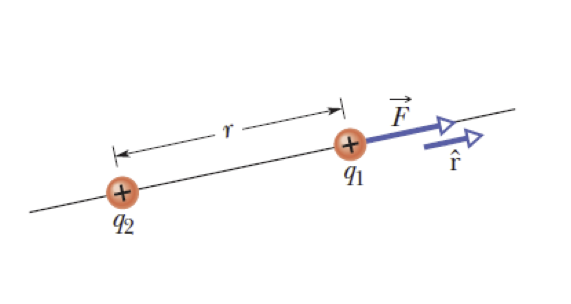
## The Electric Field
> 一个很傻逼的事情，当人们说The electric field at a point的时候，他们指的是在那个point上的electric field vector $\vec{E}$

The electric field is a _vector field_.

The electric field, E, consists of a distribution of vectors, one for each point in the region around a charged object, such as a charged rod.

We can define the electric field at some point near the charged object, such as point P in the figure to the left:
- A positive test charge $q_0$ placed at P will experience an electrostatic force F.
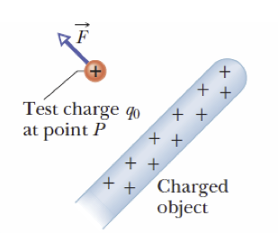

- The electric field at point P due to the charged object is defined as the electric field, E, at that point:
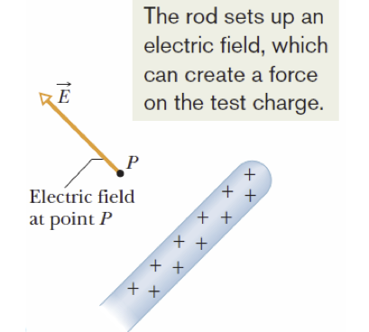
$$\vec{E} = \frac{\vec{F }}{q_0}$$

The SI unit for the electric field is the **Newton per coulomb (N/C)**.

### Electric Field Lines
就是一些不存在的line用来visualize electric field的

The field lines is drawn so that the number of lines per unit area is proportional to the magnitude of E.
- E is large when field lines are close together, and small where they are far apart.

在这张图片里，有一个negative field，然后有一个positive test charge，所以线是从positive往negative drawn的
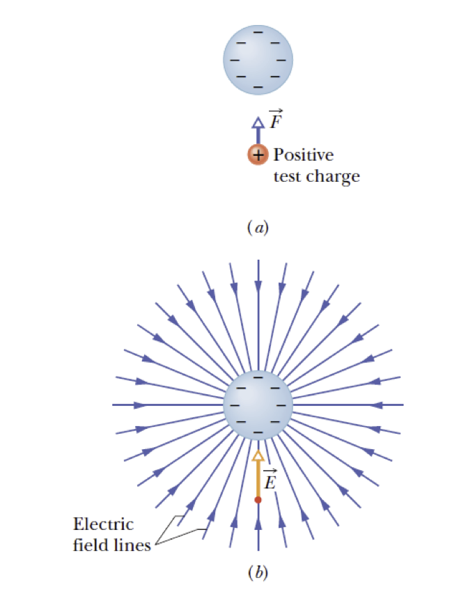

The electric field lines extend away from positive charge, and towards negative charge

Other Examples:
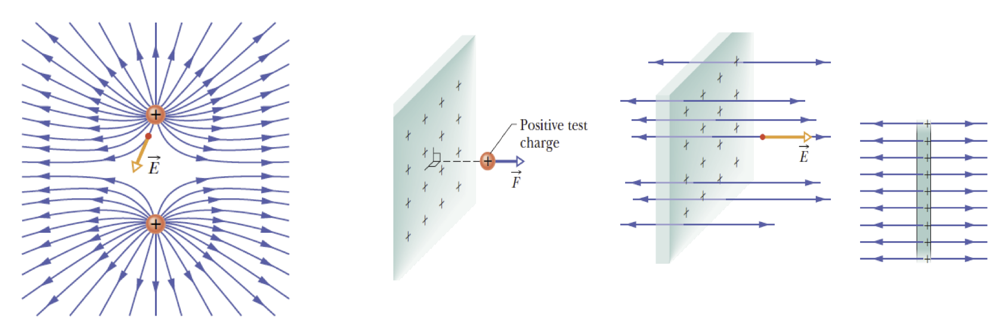

### Electric Field due to a Point Charge 
To find the electric field due to a point charge $q$(or charged particle) at any point a distance $r$ ffrom the point charge, we put a positive test charge $q_0$ at that point.

The direction of E is directly away from the point charge if $q$ is positive, and directly towards the point charge if $q$ is negative.

$$\vec{E} = \frac{\vec{F}}{q_0} = \frac{1}{4\pi \varepsilon_0} \frac{q}{r^2} \hat{r}$$
### Electric Field due to Multiple Point Charges
The net, or resultant, electric field due to more than one point charge can be found by the superposition principle

> Superposition means in a sppace with multiple charges, the resultant electric field is the vector sum of the fields created by each charge.

We place a positive test charge $q_0$ near n points charges $q_1, q_2, q_3, \dots q_n$ then, the net force, $F_0$, from the n point charges acting on the test charge is
$$\vec{F_0} = \vec{F_{01}} + \vec{F_{02}} + \dots \vec{F_{0n}}$$

The net eletric field at the position of the test charge is
$$\vec{E} = \frac{\vec{F_0}}{q_0} = \frac{\vec{F_{01}}}{q_0}+ \frac{\vec{F_{02}}}{q_0}+ \dots + \frac{\vec{F_{0n}}}{q_0} = \vec{E_1} + \vec{E_2} + \dots + \vec{E_n}$$

### The Electric Field due to a Continuous Charge
We only use linear charge (i.e. conductor) in this course!

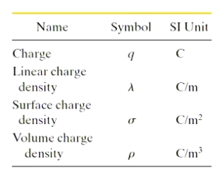

---
**:smoking: Exercise 1**

The image shows a three particles with charges $q_1 = +2Q, q_2 = -2Q, q_3 = -4Q$

Each a distance $d$ from the origin.

What net electric field $\vec{E}$ is produced at the origin?
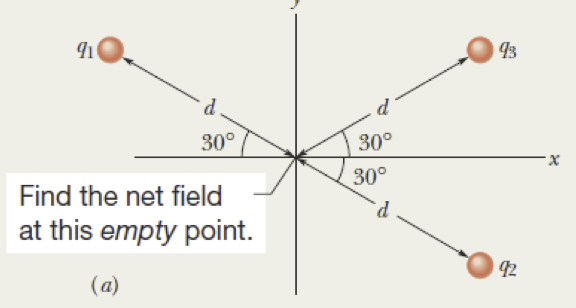

Firstly, put a negative test charge $q_0$ at the origin.

The $q_1$ and $q_2$ would produce electrostatic force at the same direction, and $q_3$ would be another direction.
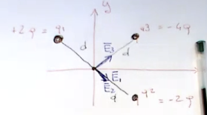

Lets only consider the absolute magnitude

For $E_1$ and $E_2$, 
$$E_1 = k \frac{q}{r_2} = \frac{1}{4 \pi \varepsilon_0} \frac{2Q}{d^2} = E_2$$

For $E_3$
$$E_3 = \frac{1}{4 \pi \varepsilon_0} \frac{4Q}{d^2}$$

So lets consider the y axis first,

他的傻逼example里面用了epsilon来代替y axis，我不知道为什么他要这么做，操他妈的。
$$|E_{1\epsilon}| = |E_{2\epsilon}| = \frac{1}{2}|E_{3\epsilon}|$$
And
$$E_{1\epsilon} + E_{2\epsilon} + E_{3\epsilon} = 0$$

$$E_{1x} + E_{2x} = k \frac{4Q}{d^2} \cos 30 = k\frac{4Q}{d^2}\frac{\sqrt{3}}{2}$$

And

$$E_{3x} = k\frac{4Q}{d^2} \frac{\sqrt{3}}{2}$$

Hence
$$\vec{E_1} + \vec{E_2} + \vec{E_3} = 2(\frac{1 }{4\pi \varepsilon_0} \frac{4Q}{d^2}) \frac{\sqrt{3}}{2} = \frac{\sqrt{3}}{\pi \varepsilon_0} \frac{Q}{d^2}$$

## Gauss' Law
### Gaussian Surface
Gauss' law relates the electric fields at points on a closed Gaussian surface to the net charge enclosed by that surface.

Gauss' law considers a _hyppothetical closed surface_ enclosing the charge distribution

The Gauss surface can have any shape.

In general, the surface that minimizes our calculations of the electric field is one that mimics the symmetry of the charge distribution.

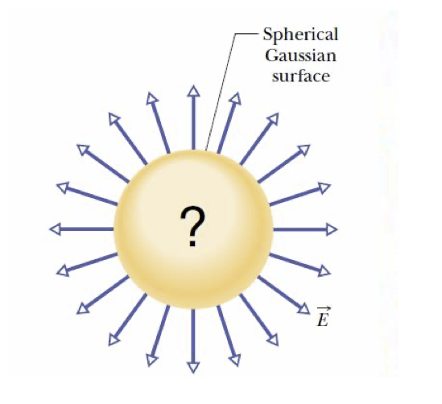

### The Concept of Flux
Lets consider a uniform airstream of velocity $v$ and two different cases:
- In figure a, the airstream $v$ is perpendicular to the plane of a surface loop.
- In figure b, the airstream $v$ is at an angle with the plane, and the component perpendicualr to the plane of the loop is $v \cos \theta$, where $\theta$ is the angle between $v$ and a normal to the plane.
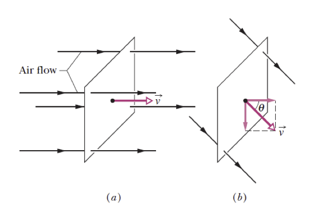

The area vector $A$ is defined as perpendicualr to the palne of the loop and makes an angle $\theta$ with $v$, as shown in c.

> Normally, when we think of area, we consider it as a scalar quantity - just a magnitude, like surface area of a wall. But in electromagnetic problems, knowing the direction associtated with the area can be also very important.
> - The direction of the area vector is usually defined as being perpendicular(normal) to the surface. For flat surface is simple, for curved surface the direction might vary across the surface.
> - The magnitude of the area vector is equal to the area of the surface it represents.

The rate of volume flow through the loop, i.e. the flux, is $\Phi = (v\cos\theta) A = \vec{v} \cdot \vec{A}$

The rate of flow through an area is an example of a flux
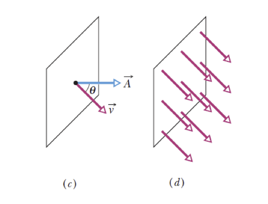

### The electric flux
The electric flux through a Gaussian surface is proportional to the net number of electric field lines passing through that surface.
$$\Phi = \vec{E} \cdot \vec{A}$$

A Gaussian surface of arbitrary shape immersed in an electric field is shown in the image. The surface is divided into small squares of area $\Delta \vec{A}$

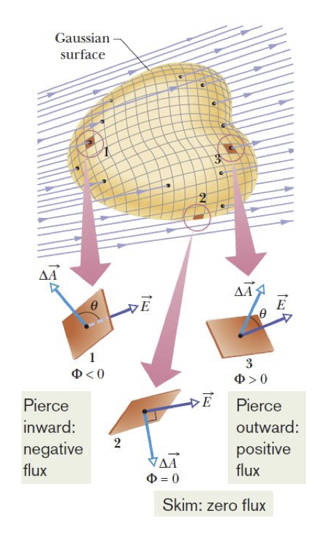

The flux through a small area is expressed as:
$$\Phi = \sum \vec{E} \cdot \Delta\vec{A}$$

The exact definition of the flux of the electric field thorugh a closed surface is found by allowing area of the sqaures to become smaller and smaller, approaching a differential limit $d \vec{A}$

Hence, the electric flux through a Gaussian Surface is calclualted as an integral:
$$\Phi = \oint \vec{E} \cdot d \vec{A}$$
> $\oint$ emphasis the curve being integrated is a closed curve

### Gauss' Law
Gauss' law relates the net flux of an electric field thorugh a closed surface (a Gaussian surface) to the net charge $q_{enc}$ that is enclosed by that surface.

$$\varepsilon_0 \Phi = q_{enc}$$
Hence
$$\varepsilon_0 \oint \vec{E} \cdot d \vec{A} = q_{enc}$$

The net charge $q_{enc}$ is the algebraic sum of all the enclosed positive and negative charges, and it can be positive negative or zero:
- $q_{enc} > 0$, positive, net flux is outward
- $q_{enc} < 0$, negative, the netflux is inward

The unit of the electirc flux is $Vm$ or $Nm^2/C$

### Applying Gauss' Law: Cylindrical Symmetry
The figure shows a section of an infinitely long cyl,.indrical plastic rod with a uniform positive linear charge density $\lambda$

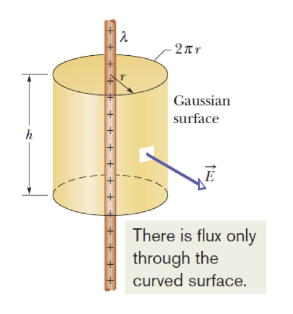

Lets find a expression for the magnitude of the electric field $E$ at a distance $r$ from the axis of the rod.

At every point on the cylindrical part of the Gaussian Surface, must have the same magnitude $E$ and (for a positively charged rod) must be directed radially outward.

The flux of $E$ through this cylindrical surface is therefore
$$\Phi = EA \cos \theta = E(2\pi r h)\cos 0 = E(2\pi r h)$$

$$\varepsilon_0 \Phi = q_{enc}$$
$$\varepsilon_0 E(2\pi r h) = \lambda h$$
Hence the line of charge would be 
$$E = \frac{\lambda}{2\pi \varepsilon_0 r}$$

### Applying Gauss' Law: Spherical Symmetry
Spherical symmetry refers to a system where the properties of the system are invariant under any rotation about a center point.

Firstly, the shell is described as having a uniform charge distributed over its surface. Due to the uniformity, no matter from which direction you approach the shell, you would encounter the same charge distribution.

所以，可以直接拿sphere的surface area来当作$\oint dA = A$ 来简化$\Phi$的计算流程

For spherical shell field at $r \geq R$, $E = \frac{1}{4\pi \varepsilon_0} \frac{q }{r^2}$

For spherical shell, field at $r < R$, $E = 0$

---
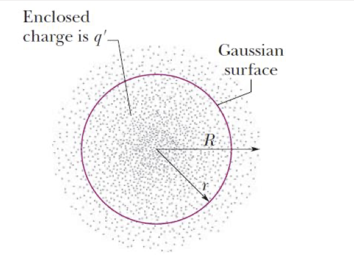

For sppherical distribution, field at $r \leq R$, $E = \frac{1 }{4 \pi \varepsilon_0} \frac{q'}{r^2}$

For uniform charge, field at $r \leq R$, $E = (\frac{q }{4 \pi \varepsilon_0 R^3})r$

GPT: This only applies in the scenario of electrostatic equilibrium, aka 中间没有多出来的那个charge的时候
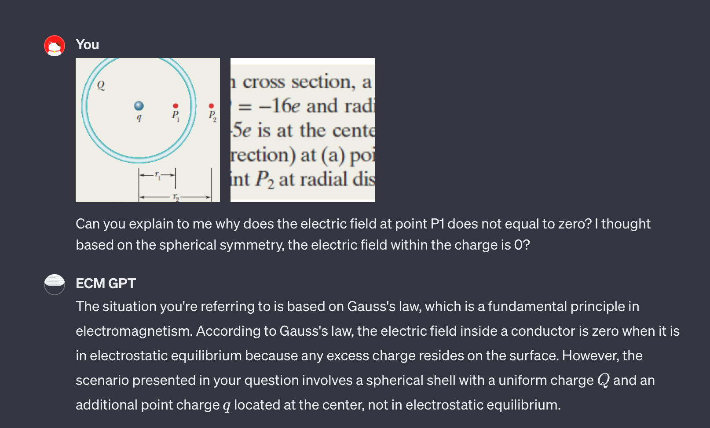

也就是说，这个principle的意思是， 如果要找一个在这个shell distributed charge圆里面的一个点的electric field。如果是关于中心还有一个charge的话，就可以不用考虑这个shell charge给electric field的影响，因为关于这个shell charge的electric field是0

在外面的时候就要考虑了。

---
**:smoking: Exercise 2**

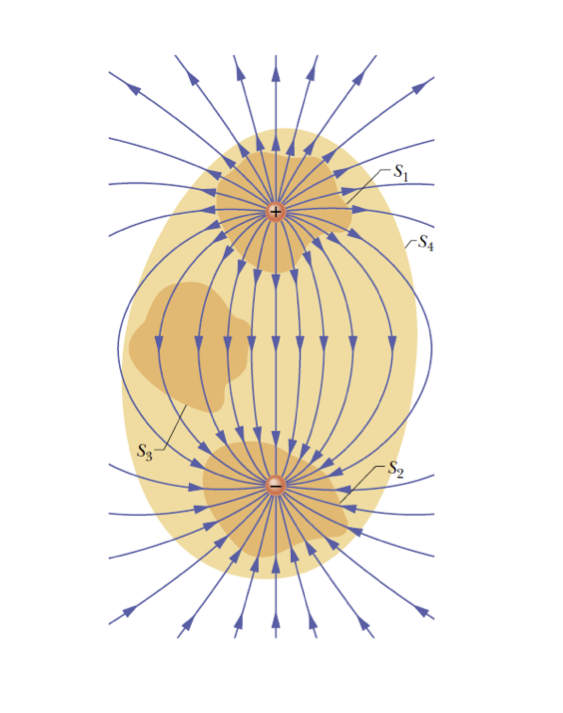
The figure shows two charges, equal in magnitude but opposite in sign, and the field lines that represent their net electric field.

Four Gaussian surfaces are shown:
- S1 encloses the positive charges
- S2 encloses the negative charges
- S3 encloses no charges
- S4 enclose both charges and thus no net charge.

Can you qualitatively describe the net flux(is it outward inward or zero)?

For S1, it should be outward.
For S2, it should be inward.
For S3, it is 0.
For S4, it is 0.

---
**:smoking: Exercise 3**
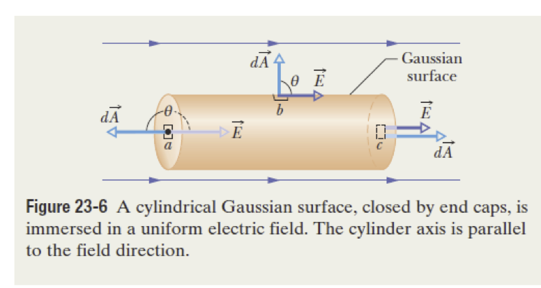

The figure shows a Gaussian surface in the form of a closed cylinder of radius R. It lies in a uniform electric field $\vec{E}$ with the cylinder's central axis(along the length of the cylinder) parallel to the field. What is the net flux $\Phi$ of the electric field through the cylinder.

We firstly split the Gaussian surface to 3 part,

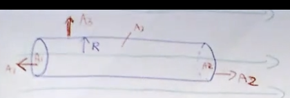

We only consider the A1 and A2, because A3 is not pointing to the direction of the electric field.

For A1 and A2, 
$$A = \pi R^2$$

And Hence
$$\Phi_1 = AE \cos \theta = AE \cos 180 = -AE$$
$$\Phi_2 = -AE$$

Hence

$$\Phi = 0$$

Hence there is no flux

---
**:smoking: Exercise 4**

The figure shows, in cross section, a pplastic, shperical shell with uniform charge $Q = -16e$ and radius $R = 10cm$. A particle with charge $q = +5e$ is at center. What is the electric field(magnitude and direction) at (a) point $P_1$ at radial distance $r_1 = 6cm$ and (b) point $P_2$ at radial distance $r_2 = 12cm$?

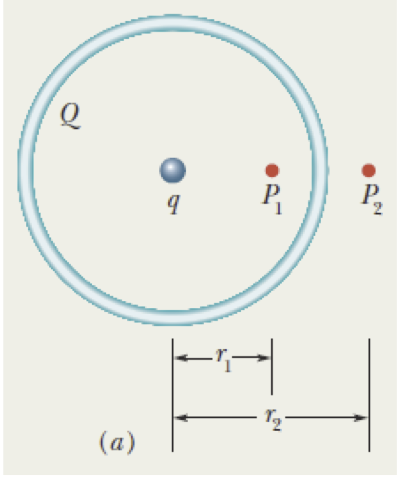

记住这个blue circle他不是一个surface, 他只是一个charge distribution

Both question can be answered by choosing a suitable gaussian surface and then apply gauss' law.

And lets firstly choose a Gaussian spherical surface with radius $r_1$, as shown in the figure.
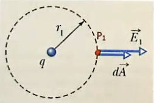

The surface only includes the charge q, because the shell would not cause electrostatic force to it.

Because we know that the field distribution due to an individual charge is spherical, the electric field is uniform and perpendicular across the surface. This allows simplifyiing the integral in Gauss' Law:
$$q_{enc} = \varepsilon_0 \oint \vec{E}_1 d \vec{A} = \varepsilon_0 E_1 4\pi r^2_1$$

and hence
$$E_1 = \frac{q_{enc}}{\varepsilon_0 4 \pi r^2_1} = \frac{5 \cdot 1.6 \cdot 10^{-19}}{4\pi \cdot 8.85\cdot 10^{-12} \cdot 0.06^2} = 2 \cdot 10^{-6} N/C$$

For the electric field at $P_2$
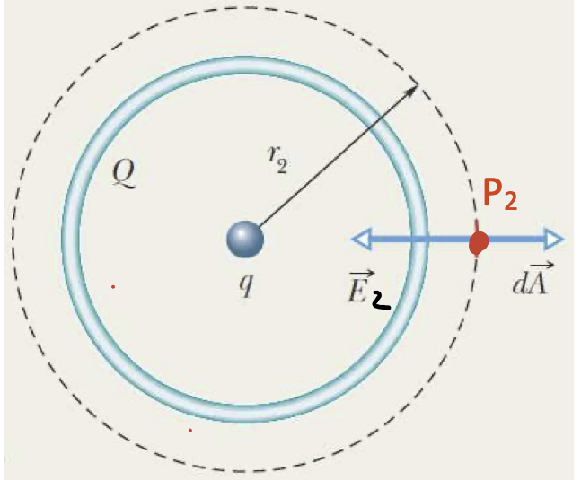

We choose a Gaussian spherical surface with radius $r_2$, the surface includes both $q$ and $Q$.

In this case, the net charge is negative, the electric field is pointing inward.

$$q_{net} = q + Q = -11e$$

Because the charge distribution is symmetrical, we can proceed as above.

$$q_{net} = -\varepsilon_0 E_2 4\pi r^2_2$$
$$E_2 = 1.10 \cdot 10^{-6} N/C$$

To summarize, Gauss' law 指的就是我们可以忽视掉Gaussian Surface里面enclosed的所有charge, 把他们想像成一个整体$q_{enc}$，然后如果这个$q_{enc}$是负数就说明electric field在这个gaussian surface往center point，如果是正数就往外面point.

---
**:smoking:Exercise 5**

The image shows portions of two large, parallel, non-conducting sheets,  each with a fixed uniform charge on one side. The magnitudes of the surface charge densities are $\sigma_{(+)} = 6.8 \mu C/m^2$ for positively charged sheet and $\sigma_{(-)} = 4.3 \mu C/m^2$ for the negatively charged sheet.

Find the electric field $\vec{E}$ (a) to the left of the sheets and (b) between the sheets and \(c\) to the right of the sheets.

<++>

## Capacitance
### Capacitance and Charge
Two conductors, isolated electrically from each other and form their surroundings, form a capacitor.

When the capacitor is charged, the charges on the conductors, or plates as they are called, have the same magnitude q but opposite signs.

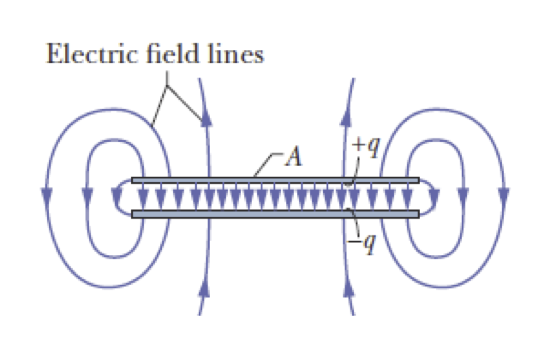

As a result of the charge $q$, there is a potential difference $V$ between the two plates. The charge and potential difference are related by the capacitance:
$$q = CV$$

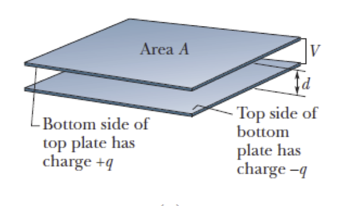

We will now find the expression of $C$ as function of the geometry, but in order to do that we need to find a formulation for the potential difference $V$.

### Definition of Electric Potential

The electric potential $V$ at point $P$ in the electric field of a charged object is
$$V = \frac{-W_{\infty}}{q_0} = \frac{U}{q_0}$$

Where $W_{\infty}$ is the work that would be done by the electric force on a positive test charge $q_0$ where it brought from an infinite distance to $P$, and $U$ is the electric potential energy that would then be stored in the test charge object system.

The unit of the electric potential is $V/m$

The potential energy at point $P$ due to a charge $q$ is therefore: $U = qV$

### Electrical Potential for Two Parallel Plates
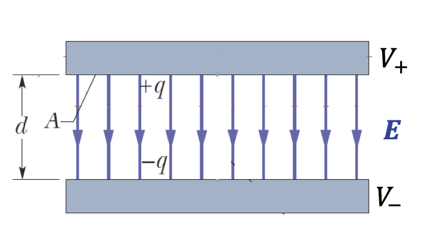

In this case, all points on the top plate has the same potential, because they share the same charge($V_+$)

All points on the lower plate, have the same potential, $V_-$

The potential difference is therefore $V = V_+ - V_-$

As a result of the charge, an electric field exists between the two plates $E$

It can be demonstrated that the potnetial difference is equal to 
$$V = V_+ - V_- = Ed$$
