# Magnetic Fields
Individual magnetic charges do not exist in the practice, magnetic fields can be generated in two ways:
1. By moving electrically charged particles(i.e. current in a wire), thus generating an electromagnet
2. By means off electorns that have an intrinsic magnetic field. In certain materials, the magnetic fields due to the electrons add up, and result in a permanent magnet.

## The Definition of B
The magnetic field(B) can be defined by firing a charged particle through a point in space, and determining the force that acts on the particle at that point.

B is a vector quantity directed along the zero-force axis.

The magnetic force on the charged particle, $F_B$ is defiend to be:
$$\vec{F_B} = q \vec{v} \times \vec{B}$$

Where $q$ is the charge of the particle, $v$ is the velocity, and $B$ is the magnetic field in the region.

The magnitude of the magnetic force is calculated as follows:
$$F_B = |q|vB \sin \theta$$

Where $\theta$ is the angle between vectors $\vec{v}$ and $\vec{B}$

Once the force is known, the magnetic field can be calculated.

## Direction of the Magnetic Force on a Particle 
The force $F_B$ acting on a charged particle moving with velocity $v$ thorugh a magnetic field $B$ is always perpendicular to $v$ and $B$.

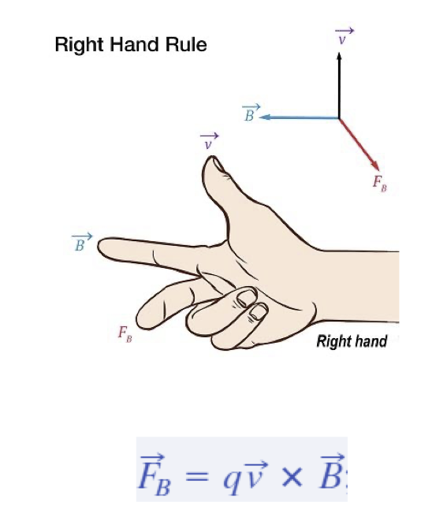

The direction of the force can be found using the right hand rule.

## The Unit of B
The SI unit for $B$ is Newton per coulomb-meter per second, or tesla (T)
$$1\ \textrm{tesla} = 1 \frac{N}{A\cdot m}$$

An alternative unit(non SI) for B is Gauss: $1 \textrm{tesla} = 10^4 \textrm{gauss}$
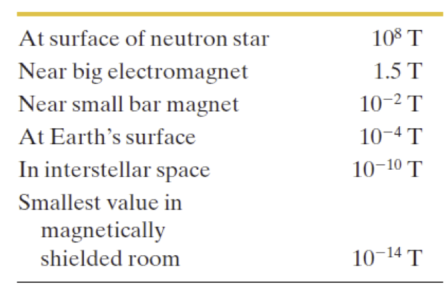

## Magnetic Field Lines
The magnetic field can be represented by means of field lines.
- The direction of the tangent to a magenetic field line at any oint gives the direction of $B$ at that point.
- The spacing of the lines represents the magnitude of $B$. (The denser, the stronger)

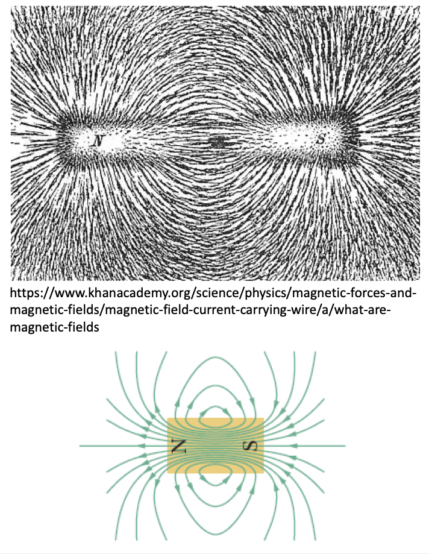

## Magnetic Force on a Current-Carrying Wire
Consider a flexible wire immersed in a magnetic field,
- Without current in the wire, the wire is straight
- With uppward current, the wire is deflected rightward.
- With downward current, the deflection is leftward.

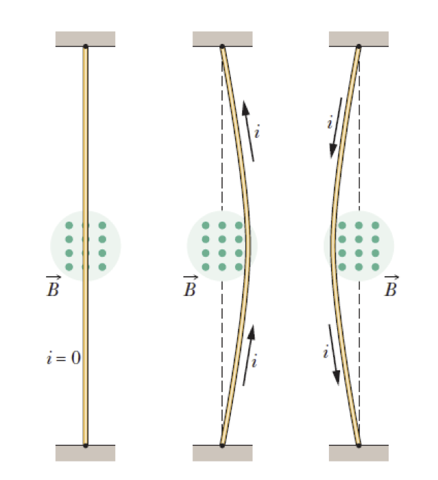

- The green dots means the vector is pointing towards you!

- If it is a cross, then it means its pointing the opposite direction.

---

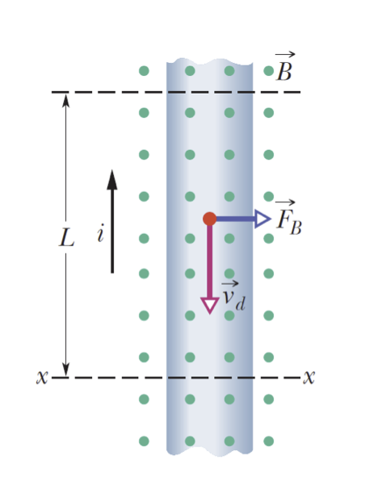

Consider a wire with length L. All the conduction electrons in this section of wire will drift past plane $xx$ in a time $t = L/v_d$, where $v_d$ is the velocity

During this time, the charge ppassing through that pplane is calculated as follows:
$q = it = i \frac{L }{v_d}$

The magnitude of the force on the charge, due to B, is therefore
$$F_b = qv_d B \sin \theta = \frac{iL }{v_d }v_d B \sin 90^\circ = iLB$$

The force can be expressed as a vector as 
$$\vec{F_B} = i \vec{L}\times \vec{B}$$

where $\vec{L}$ is a length vector that has magnitude $L$ and is directed along the wire segment in the direction of the current.

---

If the wire is not straihgt, or the field is not uniform, the wire can be considered as made of small segments. The differential force on each segment is calculated as shown below.
$$d \vec{F_B} = id \vec{L} \times \vec{B}$$

And the force on the wire is the vector sum of all the forces on each segments.

## Torque on a Current Loop
Torque is a vector quantity and it is a measure of the rotational force applied to an object.

An elementary electric motor is shown in the image

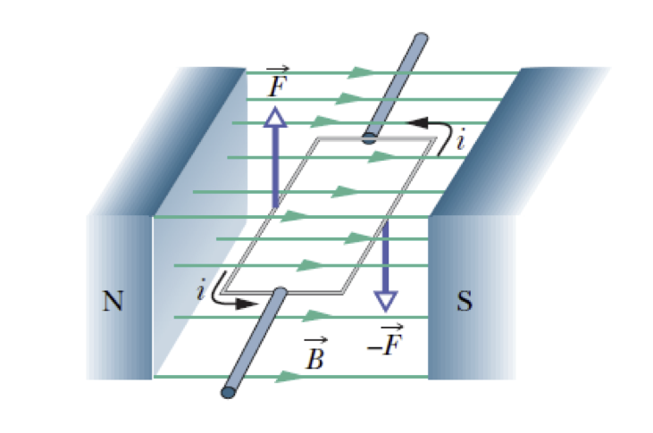

A rectangular loop of wire, carrying a current and free to rotate about a fixed axis, is placed in a magnetic field.

The magnetic forces on the wire produce a torque that will rotate it.

A commutator(not shown) reverses the direction of the current every half-revolution so that the motor keeps rotating.

---

**:smoking:  Example 2-1: Magnetic Force on a moving charged particle**

A uniform magnetic field $\vec{B}$ with magnitude $1.2mT$, is directed vertically upward throughout the volume of a laboratory chamber. A proton with kinematic energy $5.3 MeV$ enters the chamber, moving horizontally from south to north. What magnetic deflecting force acts on the proton as it enters the chamber? The proton mass is $1.67 \times 10^{-27} kg$

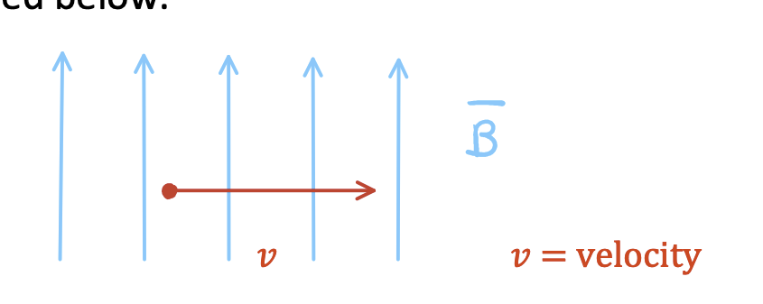

The particle velocity can be found by using the formula of the kinetic energy.
$$k = \frac{1}{2}mv^2$$

Also notice that $1ev = 1.6 \cdot 10^{-13}J$

Hence
$$v = 3.2 \cdot 10^7 m/s$$

Hence the force on the particle is perpendicular to the page and directed toward the page.

The charge for proton is $1e = 1.602 \cdot 10^{-19} C$

The magnitude of the force can be calcualted
$$F_B = qvB\sin \theta = 1.6 \cdot 10^{-19} \cdot 3.2 \cdot 10^7 \cdot 1.2 \cdot 10^{-3}$$

---
**:smoking: Example 2: Maximum Torque on a current loop**

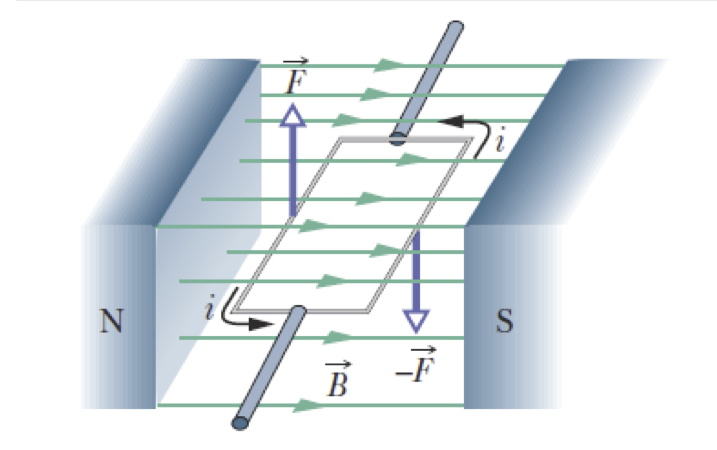

Calculate the expression of the maximum torque $\tau$ on the current loop shown to the left, immersed in a magnetic field $B$

The short sides of the loop have length $b$, the long sides of the loop have a length $a$

<++>

# Magnetic Fields due to currents
## Calculating the Magnetic Field due to a Current
The magnitude of the ffield $dB$ produced at point  at distance $r$ by a current length element $ids$ can be obtained exerimentally as follows:
$$dB = \frac{\mu_0}{4\pi} \frac{i\ ds \sin \theta}{r^2}$$

Where $\theta$ is the angle between the direcitons of $d \vec{s}$ and $\hat{r}$(a unit vector that points from $ds$ toward $P$)

The symbol $\mu_0$ reresents the ppermeability constant, whose value is 
$$\mu_0 = 4\pi \times 10^{-7} T \cdot m/A \approx 1.26 \times 10^{-6} T \cdot m / A$$

The exression above, in vector form is knows as the law of Biot-Savart:
$$d \vec{B} = \frac{\mu_0 }{4\pi } \frac{i d \vec{s } \times \hat{r }}{r^2}$$

## Magnetic Field due to a long and straight wire - magnitude
For the case of a long and straight iwre, the magnetic field vector at any point is tangent to the circle.

The magnitude of the magnetic field at a distance $R$ from such a wire carrying ga current $i$ is given by:
$$B == \frac{\mu_0 i }{2\pi R}$$

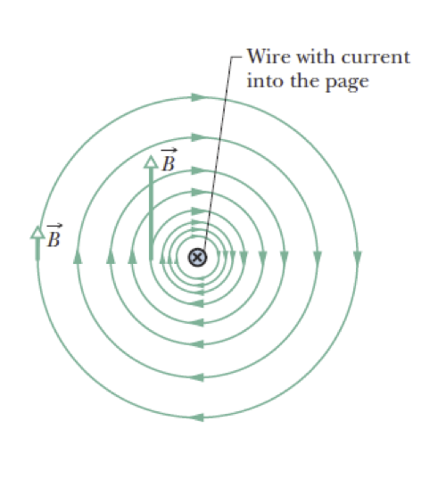

## Magnetic Field due to a long gand straight wire - direction

The right hand rule gives the direciton of the magnetic field due to a current in a wire.

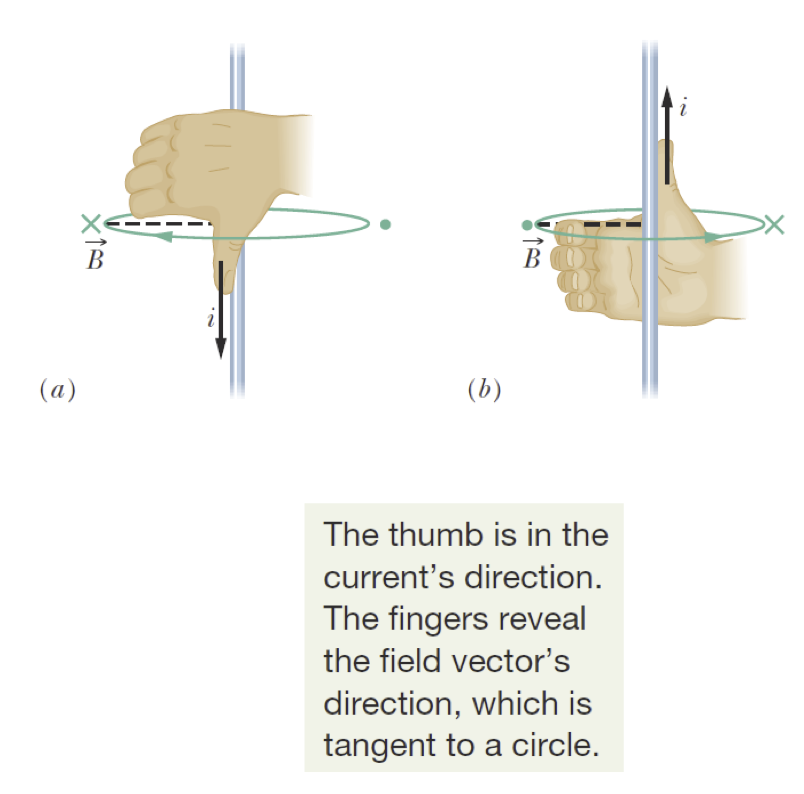

(a) The magnetic field $B$ at any point to the left off the wire is perpendicular to the dashed radial line and directed into the page, in the direction of the fingertisp, as indicated by the x.

(b) If the current is reversed, at any point to the left is still perpendicular to the dashed radial line but now is directed out of the page, as indicated by the dot.

## Force Between Two Parallel Wires

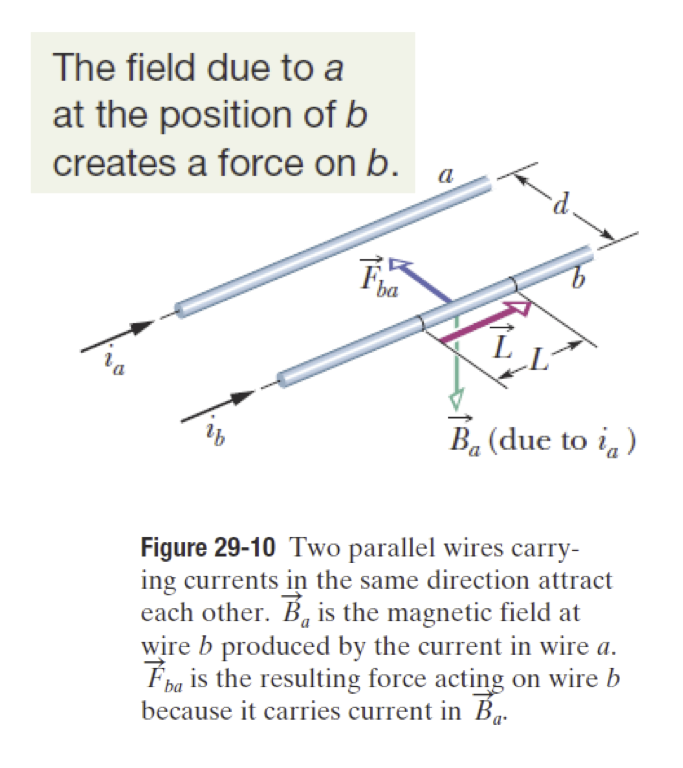

Two long parallel wires carrying currents exert forces on each other.

To find the force on a current-carrying wire due to a second current carrying wire,

First find the field due to the second wire at the site of the first wire.

Then find the force on the first wire due to that field:

$$B_a = \frac{\mu_0 i_a}{2\pi d}$$

$$\vec{F_{ba}} = i_b \vec{L }\times \vec{B_a}$$

The same pprocedure can be applied to compute the force on wire $a$ due to the current in wire $b$. In this case, the force is directely toward wire $b$.

Parallel current attract each other, and antiarallel currents repel each other.

## Ampere's Law
An alternative way to find the magnitude of the magnetic ffield due to a current distribution is to apply Amepre's law:
$$\oint \vec{B} \cdot d \vec{s} = \mu_0 i_{enc}$$

The loopp on the integral sign means that the scalar (dot) product $\vec{B} \cdot d \vec{s}$ is to be integrated around a closed loop, called an Amperian loop.

The current $i_{enc}$ is the net currenttt encircled by the closed loop.

Each current enclosed in the loop is associated with a positive or a negative sign.

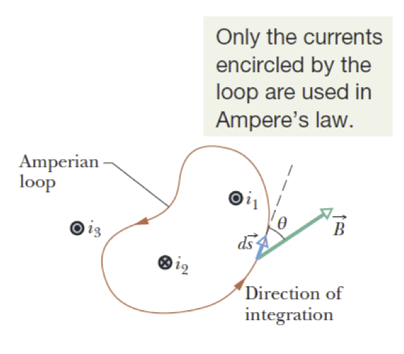

### Sign and Net Current
Curl your right hand around the amperian loo, with the fingers ppointing in the direction of integration.

A current fthrough the loop in the direction off the thumb is assigned a plus sign, and a current in the oposite direction is assigned a minus sign.

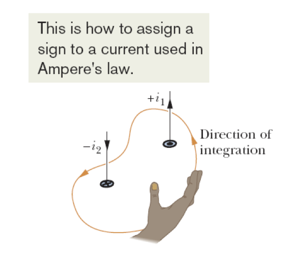

### Ampere's Law Applied to Symmetrical Current Distributions

For the case of symmetrical distributions, Ampere's law allows calculating the magnetic field easily.

- Magnetic field inside a wire carrying current: $B = (\frac{\mu_0 i }{2\pi R^2 })r$
- Magnetic field outside a wire carrying current $B = \frac{\mu_0 i }{2\pi r}$
- Magnetic field inside a solenoid $B = \mu_0 i n$
- Magnetic field inside a toroid $B = \frac{\mu_0 i N }{2\pi} \frac{1 }{r}$

# Induction and Inductance 
## Magnetic Flux Through a Loop
An emf(electromotive force) is induced in a loop when the number of magnetic field lines that pass through the loo is changing, as showwn in the two exampples to the left.

Suppose a loop enclosing an area A is placed in a magnetic field B. Then the magnetic flux through the loop is:
$$\Phi_B = \oint \vec{B } \cdot d \vec{A}$$

In the special case where the magnetic field is perpendicular to the loop and constant:
$$\Phi_B = BA$$

The unit of the maggnetic flux is the weber(Wb)
$$1 \textrm{weber} = 1 Wb = 1 T \cdot m^2$$

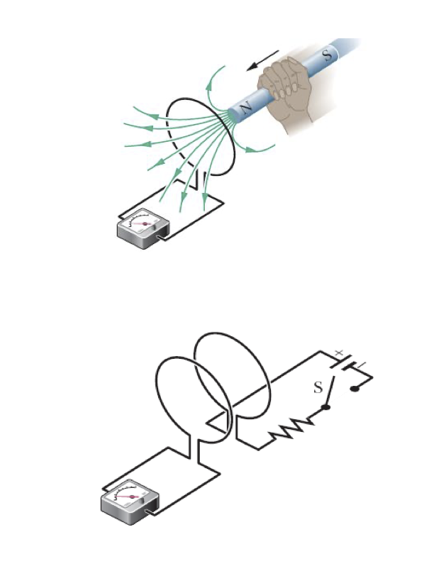

## Faraday's Law
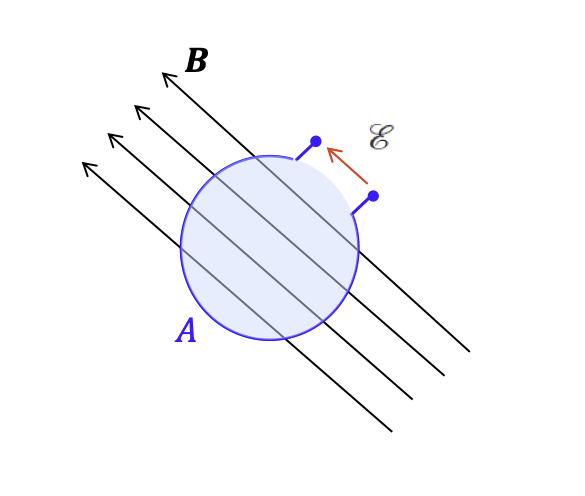

Faraday's Law: The magnitude of the emf induced in a loop is equal to the rate of change of magnetic flux through the loop
$$\mathcal{E} = - \frac{d\Phi_B}{dt}$$

In the case of N loops, the emf is calculated as follows:
$$\mathcal{E} = -N \frac{d\Phi_B }{dt}$$

## Flux through a Coil
The flux through a coil can be changed as follows:
1. Change the magnitude $B$ of the magnetic ffield within the coil.
2. Change either the total area of the coil or the portion of that area that lies within the magnetic field.
3. Change the angle between the direction of the magnetic field $B$ and the plane of the coil(for example, by rotating the coil so that field $B$ is first perpendicular to the lane of the coil and then is alongg that plane)

Electrical Generators are based on this principple.
The emf has the units of V.

## Notation: emf vs voltage
The voltage is the potential difference between two points in a circuit, or in a network.

The emf is the voltrage developed between two terminals of an electrical source, such as a generator, or a battery. The electrical ssource rovides an emf even when it is an 'open circuit'.

When you apply KVL to a circuit, you can verify that the voltage drop across the circuit is equal to the sum of the emf generated by all sources.

Although these two quantities are distinct, they have the same units, and they are often used interchangeably.

## Lenz's Law
Asssume that loop is closed. 
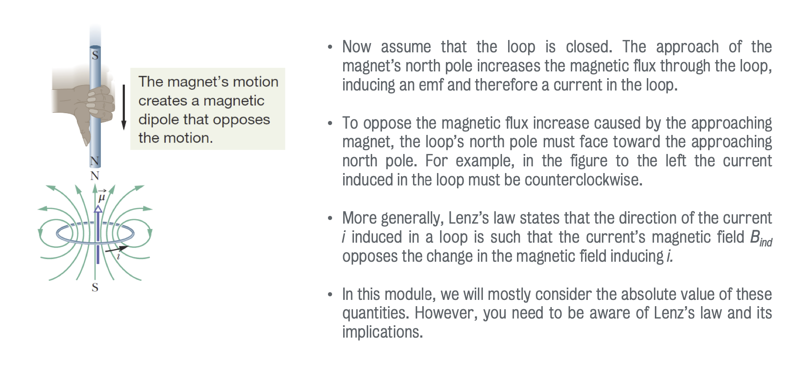

## Inductor and Inductance
An inductor is a device that can be used to produce a known magnetic field in a specified region.

If a current $i$ is established through each of the $N$ windings of an inductor, a magnetic flux $\Phi_B$ links those windings. The inductance L of the inductor is:
$$L = \frac{N\Phi_B}{i}$$

The SI unit is the henry(H)
$$1\ \textrm{henry} = 1H = 1 T \cdot m^2/A$$

### Self Induction and Mutual Induction
An induced emf $\mathcal{E}_L$ appears in any coils in which the current is changing.

This process is called self-induction, and the emf that appepars is called a self-induced emf.
$$N\Phi_B = Li$$
$$\mathcal{E}_L = - \frac{d(N\Phi_B)}{dt}$$

$$\mathcal{E}_L = -L \frac{di }{dt}$$

Similarly, we define the mutual induction when a emf appears in a coil following a change off current in a nearby coil - this is the principle of operation of transformerss.

## Energy stored in a magnetic field

