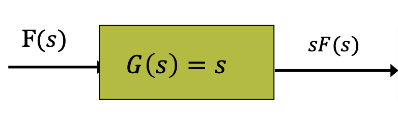

# Table of Contents
<!-- toc -->
----

# First Order D.E.

A **first order linear equation** is one that can be written in the form
$$\frac{dy}{dx} + P(x)y = Q(x)$$
**Solution**
$$y(x) = \frac{1}{v(x)}\int_{}^{}Q(x)v(x)dx$$

$$v(x) = e^{\int_{}^{}P(x)dx}$$

## Numerical Method - Euler's Method

Numerical method is for approximation
$$L(x) = y(x_0)) + y'(x_0)(x-x_0)$$

-   Example
    $y' = 1- \frac{y}{x}$,
    $y(2) = -1, dx = 0.5$
    $$y_0 = -1$$
    $$y_1 = y_0 + f(x_0,y_0) \times dx$$
    $$ = -1+ (-1 - \frac{-1}{2}) \times 0.5$$
    $$= - \frac{1}{4}$$

# Second Order D.E.

A second-order linear differential equation has the form of
$$P(x) \frac{d^2y}{dx^2} + Q(x) \frac{dy}{dx} + R(x)y = G(x)$$

## Constant S.O.D.E. and charateristic equaiton

If P Q R are all constant function, then the DE will have the form of
$$ay'' + by' + cy = 0$$

Hence, a character equation in the form of quadratic equation can be found
$$ar^2 + br + c = 0$$

if $b^2-4ac > 0$
$$y = c_1e^{r_1x} + c_2e^{r_2x}$$

if $b^2-4ac = 0$
$$y = c_1e^{rx} + c_2xe^{rx}$$

if $b^2 - 4ac < 0$
$$e^{\alpha x}(c_1\cos \beta x + c_2 \sin \beta x))$$
$$\alpha = \frac{-b}{2a}, \beta = \frac{\sqrt{4ac-b^2}}{2a}$$

For initial value problem, just put the initial value into the equaiton, and then solve the simultaneous equation to find c1 and c2. Differentiation might be use when y'(0) is given.

## Non-constant coefficient

-   MY Example
    Give that $y_1 = x$ is a solution of
    $$x^2y'' + 5xy' - 5y = 0, x> 0$$
    find a second solution and the general solution
    
    $$y = v \times y_1 = vx$$
    where $v$ is a function of x

    Lets subsidise $vx$ back to the equation
    $$x^2(vx)'' + 5x(vx)'' - 5(vx) = 0$$
    
    So $(vx)'' = (v'x + v\times 1)' = v''x + 2v'$
    Then
    $$x^2(v''x + 2v') + 5x(v'x + v) - 5vx = 0$$
    Then
    $$x^3 v'' + 2x^2 v' +5x^2v' + 5xv - 5xv = 0$$
    Then
    $$x^3v'' + 7x^2v' =0$$
    
    Let $w = v', w' = v''$
    Then
    $$x^3w' + 7x^2w = 0$$
    Now this is first order homongous differential equation
    
    $w' + 7x^{-1} w = 0$
    $$a(w) = e^{\int 7x^{-1} dx} = x^7 + C$$
    
    $$w = \frac{1}{x^7}\int 0 dx = x^{-7}c_1$$
    Hence
    $$v' = c_1x^{-7}$$
    $$v = \frac{c_1x^{-6}}{-6} + c_2$$
    $$y = (\frac{c_1 x^{-6}}{-6} + c_2)x$$
    and this is our general solution
    $$y = \frac{c_1x^-5}{-6} + c_2x$$
-   Example 2
    $$t^2y'' + 2ty' - 2y = 0$$
    
    Let $y_1(t) = t^1, y_2(t) = v(t) \times t^1$
    Then
    $$4t^2 v'(t) + t^3 v''(t) = 0$$
    
    Let $w(t) = v'(t)$
    $t^3 w'(t) + 4t^2 w(t) = 0$
    $$w'(t) + 4t^{-1}(t) = 0$$
    hence
    $$w(t) = t^{-4}$$
    $$v(t) = t^{-3}$$
    
    $$y = c_1t^1 + c_2 t^{-2}$$

# N-th order DE

Homogenous N-th order DE:

Just find characteristic equation like second order D.E. and then solve them to find r. And combine individual solution to general solution form.

## Particular Solution on Non-Homogeneous DE

This happens when G(t) not equal to 0.

$$y^{(3)} - 12y^{(2)} + 48y^{(1)} - 64 y = G(t) = 12 - 32e^{-8t} +2e^{4t}$$

LHS find characterisitic solution and solve it like homogenous D.E.

This is the complementary solution

The particular solution is found by guessing a solution in RHS, and then plug them back into the y''' y'' y' y. Find the complementary solution by equating the coefficient

The general solution is the complementary solution + particular solution

-   Example

    Lets gusss the particular solution
    $Y_p = A+Be^{-8x} + Ce^{4x}$

    Because $2e^{4t}$ has the same $e^{4t}$, it is not linearly independent from the complementary solution, so we have to multiply by $t^3$ to make them not linearly dependent

    $$Y_p = A+Be^{-8t} + Ct^3e^{4t}$$

    Plugging this back to the differential equation we get
    $$A = -\frac{3}{17}, B = \frac{1}{54}, C=\frac{1}{3}$$
    The general solution is
    $$Y(t) = y_c(t) + Y_p(t) = c_1e^{4x} + c_2te^{4t} + c_3t^2e^{4t} - \frac{3}{16} + \frac{1}{54}e^{-8t} + \frac{1}{3}t^3e^{4t}$$

# Integration Techniques

Standard intagrals

## Integration by parts

$$\int u \frac{dv}{dx} dx= uv - \int v \frac{du}{dx} dx$$

## Trigonometric fuckers

$$\int \sin^{m}x\cos^nx dx$$

-   Case - 1: m is odd

    $m = 2k + 1$, and use $sin^2 x+ cos^2 x = 1$

    $\sin^mx = \sin^{2k+1}x = (\sin^2x)^k\sin x = (1-\cos^2x)^k\sin x$

    Substitute this little fucker $u = \cos x$

    $$du = -\sin x dx$$
    $$\frac{-1}{\sin x}du = dx$$
    Hence, get rid of sinx term.

-   Case - 2: m is even and n is odd

    Similar to above for $\cos^n x$ and substitute $\cos x dx = d(\sin x)$

    Get rid of the cosx term.

-   Case - 3: both m and n are even
    $$\sin^2x= \frac{1- \cos 2x}{2}$$
    $$\cos^2x = \frac{1 + \cos2x}{2}$$
    To convert all these fuckers to cosine, hence can solve them.

## Trigonometric assholes

$$\int \sin mx \sin nx dx, \int \sin mx \cos nx dx, \int \cos mx \cos nx dx$$

It is simpler to use the following identities:
$$\sin mx \sin nx = \frac{1}{2}[\cos (m-n)x - \cos(m + n ) x]$$

$$\sin mx \cos nx = \frac{1}{2}[\sin(m-n)x + \sin (m+n)x]$$

$$\cos mx \cos nx = \frac{1}{2}[\cos(m-n)x + \cos(m+n)x]$$

-   Example 
    $$\int \sin(3x)\cos(5x)dx$$
    $$ = \int \frac{1}{2}(\sin(-2x) - \sin (8x)) dx$$
    $$= \frac{1}{2} [ \frac{1}{2}\cos 2x - \frac{1}{8}\cos 8x] + C$$

# Numerical Integration

## Trapezoid rule

To approximate $\int_{a}^{b}f(x)dx$ , use
$$T = \frac{\Delta x}{2}(y_0 + 2y_1 + 2y_2 + \dots + 2y_{n-1} + y_n)$$

-   The y's are the values of f at the partition points.
-   $$x_0 = a, x_1 = a + \Delta x, x_2 = x_1 + \Delta x, \dots, x_n = b$$
-   and $\Delta x = \frac{b-a}{n}$

-   Example
    $$\int_{1}^{2}x^2dx$$
    Let step size be 4
    $$\Delta x = \frac{2-1}{4} = \frac{1}{4}$$
    $$y_0 = 1, y_1 = \frac{25}{16}, y_2 = \frac{9}{4}, y_3 = \frac{64}{16}, y_4 = 4$$
    $$T \approx 2.343$$

## Simpson rule

To approximate $\int_{a}^{b}f(x) dx$

$$S = \frac{\Delta x}{3}(y_0 + 4y_1 + 2 y_2 + 4y_3 + \dots + 2y_{n-2} + 4y_{n-1} + y_n)$$

The y's are the values of f at the partition points and
$x_0 = a, x_1 = a+ \Delta x, \dots$
The number n is even and $\Delta x = \frac{b-a}{n}$

# Double Integration

## That fucker Fubini's Theorem

Let $f(x,y)$ be continuous on a region R.

1.  If R is defined by $a \leq x \leq b$, $g1(x) \leq y \leq g2(x)$, where g1 and g2 are continuous over $[a,b]$, then
    $$\int\int_R f(x,y) dA = \int_{x=a}^{x=b} \int_{y=g1(x)}^{y=g2(x)}f(x,y)dy dx$$

2.  If R is defined by $c \leq y \leq d$, $h1(y) \leq x \leq h2(y)$, with h1 and h2 continuous on $[c,d]$ then,
    $$\int\int_R f(x,y) dA = \int_{y=c}^{y=d}\int_{x=h1(y)}^{x=h2(y)}f(x,y)dxdy$$

3.  Example 
    $$\int_{0}^{2} \int_{x^2}^{2x}dy dx$$
    $$= \int_{0}^{2}2x - x^2dx$$
    $$= [x^2 - \frac{1}{3}x^3]^2_0$$
    $$= 4 - \frac{8}{3}$$

IF there's a average value problem then just
$$\frac{1}{\textrm{area of r}} \int\int_r f dA$$

# Sequences

If  $\{a_n\}$ converges to L, we write $\lim_{n \to \infty} a_n = L$ or simply $$a_n \to L$$ and call L the **limit** of the sequence.

If diverge $$\lim_{n\to \infty} a_n = \infty$$ or $$a_n \to \infty$$

## Limits of Sequence

Sandwich theorem
Let $\{a_n\}, \{b_n\}, \{c_n\}$ be sequences of real numbers.

If $a_n < b_n < c_n$ holds for all n beyond some index N,

and if $\lim_{n\to \infty} a_n = \lim_{n\to \infty} c_n = L$, then $\lim_{n\to \infty} b_n = L$

Example 1

In $\{a_n\} = \{\frac{\cos n }{n}\}$ show $a_n$ approaches 0

Use the sandwitch rule

$$\frac{-1}{n} < \frac{\cos n}{n} < \frac{1}{n}$$

$$\lim_{n\to \infty} \frac{-1}{n} = 0$$
$$\lim_{n\to \infty} \frac{1}{n} = 0$$
so
$$\lim_{n \to \infty} \frac{\cos n}{n} = 0$$

Continuous Function Theorem

Let $\{a_n\}$ be a sequence of real numbers

If $a_n \to L$ and if $f$ is a function that is continuous at $L$ and defined at all $a_n$,

Then $f(a_n) \to f(L)$

Example 2

$$\{a_n\} = \{\sqrt[]{\frac{n+1}{n}}\}$$
show $a_n$ approaches $1$

According to the theorem 3, continuous theorem.

$$\lim_{n \to \infty} a_n = L \to \lim_{n \to \infty} f(a_n) = f(L)$$
$$f(x) = \sqrt[]{x}$$
$$\lim_{n \to \infty} \frac{n+1}{n} = \lim_{n \to \infty}1 + \frac{1}{n} = 1$$
$$\lim_{n \to \infty}\sqrt[]{\frac{n+1}{n}} = \sqrt[]{1} = 1$$ 

## L'Hopital's Rule

L'Hopital Rule: if $f(x)$ and $g(x)$ are differentiable functions,  and
$$\lim_{x\to c}f(x) = \lim_{x\to c} g(x) = \pm \infty \textrm{ or } = 0$$

Then
$$\lim_{x\to c} \frac{f(x)}{g(x)} = \lim_{x\to c} \frac{f'(x)}{g'(x)} \textrm{, where }g(x) \neq 0$$ 

# Series

If the sequence of partial sum convergence to a limit L, we say that the series converges and that its sum is L.
$$\sum_{n=1}^{\infty}a_n = L$$

If the sequence of partial sum of the series does not converge, we say that the series diverges.

## Integral Test for Convergent/Divergent

Let $\{a_n\}$ be a sequence of positive terms.

Suppose thhat $a_n = f(n)$, where f is a continuous,  positive, decreasing function of $x$ for all $x \geq N$ (N a positive integer)

Then the series $\sum_{n=N}^{\infty}a_n$ and the integral $\int_{N}^{\infty}f(x)$ both converge or both diverge.

Example 9
$$\sum_{n=1}^{\infty} \frac{-n}{2n+5}$$

$$\lim_{n \to \infty} \frac{-n}{2n+5} = \lim_{n \to \infty} \frac{-1}{2} = -\frac{1}{2}$$

Sequence will converge, but the series will diverge.

Example 10
$$\sum_{n=1}^{\infty} \frac{3^{n-1} -1 }{6^{n-1}}$$

$$\lim_{n \to\infty} \frac{3^{n-1} -1 }{6^{n-1}} = \lim \frac{1}{2^{n-1}} - \frac{1}{6^{n-1}} = 0$$

Sequence converges to 0,

Series converge

$$\sum_{n=1}^{\infty} \frac{1}{2^{n-1}} + \sum_{n=1}^{\infty} \frac{-1}{6^{n-1}}$$

This is geometric series
$$= \frac{1}{1 - \frac{1}{2}} - \frac{1}{1 - \frac{1}{6}}$$

## Error Estimation

The remainder $R_n$ shows the difference between the total sum $S$ of the series and its $n-th$ partial sum $S_n$

$$R_n = S - S_n = a_{n+1} + a_{n+2} + \dots$$

The lower and upper bound of $R_n$ can be represented with the integral of the function of n-th term.
$$\sum_{n+1}^{\infty}f(x)dx \leq R_n \leq \int_{n}^{\infty} f(x)dx$$

Adding $S_n$ to all sides:
$$S_n + \sum_{n+1}^{\infty}f(x)dx \leq S \leq S_n + \int_{n}^{\infty} f(x)dx$$

# Laplace Transform

$$L[f(t)] = F(s) = \int_{0}^{\infty}e^{-st} f(t)dt$$
$$L[f'(t)] = sF(s) - f(0)$$
$$L(f''(t)) = s^2F(s)-sf(0) - f'(0)$$

-   Example - find LT of sine cosine

    What is the Laplace Transform of $\sin kt$?
    $$f(t) = \sin kt, f'(t) = k\cos kt, f''(t) = -k^2\sin kt, f(0) = 0, f'(0) = k$$
    $$L(-k^2\sin kt) = s^2F(s) - sf(0) - f'(0)$$
    $$L(-k^2\sin kt) = s^2F(s) - k$$
    $$L(-k^2 \sin kt) = s^2 L(\sin kt) - k$$
    $$-k^2 L(\sin kt) = s^2L(\sin kt) -k$$
    $$L(\sin kt) = \frac{k}{k^2 + s^2}$$
-   Example - using LT to solve non-homogenous second order de

    Solve the following second order d.e. using laplace method
    $$f''(t) + 3f'(t) +2f(t) = 4t, f(0) = f'(0) = 0$$
    Use Laplace on both sides
    $$s^2F(s) - 3sF(s) + 2F(s) = \frac{4}{s^2}$$
    $$F(s) = \frac{4}{s^4 - 3s^3 + 2s^2}$$
    Use Partial Fractions
    $$F(s) = -\frac{3}{s} + \frac{2}{s^2} + \frac{4}{s+1} - \frac{1}{s+2}$$
    Use Inverse Laplace
    $$f(t) = -3 +2t + 4e^{-t} -e^{-2t}$$

## First Shift Theorem - Unit Step

If we know that $L(f(t)) = F(s)$ then the first shift theorem tells us that $$L(f(t)e^{-at}) = F(s+a)$$

-   Example

    The laplace transform of a certain function $f(t)$ is given as $L(f(t)) = \frac{6}{s^4}$

    use the first shift theorem to find the laplace transform of $f(t)e^{-2t}$
    $$L(e^{-2t} f(t)) = F(s + 2)$$
    $$= \frac{6}{(s+2)^4} $$

## Second Shift Theorem - S&T Domain

$$L(f(t-a)u(t-a)) = \int_{a}^{\infty}e^{-st}f(t-a)dt = e^{-as}F(s)$$

-   Example

    Use the second shift hteorem to find the inverse laplace transform of $F(s) = e^{-3s}(\frac{1}{s+4})$
    $$L(f(t-a)u(t-a)) = e^{-as}F(s)$$
    $$L(f(t-3)u(t-3)) = e^{-3s}F(s)$$
    $$F(s) = \frac{1}{s+4} \to f(t) = e^{-4t}$$
    $$f(t-3) = e^{-4(t-3)}$$
    Inverse is
    $$u(t-3)e^{-4(t-3)}$$

-   Example - Find solution to DE with shifts

    Solve the following second order de using laplace method
    $$f''(t)  + 2f'(t) +5 f(t) = 3, f(0) = 0, f'(0) = 0$$
    $$s^2F(s)+2sF(s) + 5F(s) = \frac{3}{s}$$
    $$F(s) = \frac{3}{s(s^2 +2s + 5)}$$
    Do a partial fraction and find inverse laplace
    $$=\frac{3}{s^2+10s+5s^2}$$
    $$= \frac{A}{s} + \frac{B}{s^2+5s+10}$$
    $$= \frac{3}{10} \times \frac{1}{s} - \frac{3}{10}\times \frac{s+5}{s^2 + 5s + 10}$$
    $$= \frac{3}{10} \times \frac{1}{s} - \frac{3}{10} \times [\frac{s+ \frac{5}{2}}{(s+\frac{5}{2})^2 + \frac{15}{4}} + \frac{5}{\sqrt{15}} \frac{\frac{\sqrt{15}}{4}}{(s+\frac{5}{2})^2 + {\frac{15}{4}}}]$$
    $$x(t) = \frac{3}{10} - \frac{3}{10} e^{-\frac{5}{2}t}\cos(\frac{\sqrt{15}}{2}) - \frac{\sqrt[]{15}}{10}e^{-\frac{5}{2}t}\sin(\frac{\sqrt[]{15}}{2}t)$$

## Unit Step

A unit step $u(t-a)$ is a step of magnitude 1 turned on at $t=a$

$f(t)= t+1$ multiplied by $u(t-2)$ given as $f(t) = u(t-2) \cdot (t+1)$
$$f(t) = \begin{cases}
0\ t<2\\
t+1\ t> 2
\end{cases}$$

## Impulse

A impulse is a rectangular function with zero width, infinite height and area = 1.

Unit Impulse $\delta$ at $t=0$
$$f(t) = \delta(t)$$
$$F(s) = 1$$

Unit Impulse $\delta$ at $t = a$
$$F(s) = 1 \times e^{-as}$$

## System Transfer Functions

The transfer function characterises (tell us about) the system
$$H(s) = \frac{Y(s)}{U(s)}$$
Map U(s) to Y(s)

-   Example - Find transfer function
    A damped mass-spring system is governed by the equation
    $$y'' + 3y' + 2y = f(t), y(0)=y'(0) = 0$$
    $f(t)$ representes the input to the system. What is the response of the system $y(t)$ to an input $f(t)$
    $$s^2Y(s) + 3sY(s) + 2Y(s) = F(s)$$
    $$(s^2+3s+2)Y(s) = F(s)$$
    $$H(s) = \frac{Y(s)}{F(s)} = \frac{1}{s^2+3s + 2} = \frac{1}{(s+1)(s+2)}$$

## Impulse Response

Consider that $u(t) = \delta (t)$ is the unit impulse at time zero

Recall that $U(s) = L[\delta(t)] = 1$ then
$$Y(s) = H(s)U(s) = H(s)$$
The inverse laplace transform is:
$$y(t) = L^{-1}(H(s)) = h(t)$$

Hence, the unit impulse response at time zero is found by directly solving $H(s)$

A time-shifted impulse is found by solving $e^{-as}H(s)$

## Step Response

Consider that $u(t) = 1$ is the unit step at time zero

Recall that $U(s) = L[1] = \frac{1}{s}$ then
$$Y(s) = H(s)U(s) = \frac{1}{s}H(s)$$
The inverse laplace transform is:
$$y(t) = L^{-1}(\frac{1}{s}H(s))$$
Hence, the unit step response at time zero is found by directly solving $\frac{1}{s} H(s)$

A time-shifted step is found by solving $\frac{e^{-as}}{s}H(s)$

-   Example - Finding Step and Impulse response to a transfer function

    A system is represented by the transfer funciton:
    $$H(s) = \frac{s+1}{s^2 + 5s + 6}$$
    Use analytical methods to find the step and impulse response.

    The unit step response is found using $$Y(s) = \frac{1}{s}H(s)$$
    $$Y(s) = \frac{1}{s} \frac{s+1}{s^2+5s+6}$$
    $$Y(s) = \frac{s+1}{s^3 + 5s^2 + 6s}$$
    $$y(t) = \frac{1}{6} + \frac{3}{6}e^{-2t} - \frac{4}{6}e^{-3t}$$
    The impulse response is the same as the transfer function
    $$h(t) = 2e^{-3t} - e^{-2t}$$

## Initial and Final Value

The inital value theorem gives us the initial value of the response
$$\lim_{t \to 0} f(t) = \lim_{s \to \infty}sF(s)$$

The final value theorem gives us the final vlaue of the response
$$\lim_{t \to \infty}f(t) = \lim_{s \to 0}sF(s)$$

## Pole and Zeros

The transfer function is used to find the poles and zeros which tell us about the response
$$F(s) = \frac{N(s)}{D(s)}$$

$N(s)$ roots of numerator when $N(s) = 0$ are the zeroes - the frequency when $\textrm{gain } = 0$
$D(s)$ roots of denominator when $D(s) = 0$ are the poles - the frequency when $\textrm{gain} = \infty$

We will only consider negative poles and zeroes in this module

A real pole corresponds to a damped exponential response

A complex pair pole corresponds to a damped sinusodial response

A real zero increases the speed of the response

# Euler's Formula - Complex Exponential and Trig

$$e^{ix} = \cos(x) + i\sin(x)$$
$$\cos(x) = \frac{e^{ix} + e^{-ix}}{2}$$
$$\sin(x) = \frac{e^{ix}-e^{-ix}}{2}$$

# Fourier Transform

$$F(j\omega) = \int_{-\infty}^{\infty} f(t)e^{-j\omega t} dt$$

$$f(t) = \frac{1}{2\pi}\int_{-\infty}^{\infty} F(w)e^{j\omega t}dw$$

$$\omega = 2\pi f$$

Hence
$$F(j\omega) = F[f(t)]$$
$$f(t) = F^{-1}[F(j\omega)]$$

Basically replace s with -jw, and change limit from 0 to -infty

If it is given the time positive, then can use laplace transform table directly, and replace s to jw

if it is not given, then you have to integrate from start.

The magnitude can be found $|F(w)|$, the phase response can be found $\angle F(w) = \tan^{-1} \frac{\textrm{complex part}}{\textrm{real part}}$

For fraction
$$|F(w)| = \frac{|\textrm{top}|}{|\textrm{bottom}|}$$
$$\angle F(w) = \angle \textrm{top} - \angle \textrm{bottom}$$

The fourier transfer function response to an input $u(t)$
$$|H(jw)| \times u(wt + \angle H(jw))$$

-   Example - Frequency domain representation
    $$F(jw) = \int_{-\infty}^{\infty}e^{-jwt}f(t)dt$$
    $$f(t) = 3$$
    where $-1<t<1$
    $$F(jw) = \int_{-1}^{1}3e^{-jwt}dt$$
    $$\frac{-3}{jw}e^{-jwt}|^1_{-1}$$
    $$= \frac{-3}{jw}e^{-jw} + \frac{3}{jw}e^{jw}$$
    $$= \frac{6\sin\omega}{\omega}$$

-   Example - Response of cosine input to a transfer function
    $$H(s) = \frac{9s+14}{3(s^2+4s+3)}$$
    $$u(t)= 6\cos 2\pi t$$
    $$H(jw) = \frac{9jw + 14}{3(-w^2 +4jw + 3)}$$
    $$w = 2\pi$$
    $$|H(jw)| = \frac{\sqrt[]{9^2w^2 + 14^2}}{\sqrt[]{(-3w^2+9)^2+(12w)^2})} = 0.4384$$
    $$\angle H(jw) = 1.3281 - 0.6033$$
    An then write in $y(t) = |H(jw)| \times 6\cos(2\pi t + \angle H(jw))$

## Fourier Transform of Impulse

$$F(jw) = \int_{-\infty}^{\infty}e^{-jwt}\delta (t)dt$$
$$F(\delta(t)) = 1$$
Hence if want shifted inpulse
$$F(\delta(t-a)) = e^{-jwa}$$

## Fourier Shift

$$F\{f(t-a)u(t-a)\} = e^{-ajw}F(jw)$$
Multiply by $G(jw) = e^{-ajw}$

Since $e^{-jwa} = \cos(-wa) + j\sin(-wa)$
$$|G(jw)| = 1, \angle G(jw) = -aw$$

Hence, the shift does not affect the magnitude, only affect phase, giving it a -aw shift

## Fourier Differentiated Input

$$G(jw) = (jw)$$

$$|G(jw)| = w, \angle G(jw) = \frac{\pi}{2}$$

Hence, differentiated input amplified the imput by w, and shift it by $\frac{\pi}{2}$

## Fourier Integrated Input

$$G(jw) = \frac{1}{jw} = - \frac{jw}{w^2} = - \frac{j}{w}$$

$$|G(jw)| = \frac{1}{w}, \angle G(jw) = - \frac{\pi}{2}$$

Hence,  integrated input reduces the input and shift it by $-\frac{\pi}{2}$

## Fourier Theorems

-   Linearity
    $$F\{f(t) + g(t)\} = F\{f(t)\} + F\{g(t)\}$$
    
    $$F{kf(t)} = kF{f(t)}$$

-   Shifting
    $$F\{e^{jat}f(t)\}=F(w-a)\textrm{and}F\{f(t-a)\}=e^{-jwa}F(w)$$

-   Time Scaling
    $$F\{f(at)\} = \frac{1}{abs(a)}F(\frac{w}{a})$$

-   Example

    If the fourrier transform of f(t) is F(w), what is the fourier transform of f(2t-3)
    $$F(f(t-a)) = e^{-jwa}f(w)$$
    $$F(f(at)) = \frac{1}{abs(a)}F(\frac{w}{a})$$
    $$F{f(2(t-\frac{3}{2}))} = \frac{1}{2}F(\frac{w}{2}) e^{-jw \frac{3}{2}}$$

## Inverse Fourier Transform

$$f(t) = \frac{1}{2\pi} \int_{-\infty}^{\infty}F(jw)e^{jwt}dw$$

## Inverse Impulse

$F(jw) = \delta (w-a)$

$$f(t) = \frac{1}{2\pi} \int_{\infty}^{\infty}\delta(w-a)e^{jwt}dw$$

$$f(t) = \frac{1}{2\pi} e^{jat}$$

## Fourier Transform of Complex Exponential

$$f(t) = e^{jat}$$

$$F(jw) = \int_{-\infty}^{\infty} e^{jwt}e^{jat}dt$$

$$F(jw) = \int_{-\infty}^{\infty}e^{-j(w-a)t}dt$$

$$F(jw) = 2\pi \delta(w-a)$$

Hence this is a pure impulse magnituder of 2pi at w=a

Hence 
$$\frac{1}{2\pi}e^{jat} <-> \delta(w-a)$$

Then
$$e^{jat} <-> 2\pi \delta(w-a)$$
$$e^{-jat} <-> 2\pi \delta(w+a)$$

## Fourier Transform of Constant

$$f(t) = 1$$
This has infinite area so therefore cannot be integrated.

Instead represent as the sum of a unit step and a a negative unit step
$$F(jw) = \int_{-\infty}^{0}e^{jwt}1dt + \int_{0}^{\infty}e^{-jwt}1dt$$

$$F(jw) = 2\pi \delta(w)$$

$$1 <-> 2\pi \delta(w)$$

## Fourier Transform of Cosine

$$f(t) = \cos(at) = \frac{1}{2}(e^{jat} + e^{-jat}) = \frac{\pi}{2\pi}(e^{jat} + e^{-jat})$$

$$e^{jat} <-> 2\pi \delta (w-a)$$
$$e^{-jat} < - > 2\pi \delta (w+a)$$

Hence
$$F(\cos(at)) = \pi (\delta (w-a) + \delta(w+a))$$

## Fourier Transform of Sine

$$f(t) = \sin(at) = \frac{1}{2}(e^{jat} - e^{-jat})$$

$$F(\sin(at)) = -jw(\delta(w+a) - \delta (w-a))$$

# Fourier Series

A periodic function can be represented by the complex fourier series.
$$f(t) = \sum_{n=-\infty}^{\infty}c_ne^{jnw_0t}$$
where $w_0$ is the fundamental frequency

Hence
$$F(jw) = \sum_{n=-\infty}^{\infty}c_n \int_{-\infty}^{\infty}e^{-jwt}e^{jnw_0t}dt$$

$$F(c_n) = 2\pi c_n\delta(w)$$

-   since $1 <-> 2\pi \delta(w)$

$$c_ne^{jnw_0t} <-> 2\pi c_n \delta(w-nw_0)$$
$$e^{jat} <-> 2\pi \delta(w-a)$$

Hence
$$F(jw) = \sum_{n=-\infty}^{\infty}2\pi c_n \delta (w-nw_0)$$

A set of impulse at multiples of fundamental frequency with amplitude 2picn

## Fourier Series Angular !!!IMPORTANT!!!

$$f(t) = \frac{a_0}{2} + \sum_{n=1}^{\infty}a_n\cos(nw_0t) + \sum_{n=1}^{\infty}b_n\sin(nw_0t)$$

$$a_n = \frac{1}{L}\int_{-L}^{L}f(t)\cos(nw_0t)dt$$

$$b_n = \frac{1}{L}\int_{-L}^{L}f(t)\sin (nw_0t)dt$$

$$a_0 = \frac{1}{L}\int_{-L}^{L}f(t)dt$$

$$w_0 = \frac{2\pi}{T} = \frac{\pi}{L}$$

Calculate a0 and then calculate a1 a2 a3, see if you can see a pattern.

then calculate b1 b2 b3, and see if you can see pattern for bn.

# Discrete Fourier Transforms

The fourier transform of a sampled signal is the Discrete Fourier Transform

$$F[n] = \sum_{k=0}^{N-1}e^{-j2\pi kn/N}x[k]$$

k is the number of the sampled signal xs(k)

n is the number of the frequency sample

N is the number of samples

Inverse
$$x[k] = \frac{1}{N}\sum_{k=0}^{N-1}e^{j2\pi kn/N}F[n]$$

