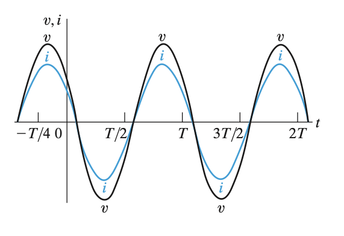
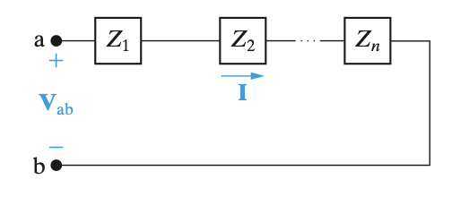
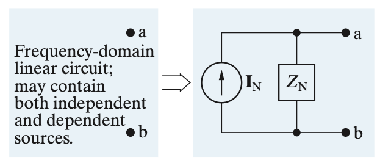
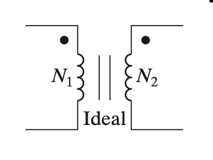

# Table of Contents
<!-- toc -->
----

# Passive Sign Convention

We agree to use passive sign convention, which means the current going into the positive terminal and leaving at the negative terminal is positive current.

# SI Units

# Terminology

# Basic Circuit Elements

## Voltage and Currents

Electric charge is bipolar, meaning that electrical effects are described in terms of positive and naegative charges

**Voltage** is the energy per unit charge created by the seperation:
$$v = \frac{dw}{dq}$$

v is the voltage in volts

w is the energy in joules

q is the charge in coulombs

**Current** is the rate of charge flow.

$$i = \frac{dq}{dt}$$

i is the current in amperes

q is the charge in coulombs

t is the time in seconds

## Power and Energy

$$p = \frac{dw}{dt} = \frac{dw}{dq} \frac{dq}{dt} = vi$$
Power is the energy per unit time. Unit Watts, W.

$$w = \int_{0}^{\infty}p(t)dt = \int_{0}^{\infty}v(t)i(t)dt$$
Energy is unit Joules, J
$$W = J/s$$

In passive convention:

If power is positive, then power is absorbed by the circuit element, or power is delivered to the circuit element.

If power is negative, then power is extracted from the circuit element.

## Voltage and Currents Source

They can be dependent on other current/voltage in the circuit.

If asked for testing whether circuit is permitted, just apply KVL, and test if all the voltage combined is 0.

## Resistor

/2023-04-02_20-14-47_screenshot.png)

$$v = iR$$
R is the resistance in ohms, $\Omega$

The reciprocal of resistance is referred to as conductance, is symbolizzed by the letter G, and is measured in simens S
$$G = \frac{1}{R}$$

A short circuit is when $$R = 0$$

A open circuit is when $R = \infty$

## Inductor

The inductor is a device which stores enery in the form of a magnetic field.
$$v = L \frac{di}{dt}$$
L is the inductance measured in henrys(H)

$$i = \frac{1}{L} \int_{-\infty}^{t}vd\tau = \frac{1}{L} \int_{t_0}^{t}v d\tau + i(0)$$

The series and parallel equivalent of inductance circuit is the same as resistance circuit.

Inductance Energy

$$p = vi = L \frac{di}{dt}i$$

The energy stroed in an inductor is calculated as follows:
$$W_L = \int_{0}^{t}pd\tau = \int_{0}^{t} L \frac{di}{d\tau} i d\tau = L \frac{i_0}{i}idi = \frac{1}{2}L (i^2-i^2_0)$$

If initial condition is zero, then its just simply
$$W_L = \frac{1}{2}Li^2$$

DC Inductor

In dc circuit

$$\frac{di}{dt} = 0 \to v = 0 \to i = I_0$$

Note that under dc conditions the voltage across the inductor is zero, the current will be constant

## Capacitor

A device which store energy in the form of a charge separation when polarised by an elecric field.

$$i = C\frac{dv}{dt}$$
C is capacitance in farads
$$v = \frac{1}{C}\int_{-\infty}^{t}i dt = \frac{1}{C} \int_{t_0}^{t}idt + V_0$$

The series and parallel equivalent is different.

In parallel is $C_{eq} = \sum_{n}^{N}C_n$

In series is $C_{eq} = 1/\sum_{n}^{N}\frac{1}{C_n}$

Capacitance Energy
$$p = iv = C \frac{dv}{dt}v$$

The energy stored in a capacitor is calculated as follows
$$e_c = \int_{0}^{t}pdt = \int_{0}^{t}C \frac{dv}{d\tau}vd\tau = \frac{1}{2}C \int_{v_n}^{v}vdv = \frac{1}{2}C(v^2 - v^2_0)$$

If initial condition is zero, its simply just
$$\frac{1}{2}Cv^2$$

DC Capacitor

$$\frac{dq}{dt} = 0 \to i_c = 0 \to v = V_0 $$ 

Note that the capacitor voltage under dc condition may not be zero, but the current will always be zero

# Circuit Analysis Method

## KCL

The algebraic sum of all the currents at any node in a circuit equal to zero

## KVL

The algebraic sum of all the voltages around any closed path in a circuit equals zero.

## Node-Voltage Method

1.  Identify the n essential nodes
2.  Select a reference node (ground) and label the other n-1 node voltages.
3.  Write KCL for each node identified as independent variable. Express each branch current as function of adjacent node voltages.

We assume all the current is leaving the node.
Use ohm's law to write current using voltage and resistor value.
(A node voltage is defined as the voltage rise from the reference node to a nonreference essential node)

1.  Solve the linear system for the node voltages.
2.  If required, calculate the remaining unknown variables.

## Mesh-Current Method

Firstly, set a direction and label the current.(because the current in a series is unchanged)

And then write KVL for each mesh.

Use ohm's law to represent voltage with current and resistance.

The collapsing part, use one current to minus the current in another direction.

For mesh a:
$$-40 + 2i_a + 8(i_a-i_b) = 0$$

ia is going down, while ib is going up, so we use ia minus ib

At the end, solve the simuoltaneous equation to find mesh current.

Use mesh current to calculate the remaining unknown variables.

## Source Transformation

The value of equivalent resistance $R_s$ is the same.

The current is calculated as $I_s = \frac{V_s}{R_s}$

## Thevenin Equivalent

The Thevenin theorem: when viewed from the load, any networks composed of voltage and current sources and of linear resistors may be represented by an equivalent circuit consisting of an ideal voltage source $V_{Th}$ in series with an equivalent resistor $R_{eq}$

Calculate Vth

1.  Remove the load
2.  Calculate the voltage across the open load terminals by using any preferred method.
3.  The calculated voltage is $V_{Th}$ in the Thevenin equivalent circuit.

Find the Thevenin equivalent of the circuit.

The resistance is calculated by applying the method explained before - i.e. all the sources are deactivated and the resistance seen at the terminals is obtained.
$$R_{th} = 4 + \frac{5 \times 20}{5+20} = 8 \Omega$$

## Norton Equivalent

The Norton theorem: when viewed from the load, any networks composed of voltage and current sources and of linear resistors may be represented by an equivalent circuit consisting of an ideal current source $I_{N}$ in parallel with an equivalent resistor $R_{eq}$

Basically the same shit, just do a fucking source transformation instead.

## Thevenin or Norton Equivalent with Shitty Dependent Source

Add a imaginary voltage source at the terminal, the $R_{th} = \frac{V}{I}$

Usually the dependent source, an extra equation need to be established to find Vx or Ix. Usually can be obtained by applying KVL or KCL at a mesh or node.

## Maximum Power Transfer for DC circuit

At this circumstance, there is maximum power transfer.
$$R_{Th} = R_L$$

## Superposition

Use super position when theres a voltage/current source in the middle of two meshes.

Whenever a linera system is excited, or drive, by more than one independent source of energy, the total response is the sum of the individual responses.

An individual responses is the result of an independent source acting along.

In practice:

1.  Set one voltage or current source to be active at the time(all other sources are open circuits or short circuits)
2.  Solve the circuit by calculating the required currents and voltages for the source under consideration
3.  Repeat the process for each source
4.  At the end, each branch current is the sum of N currents and each node voltage is the sum of N voltages

# Simple Resistive Circuit

## Voltage Divider

Current does not change in series circuit.

Basically resistors in series

Applying KVL
$$v_s = i_s(R_1 + R_2 + R_3 + \dot)$$

This equation also tell us that we can simplify the resistors connected in series into a single resistor
$$R_{eq} = \sum_{i=1}^{k}R_i = R_1 + R_2 + \dot + R_k$$

$$v_s = i_s R_{eq}$$

Hence, voltage division equation

$$i = \frac{v}{R_{eq}}$$

We apply the ohms law a second time to calculate the voltage drop $v_j$ across the resistor $R_j$, substituting $\frac{v}{R_{eq}}$ for i 

Hence, the voltage division equation
$$v_j = iR_j = \frac{R_j}{R_{eq}}v$$
The voltage drop $v_j$ across a single resistor $R_j$ from a collection of series-connected resistor is proportional to the total voltage drop v across the set of series-connected resistors.

## Current Divider

Voltage does not change in parallel circuit.

We can resolve resistors in parallel to single equivalent resistors using KCL and ohm's law
$$i_s =i_1 + i_2 + i_3 +i_4$$
Because they have same voltage,
$$i_1R_1 = i_2 R_2 = \dots$$
Therefore
$$i_1 = \frac{v_s}{R_1}, i_2 = \frac{v_s}{R_2}, \dots$$
$$i_s = v_s(\frac{1}{R_1} + \frac{1}{R_2} + \dots)$$
from which
$$\frac{i_s}{v_s} = \frac{1}{R_{eq}}$$
$$\frac{1}{R_{eq}} = \sum_{i=1}^{k} \frac{1}{R_i}$$

Hence the current division equation

We are interested in finding the $i_j$ through an arbitrary resistor $R_j$ in terms of the current i

We start from using ohms law to calculate v
$v = iR_{eq}$

Hence
$$i_j = \frac{v}{R_j} = \frac{R_{eq}}{R_j}i$$

# First Order RL & RC Circuit

Time constant for RL circuit is $\frac{R}{L}$

Time constant for RC circuit is $RC$

Natural response is how inductor/capacitor release the energy stored in them.

Step response is how inductor/capacitor react to their charging energy.

In natural response, as $t \rightarrow \infty$, the inductor current or capacitor voltage is 0.

Steps to find natural/step response

# AC Circuits - aka. where things starts to fuck up

A sinusoidal voltage source produces a voltage that varies sinusoidally with time.

A sinusoidal current source produces a current that varies sinusoidally with time.

$$v = V_m\cos (\omega t + \phi)$$
The coefficient $V_m$ gives the maximum amplitude of the sinusoidal voltage. Because $$\pm 1$$ bounds the cosine function.

The reciprocal of T, period, gives the number of cycles per second, or the frequency.
$$f = \frac{1}{T}$$
A cycle per second is called a hertz, abbreviated Hz.

Omega represeents the angular frequency of the sinusoidal function and is related to both T and f:
$$\omega = 2\pi f = 2\pi / T(\textrm{radians/second})$$

The angle $\phi$ is the phase angle of the sinusoidal voltage. It determines the voltage of the sinusoidal function at $t=0$. Therefore, it fixes the point on the periodic wave where we start measuring time. Changing the phase angle shifts the sinusoidal function along the time axis.

$\omega t$ and $\phi$ needs to be using the same unit, $\omega t$ is given in rad. $\phi$ normally is given in degrees, and $$\omega t$$ is converted into degrees before the two quantities are added.

## RMS

tldr,
The rms value of any value is it divided by sqrt 2.
$$V_{rms} = \frac{V_m}{\sqrt[]{2}}$$

Remember this little shit。

## Phasor

Euler's formula
$$e^{j\theta} = \cos \theta \pm j \sin \theta$$

Hence, phasor is basically
Basically when you have sth sinusoidal in time domain
$$A_m \cos (\omega t + \phi)$$
The phasor is just Amplitude times e to the power of j times phase
$$A = A_me^{j\phi} = A_m \angle \phi^\circ$$
The equation in time domain can be get back, by doing this
$$Re\{Ae^{jwt}\}$$

# AC Circuits in Phasor Domain

All the upper case letter in this part is fucking phasor.

## General Conclusion

Which is the impedance Z
$$Z_L = j\omega L$$
$$Z_C = \frac{1}{j\omega C}$$
$$Z_R =  R$$

$$V = ZI$$

The Admittance Y can be found
$$I = Y V = \frac{1}{Z}V$$

## AC Resistive Circuit

$$V = IR$$

Voltage and current in phase

## AC Inductive Circuit

$$V = j\omega L I$$

The j is simply $e^{j90^\circ}$, which can show that

In inductors, voltage are leading current by 90 deg

## AC Capacitive Circuit

$$V = \frac{I}{j\omega C}$$
In this case, the currents are leading voltage by $90^\circ$

## KCL and KVL

Is the fucking same

tl;dr

## Series and Parallel Connection of Impedance

Its the same shit

In series
Which all the Z can be added together to find $Z_{eq}$
$$V_{ab} = I(Z_1 + Z_2 + \hdot) = I Z_{eq}$$
$$Z_{eq}  = \sum_{n=1}^{k}Z_n= \frac{V_{ab}}{I}$$

## Source Transformation

Same fucking shit

## Thevenin and Norton Equivalent

Same shit

## The Node-Voltage Method

Same shit

## The Mesh-Current Method

# The Transformer - and that fucker mutual inductance

M is the mutual inductance, L is the self inductance

Two inductor are put very close with each other, that it can transfer energy.

A simple transformer is formed when two coils are wound on a single core, or magnetic coupling.

$L_1$ is self inductance of primary winding
$L_2$ is self inductance of secondary winding
$M$ is the mutual inductance

The mutual inductance is found by
$$M = k \sqrt[]{L_1L_2}$$

$Z_M = j\omega M$
Is the same as inductor's impedeance 

Write a KVL
$$V_s = I_1(Z_s + R_1 + j\omega L_1) - j\omega M I_2$$
The plus or minus of the mutual inductance voltage depending on the direction of the current/voltage flow, i.e. depending on the position of the dots

$$0 = I_2(R_2 + Z_L + j\omega L_2) - j\omega M I_1$$

## Z11, Z22 and Zin, Zab

Input impedance refers to the impedance that an electrical circuit presents to a signal that is being fed into it. It is the ratio of the voltage applied to the input of the circuit to the resulting current flowing into the circuit.

At the end you can find the $Z_{in} = \frac{V_s}{I_1}$, which can found the input impedance of all the shits of the right hand side

I1 is the current of the left hand mesh

We call all the impedance we found in the primary circuit $Z_{11}$
$$Z_{11}  = Z_s + R_1 + j\omega L_1$$
Z11 is basically all the left hand shit 
$$Z_{22} = Z_L + R_2 + j\omega L_2$$
Z22 is basically all the right hand shit
Solve Mesh-Current KVL to find I
$$V_s = I_1Z_{11}-j\omega M I_2$$
$$Z_{in} = \frac{V_s}{I_1} = Z_{11} + \frac{\omega^2 M^2}{Z_{22}}$$
Sometimes, we are interested i $Z_{ab}$, the terminal of $Z_{ab}$

$$Z_{ab} = Z_{in} - Z_s$$

The reflectance can be found by
$$Z_r = \frac{\omega^2M^2}{Z_{22}}$$
The load impedance can be found by
$$Z_L = R_L + jX_L$$

They've provided this asshole equation which is exactly the same
$$Z_r = \frac{w^2M^2}{|Z_{22}|}[(R_2+R_L) - j (\omega L_2 + X_L)]$$
But if they are asshole enough, they are gonna ask about finding a scaling factor, which is this little fucker.
$$\frac{w^2M^2}{|Z_{22}|}$$

## Ideal transformer

## The ideal transformer

-   No internal resistance of the coil, so no R1 R2
-   L1 and L2 are very large, and k=1

N is the number of coil.
We put two || to indicate they are ideal.

IF the dots is on both side of the same sign, then
$$\frac{V_1}{N_1} = \frac{V_2}{N_2}$$
$$I_1N_1 = I_2N_2$$

IF one of the side is different then
$$\frac{V_1}{N_1} = - \frac{V_2}{N_2}$$
$$I_1N_1 = -I_2N_2$$

If the coil voltage V1 V2 are both positive or negative at the dot marked terminals then use positive sign, otherwise use negative.

If the coil currents I1 I2 are both directed into or dot of the dot marked terminals, use minus sign, othewise positive.

The ideal transformer changes the magnitude of ZL but does not affect its phase angle, whether Zin is greater or less than Zl dpeneds on the turns ratio a.
$$Z_{in} = \frac{1}{a^2}Z_L$$

# AC Steady State Power & Energy Analysis

$$p = vi$$

$$v = V_m\cos(\omega t + \theta_v)$$
$$i = I_m \cos (\omega t + \theta_i)$$
or
$$v = V_m \cos (\omega t + \theta_v + \theta_i)$$
$$i = I_m\cos \omega t$$

$$p = V_mI_m \cos (\omega t + \theta_v - \theta_i) \cos \omega t$$
Hence
$$p = \frac{V_mI_m}{2}\cos(\theta_v - \theta_i) + \frac{V_mI_m}{2}\cos(\theta_v - \theta_i) \cos 2\omega t - \frac{V_mI_m}{2}\sin(\theta_v - \theta_i)\sin 2\omega t$$

The first term is called P, average(real) power, and its not changing with time
$$P = \frac{V_mI_m}{2}\cos(\theta_v - \theta_i)$$
The last term is called Q, the reactive power.
$$Q = \frac{V_mI_m}{2}\sin(\omega_v -\omega_i)$$

$$p = P + P\cos 2\omega t - Q \sin 2\omega t$$

$$p_{avg} = P$$

## Power for purely resistive circuit

$$\theta_v - \theta_i = 0$$
$$\cos(\theta_v-\theta_i) = 1$$
$$\sin(\theta_v- \theta_i)=0$$

Average power is
$$P = \frac{V_mI_m}{2}$$
$$Q = 0$$
$$p(t) = P + P\cos 2\omega t$$

## Power for purely inductive circuit

$$\theta_v - \theta_ i = 90^\circ$$

$$P = 0$$
Hence, in average the inductor does not consume power
$$Q = \frac{V_mI_m}{2}$$

$$q(t) = -Q\sin 2\omega t$$

Some times the power is negative,  hence indicating the inductor is charging.

## Power for purely capacitive circuits

$$\theta_v - \theta_i = -90$$
$$P = 0$$
$$Q = - \frac{V_mI_m}{2}$$
$$p(t) = -Q\sin2\omega t$$

## General Discussion

This $\cos(\theta_v - \theta_i)$ is the power factor
This $\sin(\theta_v - \theta_i)$ is the reactive factor

When the question say there is a lagging power factor 0.8 its indicating
$$\cos(\theta_v - \theta_i) = 0.8$$
And the circuit is inductive

i Lagging -> Inductive
i Leading -> Capacitive

## RMS format

$$I_{rms} = \frac{I_m}{\sqrt[]{2}}$$

Hence
$$P = V_{rms}I_{rms}\cos(\theta_v - \theta_i)$$

$$Q = V_{rms}I_{rms}\sin(\theta_v - \theta_i)$$

Hence power for resistive circuit
$$P = V_{rms}I_{rms} = \frac{V_{rms}^2}{R}$$

When the question say about the current or voltage of a home appliance, it usually refers to its rms format value. remember to convert them.

## Complex Power - Why the fuck this even exist

$$P + jQ = S$$

$$P = Re\{S\}$$
$$Q = Im\{S\}$$

$|S|$ is the apparent power

$$\tan(\theta) = \frac{Q}{P} = \frac{V_{rms}I_{rms}\sin(\theta_v - \theta_i)}{V_{rms}I_{rms}\cos (\theta_v-\theta_i)} = \tan(\theta_v - \theta_i)$$

$$|S| = \sqrt[]{P^2 + Q^2}$$

$$S = V_{rms}I_{rms} \angle \theta_v - \theta_i$$
In phasor domain(the v and i below are phasor of them) i is the complex conjugate of itself
$$S = V_{rms} . I_{rms}^*$$

## Maximum Power Transfer for AC Circuit

For maximum average power transfer,
ZL must be equal to the conjugate of the Thevenin Impedance;
$$Z_L = Z^*_{Th}$$

The maximum power delivered to the load is
$$P = \frac{|V_{Th}|^2R_L}{(2R_{Th})^2}$$

# Laplace Transform

Laplace transform is
$$L\{f(t)\} = \int_{0}^{\infty}e^{-st}f(t)dt = F(s)$$

In circuit analysis, t is time, and s is complex frequency.

Step Function

The step function is basically $ku(t) = \begin{cases}
0, t<0\\
k, t>0
\end{cases}$

$$u(t-a)$$

$$u(a-t)$$

Impulse Function
$$\delta(t)$$
Width is approximating 0, Height is approximating infty. Area is 1.

Two very useful property
$$\int_{-\infty}^{\infty}\delta(t-a)f(t) dt = f(a)$$

$$\delta(t) = \frac{d}{dt}u(t), u(t) = \int_{-\infty}^{t}\delta(\tau)d\tau$$

Laplace transform of delta function is 
$$L\{\delta(t)\} = 1$$
$$L\{\delta'(t)\} = s$$
$$L\{\delta^{n}(t)\}=s^n$$
$$L\{u(t)\} = \frac{1}{s}$$
$$L\{tu(t)\} = \frac{1}{s^2}$$
$$L\{(t-a)u(t)\} = \frac{e^{-as}}{s^2}$$

First Shift Theorem
$$L\{e^{-at}u(t)\} = \frac{1}{s+a}$$
Second Shift Theorem
$$L\{f(t-a)u(t-a)\} = e^{-as}F(s)$$

$$L\{\sin \omega t\} = \frac{\omega}{s^2+\omega^2}$$

$$L\{\cos\omega t\} = \frac{s}{s^2 + \omega^2}$$

Differentiatioon and Integration
$$L\{f'(t)\} = sF(s) - f(0^-)$$
$$L\{f''(t)\} = s^2F(s) - sf(0) - f'(0^-)$$

$$L\{\int_{0^-}^{t}f(\tau)d\tau\} = \frac{F(s)}{s}$$

Scaling
$$L\{f(at)\} = \frac{1}{a}F(\frac{s}{a})$$

Limits
Initial Value
$$\lim_{t \to 0^+} f(t) = \lim_{s \to \infty}sF(s)$$

Final Value
$$\lim_{t \to \infty} f(t) = \lim_{s \to 0^+}sF(s)$$

# Apply Laplace to Circuits

Basically write a First Order D.E., and then use laplace to solve and find the inverse of laplace to find v(t) or i(t)

# Circuit Components in S-Domain

Basically 
V = ZI
When initial condition is 0
Resistor
$$v= Ri$$
$$L\{v\} = L\{Ri\}$$
Hence
$$V(s) = RI(s)$$

The impedeance is
$$Z_R = R$$

Inductor
$$v = L \frac{di}{dt}$$
$$V(s) = L(sI(s) - i(0^-)) = sLI(s) - LI_0$$
Which can be converted into this circuit 
Try to think about KVl

We can rearrange this formula to find I formula
$$I(s) = \frac{V(s)}{sL} + \frac{I_0}{s}$$
Which can be converted into the node-voltage circuit, try to think about KCL

The impedance is
$$Z_L = sL$$

Capacitor
$$i = C \frac{dv}{dt} $$
$$L\{i\} = L \{C \frac{dv}{dt}\}$$
$$I(s) = C(sV(s) - v(0^+))$$

$$I(s) = CsV(s) - CV_0$$
$$V(s) = \frac{1}{sC}I(s)+ \frac{V_0}{s}$$
The impedeance is
$$Z_{C} = \frac{1}{sC}$$

# Circuit Analysis In s-domain

KCL and KVL are the same here.

Step Response
Basically construct the s-domain circuit, and then write KCL/KVL and you can either find inverse laplace to find the original equation, or use the initial and final value theorem to find them.

Remember to multiply by u(t) to convert a dc source to sth that can be laplace transformed

# Transfer Function

$$H(s) = \frac{Y(s)}{X(s)}$$
Y is the output, X is the input

Output is V
$$H(s) = \frac{V}{V_g}$$

Output is I
$$H(s) = \frac{I}{V_g}$$

H(s) is always a rational function of s.

