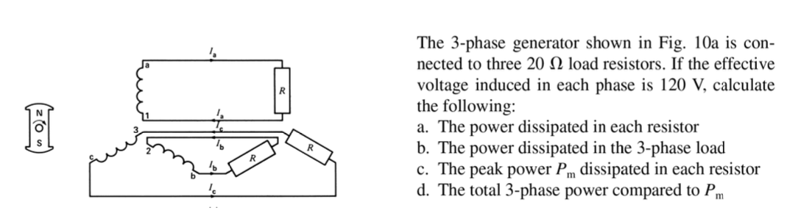
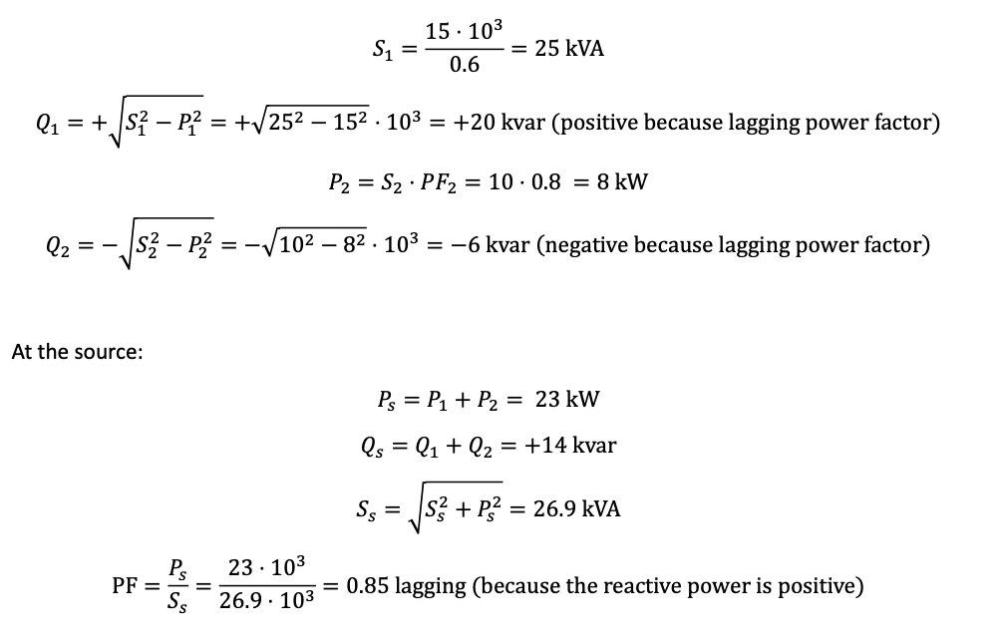

# Circuit Basics
## Phasor
Euler's identity $e^{j\alpha} = \sin \alpha + j \cos \alpha$

Hence $\sin \alpha = Re(e^{j\alpha})$

## Impedance
$\omega = 2\pi f$ is the angular frequency of sinusoidal waveform.

Impedance is a complex number qunatity that combines the effects of resistance, inductance and capacitance.

$$Z = R + j X$$

X is the sum of inductance and capacitance
- $X_L = \omega L$
- $X_C = \frac{1}{\omega C}$
# Three-phase Systems
Three phase system consists of three AC source of same frequency and voltage amplitude but with a phase difference of one third of a cycle (120deg or $\frac{2\pi}{3}$rad) between each.

## Wye and Delta Connection
The power system usually use wye connection, 长得像个alw area51, one end of each wing connect to a common point(neutral point)
- Line voltage is $\sqrt{3}$ times of phase voltage
- Line current is equal to the phase current
- Neutral point provides a return path for unbalanced currents.

The load ususally connects in delta connection.
- Line voltage is equal to phase voltage
- Line current is $\sqrt{3}$ times of phase current

## Three Phase Voltage

The letter N and n are terminal where the loads connect, in a balanced system its assumed to have node voltage $V=0$.

> Unbalanced system will cause these point have voltage because of
> - Voltage don't have same amplitude on different phase
> - Voltage have different phase shift
> - Different loads on the three phase

Line to neutral voltage(Phase voltage)
$$v_a = V\sin(\omega t)$$
$$v_b = V\sin(\omega t - \frac{2\pi}{3})$$
$$v_c = V\sin(\omega t + \frac{2\pi}{3}) = V\sin(\omega t -\frac{4\pi}{3})$$

The instantaneous sum of these voltage at each point is zero
$$v_a + v_b + v_c = 0$$

The corresponding phasor are:
$$V_a = V, V_b = Ve^{-j 2\pi/3}, V_c = Ve^{j2\pi/3}$$

Line to line voltage(line voltage) and line current:
- $V_{ab} = V_a - V_b$, $I_{ab} = I_a - I_b$
- $V_{bc} = V_b - V_c$, $I_{bc} = I_b - I_c$
- $V_{ca} = V_c - V_a$, $I_{ca} = I_c - I_a$
- $I_n = I_a + I_b + I_c$

Line current:
- $I_a = V_a/Z_a$
- $I_b = V_b/Z_b$
- $I_c = V_c/Z_c$

Delta Current:
- $I_ab = V_ab/Z_ab$
- $I_bc = V_bc/Z_bc$
- $I_ca = V_ca/Z_ca$

$V_{LL} = \sqrt{3}V_{LN}, I\Delta = \frac{I_{Line}}{\sqrt{3}}$

## Delta-star transformation

$$R_a = \frac{R_1R_3}{R_1 + R_2 + R_3}$$
$$R_b = \frac{R_2 R_1}{R_1 + R_2 + R_3}$$
$$R_c = \frac{R_3 R_2}{R_1 + R_2 + R_3}$$

> 转换完的resistance是和这个node相连的俩resistor的resistance除以sum

## Star-Delta Transformation

- R_1 = R_a + R_b + \frac{R_aR_b}{R_c}
- R_2 = R_b + R_c + \frac{R_bR_c}{R_a}
- R_3 = R_c + R_a + \frac{R_cR_a}{R_b}

> 转换完的resistance是这个resistor需要链接的两个resistor加起来然后除以他们乘起来除以另一个

## Example

Power and Three-phase Systems

a) $P = VI$ hence, $P= \frac{V^2}{R} = \frac{120^2}{20} = 720W$

b) The power dissipated at load is $P = 3P = 3 \times 720 = 2.16kW$

c) Effective voltage means $V_{rms}$ just change the rms voltage to peak voltage and then calculate again

----

Given line voltage find other

a) $V_{LN} = \frac{V_{LL}}{\sqrt{3}} = \frac{23.9 \times 10^3}{\sqrt{3}} = 13.8kV$

b) $V_a = V_b = V_c = V_{LN} = 13.8kV$

c) 60Hz, The period of each sinusoid is $T = \frac{1}{60} = 16.6ms$

And since each of them are \frac{1}{3} phase difference compare to other

$$16.6 / 3 = 5.5ms$$

d) The peak value is simply the peak voltage

$$\hat{V} = \sqrt{2}V_{rms} = \sqrt{2} \times 23.9 = 33.8kV$$

----

Three phase system calculations

a) Phase voltage = $\frac{865}{\sqrt{3}} = 500V$

b) $V = IR, I = \frac{V}{R} = \frac{500}{50} = 10A$

c) $P_R = VI = 500 \times 10 = 5kW$

    $$P_T = 3P_R = 15kW$$

----

Delta System Calculation

a) $I_\Delta = \frac{I_{LL}}{\sqrt{3}} = 5.77A$

b) $R = \frac{V}{I} = \frac{550}{5.77} = 95\Omega$

# Three-Phase System Power

Because $v = V_m \cos(\omega t), i = I_m\cos(\omega t)$

Hence 

$$p = \frac{V_mI_m}{2}\cos(\theta) + \frac{V_mI_m}{2}\cos(2\omega t+ \theta)$$

## Active Power
The constant term in power expression is named active power

$$P = \frac{V_mI_m}{2}\cos(\theta) = VI\cos\theta$$

The unit is watt

## Reactive Power
The oscillatory term in the power expression represent the exchange of energy between the source and the dynamic element

$$Q = \frac{V_mI_m}{2}\sin \theta$$

The unit is var(volt-ampere reactive)

> This module assume inductive reactive power is positive, capacitive reactive power is negative

For a pure resistive load, $\sin \theta = 0$ and therefore the reactive power is 0

## Apparent Power

$$S = P+jQ$$

The magnitude is

$$S = \sqrt{(VI\cos\theta)^2 + (VI\sin\theta)^2} = VI$$

The $\theta$ is the angle between the voltage phasor and the current phasor $\theta = \theta_v - \theta_i$

## Power in Three Phase System

Impedance 的 $\Delta$ 都等于 3Y

In a balanced Wye-Conncted resistive load circuit

The average power in a resistor is $P = \frac{V_{LN}^2}{R_Y}$

The total power is simply $P_{Total} = P_a + P_b + P_c = 3P = \frac{3V_{LN}^2}{R_Y}$

Power as a function of VLL is $P_{Total} = \frac{V_{LL}^2}{R_Y}$

----

The total power delivered to the load is $P = \frac{3V_{LL}^2}{R\Delta}$

Hence, the power expressions are equal if: $R\Delta = 3R_Y$

----

For balanced generic load, where load is an impedance, the power includes both active and reactive component

$$P = 3V_{LN}I_L \cos \phi = \sqrt{3}V_{LL}I_L\cos\phi$$
$$Q = 3V_{LN}I_L \sin \phi = \sqrt{3}V_{LL}I_L\sin\phi$$

$$S = 3V_{LN}I_L = \sqrt{3}V_{LL}I_L = P + jQ$$

Balanced wye-conncted reactive load: $Q = \frac{V_{LL}^2}{X_Y}$

Balanced delta-conncted reactive load: $Q = \frac{3V_{LL}^2}{X_\Delta}$

$$X_Y = j\omega L_Y = \frac{1}{j\omega C_Y}$$

$$X_\Delta = j\omega L_\Delta = \frac{1 }{j\omega C_\Delta}$$

The impedance transformation is $Z_\Delta = 3Z_Y$

## Single-phase equivalent circuit

## Power Factor
$$PF = \frac{P}{S}$$

Power factor is unity(1) for a resistive load, it is 0 for purely inductive and a purely capacitive load.

To correct the power factor make it closer to unity, capacitor banks are connected to improve the power factor.

$$Q_{C,\Delta} = \frac{V_{LL}^2}{X_{C,\Delta}}$$

$$Q_{C,Y} = \frac{V_{LN}^2}{X_{C,Y}}$$

$$C_Y = 3C_\Delta$$

## Example

Calculate three phase power

The given V is the line to line voltage $V_{LL}$

If calculate it using the vll voltage and three phase power definition

$$P = \frac{V_{LL}^2}{R_Y} = \frac{600^2}{2} = 180kW$$

If calculate using the vln voltage and three phase power definition

$$P = \frac{3\frac{V{_LL}}{\sqrt{3}}^2}{2} = 180kW$$

If using the single phase equivalent

$$V_{LN} = \frac{600}{\sqrt{3}}$$

$$I_a = \frac{V_{LN}}{R_Y} = 173.2A$$

$$P_a = VI = \frac{600}{\sqrt{3}} \times 173.2 = 60kW$$

total power

$$P_{Total} = 3P_a = 180kW$$

For calculating for delta load

$$R_\delta = 3 R_Y = 6\Omega$$

$$P = 3\frac{V_{LL}^2}{R_\Delta} = 3 \frac{600^2}{6} = 180kW$$

----

Three phase with neutral impedance power

In the example provided, since the circuit is symmetrical and balanced, and the impedances of the load and the cable resistance are the same for all three phases, the same current flows through each phase conductor, but each phase current is shifted in time by 120 degrees relative to the others. The net sum of the currents at the neutral point is thus zero, so no current flows through the neutral conductor.

And this can be transfer to a single-phase equivalent circuit

$$V_{LN} = 480V$$

$$I_a = \frac{V_a}{R_c + Z_L} = \frac{480}{2 + 2 j4} = 84.85 \angle -45^\circ A$$

$$P = \frac{V_mI_m}{2}\cos \theta = 14kW$$

Total power is $P \times 3 = 14k \times 3 = 42kW$

----

Threephase power factor and triangle

$$PF = \frac{P}{S}$$

$\omega = 2\pi f = 100\pi$

$$S_1 = \frac{P_1}{PF_1} = \frac{15k}{0.6} = 25kVA$$

----

Find current given three phase load system

