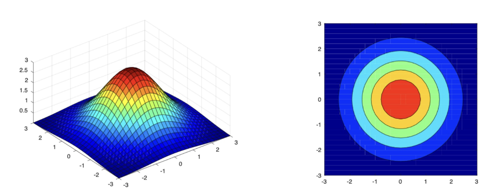
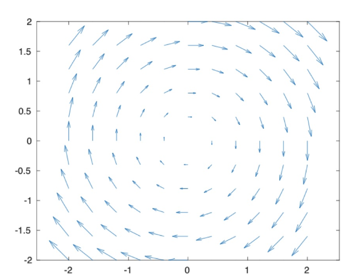

# Scalar and Vector Fields
## Scalar Fields
A scalar field on $\R^n$ is a real-valued function
$$f:\R^n \to \R$$
That assigns a scalar to every point of the vector space $\R^n$

Example: $f(x,y) = e^{-(x^2+y^2)}$

## Vector fields
A **vector field** on $\R^n$ is a vector-valued function
$$\vec{F}: \R^n \to \R^n$$
that assigns a vector from $\R^n$ to every point of the vector space $\R^n$

Example: $\vec{F}(x,y) = y \vec{i}- x \vec{j}$

## Component Functions
Vector field is often defined over $\R^3$ by 3 scalar valued functions $\boldsymbol{P, Q, R}$

$$\vec{F}(x,y,z) = \boldsymbol{P}(x,y,z)\vec{i} + \boldsymbol{Q}(x,y,z)\vec{j} + \boldsymbol{R}(x,y,z)\vec{k}$$
