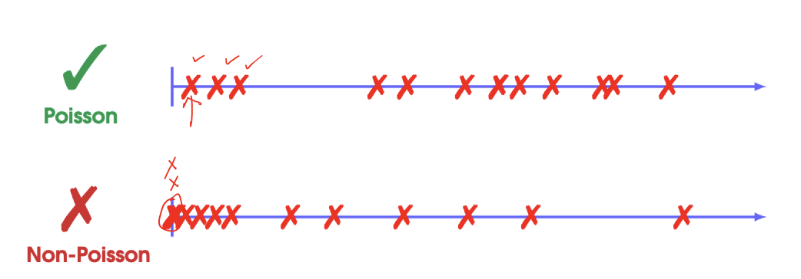
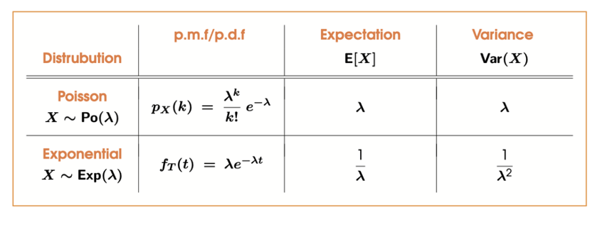

# Poisson Process
A Poisson Process is a continuous stochastic process that counts the number of 'events' $N_t$ occuring in the interval $[0,t)$

## Properties of a Poisson Process
The probability of $k$ events occuring in the interval $[t, t+L)$ dependes only on the length of the interval $L$

$$P(N_{t+L} - N_t = k) = P(N_L = k)$$

i.e. the number of events depends only on the interval length

The second one is not proper, because there's multiple event occuring at the same time. This makes it not a poisson process distribution.

---

For short intervals, the probability is approximatley proportional to the size of the interval

$$P(N_{(t+\delta)} - N_t = 1) \approx \lambda \cdot \delta$$

Where $\lambda > 0$ is the rate of the Poisson process

$\lambda$ means the estimated number of event happened. $\delta$ is the small time interval

The probability of more than one event occuring in a short interval is negligible
$$P(N_{t+\delta)} - N_t \geq 2)\approx 0$$

A random variable $X$ is said to be Poisson distributed if it has a p.m.f
$$p_x(k) = \frac{\lambda^k}{k!}e^{-\lambda}, \textrm{ for } k = 0,1,2,\dots$$

in which case we write $X \sim Po(\lambda)$

Reminder of Taylor expansion of $e^x$
$$e^x = \sum_{k=0}^{\infty}\frac{x^k}{k!}= 1 + \frac{x}{1!} + \frac{x^2}{2!} + \dots$$

----
**:smoking: Example**

There are average 10 clicks on a webpage per hour, predict the number of clicks to be exactly 5 in the next hour?

Hence $k=5, \lambda = 10$

$$p_X(x = 5) = \frac{10^5}{5!}e^{-10}= 0.0378$$

----

**THEOREM 1**

Let $P$ be a Poisson process with rate $\lambda > 0$, and let $N_t$ denote the number of events that occur within the interval $[0,t)$, then 
$$P(N_t = k) = \frac{(\lambda t)^k}{k!}e^{-\lambda t}$$

Hence $N_t \sim Po(\lambda t)$ is Poisson distributed with parameter $\lambda t$

----

Like the previous example, if the question ask us to predict the number of clicks to be exactly 5 in the next two hours and next minutes:

1. Next one hour
$$p_X(x = 5) = \frac{10^5}{5!}e^{-10}= 0.0378$$

2. Next two hour
$$p_X(x = 5) = \frac{(10 \times 2)^5}{5!}e^{-10\times 2}$$

3. Next one minute
$$p_X(x = 5) = \frac{(10 \times \frac{1}{60})^5}{5!}e^{-10 \times \frac{1}{60}}$$

----
**THEOREM 2**

Let $X \sim Po(\lambda)$ be poisson distributed. Then
$$E[X] = \lambda, \textrm{Var}(X) = \lambda$$

----
*:smoking: Exercise 10.1**

(WHAT THE FUCK????)

## Exponential Distribution
A continuous random variable is said to be exponentially distributed if it has a probability density function 
$$f_r(t) = \lambda e^{-\lambda t}\ \textrm{ for }t \in [0, \infty)$$

----
**:smoking: Exercise 10.2** 
(i) Show that $f_r(t)$ is an appropriate p.d.f. (the sum is 1)

(ii) What is $P(T <2)$
$$P(T<2) = \int_{0}^{2}\lambda e^{-\lambda t}dt$$ 
$$ = 1-e^{-2\lambda}$$

(iii) What is $$P(2<T<5)$$
$$P(2<T<5) - \int_{2}^{5}\lambda e^{-\lambda t}dt$$
$$= e^{-2\lambda}-e^{-5\lambda}$$

(iv) For what value of $t$ is $$P(T<t) = 0.5$$

----
**MY THEOREM**

For $P(a<T<b)$ of a exponential distributed random variable, the probability is

$$P(a<T<b) = e^{-a\lambda} - e^{-b\lambda}$$

----
**THEOREM**
Let $P$ be a Poisson process with a rate $\lambda > 0$, and let $T$ denote the arrival-time of the first event. Then
$$P(T \leq t_0) = \int_{0}^{t_0}\lambda e^{-\lambda t}dt$$

i.e. $T \sim \textrm{Exp}(\lambda)$ is exponentially distributed with parameter $\lambda$

Still the previous example, if they ask what is the probability of one click in an interval of 6 minutes?
$$P(T \leq 0.1) = \int_{0}^{0.1}\lambda e^{-\lambda t}dt$$

----
**THEOREM(Memoryless Property)**

Let $T\sim \textrm{Exp}(\lambda)$ be exponentially distributed with rate $\lambda > 0$. Then we have that
$$P(T \geq (s+t)\ |\ T\geq s) = P(T \geq t)$$

for all $s,t > 0$

----
Let $T \sim \textrm{Exp}(\lambda)$ be exponentially distributed, then
$$E[T] = \frac{1}{\lambda}, \textrm{Var}(T) = \frac{1}{\lambda^2}$$

----
**:smoking: Exercise 10.3** 

Let $T(n)$ denote the arrival time of the $n$-th event, for $n = 1,2,3,\dots$

# Summary

