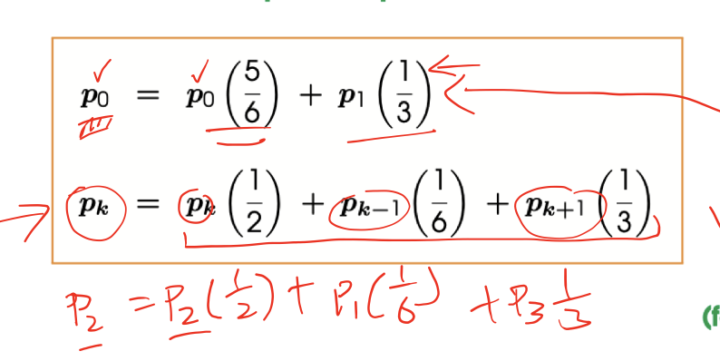
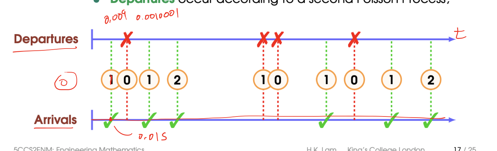
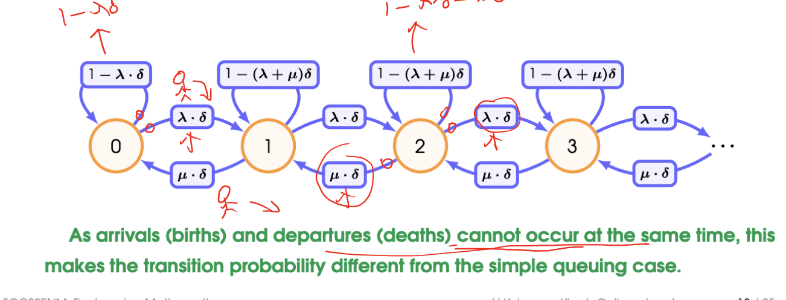
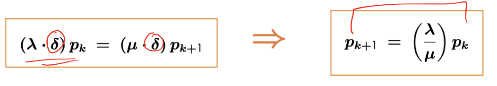

# A Simple Queuing Process
A simple queue is a Markov Chain where the states corresponds to _the number of people in the queue_

Every minute a new person joins the queue with probability $p$, and one person leaves the queue with probability $q$

$P(\textrm{arrival})=p$ and $P(\textrm{departure}) = q$, we assume at most 1 person can join/leave in each time.

## Transitional Probabilities
### Queuing Increases
$$p(n \to (n+1)) = P( \textrm{1 person arrive AND no one depart})$$

$$ = P(\textrm{1 arrival}) \times P (\textrm{0 departure}) = p(1-q)$$

### Queuing Decreases
$$p(n\to (n-1)) = P(\textrm{no one arrive AND 1 person departs})$$
$$ = P(\textrm{0 arrival}) \times P(\textrm{1 departures}) = (1-p)q$$

### Queue stays empty
$$p(0 \to 0) = P(\textrm{no one arrives OR (1 person arrives AND 1 person depart)})$$

$$ = P(\textrm{0 arrival}) + P (\textrm{1 arrival}) \times P(\textrm{1 departure})$$

$$= (1-p) + pq$$

### Queue remains the same length
$$p(n\to n) = P(\textrm{(no arrives AND no departs) OR (1 arrive AND 1 depart)})$$
$$= P(\textrm{0 arrival}) \times P(\textrm{0 departs}) + P(\textrm{1 arrival})\times P(\textrm{1 depart})$$

$$ = (1-p)(1-q) + pq$$

----
**:smoking: Exercise 11.1** 

Suppose that $p = \frac{1}{3}$ and $q = \frac{1}{2}$

What is the probability that queue will contain:

(i) 3 People after 3 minutes

Theres only one path from an empty queue to a 2-person queue in three minutes:

$$p_3(0 \to 3) = P(0\to 1\to 2\to 3) = \frac{1}{6}\times \frac{1}{6} \times \frac{1}{6} = \frac{1}{216}$$

(ii) 2 People after 3 minutes

(iii) Only 1 person after 3 minutes

## Calculating the long-term behaviour
**Step 1)**  Let $p_k$ denote the fixed-point probability that queue contains exactly $k$ people

**Step 2)** Write down the fixed-point equation for the next time

**Step 3)** Solve the system of equations recursively, write each $p_k$ in terms of $p_0$

**Step 4)** Use the fact that $\sum_{k=0}^{\infty}p_k = 1$ to solve for $p_0$

**Step 5)** Substitute this value, and get the formula to calculate for whatever k value

### Shortcut
**Step 1)**  Make a cut between two state

**Step 2)** Balance the probability flowing across the cut in both directions

**Step 3)** Solve recursively writing each $p_k$ in terms of $p)0$

**Step 4)** Continue to use sum equal 1 to find $p_0$ and substitute back

## Calculating the Expected Queue Length
**Step 1)** Calculate the fixed-point probabilities as above

**Step 2)**  Evaluate the infinite sum for the expectation

$$E[S] = \sum_{k=0}^{\infty}k \cdot p_k = \sum_{k=0}^{\infty}k \cdot (\frac{1}{2})^k (\frac{1}{2})$$

> Reminder of geometric series formula $f(x) = \sum_{k=0}^{\infty}x^k = \frac{1}{1-x}$ and $f'(x) = \sum_{k=0}^{\infty}kx^{k-1} = \frac{1}{(1-x)^2}$

**Step 3)** Solve the infinite series

# More Realistic Queue
## Continuous Single-Server Queue
A Birth-Death process (known as $M/M/1$ queue) is the generalisation of a simple queue to continuous time, where arrival(birth) and departure(death) can occur at any time(but not at same time), where
- Arrival occur according to a Poisson Process
- Departure occur according to a second Poisson Process

## Calculating the Long-term Behaviour
**Step 1)** Discretize time by dividing into many small intervals of length $\delta$
$$P(\textrm{arrival}) \approx \lambda \cdot \delta \ \textrm{, }\ P(\textrm{departure}) \approx \mu \cdot \delta$$

**Step 2)** Obtain the fixed-point equations for this discrete approximation

**Step 3)** Balance the probability across the cut

**Step 4)** As with simple queue, solve the system recursively, find $p_0$ using sum equals to 1, and substitute back

## Calculating the Expected Queue Length
**Step 1)** Find the fixed-point probability.

**Step 2)** Evaluate the infinite sum for the expectation

----
**:smoking: Example 11.2** 

tldr
