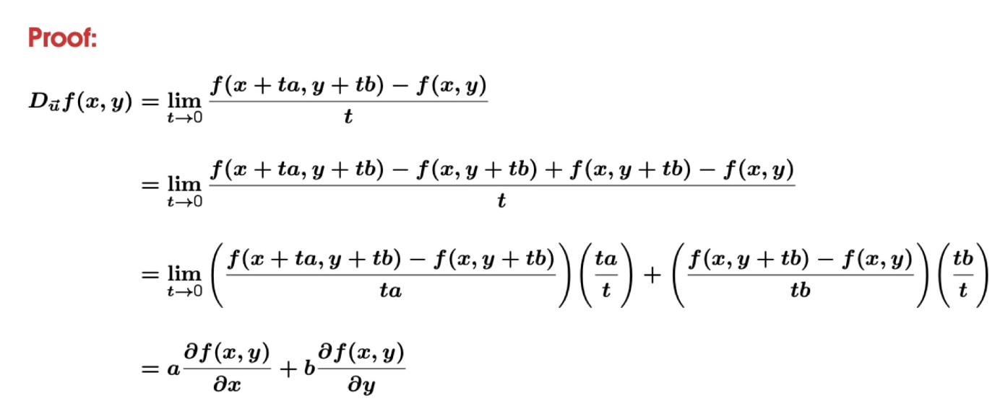
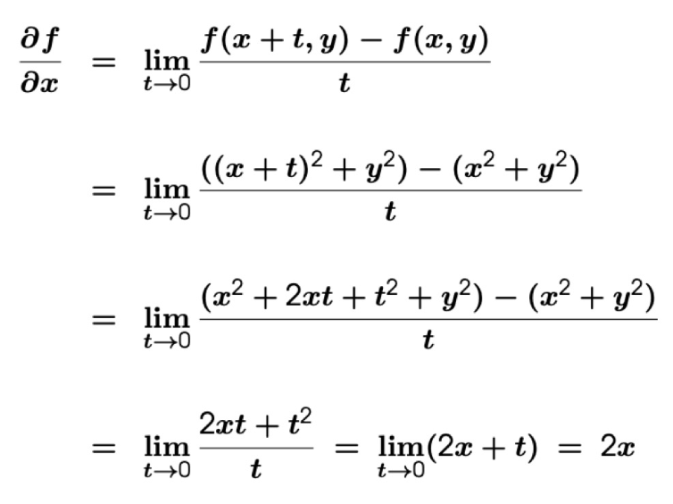
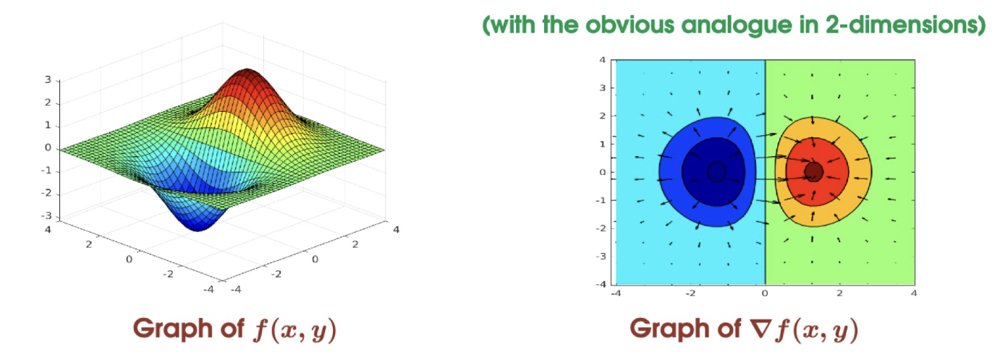
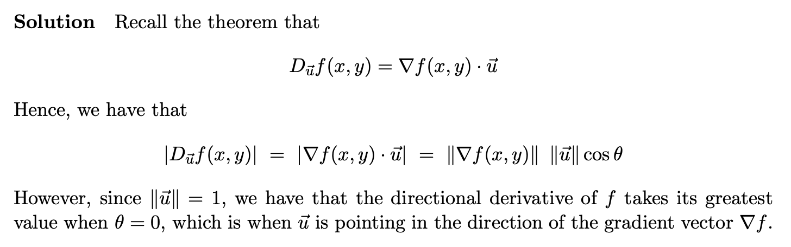
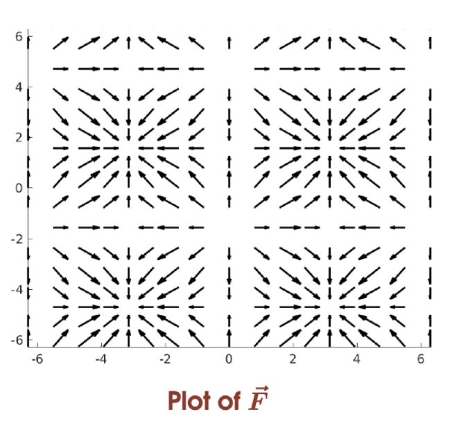
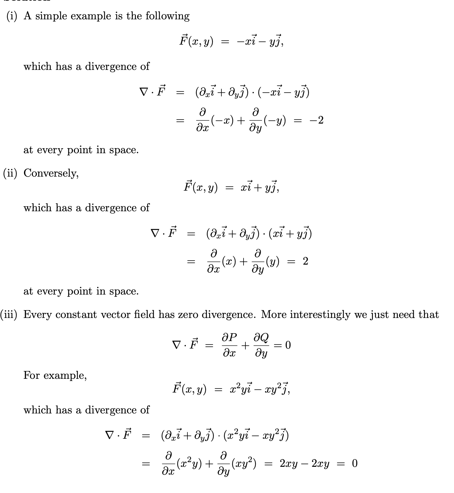
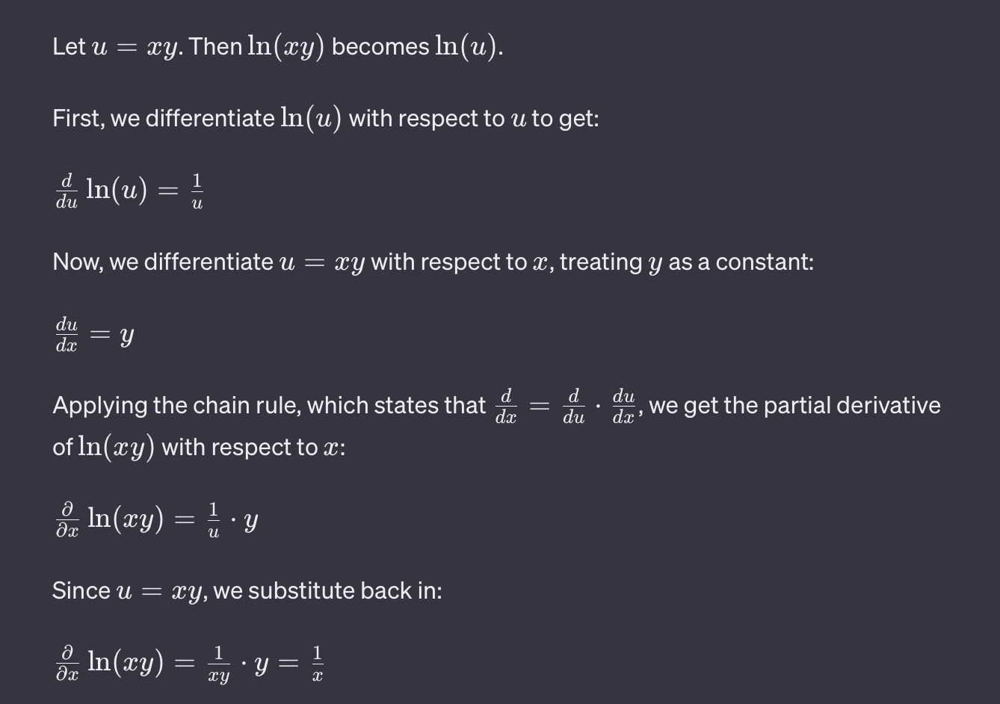
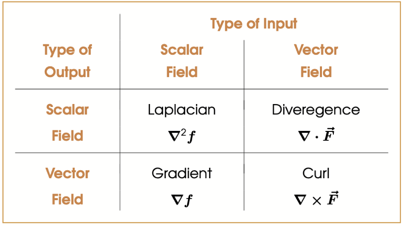

# Derivatives and Directional Derivatives

## Derivatives in One-dimension
Let $f:\R \to \R$ be a one-variable scalar function. Then the derivative of $f$ evaluated at $x \in \R$ is given by:
$$\frac{df}{dx} = \lim_{t \to 0}\frac{f(x+t) - f(x)}{t}$$
*(provided that the limit exists)*

## Directional Derivatives
### Directional Derivatives in 1 Dimension
Let $f: \R^3 \to \R$ be a scalar field on $\R^3$, and let $\vec{u} \in \R^3$ be any unit vector in $\R^3$(the direction)

Then the **directional derivative** of $f$ evaluated at $\vec{x} \in \R^3$ in the direction of $\vec{u}$ is given by

$$D_{\vec{u}}f(\vec{x}) = \lim_{t \to 0}\frac{f(\vec{x} +  \vec{u}) - f(\vec{x})}{t}$$

*(provided that the limit exists)*

### Directional Derivatives in 2 Dimensions
Directional Derivatives in 2D in the direction of a unit vector $\vec{u} = a \vec{i} + b \vec{j}$, ($||\vec{u}|| = 1$, i.e. $\sqrt{a^2+b^2} = 1$) is given by:

$$D_{\vec{u}}f(x,y) = a \frac{\partial f(x,y)}{\partial x} + b \frac{\partial f(x,y)}{\partial y}$$

---
**:smoking: Exercise 1**

Let $f: \R^2 \to \R$ be given by
$$f(x.y) = x^2+y^2$$

Find a unit vector $\vec{u}\in \R^2$ such that $D_{\vec{u }}f(x,y)=  0$

> Solution

Let $\vec{u } = u_1 \vec{i } + u_2 \vec{j}$ be an arbitrary unit vector, then we have that $\vec{x } + t \vec{u } = (x + tu_1)\vec{i } + (y + tu_2)\vec{j}$

Using the definition of the directional derivative, we find that

$$D_{\vec{u }}f(x,y) = \lim_{t  \to 0}\frac{[(x+tu_1)^2 + y(+tu_2)^2] - [x^2 + y ^2]}{t}$$
$$= \lim_{t  \to 0} 2(xu_1 + yu_2) + t(u_1^2 +u_2^2) = 2(xu_1 + yu_2)$$

Hence, at the position $(x,y) \in \R^2$, the direction in which there is no change in gradient is the solution to the equation

$$D_{\vec{u }}f(x.y) = 2(xu_1 +yu_2) = 0$$

Hence we can set
$$xu_1 = -yu_2$$

Hence we can set $u_1 = yt$ and $u_2 = -xt$, for any $t \in \R$ and get a solution to the equation. That is to say that any vector of the form $\vec{u}(t) = yt \vec{i } - xt \vec{j}$, for $t \in \R$. will experience no change in the gradient of $f$.

However, we are looking for a *unit vector*.

We need to find a value of $t$ for which $||\vec{u}(t)|| = 1$

$$||\vec{u }(t)|| = \sqrt{y^2t^2 + x^2t^2 } = t \sqrt{x^2+y^2 } = 1$$
$$t = \frac{1 }{\sqrt{x^2+y^2}}$$

So the univector that experience no change in the gradient of $f$ is
$$\vec{u }(\frac{1 }{\sqrt{x^2+y^2 }}) = \frac{y }{\sqrt{x^2+y^2}}\vec{i} - \frac{x}{\sqrt{x^2+y^2}}\vec{j}$$
### Directional Derivatives in 3 Dimensions
Directional Derivatives in 2D in the direction of a unit vector $\vec{u} = a \vec{i} + b \vec{j} + c \vec{k}$, ($||\vec{u}|| = 1$, i.e. $\sqrt{a^2+b^2+c^2} = 1$) is given by:

$$D_{\vec{u}}f(x,y,z) = a \frac{\partial f(x,y,z)}{\partial x} + b \frac{\partial f(x,y,z)}{\partial y} + c\frac{\partial f(x,y,z)}{\partial z}$$

# Partial Derivatives
By choosing $\vec{u } \in \R^3$ to be one of the standard basis vectors, we can isolate the rate of change of $f$ as we vary $x,y,z$ respectively.

These are the **partial derivatives** with respect to $x,y,z$
$$\frac{\partial f }{\partial x}=D_{\vec{i}}f(\vec{x}),\frac{\partial f }{\partial y}=D_{\vec{j}}f(\vec{y}),\frac{\partial f }{\partial z}=D_{\vec{k}}f(\vec{z}),$$

 For convinience, there's abbreviations $\partial_x, \partial_y, \partial_z$

>Basically consider other variables as constants.

---
**:shit: Example**
$$f(x,y) = x^2 + y ^2$$

For finding $\frac{\partial f }{\partial x}$, just treat other term as constants.
$$\frac{\partial f }{\partial x} = \frac{d }{dx }(x^2 + c^2) = 2x + 0 = 2x$$

也可以用这个lim的弱智方法

## Properties of Partial Derivatives
### Constant Multiple Rule
Let $f:\R^3 \to \R$ be differentiable and let $c \in \R$ be a scalar. Then 
$$\frac{\partial }{\partial x}cf(\vec{x}) = c \frac{\partial}{\partial x}f(\vec{x})$$

### Sum Rule
Let $f,g:\R^3 \to \R$ be differentiable. Then 
$$\frac{\partial }{\partial x }(f+g)(\vec{x}) = \frac{\partial}{\partial x}f(\vec{x})+ \frac{\partial}{\partial x}g(\vec{x})$$

### Product Rule
Let $f,g:\R^3 \to \R$ be differentiable. Then 
$$\frac{\partial }{\partial x}f(\vec{x})g(\vec{x}) = f(\vec{x})\frac{\partial g }{\partial x}(\vec{x}) + g(\vec{x}) \frac{\partial f }{\partial x}(\vec{x})$$

### Chain Rule - V1
Let $f: \R^3 \to \R$ and $g: \R \to \R^3$ be differentiable function, and let
$$h(t) = f(g(t)) = f(x(t),y(t),z(t))$$
be the compostion of $f$ and $g$. Then
$$\frac{dh}{dt } = \frac{\partial f}{\partial x } \frac{dx}{dt} + \frac{\partial f}{\partial y} \frac{dy }{dt } + \frac{\partial f}{\partial z}\frac{dz}{dt}$$

### Chain Rule - V2
Let $f: \R^3 \to \R$ and $g: \R^2 \to \R^3$ be differentiable function, and let
$$h(u,v) = f(g(u,v)) = f(x(u,v),y(u,v),z(u,v))$$
be the compostion of $f$ and $g$. Then holding the variable $v$ as a constant, we get partial dericative of $u$
$$\frac{\partial h}{\partial u} = \frac{\partial f}{\partial x } \frac{\partial x }{\partial u} + \frac{\partial f}{\partial y } \frac{\partial y }{\partial u} + \frac{\partial f}{\partial z } \frac{\partial z}{\partial u}$$

## Higher-Order Partial Derivatives
If all the partial derivatives are differentiable, then their second-order derivatives are given by
$$\frac{\partial^2 f}{\partial x^2} = \frac{\partial }{\partial x }(\frac{\partial f}{\partial x})$$

and

$$\frac{\partial^2 f}{\partial x \partial y } = \frac{\partial}{\partial x}(\frac{\partial f}{\partial y})$$

> The order of taking partial derivatives does not matter.

---
**:smoking: Exercise 2**

Calculate the second-order derivatives of the function 
$$f(x,y) = xy + (x+2y)^2$$

Hence

$$f(x,y) = xy + x^2 + 4xy + 4y^2$$

So making a partial derivative about x

$$\frac{\partial f}{\partial x} = y + 2x + 4y$$

And then we got

$$\frac{\partial^2 f}{\partial x^2 } = 2$$

And giving partial derivative about y
$$\frac{\partial f }{\partial y } = x+4(x+2y)$$

And then we  got

$$\frac{\partial^2 f}{\partial x\partial y} = 5$$

# Differential Operators on Scalar and Vector Fields
## The Gradient Operator
Let $f: \R^3 \to \R$ be a scalar field on $\R^3$. The gradient of $f$ is the vector field given by
$$\nabla f = \frac{\partial f}{\partial x} \vec{i } + \frac{\partial f}{\partial y} \vec{j } + \frac{\partial f}{\partial z} \vec{k }$$

Let $f:\R^3 \to \R$ be a real-valued function. Then the directional derivative of $f$ with respect to $\vec{u}$ is given by
$$D_{\vec{u}}f(\vec{x }) = \nabla f(x) \cdot \vec{u}$$
for any unit vector $\vec{u}\in \R^3$

---
**:smoking: Exercise 3**

Prove that the gradient vector $\nabla f(x,y)$ points in the direction of the steepest ascent of $f$ at postion $(x,y)$

>Solution

I don't get it

## The Divergence Operator
Let $\vec{F} = P \vec{i} + Q \vec{j} + R \vec{k}$ be a vector field on $\R^3$. The divergence of $\vec{F}$ is the scalar field given by
$$\textrm{div}\vec{F} = \nabla \cdot \vec{F} = (\partial_x \vec{i} + \partial_y \vec{j}+ \partial_z \vec{k}) \cdot (P \vec{i} + Q \vec{j} + R \vec{k})$$
$$= \frac{\partial P}{\partial x} + \frac{\partial Q}{\partial y} + \frac{\partial R}{\partial z} $$

A vector field is said to be incompressible if its divergence is zero at every point in $\R^3$
$$\nabla \cdot \vec{F}(x,y,z) = 0$$
for all $(x,y,z) \in \R^3$

**THEOREM** The divergence of a curl is always 0

---
**:smoking: Exercise 4**

Find examples of a vector fields such that

1. $\nabla \cdot \vec{F_1}(x,y) < 0$ for all $(x,y) \in \R^2$
2. $\nabla \cdot \vec{F_2}(x,y) > 0$ for all $(x,y) \in \R^2$
3. $\nabla \cdot \vec{F_3}(x,y) = 0$ for all $(x,y) \in \R^2$

## The Curl Operator
Let $\vec{F } = P \vec{i } + Q \vec{j } + R \vec{k}$ be a vector field on $\R^3$ the curl of $\vec{F}$ is another vector field given by

$$\textrm{curl} \vec{F} = \nabla \times \vec{F} = \begin{vmatrix}
\vec{i} &\vec{j} &\vec{k}\\
\partial_x &\partial_y &\partial_z\\
P &Q &R
\end{vmatrix}$$

$$ = (\frac{\partial R}{\partial y} - \frac{\partial Q}{\partial z})\vec{i}-(\frac{\partial R}{\partial x} - \frac{\partial P}{\partial z})\vec{i})+(\frac{\partial Q}{\partial x} - \frac{\partial P}{\partial y})\vec{i}$$

The curl can be interpreted as **a measure of the angular rotation of a small rigid body sitting in the field at a given point**

The axis of rotation is the direction of $\nabla \times \vec{F}$ and the angular velocity is $\frac{1 }{2 }||\nabla \times \vec{F}||$

A vector field is said to be **irrotational** if its curl is the zero vector at every point in $\R^3$ i.e.
$$\nabla \times \vec{F}(x,y,z) = \vec{0}$$

for all $(x,y,z) \in \R^3$

### Theorem (Curl of a Gradient)

Let $f$ be a scalar field on $\R^3$, then the curl of the gradient of $f$ is the zero vector. i.e.
$$\textrm{curl}\nabla f = \nabla \times (\nabla f) = 0$$
That is to say that every conservative vector field is irrotational.

A vector field is conservative if there exists a scalar function such that $\vec{F } = \nabla f$. The scalar function $f$ is called the potential function of $\vec{F}$

<++> Proof that i dont understand

---
**:smoking: Exercise 5**

Show that the following vector field cannot be the gradient of any scalar field
$$\vec{F} = -y \vec{i} + x \vec{j}$$

In other words, show that $\vec{F}$ is not a conservative vector field.

>Solution

The $\vec{F}$ is not a conservative vector field, hence it is not irrotational, hence the curl of it does not equals to 0
$$\nabla \times \vec{F} \neq 0$$

---
**:smoking: Exercise 6**

Show that the following vector field cannot be the curl of any vector field
$$\vec{F} = x \vec{i} + y \vec{j} + z \vec{k}$$

## The Laplacian Operator
Let $f:\R^3 \to \R$be a scalar field on $\R^3$. The Laplacian of $f$ is the scalar field given by the sum of the second partial derivatives
$$\nabla^2 f = \nabla \cdot (\nabla f) = \frac{\partial^2 f }{\partial x^2 } + \frac{\partial^2 f }{\partial y^2} + \frac{\partial^2 f }{\partial z^2}$$

i.e. It is the divergence of the gradient of $f$

---
**:smoking: Exercise 7**
Calculate the Laplacian of the scalar field $f:\R^2 \to \R$, given by
$$f(x,y) = \ln(xy)$$

$$\nabla \cdot (\nabla f) = - \frac{1}{x^2} - \frac{1}{y^2} = - \frac{x^2 +y^2}{(xy)^2}$$

# Summary

