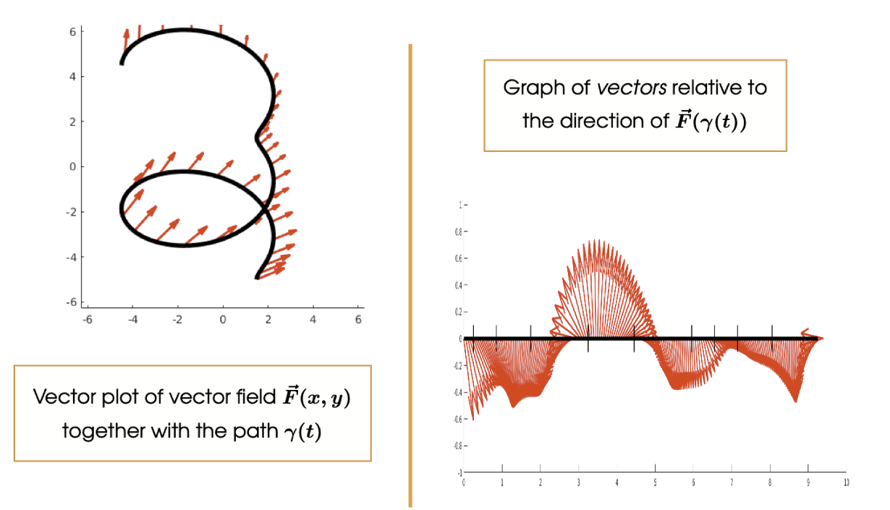

# Path and Curves
A parametrized path in $\R^3$ is a continuous function $\gamma:[a,b] \to \R^3$ mapping the closed interval $[a,b]$ into $\R^3$.

$$\gamma(t) = x(t)\vec{i} + y(t) \vec{j} + z(t) \vec{k}$$

Regarding the interval $t \in [a,b]$ then $\gamma(a)$ is the Initial Point defining $C$, i.e. $(x(a), y(a), z(a))$ and $\gamma(b)$ is the terminal point defining $C$, i.e.$(x(b),y(b),z(b))$

The curve traced out by $\gamma$ is given by the image
$$C = \{\vec{x}\in \R^3 : \gamma(t) = \vec{x} \textrm{ for some } a \leq t \leq b\}$$

这里写的是$\R^3$，但其实可以是任何的dimension

For example this is a curve of $\gamma(t) = t\cos(t)\vec{i} + t \sin (t) \vec{j}, t\in[0, 2\pi]$

## Velocity / Tangent Vector
Let $\gamma : [a,b] \to \R^3$ be a parametrized path. Then the **tangent* to $\gamma$ at time $t$ is given by the **velocity vector**
$$r'(t) = \frac{dx }{dt }\vec{i} + \frac{dy }{dt } \vec{j} + \frac{dz }{dt } \vec{k}$$

The length $||r'(t)||$ is the rate at which the path is traversed

### Unit Tangent Vector
The unit tangent vector can be obtained by scaling down the velocity vector by its length
$$\vec{T}(t) = \frac{\gamma '(t)}{||\gamma '(t)||}$$

## Types of Path / Curve
### Close Paths / Curves
A path $\gamma : [a,b] \to \R^3$ is said to be closed if
$$\gamma(a) = \gamma(b)$$

i.e. the path forms a loop in space

A closed curve is a curve traced out by a closed path

### Simple Paths / Curves
A path $\gamma: [a:b] \to \R^3$ is said to be simple if
$$\gamma(t_1) \neq \gamma(t_2) \textrm{ for all } t_1,t_2 \in [a,b), \textrm{ where } t_1 \neq t_2$$

i.e. the ptah does not intersect itself, except possibily at its endpoints

A simple curve is a curve traced out by a simple path

## Piecewise Differentiable Paths
A path $\gamma: [a,b] \to \R^3$ is said to be **Piecewise Differentiable** if it is composed of (finite many) paths, each with well-defined derivatives.

$$\gamma = \gamma_1 + \gamma_2 + \dots + \gamma_n$$

# Path Integration over Scalar Fields
## Path (Line) Integrals
Let $f: \R^3 \to \R$ be a continuous scalar field on $\R^3$, and let $\gamma: [a,b] \to \R^3$ be a differentiable path in $R^3$

The path integral of $f$ along the path $\gamma$ is given by

$$\int_{\gamma }^{}fds = \int_{a }^{b }f(\gamma(t)) ||\frac{d \gamma }{dt}||dt == \int_{a }^{b }f(\gamma(t))||\gamma '(t)||dt$$

The $s$ denotes displacement, not a separate variable

### Theorem
Let $f: \R^3 \to \R$ be a continuous scalar field on $\R^3$, and let $\alpha:[a,b] \to \R^3$ and $\beta:[c,d] \to \R^3$ be two paths that parametrize the same curve $C$, then
$$\int_{\alpha}^{}fds = \int_{\beta }^{}fds$$

i.e. The integral depends only on the curve, and not tthe parametrization

---
**:smoking: Exercise 2.1**

Let $f: \R^3 \to \R$ be the scalar field given by $f(x,y,z) = x^2+y^2+z^2$

Calculate the value of the integral of $f$ along the helical path $\gamma:[0, 2\pi]\to \R^3$ , given by
$$r(t) == (\cos t)\vec{i} + (\sin t) \vec{j} +t \vec{k}$$

<++>

### Piecewise Diferentiable Path Integrals
If $\gamma = \gamma_1 + \gamma_2 + \dots + \gamma_n$ is piecewise differentiable then we can extend the deffinition off a ath integral by taking
$$\int_{\gamma}^{}fds = \int_{\gamma_1 }^{}fs + \int_{\gamma_2}^{}fds + \dots + \int_{\gamma_n }^{}fds$$

This is anagolous to splitting the domain $\int_{-1 }^{1 }|x|dx = \int_{-1 }^{0}|x|dx + \int_{0 }^{1 }|x|dx$

### Length of an Arc
Let $C \subseteq \R^3$ be a piecewise differentiable curve, then the length of $C$ is given by the path integral
$$\int_{C }^{}1ds = \int_{a }^{b }||\gamma '(t)|| dt$$

where $\gamma:[a,b] \to \R^3$ is a simple path that parametrized $C$.

Intuitively, we want to divide time $t$ into lots of small intervals, and approximate the arc length across each small interval by the length off the velocity vector, summing over all intervals.

## Path Integration over Vector Fields
Let $\vec{F} \R^3 \to \R^3$ be a continuous vector field on $\R^3$, and let $\gamma:[a,b] \to \R^3$ be a piecewise differentiable path in $R^3$. The path integral of $\vec{F}$ along the path $\gamma$ is given by
$$\int_{\gamma}^{}F \cdot d \vec{s} = \int_{a }^{b }\vec{F}(\gamma(t))\cdot \vec{T}(t)||\gamma'(t)||dt$$

where
$$\vec{T}(t) = \frac{\gamma'(t) }{||\gamma'(t)||}$$

is the unit vector tangent to the path $\gamma$ at time $t \in [a,b]$

The $\to-$ component of each vector $\vec{F}(\gamma(t))$ is given by the dot product of $\vec{F}\gamma(t)$ with the unit tangent vector $\vec{T}(t)=\gamma'(t)/||\gamma'(t)||$

If we graph the $(\textrm{scalar}) \to-$ component against the path length, we can approximate the area under the curve as we did for scalar fields

### Theorem
Let $f:\R^3 \to R$ be a continuous scalar field on $\R^3$ and let $\gamma: [a,b] \to \R^3$ be a piecewise continuous path. Then
$$\int_{\gamma}^{}\nabla f \cdot d \vec{s} = f(\gamma(b))-f(\gamma(a))$$

### Corollary
Let $\vec{F}:R^3 \to R^3$ be a conservative vector field and let $\gamma:[a,b] \to \R^3$ be a closed path. Then 
$$\oint_{\gamma}^{}\vec{F}\cdot d \vec{s }=0$$

# Double Integration
## Double Integrals / Area Integrals
Let $f: \R^2 \to \R$ be a function and let $R \subseteq \R^2$ be a region of the plane $\R^2$. Then the double integral of $f$ over the region $R$ is denoted
$$\int\int_R f(x,y)dA = \textrm{Volume bounded between }f(x,y) \textrm{and the xy-plane, over the region R}$$

the $dA$ indicates that we are integrating with respect to the area of $R$

### Theorem
Let $f:\R^2 \to \R$ be a continuous function and let $\R = [a,b] \times [c,d]$ be a rectangular region of the xy-plane

Then

$$\int\int_R f(x,y)dA = \int_{a }^{b }[\int_{c }^{d }f(x,y)dy]dx = \int_{c }^{d }[\int_{a }^{b }f(x,y)dx]dy$$

## Simple Regions
### y-Simple Regions
A region $R \subseteq \R^2$ is said to be y-Simple if there are continuous functions $\phi^-,\phi^+:[a,b] \to \R$ for some interval $[a,b]$ such that 
$$R = \{(x,y) \in \R^2 : a\leq x \leq b \textrm{ and } \phi^-(x)\leq y\leq\phi^+(x)\}$$

### x-Simple Regions
A region $R \subseteq \R^2$ is said to be x-Simple if there are continuous functions $\psi^-,\psi^+:[c,d]\to \R$for some interval $[c,d]$ such that 

$$R = \{(x,y) \in \R^2 : \psi^-(y)\leq x \leq \psi^+(y) \textrm{ and } c \leq y \leq d\}$$

### Simple Region
A region $R \subseteq \R^2$ is said to be simple if it is both x-simple and y-simple. 

### Theorem
Let $f:\R^2 \to \R$ be a continuous function.

(i) If $R \subseteq \R^2$ be a y-simple region bounded above and below by $\phi^-, \phi^+:[a,b] \to \R$, then
$$\int\int_R f(x,y) dA = \int_{a }^{b }[\int_{\phi^-(x) }^{\phi^+(x)}f(x,y)dy]dx$$

(i) If $R \subseteq \R^2$ be a x-simple region bounded left and right by $\psi^-, \psi^+:[c, d] \to \R$, then
$$\int\int_R f(x,y) dA = \int_{c }^{d }[\int_{\psi^-(y) }^{\psi^+(y)}f(x,y)dx]dy$$

# Triple / Volume Integration
Let $f:\R^3 \to \R$ be a continuous function on $\R^3$ and let $W \subseteq \R^3$ be a region of space in $\R^3$. Then the triple integral of f over the region $W$ is denoted
$$\int\int\int_W f(x,y,,z)dV = \textrm{The mass of the region W whose density at }(x,y,z)\textrm{ is }f(x,y,z)$$

The dV indicates that we are integrating with respect to the volume of $W$

