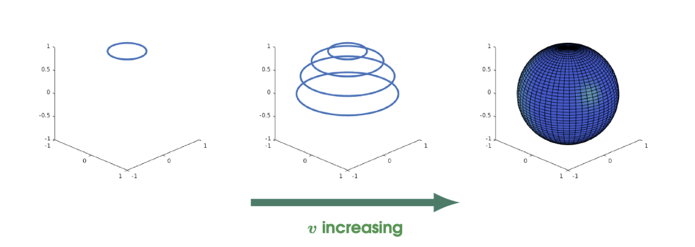
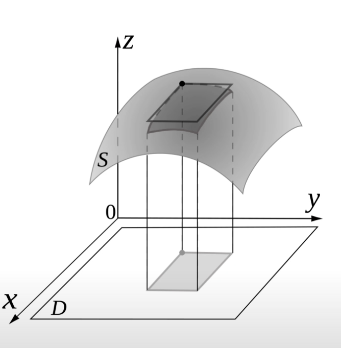
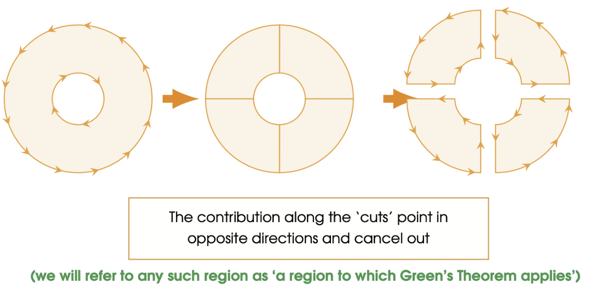
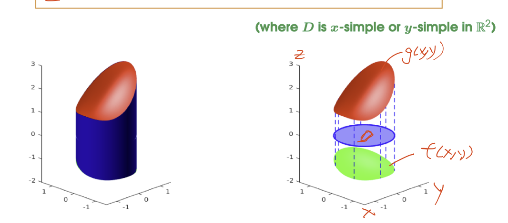

# Parametrized Surfaces
A parametrized surface is a function $\Phi :D \to \R^3$, mapping a two-dimensional domain $D \subseteq \R^2$ into $\R^3$. For example
$$\Phi(u,v) = (\cos u \sin v)\vec{i} + (\sin u \sin v)\vec{j} + (\cos v) \vec{k}$$

## Tangent Vectors
Let $\Phi: D \to \R^3$ be a parametrized surface, for some $D \subseteq \R^2$, the tangent vectors to the surface are given by the partial derivatives of $\Phi$ with respect to $u$ and $v$

$$\vec{T}_u = \frac{\partial x }{\partial u }\vec{i }+ \frac{\partial y }{\partial u}\vec{j} + \frac{\partial z}{\partial u}\vec{k}$$

and

$$\vec{T}_v = \frac{\partial x }{\partial v }\vec{i }+ \frac{\partial y }{\partial v}\vec{j} + \frac{\partial z}{\partial v}\vec{k}$$

Any linear combination of $\vec{T_u} and \vec{T_v}$ will also be a tangent vector to the surface

## Normal Vector
A normal vector to the surface is any vector that is perpendicular to the tangent vectors $\vec{T_u}$ and $\vec{T_v}$

The most obvious choice is 
$$\vec{N = \vec{T_u}}\times \vec{T_v}$$

The cross product is perpendicular to both vector

### Regular(Smooth) Surface
A surface $\Phi :D \to \R^3$ is said to be regular or smooth if
$$\vec{N}(u,v)\neq 0 \textrm{ for all pairs}(u,v)\in D$$

Intuitively, if $\vec{N}(u,v) = 0$, then there is a spike at $\Phi(u,v)$

# Surface Integration over Scalar Fields
Let $f:\R^3 \to \R$ be a continuous scalar field on $\R^3$ and let $\Phi:D\to\R^3$ be a regular surface in $\R^3$

The surface integral of $f$ across the surface $\Phi$ is given by

$$\int\int_\Phi f(x,y,z)dS = \int\int_D f(\Phi(u,v)) ||\vec{T_u}\times \vec{T_v}||du\ dv$$

## Independence of Parametrization
Let $f:\R^3 \to \R$ be a continuous scalar field on $\R^3$ and let $\Phi: D_1 \to \R^3$ and $\Psi: D_2 \to \R^3$ be two parametrizations for the same surface, then

$$\int\int_\Phi f dS = \int\int_\Psi f dS$$

i.e. The value does not depend on the choice of parametrization

## Surface Area of a Parametrized Surface
Let $\Phi: D \to \R^3$ be a regular parametrized surface. Then the surface area of $\Phi$ is given by the integral
$$\int\int_\Phi 1dS = \int\int_D ||\vec{T_u} \times \vec{T_v}|| du\ dv$$

# Surface Integration over Vector Fields
Let $\vec{F}:\R^3 \to \R^3$ be a continuous vector field on $\R^3$, and let $\\Phi: D \to \R^3$ be a regular parametrized surface in $\R^3$, then the surface integral of $\vec{F}$ across the surface $\Phi$ is given by

$$\int\int_\Phi \vec{F}(x,y,z)\cdot d \vec{S} = \int\int_D (\vec{F}\cdot \hat{N})||\vec{T_u}\times \vec{T_v}||du\ dv$$

Where $\hat{N} = \frac{\vec{T_u}\times \vec{T_v}}{||\vec{T_u} \times \vec{T_v}||}$ is a unit vector to the surface of $\Phi$

We can further simplify the surface integration formula by cancelling the denominator of $||\vec{T_u}\times \vec{T_v}||$ from $\hat{N}$ (Since the dot product is linear).

$$\int\int_\Phi \vec{F}(x,y,z)\cdot d \vec{S} = \int\int_D \vec{F}\cdot (\vec{T_u} \times \vec{T_v})du\ dv$$

Another name for the surface integral $\int\int_\Phi \vec{F}\cdot d \vec{S}$ is the flux of $\vec{F}$ across the surface $\Phi$

# Integral Theorems
## Path Orientation
Path Orientation refer to the direction in which the path is traversed.

Let $D \subseteq \R^2$ be a simple region with boundary $\partial D$

Then a closed path parametrizing $\partial D$ can either have:

## Green's Theorem
Let $D \subseteq \R^2$ be a simple region of $\R^2$, and let $\partial D$ be its positively oriented boundary. Suppose that $P, Q : D \to \R$ are differentiable real-valued functinos. Then we have that
$$\oint_{\partial D} P dx + Q dy = \int\int_D(\frac{\partial Q}{\partial x} - \frac{\partial P}{\partial y})dx\ dy$$

Green's Theorem can only be used for a two-dimensional vector field $\vec{F} = P \vec{i} + Q \vec{j}$

> Btw, $\partial D$ means the curve or collection of curves that form the boundary of $D$

### Green's Theorem on y-simple region
Let $D \subseteq \R^2$ be a y-simple region of $\R^2$ whose boundary is $\partial D$, and let $P: D \to \R$ be a differentiable real-valued function. Then we have that
$$\oint_{\partial D}P dx = - \int\int_D \frac{\partial P}{\partial y }dx\ dy$$

### Green's Theorem on x-simple region
Let $D \subseteq \R^2$ be a x-simple region of $\R^2$ whose boundary is $\partial D$, and let $Q: D \to \R$ be a differentiable real-valued function. Then we have that
$$\oint_{\partial D}Q dy =  \int\int_D \frac{\partial Q}{\partial x }dx\ dy$$

### More General Regions
Green's Theorem can also be applied to some non-simple regions, by dissecting them into smaller simple regions

### Green's Theorem Vector Form
Let $D$ be a region to which Green's Theorem applies, and suppose that $\vec{F}$ be a vector field on $\R^2$. Then we have that
$$\oint_{\partial D}\vec{F}\cdot d\vec{s} = \int\int_D (\nabla \times \vec{F}) \cdot \vec{k} dA$$

---
Let $\vec{F}:\R^2 \to \R^2$ be a conservative vector field. And let $D \subseteq \R^2$ be a region to which Green's Theorem applies. The
$$\oint_{\partial D} \vec{F}\cdot d\vec{s} = 0$$

# Simple Regions in $\R^3$
## z-Simple Regions in $R^3$
A region $W \subseteq \R^3$ is said to be z-simple if there are functions $f,g:D\to \R$ for some region $D \subseteq \R^2$ such that
$$W = \{(x,y,z) \in \R^3 : (x,y) \in D \textrm{ and } f(x,y)\leq z\leq g(x,y)\}$$

Where $D$ is x-simple and y-simple in $R^2$

### Theorem
Let $h: \R^3 \to \R$ be a continuous function. If $W \subseteq \R^3$ is a z-simple region bounded below and above by $f,g:D \to \R$, Then
$$\int\int\int_W h(x,y,z)dV = \int\int_D[\int_{f(x,y) }^{g(x,y) }h(x,y,z)dz]dA$$

# Gauss' Divergence Theorem
Let $\vec{F}$ be a vector field on $\R^3$, and let $W \subseteq \R^3$ be a simple region of $\R^3$, with boundary $\partial W$. Then
$$\oiint_{\partial W} \vec{F}\cdot d\vec{S} = \iiint_W(\nabla \cdot \vec{F})dV$$

**Lemma**

Let $R:\R^3 \to \R$ be a real valued function, and let $W \subseteq \R^3$ be a z-simple region of $\R^3$, then
$$\iiint_W \frac{\partial R}{\partial z}dV = \iint_{\partial W}R \vec{k}\cdot d \vec{S}$$
