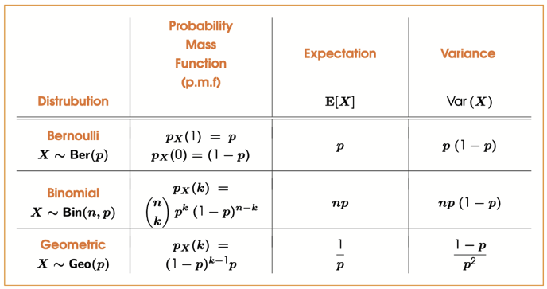

# Introduction to Probability
## Probability Measure
A probability measure on a set of event $E$ is a function
$$P: \textrm{powerset}(E) \to [0,1]$$

such that:
- Something is guarenteed, i.e. $P(\{\textrm{all events}\}) = 1$
- If $A_1, \dots, A_n$ are pairwise disjoint(mutually exclusive)(不可能同时发生的) events then
$$P(A_1 \cup \dots \cup A_n) = P(A_1) + \dots + P(A_n)$$

A probability space is a pair $(E,P)$ where $E$ is a set of possible events and $P$ is a probability measure on $E$

用人话说：$P$ is the probability function that assigns each event in event space, $E$, a probability, which is a number between 0 and 1.

## Conditional Probability
Suppose that $A,B \subseteq E$, are two events such that $P(B) \neq 0$. Then the conditional probability of $A$ given $B$ is defined

$$P(A|B) = \frac{P(A \cap B )}{P(B)}$$

However, if two events $A, B \subseteq E$ are said to be independent, then
$$P(A|B) = P(A)$$
> Independent events are those whose probabilities do not affect one another

Only for independent events, $P(A \cap B) = P(A) \cdot P(B)$

比如连续抛三次硬币都是头的概率是 $0.5 \cdot 0.5 \cdot 0.5$

# Random Variables
A random variable on $(E,P)$ is a function that assigns a numerical value to each event in $E$
$$X:E \to \R$$

## Probabilities of Random Variables
To find the probability that a random variable $X$ takes the value $x \in \R$, we must identify $e \in E$ that are mapped to $x\in \R$, i.e. where $X(e) = x$, then we have
$$P(X=x) = P(\{e \in E: X(e) = x\})$$

Similarly
$$P(X\leq x) = P(\{e \in E: X(e) \leq x\})$$

$$P(X\geq x) = P(\{e \in E: X(e) \geq x\})$$

$$P(X \in A) = P(\{e \in E: X(e) \in A\})$$

**:smoking: Exercise 8.1**
----

Let $E$ be the set of all possible events resulting from rolling two fair 6-sided dice and let $X$ be the sum of the two values rolled.

Calculate the following probabilities:

(i) $P(X=5)$

$$5 = 1+4, 2+3, 3+2, 4+1$$

$$P(X=5) = P((1, 4) \cup (2 , 3) \cup (3 , 2) \cup (4, 1)) = 4 \times (\frac{1}{6} \times \frac{1}{6}) = \frac{1 }{9}$$

剩下的两个懒得写了，一样的道理

## Discrete Random Variables
A random variable $X$ is said to be discrete if there is a function $p_x:{x_1, x_2, \dots} \to \R$ such that
$$P(X \in B) = \sum_{x_i \in B} p_x(x_i)$$

and
$$\sum_{x_i} p_x(x_i) = 1$$

> $p_x$ is the probability mass function(p.m.f) of $X$

## Continuous Random Variables
A random variable $X$ is said to be continuous if there is a function $f_x : \R \to \R$ such that
$$P(X \in B) = \int_{B}^{}f_X(x)dx$$

and
$$\int_{-\infty}^{\infty }f_X(x)dx = 1$$

> $f_X$ is the probability density function (p.d.f) of $X$

**:smoking: Exercise 2**
----
Which of the following random variables are discrete and which are continuous:

(i) The sum two values rolled on two six-sided dice, 

Discrete

(ii) The distance a dart lands from the center of a dart board

Continuous

(iii) The lifespan of a whiteboard marker

Continuous

(iv) The height of a student slected at random from Kings

This can be discrete or continuous depending on the interpretation. If selecting a student at random and measure their height, the value would be continuous. However, if we assume the population of student is fixed and each student has an associated height, which is also fixed. Then since the number of student is finite then there are only finitely many possible outcomes for our random variable.

## Expectation
Consider a random variable $X$ with a finite list $x_1, x_2, \dots, x_k$ of possible outcomes, each of which has probability $p_1, p_2, \dots, p_k$

The expectation of a random variable $X$ is the weighted average of the possible values of $X$

$$E[X] = \sum_\infty x p_X(x)\ \ \textrm{ or }\ \ E[X] = \int_{-\infty }^{\infty} x f_X(x)dx$$

Alternatively, it is the average value across all possible events

$$E[X] = \sum_{e\in E} X(e)P(e)\ \ \textrm{  or  }\ \ E[X] = \int_E X(e)P(e)de$$

**THEOREM**

Let $X$ be a random variable and let $a,b \in \R$ be real numbers, then
$$E[aX + b] = aE[X] + b$$

**THEOREM2**

Let $X$ and $Y$ be random variables. Then
$$E[X+Y] = E[X] + E[Y]$$

## Variance
The variance of a random variable $X$ is the expectation of the sqaured deviations from the main
$$\textrm{Var}(X) = E[(X - E[X])^2]$$

The standard deviation of a random variable $X$ is the square-root of the variance of $X$
$$\sigma_X = \sqrt{\textrm{Var}(X)}$$

**THEOREM**

Let $X$ be a random variable. Then we have that
$$\textrm{Var}(X) = E[X^2] - E[X]^2$$

----

**THEOREM**

Let $X$ be a random variable and let $a,b \in \R$ be real numbers. Then
$$\textrm{Var}(aX + b) = a^2 \textrm{Var}(X)$$

----

**THEOREM**

Let $X$ and $Y$ be an independent random variables, then
$$\textrm{Var}(X+Y) = \textrm{Var}(X) + \textrm{Var}(Y)$$

# Common Distributions
## Discrete Distributions
### Bernoulli Distribution
A discrete random variable is said to be Bernoulli Distributed, $X \sim \textrm{Ber}(p) $ if
- It only takes the values $1$(true) or $0$(false)
- Has the probability mass function $p_X(1) = p \textrm{ and } p_X(0) = (1-p)$

A good example is tossing coin, where head and tail's probability is both 0.5

**THEOREM**

Let $X \sim \textrm{Ber}(p)$ be Bernoulli distributed. Then we have that
$$E[X] = p$$
and
$$\textrm{Var}(X) = p(1-p)$$

----
**:smoking: Exercise 8.3**

(i) What is the expectation and variance of a fair coin landing on heads?
Let $X$ be the Bernoulli random variable that takes a value $1$ if the coin hands heads and $0$ otherwise.

Since $X$ only takes two value, the expectation is simply given by

$$E[X] = 0\cdot p_X(0) + 1 \cdot p_X(1) = p_X(1) = \frac{1}{2}$$

For variance
$$\textrm{Var}(X) = E[X^2] - E[X]^2 = \frac{1}{2} - (\frac{1}{2})^2 = \frac{1}{4}$$

(ii) What is the expectation and variance of rolling a six on a fair six-sided die?
Let $X$ be a Bernoulli random variable that takes a value 1 if the dice land on six and 0 otherwise

$$p_X(0) = \frac{5}{6}, p_X(1)= \frac{1}{6}$$

Hence
$$E[X] = 0 \cdot p_X(0) + 1\cdot p_X(1) = \frac{1}{6}$$

and
$$\textrm{Var}(X) = \frac{1}{6} - (\frac{1}{6})^2 = \frac{5}{36}$$

### Binomial Distribution
The binomial distribution models the number of successes in a fixed number of independent trails of a binary experiment.

n is the number of trials.
p is the probability of success on an individual trial.

The binomial distribution answers questions like "What is the probability of getting exactly k successes in n independent trial??

A discrete random variable is said to be binomially distributed,$X \sim \textrm{Bin}(n,p)$, if it has a p.m.f
$$p_X(k) = \begin{pmatrix}n \\ k\end{pmatrix}p^k (1-p)^{n-k}$$

**THEOREM**

Let $X \sim \textrm{Bin}(n,p)$ be binomially distributed, then
$$E[X] = np$$

and

$$\textrm{Var}(X) = np(1-p)$$

----
**:smoking: Exercise 8.4**

Suppose we randomly answer a multiple choice test comprising 10 questions, each with 4 possible answers.

(i) What is the probability of answering exactly $k$ questions correctly?

Let $X$ be the binomial random variable denoting the number of questions answerd correctly

$p = \frac{1}{4}$ is the probability getting a multiple choice question correct.

The number of trials is $n = 10$

Hence, the probability of answeing exactly $k$ quesitons correct is:
$$p_X(k) = \begin{pmatrix}n \\ k\end{pmatrix} p^k(1-p)^{n-k}$$

(ii) How many correct answers can we expect to get?

$$E[X] = \sum_{k=0}^n k p_X(k) = \sum_{k=0}^n \begin{pmatrix}n \\ k\end{pmatrix} p^k(1-p)^{n-k}$$
$$\textrm{Var}(X) = 10p(1-p)$$

### Geometric Distribution
A discrete random variable is said to be geometrically distributed, $X \sim \textrm{Geo}(p)$ if it has a p.m.f
$$p_X(k) = (1-p)^{k-1}p$$

**THEOREM**

Let $X \sim \textrm{Geo}(p)$ be geometric distributed. Then we have that
$$E[X] = \frac{1}{p}$$

and

$$\textrm{Var}(X) = \frac{1-p}{p^2}$$

----
**:smoking: Exercise 8.5**

Suppose we role a fair six-sided dice repeatedly and record the outcome

(i) What is the probability that our first six appears on the $n$th roll?

Associate each roll to be an independent Bernoulli random variable $X$, where $p = \frac{1}{6}$ is the probability of rolling a six.

The random variable $N$ in which we are interested takes the form
$$N = \textrm{min}\{k\in \N : X_k = 1\}$$

$N$ is defined as the minimum value of $k$ for which the event $X_k = 1$ occurs, where $X_k$ denotes the outcome of the $k$-th roll of the dice.

Hence, the p.m.f of $N$ is given by the following

$$p_N(k) = P(N=k)$$
$$= P(X_k = 1 \textrm{ and } X_j = 0 \textrm{ for } 1 \leq j < k)$$

$$= p_{X_1}(0) \cdot p_{X_2}(0) \dots p_{X_k}(1)$$
$$= (1-p)^{k-1}p = (\frac{5}{6})^{k-1} (\frac{1}{6})$$

(ii) How many times should we expect to wait until we first roll a six?

$$E[N] = 6$$

(iii) What is the variance of our waiting time?
$$\textrm{Var}(N) = 30$$

### Summary

## Bivariate(Joint) Distributions
Let $X$ and $Y$ be two discrete random variables defined over the same set of events. The joint probability mass function of $X$ and $Y$ is the function $p_{X,Y}: \R^2 \to \R$ where
$$p_{X,Y}(x,y) = P(\{X = x\} \cap \{Y = y\})$$
$$= P(X=x, Y=y)$$

### Marginal Distributions of Bivariate Distribution
The marginal Distribution of a Bivariate distribution $p_{X,Y}$ with respect to $X$ and $Y$ are given by
$$p_X(x) = \sum_y p_{X,Y}(x,y)$$
and
$$p_Y(y) = \sum_x p_{X,Y}(x,y)$$

## Conditional Distributions and Conditional Expectation
Let $X$ and $Y$ be two discrete random variables. Then the conditional distribution of $X$ given $Y$ is the probability mass function given by
$$p_{x|y} = P(\{X=x\} | \{Y=y\})$$
$$ = \frac{P(X=x, Y=y)}{P(Y=y)}$$
$$ = \frac{P(X=x, Y=y)}{P(Y=y)} = \frac{p_{X,Y}(x,y)}{p_Y(y)}$$

**:smoking: Exercise 8.6**
----

Let $X$ be the number of jobs completed and let $Y$ be the number of cups of coffee I  drink on a given day. Then the joint distribution $X$ and $Y$ is given by:

(i) What are the marginal distributions of $X$ and $Y$?

(ii) What is the probability that $X = Y$?

We can compute the joint probability for any subset of pairs of value that $X$ and $Y$ might take. The probability $X=Y$ is given by
$$P(X=Y) = \sum_{i=0}^3 P(X=i, Y=i) = \frac{3}{30} + \frac{3}{30} + \frac{3}{30} + \frac{3}{30} = \frac{4}{10}$$

(iii) What is the conditional probability of $X$ given that $Y = 2$?
$$p_{X|Y}(x|y=2) = \frac{p_{X,Y}(x,y) }{p_Y(y)} = \frac{p_{X,Y}(x,y)}{\frac{1}{3}}$$

# Covariance and Correlation
