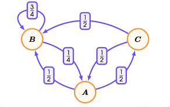

# Markov Chains
## Stochastic Process
Let $(E,P)$ be a probability space and let $S$ be a set of possible states of a system.

A stochastic process $X$ is a sequence of random variables

$$X_t: E\to S\ \ \ \ \textrm{for }t=0,1,2,\dots$$

## Markov Chains and Markov Property
A stochastic process $X$ is said to be a Markov chain if it satisfies the Markov property that
$$P(X_t=s| X_0, X_1, \dots, X_{t-1}) = P(X_t=s|X_{t-1})$$
for all $t=1,2,3,\dots$ and all $s \in S$

## State Transition Diagram
Let $X = \langle X_0, X_1, X_2, \dots\rangle$ be a Markov Chain on $S$. Then the state transition diagram of $X$ is a weighted diagraph $(S,\to)$, where the weight of the edge from $s_i$ to $s_j$ is given by the probability:
$$p(s_i \to s_j) = P(X_t = s_j| X_{t-1} = s_i)$$

----
**:smoking: Example 9.1**

An ant wanders randomly between three locations: anthill $A$, chocolate bar $B$, and soda can $C$. The ant's behaviour follows the following pattern
- Whenever the ant is at $A$, in the next minute the ant travels to either $B$ or $C$ with equal probability.
- Whenever the ant is at $B$, in the next minute the ant will likely remain at B with probability $\frac{3}{4}$ or return to the anthill $A$.
- Whenever the ant is at $C$, in the next minute the ant will travel to either $A$ or $B$ with equal probability.

## The Chapman-Kolmogorov Equation
Suppose that $X = (X_t: t \in \N)$ is a Markov chain on the state space $S$. Then
$$p_{n+k}(s_i \to s_j) = \sum_{s \in S} p_n(s_i \to s)p_k(s \to s_j)$$

----
**:smoking: Exercise 9.2**

(i) Write out the transition matrix for the Markov Chain described in Example 9.1

(ii) Calculate the matrix $Q^2$ using matrix multiplication

(iii) What is the significance of the matrix $Q^2$?
