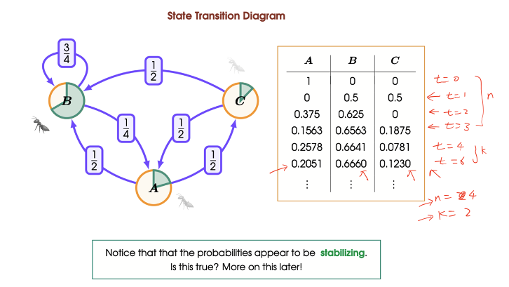

# Markov Chains
## Stochastic Process
Let $(E,P)$ be a probability space and let $S$ be a set of possible states of a system.

A stochastic process $X$ is a sequence of random variables

$$X_t: E\to S\ \ \ \ \textrm{for }t=0,1,2,\dots$$

## Markov Chains and Markov Property
A stochastic process $X$ is said to be a Markov chain if it satisfies the Markov property that
$$P(X_t=s| X_0, X_1, \dots, X_{t-1}) = P(X_t=s|X_{t-1})$$
for all $t=1,2,3,\dots$ and all $s \in S$

## State Transition Diagram
Let $X = \langle X_0, X_1, X_2, \dots\rangle$ be a Markov Chain on $S$. Then the state transition diagram of $X$ is a weighted diagraph $(S,\to)$, where the weight of the edge from $s_i$ to $s_j$ is given by the probability:
$$p(s_i \to s_j) = P(X_t = s_j| X_{t-1} = s_i)$$

> GPT 说小p和大p单纯是个人选择，没有明确的区别，纯傻逼

----
**:smoking: Example 9.1**

An ant wanders randomly between three locations: anthill $A$, chocolate bar $B$, and soda can $C$. The ant's behaviour follows the following pattern
- Whenever the ant is at $A$, in the next minute the ant travels to either $B$ or $C$ with equal probability.
- Whenever the ant is at $B$, in the next minute the ant will likely remain at B with probability $\frac{3}{4}$ or return to the anthill $A$.
- Whenever the ant is at $C$, in the next minute the ant will travel to either $A$ or $B$ with equal probability.

## The Chapman-Kolmogorov Equation
Suppose that $X = (X_t: t \in \N)$ is a Markov chain on the state space $S$. Then
$$p_{n+k}(s_i \to s_j) = \sum_{s \in S} p_n(s_i \to s)p_k(s \to s_j)$$

简单来说就是$s_i \to s_j$，$s_i$是初始位置 $s_j$是目标位置，在$n+k$步的时候的probability等于所有可能的走法的probability的总和.

为什么要写成$n+k$ step，是因为很有可能你会先知道n step的probability，比如大多数情况下你会知道p_1的probability,这样你就可以直接算k的probability。The equation let you build up the multi-step transition probabilities systematically from the one-step probabilities.

Example: $n=1, k=2; p_{1+2}(A\to A)$

This is a question finding the probabilities of starting from A and at the end reach A in 3 steps.

There's only two way of reaching A in 3 steps.

$$A \to B \to B \to A$$

$$A \to C\to B \to A$$

Then the probability is

$$p_{1+2} = p_1(A \to B)p_2(B \to A) + p_1(A\to C)p_2(C \to A)$$

算出来的结果就会是在上一个example里面最后写的那个表格的t=3那一行A列填的数字。同理，如果是$p_{1+2}(A\to B)$则是B列。

## Transition Matrix
The transition matrix of a Markov Chain $X$ is given by
$$Q = \begin{bmatrix}p(s_0 \to s_0) &p(s_1 \to s_0) &\dots &p(s_n \to s_0) \\ p_(s_0 \to s_1) & p(s_1 \to s_1) &\dots &p(s_n \to s_1) \\ \dots &\dots &\dots &\dots \\ p(s_0 \to s_n) & p(s_1 \to s_n) &\dots &p(s_n \to s_n)\end{bmatrix}$$

Column $i$ Row $j$ is the probability of $p(s_i \to s_j)$

----
**:smoking: Exercise 9.2**

(i) Write out the transition matrix for the Markov Chain described in Example 9.1

$$Q = \begin{bmatrix}0 & 0.25 &0.5\\ 0.5 & 0.75 & 0.5 \\ 0.5 & 0 & 0 \end{bmatrix}$$

(ii) Calculate the matrix $Q^2$ using matrix multiplication

$$Q^2 = \begin{bmatrix}0 & 0.25 &0.5\\ 0.5 & 0.75 & 0.5 \\ 0.5 & 0 & 0 \end{bmatrix} \begin{bmatrix}0 & 0.25 &0.5\\ 0.5 & 0.75 & 0.5 &\\0.5 & 0 & 0 \end{bmatrix}$$

$$ = \begin{bmatrix}\frac{3}{8} & \frac{3}{16} & \frac{1}{8} \\ \frac{5}{8} &\frac{11}{16} &\frac{5}{8} \\ 0 & \frac{1}{8} &\frac{1}{4}\end{bmatrix}$$

(iii) What is the significance of the matrix $Q^2$?

The matrix $Q^2$ tells us the transitional probabilities for paths of length 2, and in general $Q^k$ tells us the transitional probabilities between any two states in for paths of length $k$.

If we know that the ant is at $A$ at $t=0$. Then we can use $Q^2$ to find the probability distribution of where the ant is likely to be located two times transport later.
$$\begin{bmatrix}p_2(A \to A) \\ p_2(A \to B) \\ p_2(A \to C)\end{bmatrix} = \begin{bmatrix}\frac{3}{8} & \frac{3}{16} & \frac{1}{8} \\ \frac{5}{8} &\frac{11}{16} &\frac{5}{8} \\ 0 & \frac{1}{8} &\frac{1}{4}\end{bmatrix} \begin{bmatrix}1 \\ 0 \\ 0\end{bmatrix} = \begin{bmatrix}\frac{3}{8} \\ \frac{5}{8} \\ 0\end{bmatrix}$$

In particular, $p_2(A \to A) = 0.375, p_2(A \to B)=0.625, p_2(A\to C) = 0$

If we happen to know that at a given time there is an equal chance of ant being located at each of the location $A, B, C$ at time $t=0$. then two times later we would expect
$$\begin{bmatrix}p_2(A \to A) \\ p_2(A \to B) \\ p_2(A \to C)\end{bmatrix} = \begin{bmatrix}\frac{3}{8} & \frac{3}{16} & \frac{1}{8} \\ \frac{5}{8} &\frac{11}{16} &\frac{5}{8} \\ 0 & \frac{1}{8} &\frac{1}{4}\end{bmatrix} \begin{bmatrix}\frac{1}{3} \\ \frac{1}{3} \\ \frac{1}{3}\end{bmatrix} = \begin{bmatrix}\frac{11}{48} \\ \frac{31}{48} \\ \frac{1}{8}\end{bmatrix}$$

# Long-term (Equilibrium) Behaviour
**:smoking: Exercise 9.3**

The probabilities appear to converge on a stable value as time progress. They also converge to the same value in both cases, regardless of where we start.

## HOW TO Calculate Long-term Behaviour

**Step 1)** Assume the long-term probability as follows
$$p = p_\infty(A), q = p_\infty(B), r = p_\infty(C)$$
where $p+q+r = 1$

**Step 2)** Use the transition matrix to determine the fixed point equation
$$\begin{bmatrix}0 & 0.25 &0.5\\ 0.5 & 0.75 & 0.5 \\ 0.5 & 0 & 0 \end{bmatrix} \begin{bmatrix} p \\ q \\ r\end{bmatrix} = \begin{bmatrix}p \\ q \\ r\end{bmatrix}$$

**Step 3)** Expand the matrix to generate a linear algebra of a system of simultaneous equations
$$p = \frac{1}{4}q + \frac{1}{2}r$$
$$q = \frac{1}{2}p + \frac{3}{4}q + \frac{1}{2}r$$
$$r = \frac{1}{2}p$$

**Step 4)** Solve them using $p+q+r = 1$
$$p = \frac{2}{9}, q = \frac{2}{3}, r = \frac{1}{9}$$

This is the equilibrium value.

----
**:smoking: Exercise 9.4** 

|     | Tea    | Coffee    | Juice    |
|---------------- | --------------- | --------------- | --------------- |
| Tea    | 0.5 | 0.5 | 1  |
| Coffee | 0.5 | 0   | 0  |
| Juice  | 0   | 0.5 | 0  |

$$p_{\textrm{tea}} = p_\infty(\textrm{tea})$$
$$q_{\textrm{coffee}} = p_\infty(\textrm{coffee})$$
$$r_{\textrm{juice}} = p_\infty(\textrm{juice})$$

$$p + q + r = 1$$

The calculation would be
$$\begin{bmatrix}0.5 &0.5 &1 \\ 0.5 & 0 & 0 \\ 0 &0.5 & 0\end{bmatrix} \begin{bmatrix}p \\ q \\ r\end{bmatrix} = \begin{bmatrix}p \\ q \\r\end{bmatrix}$$

$$p = 0.5p + 0.5q + r$$
$$q = 0.5p$$
$$r = 0.5q$$

----

$$0.25p = r$$

$$p + q +r = p + 0.5p + 0.25p = 1$$

$$p = \frac{4}{7}, q = \frac{2}{7}, r = \frac{1}{7}$$
