# Directional Derivatives
Directional Derivatives in 2D in the direction of a unit vector $\vec{u} = a \vec{i} + b \vec{j}$, ($||\vec{u}|| = 1$, i.e. $\sqrt{a^2+b^2} = 1$) is given by:

$$D_{\vec{u}}f(x,y) = a \frac{\partial f(x,y)}{\partial x} + b \frac{\partial f(x,y)}{\partial y}$$
## Directional Derivatives in 3 Dimensions
Directional Derivatives in 2D in the direction of a unit vector $\vec{u} = a \vec{i} + b \vec{j} + c \vec{k}$, ($||\vec{u}|| = 1$, i.e. $\sqrt{a^2+b^2+c^2} = 1$) is given by:

$$D_{\vec{u}}f(x,y,z) = a \frac{\partial f(x,y,z)}{\partial x} + b \frac{\partial f(x,y,z)}{\partial y} + c\frac{\partial f(x,y,z)}{\partial z}$$

## Partial Derivatives
By choosing $\vec{u } \in \R^3$ to be one of the standard basis vectors, we can isolate the rate of change of $f$ as we vary $x,y,z$ respectively.

These are the **partial derivatives** with respect to $x,y,z$
$$\frac{\partial f }{\partial x}=D_{\vec{i}}f(\vec{x}),\frac{\partial f }{\partial y}=D_{\vec{j}}f(\vec{y}),\frac{\partial f }{\partial z}=D_{\vec{k}}f(\vec{z}),$$

# Vectors Algebra
## Linear Independent
如果他给了你三个式子
$$f(x) = x_1 + x_2 + x_3$$
$$g(y) = y_1 + y_2 + y_3$$
$$h(z) = z_1 + z_2 + z_3$$

如果他想让你证明三个式子是linearly independent的，只需要证明他们作为column的matrix的determinant不等于0就行

$$det \begin{bmatrix}x_1 & y_1 & z_1 \\ x_2 & y_2 & z_2 \\ x_3 & y_3 & z_3\end{bmatrix} \neq 0$$
## Addition Properties
- Associativity: $\vec{a} + (\vec{b} + \vec{c}) = (\vec{a} + \vec{b}) + \vec{c}$
- Commutativity: $\vec{a} + \vec{b} = \vec{b } + \vec{a}$
- Additive Inverse: $\vec{a } + (- \vec{a}) = 0$

## Multiplication Properties
- Associativity: $k(t \vec{a}) = (kt) \vec{a}$
- Distributivity over vector addition: $k(\vec{a} + \vec{b }) = k \vec{a} + k \vec{b}$
- Distributivity over scalar addition: $(k+t) \vec{a} = k \vec{a} + t \vec{a}$

## Scalar Product
$$\vec{A} \cdot \vec{B} = \begin{bmatrix}a_1 \\ a_2 \\a_3\end{bmatrix} \cdot \begin{bmatrix}b_1 \\ b_2 \\b_3\end{bmatrix} = a_1b_1 + a_2b_2 + a_3b_3$$

Also it have the equivalent form
$$\vec{A} \cdot \vec{B} = ||\vec{A}|| \ ||\vec{B}|| \cos(\theta)$$

## Vector/Cross Product
$$\vec{A} \times \vec{B} = \begin{bmatrix}\vec{i} & \vec{j} &\vec{k}\\ a_1 & a_2 & a_3 \\ b_1 & b_2 & b_3\end{bmatrix}$$

Also it have the equivalent form
$$\vec{A} \times \vec{B} = ||\vec{A}||\ ||\vec{B}|| \sin(\theta)$$

### Area of the Parallelogram
$||\vec{A} \times \vec{B}||$ is equal to the area of the parallelogram spaned by $\vec{A}, \vec{B}$

## Matrix Multiplication
Matrix 就是长和宽不相等的vector

简单来说就是横着和竖着的dot product(The dot product of rows and columns)

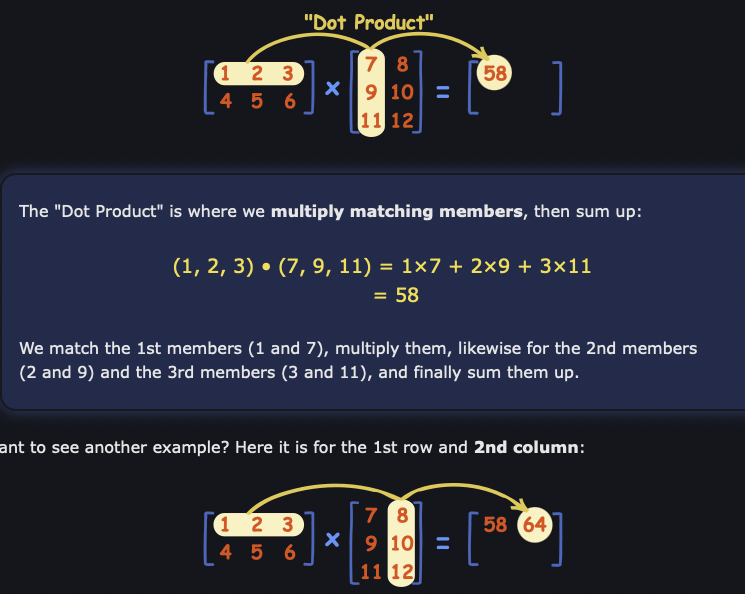

## Find a vector that is perpendicular to another
Their scalar product must be 0, as $\cos90 = 0$

## Find a vector that is perpendicular to both vector
Just use cross product

# Vector Calculus
## Gradient
Let $f: \R^3 \to \R$ be a scalar field on $\R^3$. The gradient of $f$ is the vector field given by
$$\nabla f = \frac{\partial f}{\partial x} \vec{i } + \frac{\partial f}{\partial y} \vec{j } + \frac{\partial f}{\partial z} \vec{k }$$

Let $f:\R^3 \to \R$ be a real-valued function. Then the directional derivative of $f$ with respect to $\vec{u}$ is given by
$$D_{\vec{u}}f(\vec{x }) = \nabla f(x) \cdot \vec{u}$$
for any unit vector $\vec{u}\in \R^3$

## Divergence
Let $\vec{F} = P \vec{i} + Q \vec{j} + R \vec{k}$ be a vector field on $\R^3$. The divergence of $\vec{F}$ is the scalar field given by
$$\textrm{div}\vec{F} = \nabla \cdot \vec{F} = (\partial_x \vec{i} + \partial_y \vec{j}+ \partial_z \vec{k}) \cdot (P \vec{i} + Q \vec{j} + R \vec{k})$$
$$= \frac{\partial P}{\partial x} + \frac{\partial Q}{\partial y} + \frac{\partial R}{\partial z} $$

A vector field is said to be incompressible if its divergence is zero at every point in $\R^3$
$$\nabla \cdot \vec{F}(x,y,z) = 0$$
for all $(x,y,z) \in \R^3$

----

**THEOREM** The divergence of a curl of a vector field is always 0.

## Curl
Let $\vec{F } = P \vec{i } + Q \vec{j } + R \vec{k}$ be a vector field on $\R^3$ the curl of $\vec{F}$ is another vector field given by

$$\textrm{curl} \vec{F} = \nabla \times \vec{F} = \begin{vmatrix}
\vec{i} &\vec{j} &\vec{k}\\
\partial_x &\partial_y &\partial_z\\
P &Q &R
\end{vmatrix}$$

$$ = (\frac{\partial R}{\partial y} - \frac{\partial Q}{\partial z})\vec{i}-(\frac{\partial R}{\partial x} - \frac{\partial P}{\partial z})\vec{i})+(\frac{\partial Q}{\partial x} - \frac{\partial P}{\partial y})\vec{i}$$

The curl can be interpreted as **a measure of the angular rotation of a small rigid body sitting in the field at a given point**

The axis of rotation is the direction of $\nabla \times \vec{F}$ and the angular velocity is $\frac{1 }{2 }||\nabla \times \vec{F}||$

A vector field is said to be **irrotational** if its curl is the zero vector at every point in $\R^3$ i.e.
$$\nabla \times \vec{F}(x,y,z) = \vec{0}$$

for all $(x,y,z) \in \R^3$

---
**THEOREM** Not conservative means the curl of $\vec{F} \neq 0$ 

**THEOREM** The curl of a gradient of a scalar field is always 0

If mathvecF: \R^2 \to \R^2 is a conservative vector field, the curl of a conservative vector field is 0.

## Laplacian
Let $f:\R^3 \to \R$be a scalar field on $\R^3$. The Laplacian of $f$ is the scalar field given by the sum of the second partial derivatives
$$\nabla^2 f = \nabla \cdot (\nabla f) = \frac{\partial^2 f }{\partial x^2 } + \frac{\partial^2 f }{\partial y^2} + \frac{\partial^2 f }{\partial z^2}$$

i.e. It is the divergence of the gradient of $f$

# Path Integration
## Parametrize a Path

A circle/disk, $x = cos(t), y=sin(t)$

Verify Stoke's Theorem LHS, $\gamma(t) = u(t)\vec{i} + v(t) \vec{j} + f(u(t),v(t))\vec{k}$

A surface whose boundary is Curve C, for example C is $C = \{(x,y,z): x^2 +y^2 = 1, \textrm{ and } y+z=2\}$, Then the surface can be $\Phi(r,\theta) = r\cos \theta \vec{i} + r\sin \theta \vec{j} + 2-r\sin\theta \vec{k}$

## Velocity / Tangent Vector
Let $\gamma : [a,b] \to \R^3$ be a parametrized path. Then the **tangent* to $\gamma$ at time $t$ is given by the **velocity vector**
$$r'(t) = \frac{dx }{dt }\vec{i} + \frac{dy }{dt } \vec{j} + \frac{dz }{dt } \vec{k}$$

The length $||r'(t)||$ is the rate at which the path is traversed

Unit tangent vector is simply $\vec{T} = \frac{\gamma ' (t)}{||\gamma'(t)||}$

## Path Integration over Scalar Fields
Let $f: \R^3 \to \R$ be a continuous scalar field on $\R^3$, and let $\gamma: [a,b] \to \R^3$ be a differentiable path in $R^3$

The path integral of $f$ along the path $\gamma$ is given by

$$\int_{\gamma }^{}fds = \int_{a }^{b }f(\gamma(t)) ||\frac{d \gamma }{dt}||dt = \int_{a }^{b }f(\gamma(t))||\gamma '(t)||dt$$

The $s$ denotes displacement, not a separate variable

## Path Integration over Vector Field
Let $\vec{F} \R^3 \to \R^3$ be a continuous vector field on $\R^3$, and let $\gamma:[a,b] \to \R^3$ be a piecewise differentiable path in $R^3$. The path integral of $\vec{F}$ along the path $\gamma$ is given by
$$\int_{\gamma}^{}F \cdot d \vec{s} = \int_{a }^{b }\vec{F}(\gamma(t))\cdot \vec{T}(t)||\gamma'(t)||dt = \int_{a}^{b} \vec{F}(\gamma(t)) \cdot \gamma '(t)dt$$

where
$$\vec{T}(t) = \frac{\gamma'(t) }{||\gamma'(t)||}$$

is the unit vector tangent to the path $\gamma$ at time $t \in [a,b]$

## Length of an Arc
Let $C \subseteq \R^3$ be a piecewise differentiable curve, then the length of $C$ is given by the path integral
$$\int_{C }^{}1ds = \int_{a }^{b }||\gamma '(t)|| dt$$

where $\gamma:[a,b] \to \R^3$ is a simple path that parametrized $C$.

## Simple Path/Curve
Path/Curve is simple if it does not intersect itself, except possibly at its endpoints.

# Area and Volume Integration
## Simple Region
### X-Simple Region
A region is said to be x-simple if it can be described as a set of points $(x,y)$ where $x$ ranges between two functions of $y$
$$a(y) \leq x \leq b(y)$$

And $y$ ranges between two constants $c \leq y \leq d$, or each $y$ is in the interval of $[c,d]$
### Y-Simple Region
Its the same shit, only change x to y, y to x.

### Simple Region
If a region is both x-simple and y-simple, its a 很他妈fuckin simple region.

## Double Integration
Let $f:\R^2 \to \R$ be a continuous function and let $\R = [a,b] \times [c,d]$ be a rectangular region of the xy-plane

Then

$$\iint_R f(x,y)dA = \int_{a }^{b }[\int_{c }^{d }f(x,y)dy]dx = \int_{c }^{d }[\int_{a }^{b }f(x,y)dx]dy$$

---

Let $f:\R^2 \to \R$ be a continuous function.

(i) If $R \subseteq \R^2$ be a y-simple region bounded above and below by $\phi^-, \phi^+:[a,b] \to \R$, then
$$\iint_R f(x,y) dA = \int_{a }^{b }[\int_{\phi^-(x) }^{\phi^+(x)}f(x,y)dy]dx$$

(i) If $R \subseteq \R^2$ be a x-simple region bounded left and right by $\psi^-, \psi^+:[c, d] \to \R$, then
$$\iint_R f(x,y) dA = \int_{c }^{d }[\int_{\psi^-(y) }^{\psi^+(y)}f(x,y)dx]dy$$

## Triple Integration

Let $f:\R^3 \to \R$ be a continuous function on $\R^3$ and let $W \subseteq \R^3$ be a region of space in $\R^3$. Then the triple integral of f over the region $W$ is denoted
$$\iiint_W f(x,y,,z)dV = \textrm{The mass of the region W whose density at }(x,y,z)\textrm{ is }f(x,y,z)$$

The dV indicates that we are integrating with respect to the volume of $W$

# Surface Integration
## Tangent Vectors
Let $\Phi: D \to \R^3$ be a parametrized surface, for some $D \subseteq \R^2$, the tangent vectors to the surface are given by the partial derivatives of $\Phi$ with respect to $u$ and $v$

$$\vec{T}_u = \frac{\partial x }{\partial u }\vec{i }+ \frac{\partial y }{\partial u}\vec{j} + \frac{\partial z}{\partial u}\vec{k}$$

and

$$\vec{T}_v = \frac{\partial x }{\partial v }\vec{i }+ \frac{\partial y }{\partial v}\vec{j} + \frac{\partial z}{\partial v}\vec{k}$$

Any linear combination of $\vec{T_u} and \vec{T_v}$ will also be a tangent vector to the surface
## Normal Vector
A normal vector to the surface is any vector that is perpendicular to the tangent vectors $\vec{T_u}$ and $\vec{T_v}$

The most obvious choice is 
$$\vec{N} = \vec{T_u}\times \vec{T_v}$$

The cross product is perpendicular to both vector

## Surface Integration over Scalar Fields
Let $f:\R^3 \to \R$ be a continuous scalar field on $\R^3$ and let $\Phi:D\to\R^3$ be a regular surface in $\R^3$

The surface integral of $f$ across the surface $\Phi$ is given by

$$\iint_\Phi f(x,y,z)dS = \iint_D f(\Phi(u,v)) ||\vec{T_u}\times \vec{T_v}||du\ dv$$

## Surface Integration over Vector Fields
Let $\vec{F}:\R^3 \to \R^3$ be a continuous vector field on $\R^3$, and let $\Phi: D \to \R^3$ be a regular parametrized surface in $\R^3$, then the surface integral of $\vec{F}$ across the surface $\Phi$ is given by

$$\iint_\Phi \vec{F}(x,y,z)\cdot d \vec{S} = \iint_D (\vec{F}\cdot \hat{N})||\vec{T_u}\times \vec{T_v}||du\ dv= \iint_D \vec{F}\cdot (\vec{T_u} \times \vec{T_v})du\ dv$$

Where $\hat{N} = \frac{\vec{T_u}\times \vec{T_v}}{||\vec{T_u} \times \vec{T_v}||}$ is a unit vector to the surface of $\Phi$

We can further simplify the surface integration formula by cancelling the denominator of $||\vec{T_u}\times \vec{T_v}||$ from $\hat{N}$ (Since the dot product is linear).

Another name for the surface integral $\iint_\Phi \vec{F}\cdot d \vec{S}$ is the flux of $\vec{F}$ across the surface $\Phi$

## Surface Area of a Parametrized Surface
Let $\Phi: D \to \R^3$ be a regular parametrized surface. Then the surface area of $\Phi$ is given by the integral
$$\iint_\Phi 1dS = \iint_D ||\vec{T_u} \times \vec{T_v}|| du\ dv$$

# Integration Theorem
凡是和Simple Region with boundary $\partial D$ 相关的题目都是这个section的

这堆东西和前面挺不相关的
## Path Orientation
Path Orientation refer to the direction in which the path is traversed.

Let $D \subseteq \R^2$ be a simple region with boundary $\partial D$

Then a closed path parametrizing $\partial D$ can either have:
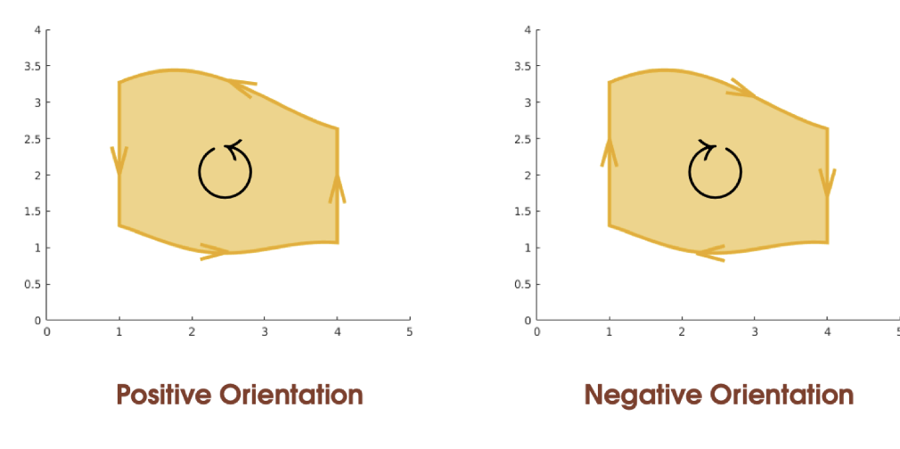

## Green's Theorem
Let $D \subseteq \R^2$ be a simple region of $\R^2$, and let $\partial D$ be its positively oriented boundary. Suppose that $P, Q : D \to \R$ are differentiable real-valued functinos. Then we have that
$$\oint_{\partial D} P dx + Q dy = \iint_D(\frac{\partial Q}{\partial x} - \frac{\partial P}{\partial y})dx\ dy$$

Green's Theorem can only be used for a two-dimensional vector field $\vec{F} = P \vec{i} + Q \vec{j}$

----
**Vector Form** 
$$\oint_{\partial D}\vec{F } \cdot d\vec{S} = \iint_D (\nabla \times \vec{F})\cdot \vec{k}dA$$

If $\vec{F}: \R^2 \to \R^2$ is a conservative vector field, the curl of a conservative vector field is 0. i.e. $\oint_{\partial D} \vec{F} \cdot d \vec{S} = 0$

----
**Proof**

**Step 1)** Show that
$$\oint_{\partial D} Pdx = -\iint_D \frac{\partial P}{\partial y}dx\ dy$$
$$\oint_{\partial D} Qdy = \iint_D \frac{\partial Q}{\partial x}dx\ dy$$

**Step 2)** Add them together 这他妈不是废话吗

### Green's Theorem on y-simple region
Let $D \subseteq \R^2$ be a y-simple region of $\R^2$ whose boundary is $\partial D$, and let $P: D \to \R$ be a differentiable real-valued function. Then we have that
$$\oint_{\partial D}P dx = - \int\int_D \frac{\partial P}{\partial y }dx\ dy$$

--- 
**Proof** 

**Step 1)** Since $D$ is y-simple, we have that
$$D = \{(x,y)\in \R^2: a \leq x \leq b \textrm{ and } f(x)\leq y \leq g(x)\}$$

**Step 2)** Evaluate the double integral
$$\iint_D \frac{\partial P}{\partial y}(x,y)dx\ dy = \int_{a}^{b}[\int_{f(x)}^{g(x)}\frac{\partial P}{\partial y}(x,y)dy]dx$$

$$= \int_{a}^{b}[P(x,y)]^{g(x)}_{f(x)}dx$$

$$= \int_{a}^{b}[P(x,g(x))-P(x,f(x))]dx$$
$$= \int_{a}^{b}P(x,g(x))dx - \int_{a}^{b}P(x,f(x))dx$$

_FINISHED PROOFING LHS_

**Step 3)** Evaluate the path integral in four pieces
$$\oint_{\partial D}Pdx = \int_{A}^{}P dx + \int_{C}^{}Pdx + \int_{B}^{}P dx + \int_{D}^{}Px$$

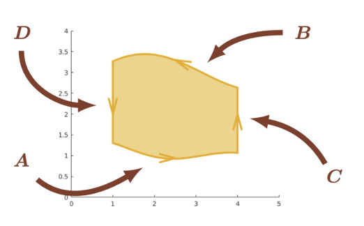

**Step 4)** Parametrize Path

Path A can be parametrized as $A^+(t) = t \vec{i} + f(t) \vec{j}$

$$\int_{A^+}^{}P(x,y)dx = \int_{a}^{b}P(t,f(t)) \frac{dx}{dt}dt = \int_{a}^{b}P(t,f(t))dt$$

Path B can be parametrized as $B^-(t) = t \vec{i} + g(t) \vec{j}$

$$\int_{B^-}^{}P(x,y)dx = \int_{a}^{b}P(t,g(t)) \frac{dx}{dt}dt = \int_{a}^{b}P(t,g(t))dt$$

> Note that the direction of $B$ along $\partial D$ is reversed

Path C can be parametrized as $C^+(t) = b \vec{i} + t \vec{j}$

$$\int_{C^+}^{}P(x,y)dx = \int_{f(b)}^{g(b)}P(b,t) \frac{dx}{dt}dt = 0$$

> Since the x component of $C$ is constant, so $\frac{dx}{dt} = 0$

Path D can be parametrized as $D^-(t) = a \vec{i} + t\vec{j}$

$$\int_{D^-}^{}P(x,y)dx = \int_{f(a)}^{g(a)}P(a,t) \frac{dx}{dt }dt = 0$$

> Since the x component of D is also constant, so $\frac{dx}{dt} = 0$

**Step 5)** Hence,

$$\oint_{\partial D}Pdx = \int_{A}^{}P dx + \int_{C}^{}Pdx + \int_{B}^{}P dx + \int_{D}^{}Px$$

$$ = \int_{a }^{b } P(t,f(t))dt - \int_{a}^{b}P(t,g(t))dt$$

Which is the same fuckin thing LHS = RHS

### Green's Theorem on x-simple region

Let $D \subseteq \R^2$ be a x-simple region of $\R^2$ whose boundary is $\partial D$, and let $Q: D \to \R$ be a differentiable real-valued function. Then we have that
$$\oint_{\partial D}Q dy =  \iint_D \frac{\partial Q}{\partial x }dx\ dy$$

The Proof of this is similar as LHS, but remember its positive.

## Gauss' Divergence Theorem
Let $\vec{F}$ be a vector field on $\R^3$, and let $W \subseteq \R^3$ be a simple region of $\R^3$, with boundary $\partial W$. Then
$$\oiint_{\partial W} \vec{F}\cdot d\vec{S} = \iiint_W(\nabla \cdot \vec{F})dV$$

**Lemma**

Let $R:\R^3 \to \R$ be a real valued function, and let $W \subseteq \R^3$ be a z-simple region of $\R^3$, then
$$\iiint_W \frac{\partial R}{\partial z}dV = \iint_{\partial W}R \vec{k}\cdot d \vec{S}$$

----
**PROOF**

Just like before, we divide the problem into separate components

也就是证明这三个然后加起来

$$\oiint_{\partial W} P \vec{i} \cdot d \vec{S} = \iiint_W \frac{\partial P}{\partial x}dV$$

$$\oiint_{\partial W} Q \vec{j} \cdot d \vec{S} = \iiint_W \frac{\partial Q}{\partial y}dV$$

$$\oiint_{\partial W} R \vec{k} \cdot d \vec{S} = \iiint_W \frac{\partial R}{\partial z}dV$$

证明最下面那个:

**Step 1)** Since $W$ is z-simple, there is some region $D \subseteq \R^2$
$$W = \{(x,y,z) \in \R^3 : (x,y) \in D \textrm{ and }f(x,y)\leq z \leq g(x,y)\}$$

where $f,g: D \to \R$ is the lower and upper bound on $z$

**Step 2)** Evaluate the triple integral
$$\iint_W \frac{\partial R}{\partial z} dV = \iint_D [\int_{f(x,y)}^{g(x,y)} \frac{\partial R}{\partial z}dz]dA$$
$$= \iint_D [R(x,y,z)]^{g(x,y)}_{f(x,y)}dA$$

$$= \iint_DR(x,y,g(x,y))dA - \iint_DR(x,y,f(x,y))dA$$

_Finish RHS Proof_

**Step 3)** Divide the surface $\partial W$ into three pieces $S_1, S_2, S_3$

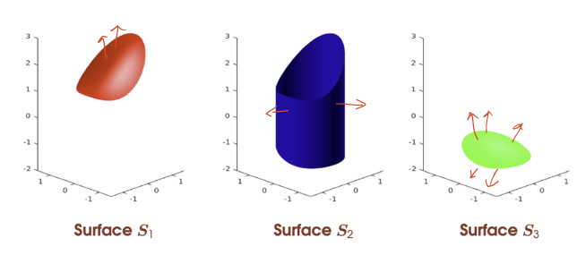

$$\oiint_{\partial W} R \vec{k} \cdot d \vec{S} = \iint_{S_1}^{}R \vec{k}\cdot d \vec{S} + \iint_{S_2}R \vec{k}\cdot d \vec{S} - \iint_{S_3}R \vec{k} \cdot d \vec{S}$$
> $S_3$ 是负的因为他的方向是反的，我也不知道为什么他他妈是反的，我也他妈不在乎他他妈为什么是反的，但他他妈的就是反的

**Step 4)** Parametrize

Parametrize $S_1$ as $S_1(u,v) = u \vec{i} + v \vec{j} + g(u,v) \vec{k}$

So
$$\vec{T_u} = \vec{i} + \frac{\partial g}{\partial u}\vec{k}$$

$$\vec{T_v} = \vec{j} + \frac{\partial g}{\partial v}\vec{k}$$

$$\vec{T_u}\times \vec{T_v} = - \frac{\partial g}{\partial u} \vec{i} - \frac{\partial g}{\partial v}\vec{j} + \vec{k}$$

> Inparticular, we note that $\vec{k} \cdot (\vec{T_u} \times \vec{T_v}) = 1$

Hence

$$\iint_{S_1} R \vec{k} \cdot d \vec{S} = \iint_D R(S_1(x,y))\vec{k}\cdot (\vec{T_u}\times \vec{T_v})dA$$

$$\iint_D R(u,v,g(u,v))dA$$

Similar, the surface integral of $S_3$
$$\iint_{S_3} = R \vec{k}\cdot d \vec{S} = \iint_D R(u,v,f(u,v))dA$$

BUT FOR $S_2$, 他是个臭傻逼

Parametrize $S_2$ as $S_2(u,v) = x(u)\vec{i} + y(u)\vec{j} + v \vec{k}$

And then you will find out
$$\vec{T_u}\times \vec{T_v} = x'(u)\vec{i} + y'(u)\vec{j} + 0 \vec{k}$$

Hence that $\vec{k}\cdot (\vec{T_u}\times \vec{T_v}) = 0$

Hence
$$\iint_{S_2} R \vec{k}\cdot d \vec{S} = 0$$

Hence the whole LHS will be 
$$\iint_D R(x,y,g(x,y))dA - \iint_D R(x,y,f(x,y))dA$$

## Stoke's Theorem
Let $\vec{F}$ be a vector field on $\R^3$, and let $\Phi: D \to \R^3$ be a parametrized surface with boundary $\partial \Phi$, where $D \subseteq \R^2$ is a region to which Green's Theorem applies. Then
$$\oint_{\partial\Phi} \vec{F}\cdot d \vec{s} = \iint_\Phi(\nabla \times \vec{F})\cdot d \vec{S}$$

----
**Proof** 

**Step 1)** Consider the following special case
$$\Phi(u,v) = u \vec{i} + v \vec{j} + f(u,v) \vec{k}$$

**Step 2)** Evaluate the RHS double integral
$$\vec{T_u} = \vec{j} + \frac{\partial f}{\partial u} \vec{k}$$

$$\vec{T_v} = \vec{j} + \frac{\partial f }{\partial v }\vec{k}$$

Cross product is
$$\vec{T_u}\times \vec{T_v} = - \frac{\partial f }{\partial u }\vec{i} - \frac{\partial f }{\partial v }\vec{j} + \vec{k}$$

$$(\nabla\times \vec{F})\cdot (\vec{T_u}\times \vec{T_v}) = - (\frac{\partial R }{\partial y } - \frac{\partial Q }{\partial z} ) \frac{\partial f }{\partial u } + \dots$$

反正是一个很长的傻逼东西

**Step 3)** Evaluate LHS

$$\gamma(t) = u(t) \vec{i} + v(t) \vec{j} + f(u(t),v(t))\vec{k}$$

So that
$$\gamma'(t) = \frac{du }{dt }\vec{i} + \frac{dv }{dt }\vec{j} + (\frac{\partial f }{\partial u } \frac{du }{dt } + \frac{\partial f }{\partial v }\frac{dv }{dt })\vec{k}$$

$$\vec{F }(\gamma(t)) \cdot \gamma'(t) = (P + R \frac{\partial f }{\partial u })\frac{du }{dt } + (Q + R \frac{\partial f }{\partial v})\frac{dv }{dt}$$

Integrate them we get
$$\oint_{\partial \Phi}^{} \vec{F} \cdot d \vec{S} = \oint_{\partial D}(P + R \frac{\partial f }{\partial u })du + (Q + R \frac{\partial f }{\partial v})dv$$

把两个括号各当成单独的一个完整的term，然后用Green's Theorem

$$= \oint_{\partial D } \frac{\partial }{\partial u }(Q + R \frac{\partial f }{\partial v }) - \frac{\partial }{\partial v}(P + R \frac{\partial f }{\partial u })dA$$

这个东西接下来会非常的屎，我们一个一个来

首先 $\vec{F} = P(x,y,z)\vec{i} + Q(x,y,z)\vec{j}+ R(x,y,z) \vec{k}$ 而且 $z = f(x,y)$

And because of $u=x, v=y$,Hence

$$\frac{\partial Q}{\partial u} = \frac{\partial Q }{\partial x} + \frac{\partial Q }{\partial z} \frac{\partial f}{\partial u}$$

The second term, $\frac{\partial }{\partial u }(R \frac{\partial f }{\partial v})$ 需要用到product rule

$$ = \frac{\partial R }{\partial u } \frac{\partial f }{\partial v } + R \frac{\partial f^2}{\partial u \partial v}$$

然后这个的第一个term $\frac{\partial R }{\partial u}$又可以按照前面的那个来integrate

$$\frac{\partial R }{\partial u }= \frac{\partial R }{\partial x } + \frac{\partial R }{\partial z }\frac{\partial f }{\partial u }$$

全部结合在一起就会变成

$$\frac{\partial }{\partial u }(Q + R \frac{\partial f }{\partial v }) = (\frac{\partial Q }{\partial x } + \frac{\partial Q }{\partial z }\frac{\partial f }{\partial u}) + (\frac{\partial R }{\partial x } + \frac{\partial R }{\partial z } \frac{\partial f }{\partial u}) \frac{\partial f }{\partial v} + R \frac{\partial^2 f }{\partial u \partial v}$$

另一个term则是

$$\frac{\partial }{\partial v }(Q + R \frac{\partial f }{\partial v }) = (\frac{\partial Q }{\partial y } + \frac{\partial Q }{\partial z }\frac{\partial f }{\partial v}) + (\frac{\partial R }{\partial y } + \frac{\partial R }{\partial z } \frac{\partial f }{\partial v}) \frac{\partial f }{\partial u} + R \frac{\partial^2 f }{\partial u \partial v}$$

这俩按照之前提到的关系结合一下就成为了 LHS = RHS

Hence
$$\oint_{d\Phi} \vec{F}\cdot d \vec{S} = \oint_{\partial D} \vec{F}(\gamma (t)) \cdot \gamma'(t) dt = \iint_D(\nabla \times \vec{F})\cdot (\vec{T_u}\times \vec{T_v})dA = \iint_\Phi (\nabla \times \vec{F})\cdot d \vec{S}$$

# Laplace Transform

## Partial Fraction
## Laplace 
$$L[f(t)] = F(s) = \int_{0}^{\infty}e^{-st} f(t)dt$$
$$L[f'(t)] = sF(s) - f(0)$$
$$L(f''(t)) = s^2F(s)-sf(0) - f'(0)$$

## First Shift Theorem - Unit Step

If we know that $L(f(t)) = F(s)$ then the first shift theorem tells us that $$L(f(t)e^{-at}) = F(s+a)$$

-   Example

    The laplace transform of a certain function $f(t)$ is given as $L(f(t)) = \frac{6}{s^4}$

    use the first shift theorem to find the laplace transform of $f(t)e^{-2t}$
    $$L(e^{-2t} f(t)) = F(s + 2)$$
    $$= \frac{6}{(s+2)^4} $$

## Second Shift Theorem - S&T Domain

$$L(f(t-a)u(t-a)) = \int_{a}^{\infty}e^{-st}f(t-a)dt = e^{-as}F(s)$$

-   Example

    Use the second shift hteorem to find the inverse laplace transform of $F(s) = e^{-3s}(\frac{1}{s+4})$
    $$L(f(t-a)u(t-a)) = e^{-as}F(s)$$
    $$L(f(t-3)u(t-3)) = e^{-3s}F(s)$$
    $$F(s) = \frac{1}{s+4} \to f(t) = e^{-4t}$$
    $$f(t-3) = e^{-4(t-3)}$$
    Inverse is
    $$u(t-3)e^{-4(t-3)}$$

-   Example - Find solution to DE with shifts

    Solve the following second order de using laplace method
    $$f''(t)  + 2f'(t) +5 f(t) = 3, f(0) = 0, f'(0) = 0$$
    $$s^2F(s)+2sF(s) + 5F(s) = \frac{3}{s}$$
    $$F(s) = \frac{3}{s(s^2 +2s + 5)}$$
    Do a partial fraction and find inverse laplace
    $$=\frac{3}{s^2+10s+5s^2}$$
    $$= \frac{A}{s} + \frac{B}{s^2+5s+10}$$
    $$= \frac{3}{10} \times \frac{1}{s} - \frac{3}{10}\times \frac{s+5}{s^2 + 5s + 10}$$
    $$= \frac{3}{10} \times \frac{1}{s} - \frac{3}{10} \times [\frac{s+ \frac{5}{2}}{(s+\frac{5}{2})^2 + \frac{15}{4}} + \frac{5}{\sqrt{15}} \frac{\frac{\sqrt{15}}{4}}{(s+\frac{5}{2})^2 + {\frac{15}{4}}}]$$
    $$x(t) = \frac{3}{10} - \frac{3}{10} e^{-\frac{5}{2}t}\cos(\frac{\sqrt{15}}{2}) - \frac{\sqrt[]{15}}{10}e^{-\frac{5}{2}t}\sin(\frac{\sqrt[]{15}}{2}t)$$

## Unit Step

A unit step $u(t-a)$ is a step of magnitude 1 turned on at $t=a$

$f(t)= t+1$ multiplied by $u(t-2)$ given as $f(t) = u(t-2) \cdot (t+1)$
$$f(t) = \begin{cases}
0\ t<2\\
t+1\ t> 2
\end{cases}$$

Consider that $u(t) = 1$ is the unit step at time zero

Recall that $U(s) = L[1] = \frac{1}{s}$ then
$$Y(s) = H(s)U(s) = \frac{1}{s}H(s)$$
The inverse laplace transform is:
$$y(t) = L^{-1}(\frac{1}{s}H(s))$$
Hence, the unit step response at time zero is found by directly solving $\frac{1}{s} H(s)$

A time-shifted step is found by solving $\frac{e^{-as}}{s}H(s)$

## Impulse

A impulse is a rectangular function with zero width, infinite height and area = 1.

Unit Impulse $\delta$ at $t=0$
$$f(t) = \delta(t)$$
$$F(s) = 1$$

Unit Impulse $\delta$ at $t = a$
$$F(s) = 1 \times e^{-as}$$

## Inverse Laplace

# Probability

## Discrete Random Variables
A random variable $X$ is said to be discrete if there is a function $p_x:{x_1, x_2, \dots} \to \R$ such that
$$P(X \in B) = \sum_{x_i \in B} p_x(x_i)$$

and
$$\sum_{x_i} p_x(x_i) = 1$$

> $p_x$ is the probability mass function(p.m.f) of $X$

## Continuous Random Variables
A random variable $X$ is said to be continuous if there is a function $f_x : \R \to \R$ such that
$$P(X \in B) = \int_{B}^{}f_X(x)dx$$

and
$$\int_{-\infty}^{\infty }f_X(x)dx = 1$$

> $f_X$ is the probability density function (p.d.f) of $X$

## Expectation
Consider a random variable $X$ with a finite list $x_1, x_2, \dots, x_k$ of possible outcomes, each of which has probability $p_1, p_2, \dots, p_k$

The expectation of a random variable $X$ is the weighted average of the possible values of $X$

$$E[X] = \sum_\infty x p_X(x)\ \ \textrm{ or }\ \ E[X] = \int_{-\infty }^{\infty} x f_X(x)dx$$

Alternatively, it is the average value across all possible events

$$E[X] = \sum_{e\in E} X(e)P(e)\ \ \textrm{  or  }\ \ E[X] = \int_E X(e)P(e)de$$

**THEOREM**

Let $X$ be a random variable and let $a,b \in \R$ be real numbers, then
$$E[aX + b] = aE[X] + b$$

**THEOREM2**

Let $X$ and $Y$ be random variables. Then
$$E[X+Y] = E[X] + E[Y]$$

**THEOREM3**
Only when $X$ and $Y$ are independent.
$$E[XY] = E[X]E[Y]$$

## Variance
The variance of a random variable $X$ is the expectation of the sqaured deviations from the main
$$\textrm{Var}(X) = E[(X - E[X])^2]$$

The standard deviation of a random variable $X$ is the square-root of the variance of $X$
$$\sigma_X = \sqrt{\textrm{Var}(X)}$$

**THEOREM**

Let $X$ be a random variable. Then we have that
$$\textrm{Var}(X) = E[X^2] - E[X]^2$$

----

**THEOREM**

Let $X$ be a random variable and let $a,b \in \R$ be real numbers. Then
$$\textrm{Var}(aX + b) = a^2 \textrm{Var}(X)$$

!!! This also makes a become positive, 因为square了，无论前面是正还是负全都改成正.

----

**THEOREM**

Let $X$ and $Y$ be an independent random variables, then
$$\textrm{Var}(X+Y) = \textrm{Var}(X) + \textrm{Var}(Y)$$

---

**THEOREM** 
Let $X$ and $Y$ be independent variable, then
$$\textrm{Var}(XY) = \textrm{Var}(X) \textrm{Var}(Y) + \textrm{Var}(X) \textrm{E}[Y]^2 + \textrm{Var}(Y) \textrm{E}[X]^2$$ 

PROOF

just use the fact that
$\textrm{Var}(XY) = \textrm{E}[X^2Y^2] - \textrm{E}[XY]^2$

## Discrete Distribution

Use Binomial Distribution when you're concerned with the number of successes in a fixed number of trials.

Use Geometric Distribution when you're interested in the number of trials required to achieve the first success.
### Bernoulli Distribution
A discrete random variable is said to be Bernoulli Distributed, $X \sim \textrm{Ber}(p) $ if
- It only takes the values $1$(true) or $0$(false)
- Has the probability mass function $p_X(1) = p \textrm{ and } p_X(0) = (1-p)$

A good example is tossing coin, where head and tail's probability is both 0.5

**THEOREM**

Let $X \sim \textrm{Ber}(p)$ be Bernoulli distributed. Then we have that
$$E[X] = p$$
and
$$\textrm{Var}(X) = p(1-p)$$

### Binomial Distribution
The binomial distribution models the number of successes in a fixed number of independent trails of a binary experiment.

n is the number of trials.
p is the probability of success on an individual trial.

The binomial distribution answers questions like "What is the probability of getting exactly k successes in n independent trial??

A discrete random variable is said to be binomially distributed,$X \sim \textrm{Bin}(n,p)$, if it has a p.m.f
$$p_X(k) = \begin{pmatrix}n \\ k\end{pmatrix}p^k (1-p)^{n-k}$$

**THEOREM**

Let $X \sim \textrm{Bin}(n,p)$ be binomially distributed, then
$$E[X] = np$$

and

$$\textrm{Var}(X) = np(1-p)$$

### Negative Binomial Distribution
In the Binomial Distribution, you're interested in the number of successes out of a predetermined number of trials.

In the Negative Binomial Distribution, you continue performing trials until you achieve a predetermined number of successes.

The negative binomial probability mass function is given as,
$$P(X=k) = \begin{pmatrix} k-1\\ r-1\end{pmatrix} \times p^3 \times (1-p)^{k-r}$$

Where $k$ is the total number of trails, $r$ is the number of success, and $p$ is the probability of success in each trail, and $(1-p)$ is the probability of failure on each trail.

### Geometric Distribution
A discrete random variable is said to be geometrically distributed, $X \sim \textrm{Geo}(p)$ if it has a p.m.f
$$p_X(k) = (1-p)^{k-1}p$$

**THEOREM**

Let $X \sim \textrm{Geo}(p)$ be geometric distributed. Then we have that
$$E[X] = \frac{1}{p}$$

and

$$\textrm{Var}(X) = \frac{1-p}{p^2}$$

### Summary

## Bivariate(Joint) Distributions
Let $X$ and $Y$ be two discrete random variables defined over the same set of events. The joint probability mass function of $X$ and $Y$ is the function $p_{X,Y}: \R^2 \to \R$ where
$$p_{X,Y}(x,y) = P(\{X = x\} \cap \{Y = y\})$$
$$= P(X=x, Y=y)$$

### Marginal Distributions of Bivariate Distribution
The marginal Distribution of a Bivariate distribution $p_{X,Y}$ with respect to $X$ and $Y$ are given by
$$p_X(x) = \sum_y p_{X,Y}(x,y)$$
and
$$p_Y(y) = \sum_x p_{X,Y}(x,y)$$

## Conditional Distributions and Conditional Expectation
Let $X$ and $Y$ be two discrete random variables. Then the conditional distribution of $X$ given $Y$ is the probability mass function given by
$$p_{x|y} = P(\{X=x\} | \{Y=y\})$$
$$ = \frac{P(X=x, Y=y)}{P(Y=y)}$$
$$ = \frac{P(X=x, Y=y)}{P(Y=y)} = \frac{p_{X,Y}(x,y)}{p_Y(y)}$$

## Covariance
The covariance between two random variables $X$ and $Y$ is the expected value of the product of the deviations of $X$ and $Y$ from their respective means.
$$\textrm{Cov}(X,Y) = E[(X-E[X])(Y-E[Y])]$$

It can also be
$$\textrm{Cov}(X,Y) = E[XY] - E[X]E[Y]$$

----

**THEOREM**

Let $X$ and $Y$ be two random variables, not necessarily independent, then
$$\textrm{Var}(X+Y) = \textrm{Var}(X) + \textrm{Var}(Y) + 2 \textrm{Cov}(X,Y)$$

## Correlation
The covariance provides a measure of how correlated two random variables are

If $\textrm{Cov}(X,Y) > 0$ Then $Y$ generally increases as $X$ increases.

If $\textrm{Cov}(X,Y) < 0$ Then $Y$ generally decreases as $X$ increases.

If $\textrm{Cov}(X,Y) = 0$ Then $X$ and $Y$ are uncorrelated.

The correlation between two random variables $X$ and $Y$ is the normalized covariance of $X$ and $Y$.

$$\textrm{Corr}(X,Y) = \frac{\textrm{Cov}(X,Y)}{\sqrt{\textrm{Var}(X) \textrm{Var}(Y)}} = \frac{\textrm{Cov(X,Y)}}{\sigma_X \sigma_Y}$$

where $\sigma_X, \sigma_Y$ are standard deviations of $X$ and $Y$

The correlation value will stays in the range between $-1$ and $1$.

----

IF the question ask Show X and Y are not correlated, just find 
$$\textrm{Cov}(X,Y) = 0$$

# Markov Chain
## State Transition Diagram
Let $X = \langle X_0, X_1, X_2, \dots\rangle$ be a Markov Chain on $S$. Then the state transition diagram of $X$ is a weighted diagraph $(S,\to)$, where the weight of the edge from $s_i$ to $s_j$ is given by the probability:
$$p(s_i \to s_j) = P(X_t = s_j| X_{t-1} = s_i)$$

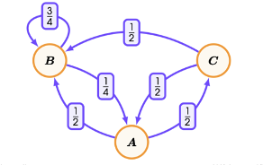

## Transition Matrix
The transition matrix of a Markov Chain $X$ is given by
$$Q = \begin{bmatrix}p(s_0 \to s_0) &p(s_1 \to s_0) &\dots &p(s_n \to s_0) \\ p_(s_0 \to s_1) & p(s_1 \to s_1) &\dots &p(s_n \to s_1) \\ \dots &\dots &\dots &\dots \\ p(s_0 \to s_n) & p(s_1 \to s_n) &\dots &p(s_n \to s_n)\end{bmatrix}$$

Column $i$ Row $j$ is the probability of $p(s_i \to s_j)$

## HOW TO Calculate Long-term Behaviour

**Step 1)** Assume the long-term probability as follows
$$p = p_\infty(A), q = p_\infty(B), r = p_\infty(C)$$
where $p+q+r = 1$

**Step 2)** Use the transition matrix to determine the fixed point equation
$$\begin{bmatrix}0 & 0.25 &0.5\\ 0.5 & 0.75 & 0.5 \\ 0.5 & 0 & 0 \end{bmatrix} \begin{bmatrix} p \\ q \\ r\end{bmatrix} = \begin{bmatrix}p \\ q \\ r\end{bmatrix}$$

**Step 3)** Expand the matrix to generate a linear algebra of a system of simultaneous equations
$$p = \frac{1}{4}q + \frac{1}{2}r$$
$$q = \frac{1}{2}p + \frac{3}{4}q + \frac{1}{2}r$$
$$r = \frac{1}{2}p$$

**Step 4)** Solve them using $p+q+r = 1$
$$p = \frac{2}{9}, q = \frac{2}{3}, r = \frac{1}{9}$$

This is the equilibrium value.

## Combine with a Bernoulli Distribution
If the question says $p$ is the probability of the system starts from State A, and theres two state, you need to combine p with calculating the probability

For example

$$P_2(W) = p \times P(W \to W \to W) + p \times P(W \to F \to W) + (1-p)\times P (F \to W \to W) + (1-p)\times P (F \to F \to W)$$

## Probability between two time

If the question says, the system is at State A when time=3, find what is the probability of at State B when time=5.

Just dont care about the beginning, it just means the system starts at A, find probability of at State B when time=$5-3=2$

# Poisson Process
A Poisson Process is a continuous stochastic process that counts the number of 'events' $N_t$ occuring in the interval $[0,t)$

e.g. There are average 10 clicks on a webpage per hour, predict the number of clicks to be exaclty 5 in the next hour.

A random variable $X$ is said to be Poisson distributed if it has a p.m.f
$$p_x(k) = \frac{\lambda^k}{k!}e^{-\lambda}, \textrm{ for } k = 0,1,2,\dots$$

- $\lambda$ is the estimated number of event happened

- For the previous example, $\lambda = 10, k=5$

in which case we write $X \sim Po(\lambda)$

Reminder of Taylor expansion of $e^x$
$$e^x = \sum_{k=0}^{\infty}\frac{x^k}{k!}= 1 + \frac{x}{1!} + \frac{x^2}{2!} + \dots$$

----

**THEOREM 1**

Let $P$ be a Poisson process with rate $\lambda > 0$, and let $N_t$ denote the number of events that occur within the interval $[0,t)$, then 
$$P(N_t = k) = \frac{(\lambda t)^k}{k!}e^{-\lambda t}$$

Hence $N_t \sim Po(\lambda t)$ is Poisson distributed with parameter $\lambda t$

----

Like the previous example, if the question ask us to predict the number of clicks to be exactly 5 in the next two hours and next minutes:

1. Next one hour
$$p_X(x = 5) = \frac{10^5}{5!}e^{-10}= 0.0378$$

2. Next two hour
$$p_X(x = 5) = \frac{(10 \times 2)^5}{5!}e^{-10\times 2}$$

3. Next one minute
$$p_X(x = 5) = \frac{(10 \times \frac{1}{60})^5}{5!}e^{-10 \times \frac{1}{60}}$$

----
**THEOREM 2**

Let $X \sim Po(\lambda)$ be poisson distributed. Then
$$E[X] = \lambda, \textrm{Var}(X) = \lambda$$

## Exponential Distribution
A continuous random variable is said to be exponentially distributed if it has a probability density function 
$$f_r(t) = \lambda e^{-\lambda t}\ \textrm{ for }t \in [0, \infty)$$

----
**MY THEOREM**

For $P(a<T<b)$ of a exponential distributed random variable, the probability is

$$P(a<T<b) = e^{-a\lambda} - e^{-b\lambda}$$

----
**THEOREM**
Let $P$ be a Poisson process with a rate $\lambda > 0$, and let $T$ denote the arrival-time of the first event. Then
$$P(T \leq t_0) = \int_{0}^{t_0}\lambda e^{-\lambda t}dt$$

i.e. $T \sim \textrm{Exp}(\lambda)$ is exponentially distributed with parameter $\lambda$

Still the previous example, if they ask what is the probability of one click in an interval of 6 minutes?
$$P(T \leq 0.1) = \int_{0}^{0.1}\lambda e^{-\lambda t}dt$$

----
**THEOREM(Memoryless Property)**

Let $T\sim \textrm{Exp}(\lambda)$ be exponentially distributed with rate $\lambda > 0$. Then we have that
$$P(T \geq (s+t)\ |\ T\geq s) = P(T \geq t)$$

for all $s,t > 0$

----
Let $T \sim \textrm{Exp}(\lambda)$ be exponentially distributed, then
$$E[T] = \frac{1}{\lambda}, \textrm{Var}(T) = \frac{1}{\lambda^2}$$

## Summary

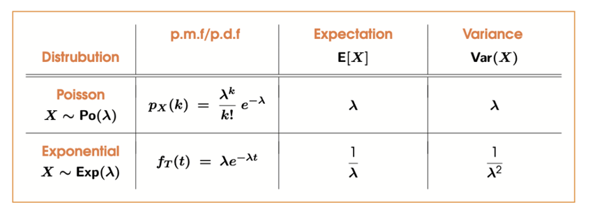

# Queueing
## Simple Queuing Process

A simple queue is a Markov Chain where the states corresponds to _the number of people in the queue_

Every minute a new person joins the queue with probability $p$, and one person leaves the queue with probability $q$

$P(\textrm{arrival})=p$ and $P(\textrm{departure}) = q$, we assume at most 1 person can join/leave in each time.

### Queuing Increases
$$p(n \to (n+1)) = P( \textrm{1 person arrive AND no one depart})$$

$$ = P(\textrm{1 arrival}) \times P (\textrm{0 departure}) = p(1-q)$$

### Queuing Decreases
$$p(n\to (n-1)) = P(\textrm{no one arrive AND 1 person departs})$$
$$ = P(\textrm{0 arrival}) \times P(\textrm{1 departures}) = (1-p)q$$

### Queue stays empty
$$p(0 \to 0) = P(\textrm{no one arrives OR (1 person arrives AND 1 person depart)})$$

$$ = P(\textrm{0 arrival}) + P (\textrm{1 arrival}) \times P(\textrm{1 departure})$$

$$= (1-p) + pq$$

### Queue remains the same length
$$p(n\to n) = P(\textrm{(no arrives AND no departs) OR (1 arrive AND 1 depart)})$$
$$= P(\textrm{0 arrival}) \times P(\textrm{0 departs}) + P(\textrm{1 arrival})\times P(\textrm{1 depart})$$

$$ = (1-p)(1-q) + pq$$

## Calculating the long-term behaviour
**Step 1)**  Let $p_k$ denote the fixed-point probability that queue contains exactly $k$ people

**Step 2)** Write down the fixed-point equation for the next time

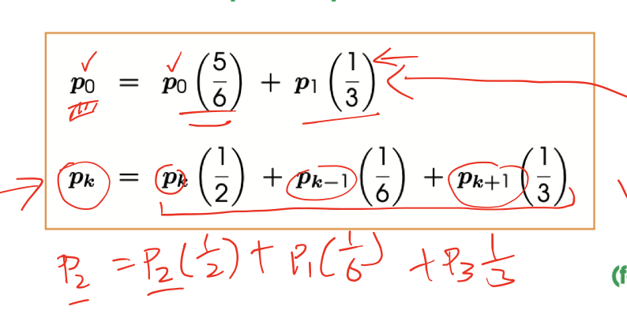

**Step 3)** Solve the system of equations recursively, write each $p_k$ in terms of $p_0$

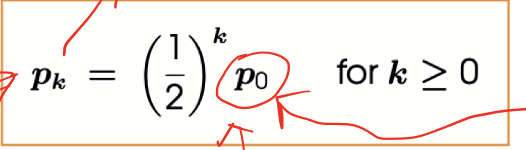

**Step 4)** Use the fact that $\sum_{k=0}^{\infty}p_k = 1$ to solve for $p_0$

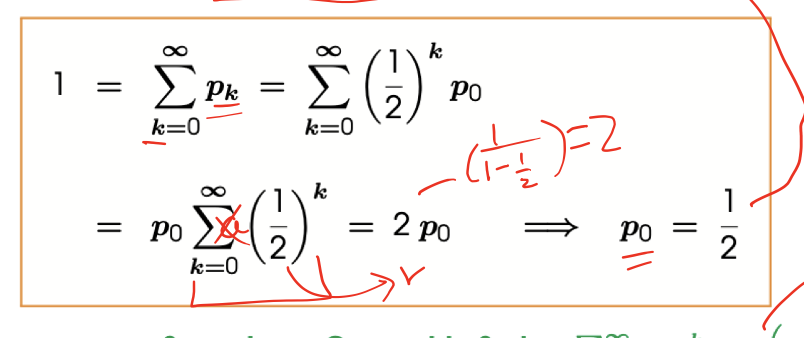

**Step 5)** Substitute this value, and get the formula to calculate for whatever k value

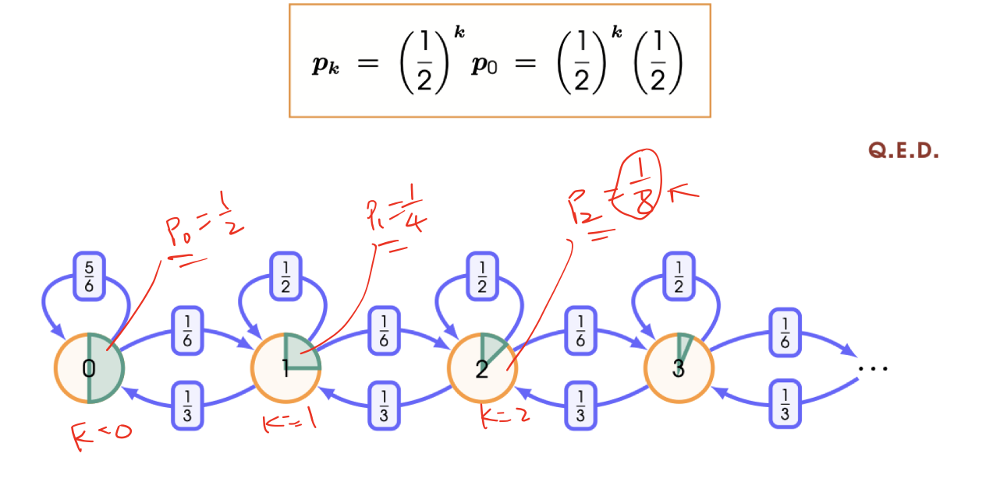

### Shortcut
**Step 1)**  Make a cut between two state

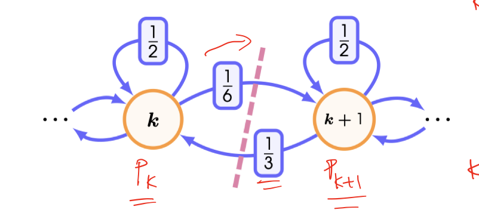

**Step 2)** Balance the probability flowing across the cut in both directions

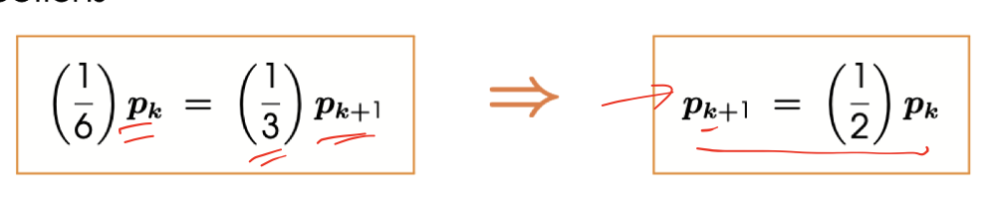

**Step 3)** Solve recursively writing each $p_k$ in terms of $p)0$

**Step 4)** Continue to use sum equal 1 to find $p_0$ and substitute back

## Calculating the Expected Queue Length
**Step 1)** Calculate the fixed-point probabilities as above

**Step 2)**  Evaluate the infinite sum for the expectation

$$E[S] = \sum_{k=0}^{\infty}k \cdot p_k = \sum_{k=0}^{\infty}k \cdot (\frac{1}{2})^k (\frac{1}{2})$$

> Reminder of geometric series formula $f(x) = \sum_{k=0}^{\infty}x^k = \frac{1}{1-x}$ and $f'(x) = \sum_{k=0}^{\infty}kx^{k-1} = \frac{1}{(1-x)^2}$

**Step 3)** Solve the infinite series

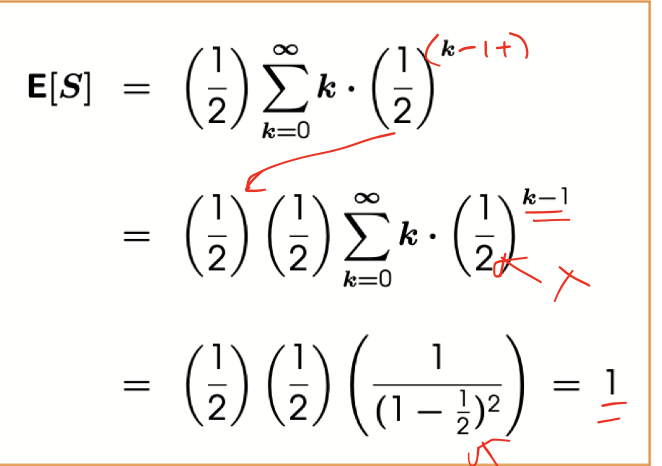

## Continuous Single-Server Queue
A Birth-Death process (known as $M/M/1$ queue) is the generalisation of a simple queue to continuous time, where arrival(birth) and departure(death) can occur at any time(but not at same time), where
- Arrival occur according to a Poisson Process
- Departure occur according to a second Poisson Process

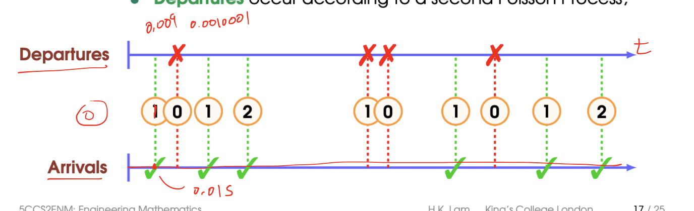

## Calculating the Long-term Behaviour
**Step 1)** Discretize time by dividing into many small intervals of length $\delta$
$$P(\textrm{arrival}) \approx \lambda \cdot \delta \ \textrm{, }\ P(\textrm{departure}) \approx \mu \cdot \delta$$

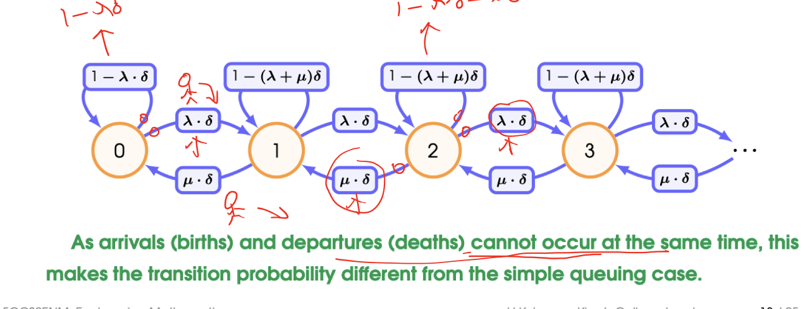

**Step 2)** Obtain the fixed-point equations for this discrete approximation

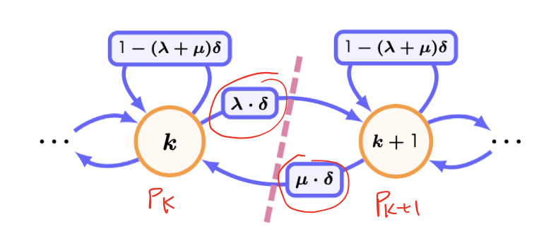

**Step 3)** Balance the probability across the cut
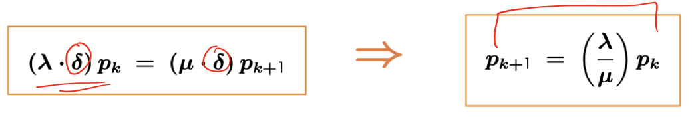

**Step 4)** As with simple queue, solve the system recursively, find $p_0$ using sum equals to 1, and substitute back

## Calculating the Expected Queue Length
**Step 1)** Find the fixed-point probability.

**Step 2)** Evaluate the infinite sum for the expectation

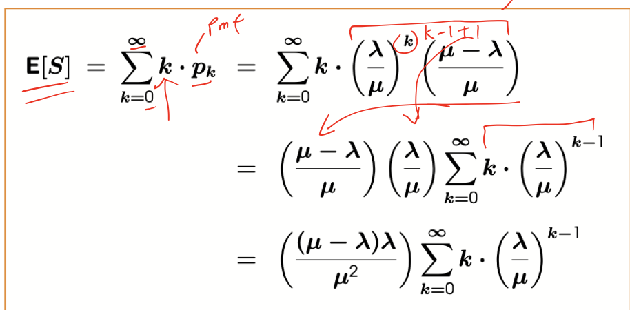

