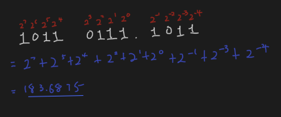
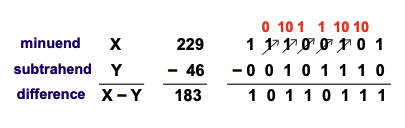
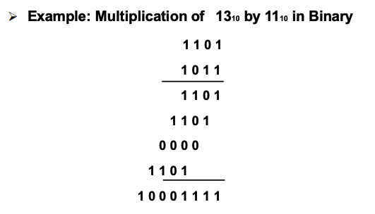
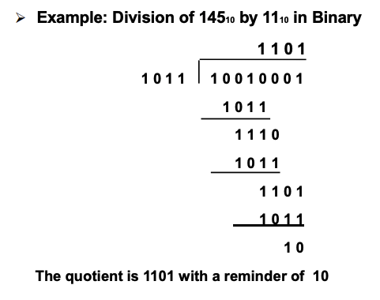
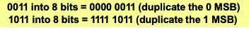
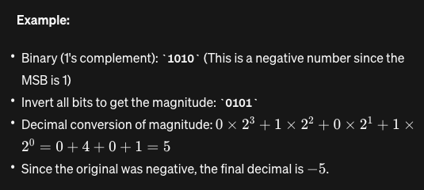

# Binary Arithmetics

## Addition and Subtraction
就和正常的一样有往前进1和往前借1

## Multiplication and Division

# Negative Binary Numbers
## Signed-Magnitude
The MSB bit indicate sign, $1$ means minus, $0$ means plus.

However, Signed-Magnitude arithmetics will be inefficient using logic circuit

## Complements
### Dimished Radix Complement of number N
$(r^n -1) - N$

The radix $r$ of a number system is 10 for decimal and 2 for binary etc.

### Two's Complement
The MSB is $-2^{N-1}$, 比如for a 8 digit binary number, the MSB is -128

For finding the negative number, simply flip all the digits and then add 1

To convert two's complement number into ones with larger bits, check the MSB, if MSB is 0, append all the new digit with 0, MSB is 1, all the new digit is 1.

Addition and Subtraction is the same for two's complement. The only problem is the potential overflow.

### One's Complement
Simply flip the digit without adding 1

