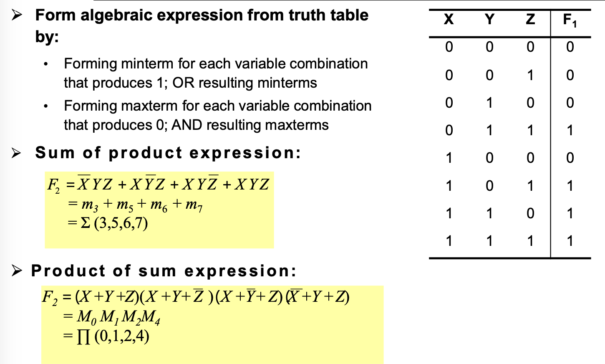

# Binary System
# Boolean Algebra
The operator '.' has precedence over '+'
## Single Variable Theorems
- $X + 0 = X, X.1 = X$ (Identitiees)
- $X+1 = 1, X.0 = 0$ (Null elements)
- $X+X = X, X.X = X$ (Idempotency)
- $(X')' = X$ (Involution)
- $X + X' = 1, X.X' = 0$ (Complements)

## Two/three Variable Theorems
- $X + Y = Y + X, X.Y = Y.X$ (Commutativity)
- $(X+Y) + Z = X + (Y + Z), (X.Y).Z = X.(Y.Z)$ (Associativity)
- $X.Y + X.Z = X. (Y + Z), (X + Y) . (X + Z) = X + (Y . Z)$ (Distributivity)
- $X + X.Y = X, X.(X+Y) = X$ (Covering)
- $X . Y + X.Y' = X, (X+Y).(X+Y') = X$ (Combining)
- $X.Y+X'.Z+Y.Z = X.Y + X'.Z, (X+Y).(X'+Z).(Y+Z) = (X+Y).(X'+Z)$ (Consensus)

Proof of Consensus Theorem

## Canonical Forms
Boolean functions can be expressed in canonical form

> Sum 就是 OR, Product 就是 AND

Minterm - Each term in Sum of Product canonical expression
- 把1的term全部Sum起来

Maxterm - Each term in Product of Sum canonical expression
- 把0的term全部Product起来

### Converting SoP and PoS

Interchange the symbol and list numbers missing from original form

## Minimising Boolean Functions
### De Morgan's Theorem
$$\overline{X_1 + X_2} = \overline{X_1} . \overline{X_2}$$

$$\overline{X_1 . X_2} = \overline{X_1} + \overline{X_2}$$

### Karnaugh Map
There may be more than one way to simplify using K-map

只圈最少的1、4、8方块。

# Combinational Logic Circuit
Usually inverting gates NOT NAND NOR are faster than non-inverting gates AND NOT OR
## Logic Gates
De Morgan's Theorem can be used to produce alternative logic gates.
### AND Gate

### OR Gate

### NOT Gate

### NAND Gate

### NOR Gate

### XOR and XNOR Gate
2 input XOR: Output is high only if both inputs are different

This gate can be implement using NAND gate

$$X \oplus Y = XY' + X'Y = XY' + XX' + X'Y + YY' = (X' + Y')X + Y(X'+Y')$$

$$= \overline{\overline{(X.Y)'.X}.\overline{(X.Y)'.Y}}$$

----

2 input XNOR: Output is high only if both inputs are same

$$\overline{X \oplus Y} = (X'+Y)(X+Y') = XY + X'Y'$$

----

n-input XOR - output high when inputs have odd number of 1's -parity checker

n-input XNOR - output high when inputs have even number of 1's

Implement using NAND gate can save elements

The following circuit is a Even-Parity-Generator, which generate a parity bit for a given set of data bits. Its objective is to ensure that the total number of 1s including the parity bit is even.

The following circuit is a Even-Parity-Checker is to check the received data includes the parity bit, determine whether an error has occured during transmission.

> For instance, if the parity bit is 1 indicating an odd parity, however the received bits are not odd, it indicates an transmission error.

Combinational logic analysis example

