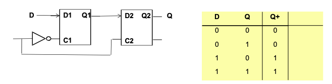
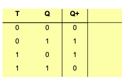

# Binary System
# Boolean Algebra
The operator '.' has precedence over '+'

AND is the operator '.'

OR is the operator '+'

## Single Variable Theorems
- $X + 0 = X, X.1 = X$ (Identitiees)
- $X+1 = 1, X.0 = 0$ (Null elements)
- $X+X = X, X.X = X$ (Idempotency)
- $(X')' = X$ (Involution)
- $X + X' = 1, X.X' = 0$ (Complements) 要注意这个很容易搞错

## Two/three Variable Theorems
- $X + Y = Y + X, X.Y = Y.X$ (Commutativity)
- $(X+Y) + Z = X + (Y + Z), (X.Y).Z = X.(Y.Z)$ (Associativity)
- $X.Y + X.Z = X. (Y + Z), (X + Y) . (X + Z) = X + (Y . Z)$ (Distributivity)
- $X + X.Y = X, X.(X+Y) = X$ (Covering)
- $X . Y + X.Y' = X, (X+Y).(X+Y') = X$ (Combining)
- $X.Y+X'.Z+Y.Z = X.Y + X'.Z, (X+Y).(X'+Z).(Y+Z) = (X+Y).(X'+Z)$ (Consensus)

Proof of Consensus Theorem

## Canonical Forms
Boolean functions can be expressed in canonical form

> Sum 就是 OR, Product 就是 AND

Minterm - Each term in Sum of Product canonical expression
- 把1的term全部Sum起来

Maxterm - Each term in Product of Sum canonical expression
- 把0的term全部Product起来

### Converting SoP and PoS

Interchange the symbol and list numbers missing from original form

## Minimising Boolean Functions
### De Morgan's Theorem
$$\overline{X_1 + X_2} = \overline{X_1} . \overline{X_2}$$

$$\overline{X_1 . X_2} = \overline{X_1} + \overline{X_2}$$

### Karnaugh Map
There may be more than one way to simplify using K-map

只圈最少的1、2、4、8方块。

注意4x4 karnaugh map的顺序

注意

$\sum_d$ means dont care, it means the number in this column can either be 1 or 0 to simplify the output

注意2

注意四边都是可以fold的

# Combinational Logic Circuit
Usually inverting gates NOT NAND NOR are faster than non-inverting gates AND NOT OR
## Logic Gates
De Morgan's Theorem can be used to produce alternative logic gates.
### AND Gate

### OR Gate

### NOT Gate

### NAND Gate

### NOR Gate

### XOR and XNOR Gate
2 input XOR: Output is high only if both inputs are different

This gate can be implement using NAND gate

$$X \oplus Y = XY' + X'Y = XY' + XX' + X'Y + YY' = (X' + Y')X + Y(X'+Y')$$

$$= \overline{\overline{(X.Y)'.X}.\overline{(X.Y)'.Y}}$$

----

2 input XNOR: Output is high only if both inputs are same

$$\overline{X \oplus Y} = (X'+Y)(X+Y') = XY + X'Y'$$

----

n-input XOR - output high when inputs have odd number of 1's -parity checker

n-input XNOR - output high when inputs have even number of 1's

Implement using NAND gate can save elements

The following circuit is a Even-Parity-Generator, which generate a parity bit for a given set of data bits. Its objective is to ensure that the total number of 1s including the parity bit is even.

The following circuit is a Even-Parity-Checker is to check the received data includes the parity bit, determine whether an error has occured during transmission.

> For instance, if the parity bit is 1 indicating an odd parity, however the received bits are not odd, it indicates an transmission error.

Combinational logic analysis example

# Combinational Logic Synthesis
- From problem specification identify the inputs and outputs
- Obtain boolean function for each output as function of input variables
    - Directly from problem statement
    - Constructing the truth table
- Simplify the Boolean function using Karnaugh map or alegbraic manipulation
- Draw logic circuit diagram and verify correct operation

## Direct Implementation
For example, we derive a boolean function $F = A'BC + B'C' + AD$

## Implement using NAND gates
NAND gate are typically faster

We can use DeMorgan's Theorem to transform:

$$F = A'BC + B'C' + AD$$

$$= \overline{\overline{A'BC + B'C' + AD}}$$

$$= \overline{\overline{(A'BC)}.\overline{(B'C')}\overline{(AD)}}$$

Question 4.1

(a)Rewrite A+B using 2 NOT and 1 NAND Operator

$$A+B = \overline{\overline{A+B}} = \overline{\overline{A}.\overline{B}}$$

(b)Rewrite A+B+C+D using only NOT and two-input NAND operator

$$A+B+C+D = \overline{\overline{A+B}}$$

## Bubble to Bubble Logic
Transform the logic gate to nandgate by replacing using alternative symbols.

## Implement using NAND gates second method
Remember that the following gates are equivalent

- Draw the circuit using AND or OR gate
- Change every AND to NAND, OR to NOR
- Check for complements
- Change XOR to NAND

Example

## Minimisation using Karnaugh Map

Construct the truth table for each output, and then write down canonical expression

Multiple output require multiple karnaugh map for each output

# Medium Scale Combinational Logic Circuits

## Multiplexers

MUX are combinational devices with several input lines and one output line

## Adder

When two binary number are added together, S is the sum bit, C is the carry out bits

### Half Adder

### Full Adder

### Parallel/Ripple Adder

### Subtractors

### Adder Delay

## Decoder

## Encoder

## Comparator

# Asynchronous Logic

A latch is a memory device that changes its output based on its input staets, andd it does not require a clock signal to operate.

A flipflop is a clocked device, it changes state only at the edge of a clock signal(either rising or falling edge)

## SR Latch and Flip-Flop

Asserting S sets Q to 1 and QN to 0

Asserting R resets Q to 0 and QN to 1

If S and R are not asserted, Q and QN retain their previous values.

When S=R=1, undefined output is produced, the circuit is FUCKED UP

### S-R Latch Construction

Basically, the start state is at random, no body knows WTF whas happening at the output.

But once we set the input, either Set or Rest, because NOR gate outputs 0 as long as any input is 1, so we can obtain the desired result.

And if the inputs are both 0, the SR latch enters memory state, where the output retain their previous state.

Dont let S and R be 1 simultaneously, it will FUCK UP THE CIRCUIT.

## D(Transparent) Latch

When C(Control or Enable PIN) is 1, it allow Q+ = D.

When C is 0, Q+ is the previous Q

### D Latch Construction
Constructed from SR latch and gates

## Edge-triggered D Flip-Flop

Data is only fed to the output at rising edge of clock signal.

Otherwise, output remains at previous value.

如果是反过来的，那 the flip-flop is triggered to falling edge of the clock.

### D Flip-Flop Construction

$Q +  = D$

## SR Flip-Flop

## JK Flip Flop

和SR是一样的，只不过在J和K同时为1时，Q和QN互换

### Construction of JK Flip Flop

## T Flip Flop

T changes state on every clock tick.

Basically invert Q when T=1

Sometimes, include an enable pin to control the state transition.

# Finite State Machine Analysis

> Chatgpt says: A Finite State Machine (FSM) is a computational model used to design both computer programs and sequential logic circuits. It is called "finite" because it operates within a limited number of specific states. An FSM is defined by a list of its states, its initial state, and the conditions for each transition. 

States are a finite set of conditions that are mutually exclusive, each state represents a particular condition or step in the process.

Initial State are the state in which FSM begins operation.

Inputs are external conditions that trigger transitions from one state to another.

Next state logic determines the next state as function of current state and input.

Output logic determines the output as function of the current state and possibly input.

State memory is a set of flip-flops that store current state of FSM.

## Moore and Mealy Machines

Mealy Machine, output is a function of both input and current state

- Next state = F(current state, input)
- Output = G(current state, input)
- X[k+1] = F(X[k], U[k])
- Y[k] = G(X[k],U[k])

Moore Machine, the output is related to current state.

- X[k+1] = F(X[k], U[k])
- Y[k] = G(X[k])

## State Memory - Characteristic Equation

State memory can be implement using edge triggered d flip flop.

Characteristic Equation for D-Flipflop

$$Q[k+1] = D$$

----

Some times, JK Flip flop can allso be used,

$$Q[k+1] = J \cdot Q[k]' + K' \cdot Q[k]$$

----

T flip flop characteristic equation

$$Q+ = T \textrm{ XOR } Q$$
## Analysing FSM

1. Determine next state and output functions, F and G.
2. Use F and G to build state/output table specifying next state and output for every possibler combination of current state and input.

要注意Output一般拿的都是过去的数据，因为他是瞬间同时执行的运算

**Example** 

Step 1:

$$D_A = AX + BX$$

$$D_B = A'X$$

$$Y = (A+B) X'$$

Hence, the transition equation

$$A[k+1] = A[k]X[k] + B[k]X[k]$$
$$B[k+1] = A[k]' X[k]$$

$$Y[k] = (A[k] + B[k]) X'[k]$$

Step 2:

Form 3就是把AB的各种情况当成S0 ~ S3， 然后把output挨着他们

Step 3:

----

**JK Example** 

> 非常牛逼的JK

# FSM Design

Typically steps

1. 通过描述画 State Diagram
2. Construct state/output table corresponding to the state diagram
3. Assign binary value to the states
4. Obtain binary coded state table
5. Choose type of flip-flop to be used for state memory
6. Derive simplified flip-flop input and output equations
7. Draw that FUCKIN AWESOME Circuit diagram

## Example 1

