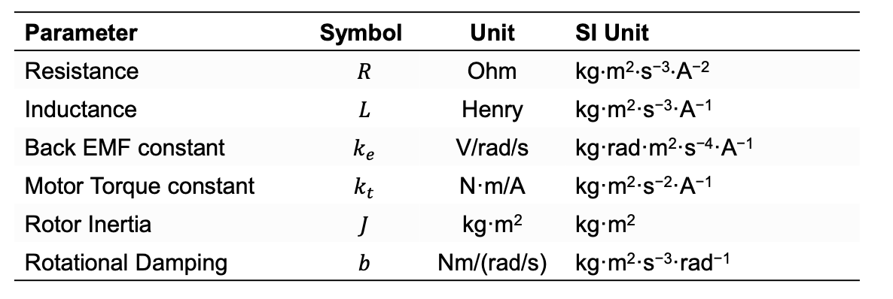
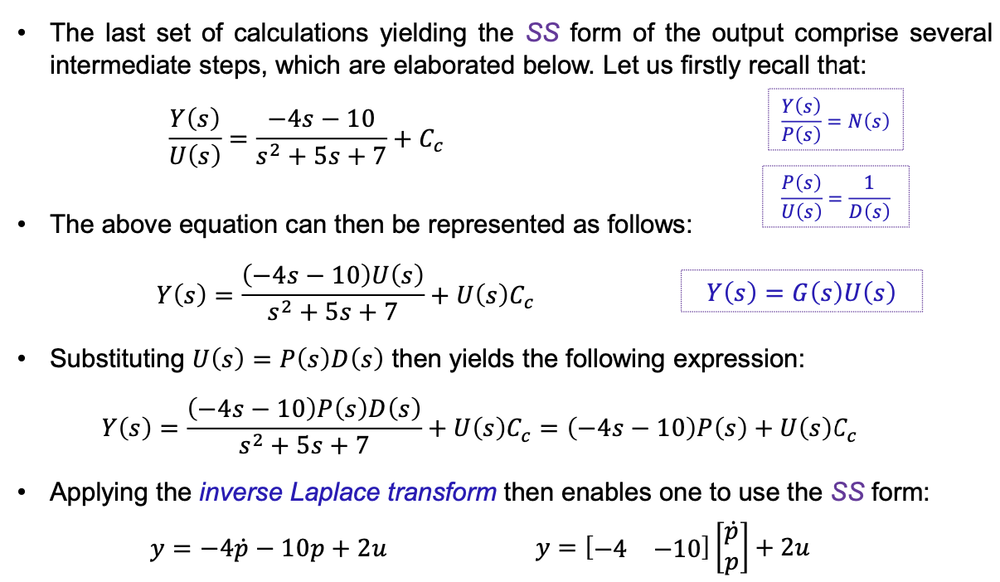
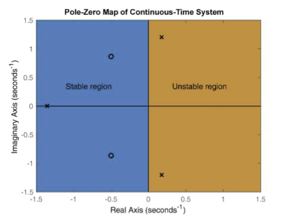

> **! hint 这个傻逼module用的mathematical notation和之前SAS那个老师用的很他妈不一样**

A dynamical system can be modelled as a function that relates inputs to outputs.

# Models of dynamic systems
A dynamical system has states, $x(t)$, and state derivatives $\dot{x}(t)$
> state 就是 time dependent variable 比如position and velocity of a pendulum. angle and angular rate of motor.

A generalised continuous form of the dynamical system equation is

> PROVIDED IN FORMULA SHEET

> Noise(internal), Disturbance(external)

## 行业黑话

# Modelling Approaches
Linear System satisfies superposition principle

It means they met these properties:

1. Homogeneity: $f(\eta \cdot A) = \eta \cdot f(A)$
2. Additivity: $f(A+B) = f(A) + f(B)$

Hence, to summarize

$$f(\eta_1 \cdot A + \eta_2 \cdot B) = \eta_1 \cdot f(A) + \eta_2 \cdot f(B)$$
## Mathematical
用dc motor当例子, 首先先找到variales, parameters and units

通过这些东西deduce他的equation出来，通过circuit analysis或者mechanical analysis啥的

$$V(t) = Ri(t) + L \frac{di(t)}{dt } + e(t)$$

$$e(t) := k_e \dot{\theta(t)}$$

考试会把那个问题用到的system的mathematical equation提供给我们

### Laplace Transform

没什么可讲的，就还是用LT去find solution of ODEs

#### Transfer Function
The transfer function $G(s)$:

$$Y(s) = G(s)U(s) + \textrm{initial value terms}(y_0^k, u_0^k)$$

但如果system是assume to be at rest prior to application of the input, 那他就是

$$Y(s) = G(s)U(s)$$

Hence, the transfer function is calculated as

$$G(s) = \frac{Y(s)}{U(s)}$$

> Roots of the numerator: system **zeros**

> Roots of denominator: system **poles**

If all the poles have **negative real parts**, the system is stable.

### State Vector

### State Space Form

Matrix Multiplication Reminder

$$\boldsymbol{\dot{x}}(t) = \boldsymbol{Ax}(t) + \boldsymbol{Bu}(t)$$
$$\boldsymbol{y}(t) = \boldsymbol{Cx}(t) + \boldsymbol{Du}(t)$$

- $\boldsymbol{x}(t)$ represents the 'state' vector
- $\boldsymbol{y}(t)$ represents the output vector
- $\boldsymbol{u}(t)$ is the input vector
- $\boldsymbol{A}$ is the state transition matrix
- $\boldsymbol{B}$ is the input matrix
- $\boldsymbol{C}$ is the output(selection) matrix
- $\boldsymbol{D}$ is the feedthrough matrix

SS of SISO example

#### Linearization
Given a non linear system $\dot{\boldsymbol{x}}(t) = f(\boldsymbol{x}(t), \boldsymbol{u}(t), t)$

Firstly choose a equilibrium point $(x_0, u_0)$ where

$$\dot{x_0} = 0 \Longleftrightarrow f(x_0, u_0) = 0$$

And then make a first order Taylor series expansions of f and g around $(x_0, u_0)$

And then introduce $\delta \boldsymbol{x} = \boldsymbol{x}-\boldsymbol{x}_0$

$$\delta \boldsymbol{\dot{x}}(t) = \boldsymbol{A}(t)\delta \boldsymbol{x}(t) + \boldsymbol{B} (t) \delta \boldsymbol{u}(t)$$

$$\delta \boldsymbol{y}(t) = \boldsymbol{C}(t) \delta \boldsymbol{x}(t) + \boldsymbol{D}(t) \delta \boldsymbol{u}(t)$$

$$A = [\frac{\partial f}{\partial \boldsymbol{x}}]_0 = \frac{\partial }{\partial \boldsymbol{x}} f(x_0, u_0)$$

etc

usually with small angle approximation, when linearisihng around 0 $\sin(\theta) \approx \theta, \cos(\theta)\approx 1$

when linearising around $\pi$, $\sin(\theta) \approx -\theta$, $\cos(\theta) \approx -1$

## TF to State Space

For type I, just inverse laplace the transfer function using zero initial condition.

----

For type II we need to substitute P(s)

----

For type III, we need to make the TF become less 傻逼, and then use type II substitution method

## Physical
就是用电脑跑simulation考试必不可能考

## Data-Driven
就是look up table, 考试也必不可能考

# Feedback Control

- **plant** is the system being controlled
- **reference** is the desired output, or system behaviour
- **feedback** is a collection of state measurements(a subset of the output)
- **error** is the difference between the desired and actual states
- **gain** multiplies the current error, and the resulting product/signal is used to control the plant in a way that minimize the subsequent error

----

- **sensors** measure the quantity that is subject to control
- **actuators** acts on the plant by providing motion
- **control law** is the mathematical equation(rules) that maps sensor signal to actuators signals
- **controller** processes the sensory feedback, and the control law, delivers the resulting input signal to the actuators.

## Full state feedback

Full state feedback(FSF) 就是干他娘的塞爆feedback, 把所有的state全都塞进去

## PID Control
PID control relies upon a weighted combination of Proportional, Integral, and Derivative terms

$$u(t) = k_p e(t) + k_D \cdot{e}(t) + k_I \int_{0}^{t}e \cdot dt$$

- $r(t)$ reference signal
- $e(t)$ error signal
- $e(t) = r(t) - y(t)$
- $k_P, k_I, k_D$ controller gains

$k_P$ the controller gain determines how **quickly** the system respond to the error, increasing $k_P$ will cause
- Rise time decreases
- Overshoot increases
- Settling time small change
- Steady-state error decreases

如果最后的output没有converge，反而在oscillate,那就要用i

$k_I$ mainly used to address the steady-state offset problem associated with P-only controllers, increasing $k_I$ wil cause
- Rise time decreases
- Overshoot increases
- Settling time increases
- Steady-state error eliminated
- Stability decreases

如果他妈的overshoot烂掉了就要用d term

$k_D$ is known as the 'damping gain' in robotics, used to supresses oscillations and overshoot, however, damping terms are **sensitive to noise**. Increasing $k_d$ will cause.
- Rise time minor change
- Overshoot decreases
- Settling time decreases
- Steady-state error minor to no effect
- Stability improves

PD control yields fast, oscillation free response, but unable to guarantee steady-state error minimisation, and may amplify high-frequency noise.

### LT Transfer Function of PID Controller
$$U(s) = k_P E(s) + k_D E(s)s + \frac{k_I E(s)}{s} = (k_P + k_D s + \frac{k_I}{s})E(s)$$

$$G(s) = \frac{U(s)}{E(s)} = k_P + k_D s + \frac{k_I}{s}$$

Example

# Linear System Analysis

Frequency-domain specification:
- **Phase Margin** relative **stability** measure
- **Gain Margin** relative **stability** measure
- **Bandwidth** response **speed** measure
- **Delay Time** response **speed** measure
- **Resonance Peak** relative **stability measure** 
- **Resonant Frequency** relative **stability measure** 
- **Cut-off Rate** response **speed** measure

Time-domain specification:
- **Delay Time** response **speed** 
- **Rise Time** response **speed** 
- **Settling Time** response **speed** 
- **Overshoot** relative **stability** 

## Pole-Zero Maps

> Remember that for a transfer function, the roots of numerator are zeros, the roots of denominator are poles

The poles and zeros are complex number that described using two variables: real part and imaginary part

Hence, can be plotted using a pole-zero map(s-plane), the y($j\omega$) axis is imaginary part, the x($\sigma$)axis is the real part.

The left half where $\sigma < 0$ is called the left half of the s-plane, The right half is called the right half of the s-plane

The zeros are symbolised by O's, the poles are denoted by cross(X)

The left half of the s-plane(LHSP) corresponds to the **stable region** 
The right half of the s-plane(RHSP) corresponds to the **unstable region** 

## Root Locus

> Locus is just a fancy word for path

> From the block diagram, we can derive $(R-CH)G = C$

$$\frac{C}{R} = \frac{G}{1 + GH}$$

> NOT PROVIDED IN THE FORMULA SHEET

$GH$ is the open-loop TF $GH = \frac{K N(s)}{D(s)}$

> $N(s) D(s)$就是Numerator和Denominator和s相关的所有term, K is the open-loop gain

Substituting this open-loop TF into the close-loop TF yields

$$\frac{C}{R} = \frac{G}{1 + \frac{KN(s)}{D(s)}} = \frac{GD(s)}{D(s) + KN(s)}$$

Where the closed-loop poles are roots of the characteristic equation:

$$D(s) + KN(s) = 0$$

Hence, the poles will be a function about K.

The open-loop zeros determine the paths shape, they will end at these zeros or go off to inifinity if there are fewer zeros than poles.

The open loop poles is equal to the the number of branches, or loci.

### Magnitude & Angle Criteria

idk what the fuck is this about

### Asymptotes

When poles and zeros of open-loop LT are unequal, the branches travel to or travel from infinity. These are **breakout** and **breakin** points. 

Asymptote are computed via two parameters:

**The asymptote angles**:

$$\theta_A = \frac{(2\mu + 1)\pi}{n-m} \textrm{ for } K>0$$
$$\theta_A = \frac{2\mu \cdot \pi}{n-m} \textrm{ for } K < 0$$

> NOT PROVIDED IN THE FORMULA SHEET

- $\mu = 0, \pm 1, \pm 2, \cdots, (n-m-1)$
- $n$ is the number of poles
- $m$ is the number of zeros

> $n-m$ is the number of unmatched pair, or the number of lines going to infinity

**Centroid**:
$$\sigma_{gp} = \frac{\sum \textrm{finite poles} - \sum \textrm{finite zeros}}{n-m}$$

> NOT PROVIDED IN THE FORMULA SHEET

The centroid is the point at which an asymptote intersects the real-axis, while the asymptote angle is the angle at which an asymptote intersects the real axis.

<++ Example on finding Close-Loop TF from Root Locus Plot?>

### Gain and Phase Margin

The gain margin is the factor by which the open-loop gain, K, can be multiplied before the system is rendered unstable(FUCKED UP)
- 就是他距离FUCK UP还能被乘以多少GAIN

$$G_M = \frac{K_{imi}}{K_{dgn}}$$

- $K_{imi}$ is the $K$ value at imaginary axis intersection
- $K_{dgn}$ is the designed $K$ vallue

The phase margin is computed by locating the point $j\omega_1$ on the imaginary axis at which

$$|GH(j\omega_1)| = 1$$

for a specific $K$ value, the following $K_{dgn}$ condition can be stated

$$|\frac{D(j\omega_1)}{N(j\omega_1)}| = K_{dgn}$$

The phase margin can then be computed by obtaining the argument of $GH(j\omega_1)$

$$\phi_M = \pi + \arg(GH(j\omega_1))$$

> $\arg$ is the angle of a complex nuymber in its polar form.

reminder of polar form

### Damping Ratio

The damping ratio is a parameter that describes how oscillations in a system decay after a disturbance.

- $\zeta < 1$ Means underdamped, the system ocillates with the amplitude gradually decreasing over time
- $\zeta = 1$ Means critically damped, the system returns to equillibrium as quickly as possible without oscillating
- $\zeta > 1$ Means overdamped, the system returns to equilibrium without oscillating but slower than in the critically damped case.

The damping ratio, $\zeta$, can be determined via the root-locus, by means of drawing a line from the origin to the pole makes with the negative real aixs at an angle $\theta$ w.r.t. the negative half of the real axis.

$$\theta = \cos^{-1}\zeta$$

### Dynamical Compensation

When system's steady-state and transient reponse 他妈的出事了, 就给system 他妈的塞爆 tandem compensation TF
- Improves system's steady-state response
- Improve system's transient response

#### Integral Compensation on Steady-State Response

Closesd-loop system's steady-state response can be improved by meanss of integral control

Hence, Integral compensation can be achieved via the TF:

$$G_{cm}(s) = \frac{k_I}{s}$$

For example conisder the following uncompensasted system

$$G_p(s) = \frac{1}{(s+2)(s+4)}$$

An integrator can be applied onto the system

$$G_{cm}(s)G_p(s) = \frac{k_I}{s} \frac{1}{(s+2)(s+4)} = \frac{k_I}{s^3 + 6s^2 + 8s}$$

This indeed improve the steady-state response, however it make the transient reponse distorted.

### PI Compensation

PI Compenation can improve the steady state respones, while leaving the transient response intact

$$G_{cm}(s) = k_P + \frac{k_I}{s}$$

Therefore for the previous example

$$G_{cm}(s) G_p(s) = \frac{k_P s + k_I}{s(s+2)(s+4)}$$

### PD Compensation

PD compensator can alter the tranient response, the derivative term can ssupress oscillations and minimise overshoot and setlling time

$$G_{cm}(s) = k_P + k_D s$$

### PID Compensation

没什么可说的

$$G_{cm}(s) = k_P + \frac{k_I}{s} + k_D s$$

## Pole Placement

The addition of poles introduce following effects:
- Moves the root locus towardss the right
- Decrease the system's relative stability
- Increase the system respones's settling time

Adding zero have following effect:
- Moves the root locus towards the left
- Increase the system's relative stability
- Decrease the system respsonses' settling time

There no significant stability change when K i increased to values >> 1, however when K is gradually decreased to 0, it will shift poles towards the origin, presumably without affecting the system's stability. 

## Bode Plot

### Decibels

The y-axis i expressed in decibels(dB) or $\frac{1}{10}$ bel. Bel iss a measure of power level (gains) ratio.

$$G = \log_{10}(\frac{P_2}{P_1}), \textrm{ and the decibel is then } G_{dB} = 10 \cdot \log_{10}(\frac{P_2}{P_1})$$

However, in many cases we're interested in ratios of variables which are squares of power, e.g. Voltage, hence

$$G_{dB} = 10 \cdot \log_10{\frac{V^2_2}{V_1^2}} = 20 \cdot \log_{10} \frac{V_2}{V_1}$$

### Convert to Bode Form

The system's TF need to convert to Bode Form

Consider the following example

$$G(s) = 25 \frac{s+3}{s^2 + 6s + 8} = \frac{25 \cdot 3}{8} \cdot \frac{\frac{s}{3} + 1 }{(\frac{s}{2}  +1) ( \frac{s}{4} + 1)}$$

这个样子前面的那个constant就叫Bode gain

One can then readily observe that this sssystem posssessses the poless at 2 rad/sec and 4 rad/sec a zero at 3 rad/sec

### Asymptotic Approximation for Bode Plot
RULES:
1. The Bode Gain correspondss to the constant region of the Bode plot
2. A pole corresponds to a point at which the slope decrease by 20 dB/decade(TF decrease by 20dB in magnitude for every factor of 10 change in frequency)
3. A zero corresponds to a point at which the slope increase by 20 db/decade

The pole location are **break points** on the Bode Plot

Bandwidth determine the maximum input signal frequency that a system can track without phase shift, and is the frequency at which the closed-loop magnitude resonse is equal to $-3$ dB

## Eigenvalues

Eigenvalue和Matrix Algebra太阴间了，这又不是考数学的，感觉不会考。

Eigenvalues positive -> System unstable, state continuous increases with time

Eigenvalues negative -> System stable, state continuous decays over time

# Signal Processing and Filter

$f_L$ and $f_H$ denote lower and upper, cut-off frequencies

For bandpass filter, that region is called pass band;

For band-stop filter, that region is called stop band.

Ideal filter have constant gain in pass band and zero in stop band

## Real Filter

## Analog Filter
Analog Filter Benefits:
- Low cost
- Higher Bandwidth
- Ease of implementation; no microprocessors
- No quantisation noise

Analog Filter Drawbacks:
- Take Space
- Difficult to modify once implemented
- Performance is susceptible to physical phenomena
- They're not ideal for low frequency operation

Passive filters obviated the need for external power, they use solely passive electrical components such as resistors capacitors inductors

Active filter require external powwer as they rely on op-amps

## Butterworth Filter

Butterworth filter have both passive and active element, and the FORMULA are provided in the SHEET

in BPF, $\omega_b$ is the bandwidth frequency, and $\omega_c$ is the center frequency

in others, $\omega_c$ is the cutoff frequency.

## Quality Factor and Damping ratio

$$Q = \frac{1}{2\zeta}$$

$Q > 0.5$ means underdamped, the response is fast and oscillatory
$Q < 0.5$ means overdamped, the response is slow and oscillation free
$Q = 0.5$ means critically damped, the response is fast, overshoot-free, and oscillation free

## Digital Filter

Finite Impulse Response (FIR): are non-recursive as they depend solely on input values and can therefore be expressed as follows

$$y[k] = \sum_{i=0}^{N} a_i x[k-i]$$

- $a_i \in \R$ filter coefficients
- $N$ is the number of filter coefficients

Infinite Impulse Response (IIR): are recursive as they depend on both input and output values

$$y[k] = \sum_{i=0}^{N}a_i x[k-i] + \sum_{i=1}^{M} b_iy[k-i]$$

- $b_i \in \R$ ilter coefficients

### Bilinear Transformation

Basically replace s with z domain using Tustin's method

$$s \to \frac{\ln (z) }{T} \approx \frac{2}{T} (\frac{z-1}{z+1})$$

> PROVIDED IN THE FORMULA SHEET 

# Model Based Trajectory Tracking Control

The problem of following time-varying references (trajectories) is termed trajectory tracking
> The simpler problem of follwoing steps is termed set-point regulation

Hence, if the positional step input denoted as $\theta_d$, the trajectory would be represented as $\theta_d(t)$

PD for trajectory will be

$$u = k_P(\theta_d - \theta) + k_D(\dot{\theta_d} - \dot{\theta})$$

## DoF

Degree of Freedom, position and orientation, hence max DoF is 6

## Joint Space and Cartesian Space

没啥可说的，一般用的都是Cartesian Space

## FK
就是3d动画里面的FK骨骼

FK involves a relationship between an arbitrary function of a joint angle vector, $\boldsymbol{q} \in \R^n$, and a vector of cartesian positions and orientations $\boldsymbol{c} \in \R^m$
> n is the number of joints(DoFs), m is the number of cartesian space coordinates, hence maximum is 6

$$\boldsymbol{c} = f(\boldsymbol{q})$$

Since our main focus is motion control, we will mainly be concerned with velocity(differential) based relationships between Cartesian and joint space coordinates.

$$\dot{\boldsymbol{c}} = \boldsymbol{J \dot{q}}$$

- $\boldsymbol{J} \in \R^{m \times n}$ denotes the Jacobian matrix

> Jacobian matrix is a mathematical tool that relates the velocities in the joint space (the rate of change of joint angles) to the velocities in the task space (the rate of change of the position and orientation of the end effector).

## IK

$$\boldsymbol{\dot{q}} = \boldsymbol{J^{-1} \dot{c}}$$

If $m \neq n$, and $\boldsymbol{J}$ is a non-square matrix, then it is non-invertible

- If $m > n$ the system does not possess enough DoFs to realise an arbitrary Cartesian configuration, the system is **kinematically insufficient** 

- If $m < n$ the system is kinematically redundant

If $m \neq n$ then a pseudoinverse $\boldsymbol{J}^+$ is required, $\dot{\boldsymbol{q}} = \boldsymbol{J^+ \dot{c}}$

如果 $m < n$ 就可以用一个 Moore-Penrose pseudoinverse, 直接这样说就行了。

## Model Based Control

Remember to mention filtering to minimise noise and disturbance
