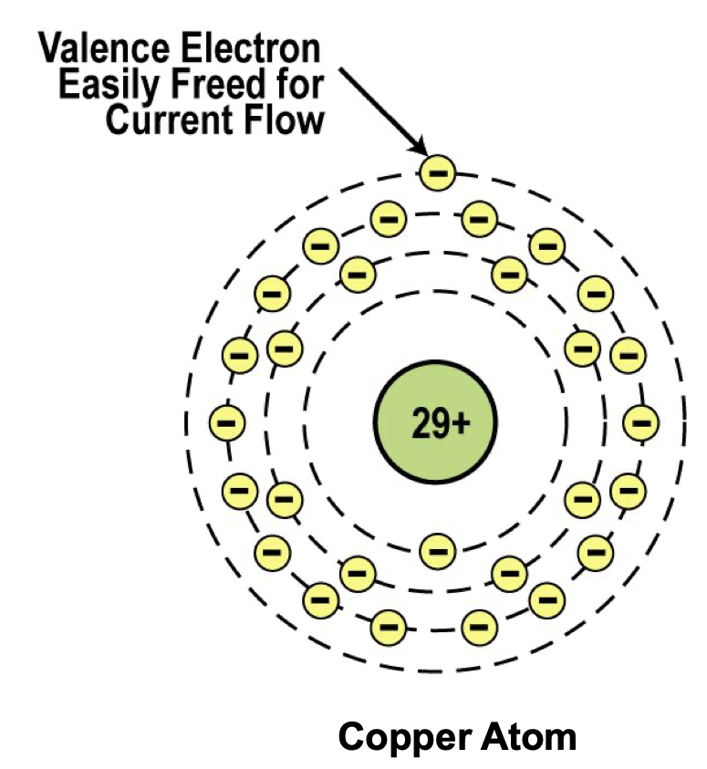
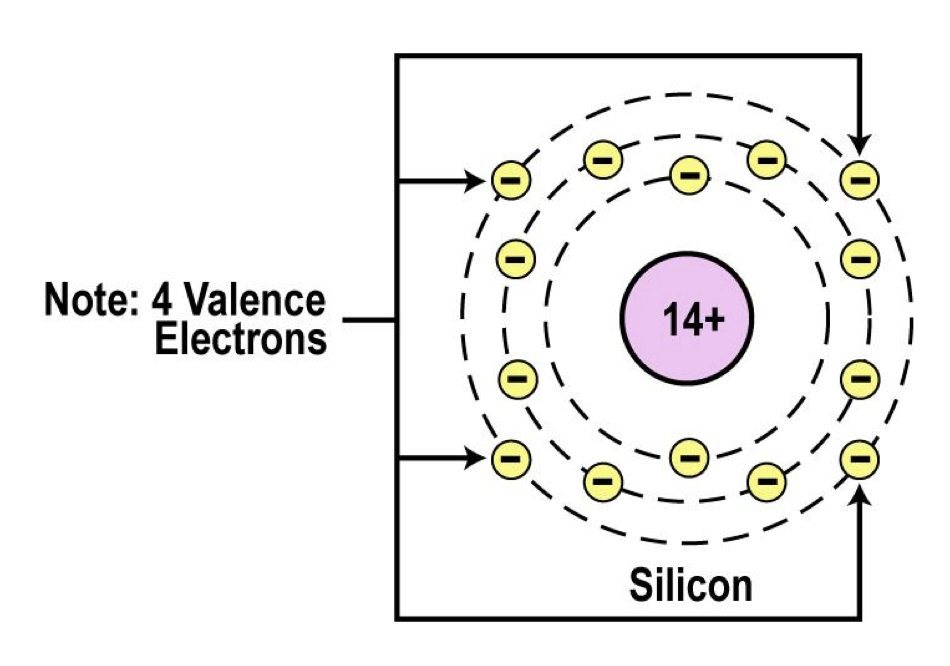
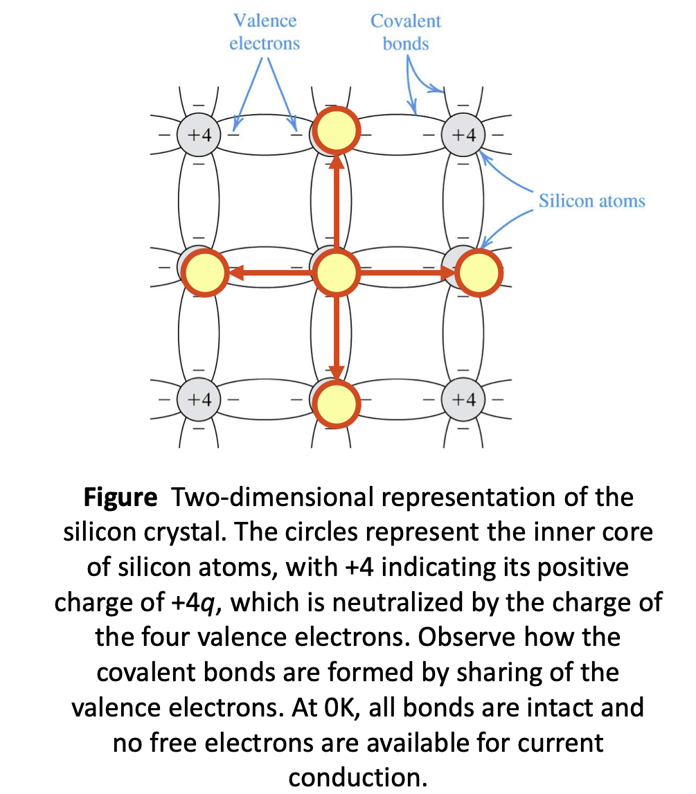
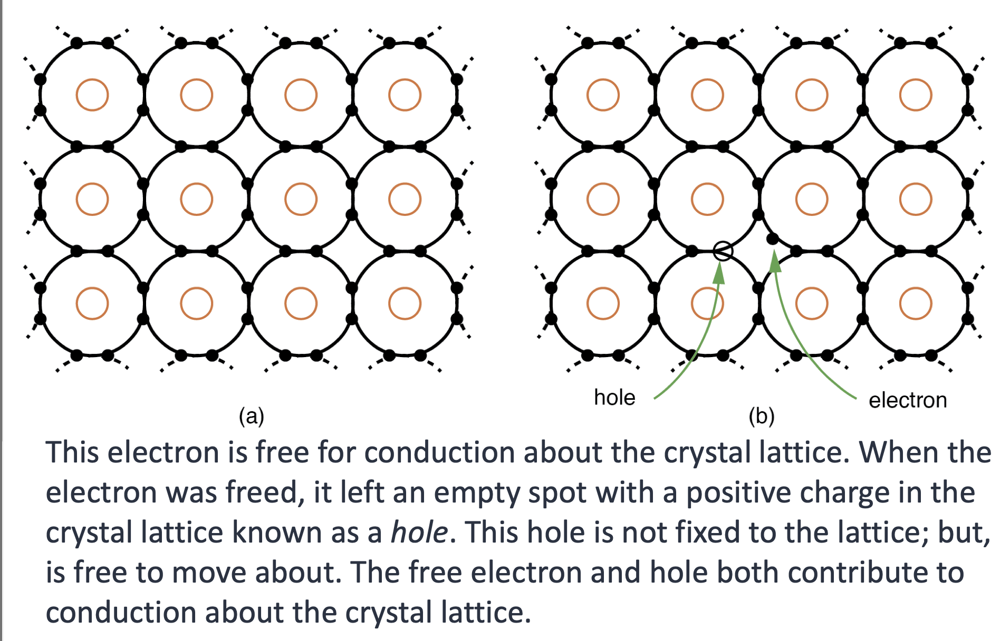
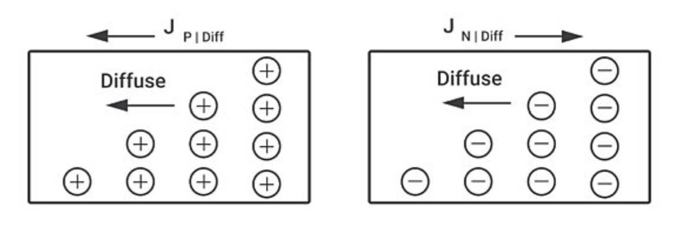
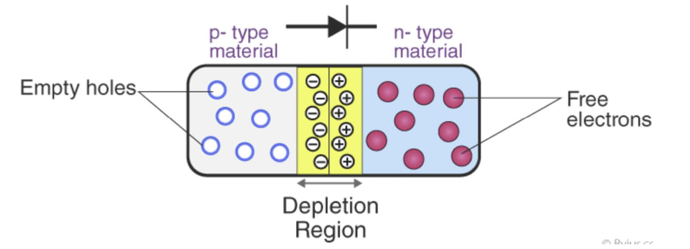
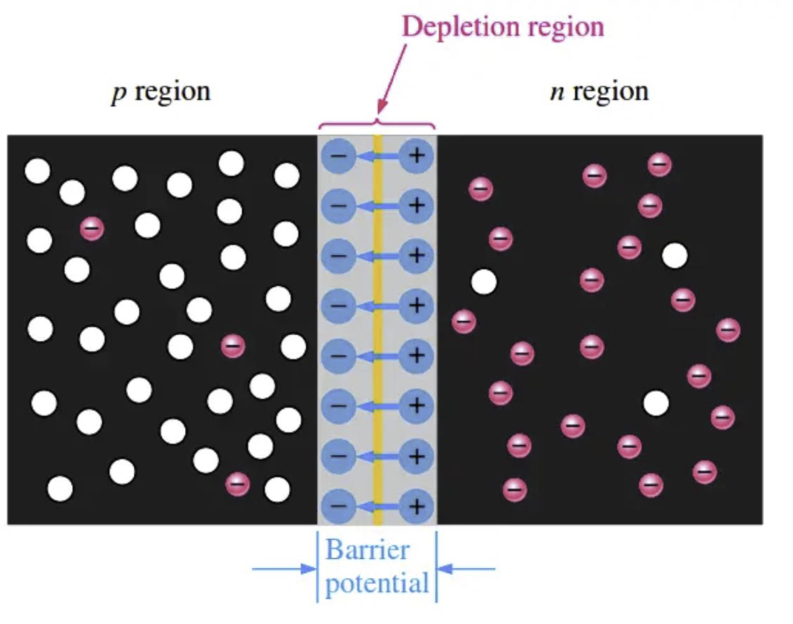
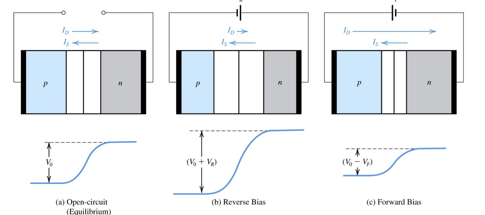

# Electronic Materials
The goal of the electronic materials is to generate and control the flow of an electrical current
- Conductors: Low Resistance -> Allow electric current flow
- Insulators: High Resistance -> Supresses electrical current flow
- Semiconductors: Can allow or suppress electrical current flow

## Conductors
Good conductors have low resistance, so the electron can flow through them with ease.

Good example:
- Copper, silver, gold, aluminum, nickel
- Brass, Steel
- Good conductor can also be liquid, e.g. Salt water.

### Conductor Atomic Structure

The atomic structure of good conductors usually includes **only one** electron in their outer shell.
- It is called a valence electron
- It is easily striped from the atom, producing current flow

## Insulators
Insulators have high resistance so current does not flow in them.

Good Example：：
- Glass, ceramic, plastics, wood

Most insulators are compounds of several elements

The atoms are tightly bound to one another so electrons are difficult to strip away for current flow

## Semiconductors
Semiconductors are materials that essentially can be conditioned to act as good conductors or good insulators, or anything in between.

Common elements: carbon, silicon, germanium

Silicon is the best and most widely used semiconductor

### Semiconductor Valence Orbit

The main characterisitc of a semiconductor element is that it has four electrons in its outer or valence orbit.

**Valence Electron** is a electron that participates in the formation of chemical bonds
- Atom with one or two valence electrons more than a closed shell are highly reactive becasue the extra electrons are easily removed to form positive ions.

**Covalent Bond** is a form of chemical bond in which two atoms share a pair of atoms.
- It is a stable balance of attractive and repulsive forces between atoms whne they share electrons.

### Crystal Lattice Structure
For silicon atoms:
- Four valence electrons
- Requires four more to complete outermost shell
- Each apir of shared forms a covalent bond
- The atoms form a lattice structure

### Semiconductor can be insulator
If the material is pure semiconductor material like silicon, the crystal lattice structure forms an excellent insulator since all the atoms are bound to one another and are not free for current flow

Good insulating semiconductor material is referred to as intrinsic.

Since the outer valence electrons of each atom are tightly boiund together with one another, the electron are difficult to dislodge for the current flow. Silicon in this form is a great insulator

Semiconductor material is often used as an insulator

### Thermal Generation Creating Current Flow
Silicon at low temperature, all the covalent bond becomes intact. No electrons are available for conduction. **Conductivity is 0**.

Silicon at room temperature, some covalent bonds - break, freeing elements and creating hole, due to thermal energy.

Some electrons will wander from the adjacent atoms, becoming available for induction.

Conductivity is greater than 0

> Basically the process of freeing electrons, creating holes and filling them facilitates current flow

However, 我们并不会把 thermal generation当作effect meaningful current conduction

### Dopipng
To make the semiconductor conduct electricity, other atoms called impurities must be added.

"Impurities" are different elements.

This process is called doping

**P-type semiconductor**:
- Has a shortage of electrons with vacancies called holes. Increase the concentration of holes, one example is boron, which is an acceptor

**n-type semiconductor**
- Has extra electrons. To increase the concentration of free electrons, one example is phosphorus, which is a donor.

The heavier the doping, the grater the conductivity or lower the resistance.

By controlling the doping of silicon, the semiconductor material can be made as conductive as desired.

## Semiconductor Conductivity
Diffusion current the movement caused by variation in the carrier concentration.

Drift current is the movement caused by electric field.

Drift and Diffusion are responsible for generating current in semiconductors and the overall current density is the sum of the drift and diffusion currents.

### Drift Current
Drift Current arises from the movement of carriers in response to an applied electric field.

When an electric field is applied, these carriers respond by moving: holes(positive carriers) move in the direction of the electric field, and electrons(negative carriers) move in the opposite direction.

The movement creates what is known as the drift current.

$$I_p = Aqp\mu_p E$$
- $I_p$ is the current flow attributed to holes.
- $A$ is the cross sectional area of silicon
- $q$ is the magnitude of the electron charge
- $p$ is the concentration of holes
- $\mu_p$ is the hole mobility
- $E$ is the electric field

The current density is $J_p$
$$J_p = \frac{I_p}{A} = qp\mu_p E$$

The drift current follows Ohm's law.

### Diffusion Current
Carrier Diffusion is the flow of charge carriers from area of high concentration to low concentration
- It requires non-uniform distribution of carriers.

Diffusion current is the curent flow that result from diffusion

This occurs when a semiconductor is doped non-uniformly then there is a non-uniform distribution of carriers or a concentration gradient.

The repulsive force will drive the diffusion of carriers leading  to a change in concentrations and eventually a uniform distribution.

The current moves in the same direction as the movement of holes and opposite to that of electrons.

Hole diffusion current density:
$$J_p = -qD_p \frac{dp(x)}{dx}$$
- $J_p$ is the current flow density attributed to holes
- $q$ is magnitude of the electron charge
- $D_p$ is diffusion constant of holes, $12 \textrm{cm}^2/s$ for silicon.
- $p(x)$ is the hole concentration at point x
- $\frac{dp }{dx}$ is the gradient of hole concentration

Electron diffusion current density:
$$J_n = -qD_n \frac{dn(x)}{dx}$$
- $J_n$ is the current flow density attributed to free electrons
- $D_n$ is diffusion constant of electrons, $35 \textrm{cm}^2/s$ for silicon.
- $n(x)$ is the free electron concentration at point x
- $\frac{dn }{dx}$ is the gradient of free electron concentration

# PN Junction
A PN junction is defined as an interface between two types of semiconductor materials (p and n type semiconductor) inside a crystal of semiconductor.

The positive\(p\) side contains an excess of holes, while the negative(n) side contains an excess of electrons in the outer shells of atoms within the semiconductor

The pn junction is created by the method of doping.

## Depletion Region
The Depletion Region or Depletion Layer is a region in a PN junction diode where no mobile charge carriers are present.

The free electrons in the n region are randomly drifting in all directions. At the instant of the pn junction formation, the free electrons near the junction in the n region begin to diffuse across the junction into the p region where they combine with holes near the junction.

In the depletion region there are many positive charge and many negative charges on opposite sides of the pn junction. The force between the opposite charges form an electric field.

### Barrier Potential

This electric field is a barrier to the free electrons in the region, energy must be expended to move an electron through the electric field.

**EXTERNAL ENERGY MUST BE APPLIED TO GET ELECTRONS MOVE ACROSS THE BARRIER**

The potential difference of the electric field across the depletion region is the amount of voltage required to move electrons through the electric field.

This potential difference is called the barrier potential and is expressed in volts.

This is approximately 0.7V for silicon.

### Built-in Voltage

PN-junction built-in voltage $V_0$ is the equilibrium value of barrier voltage.
$$V_0 = V_T \ln(\frac{N_aN_d }{n^2_i})$$
- $V_0$ is the barrier voltage
- $V_T$ is the thermal voltage
- $N_A$ is the acceptor doping concentration
- $N_D$ is the donor doping concentration
- $n_i$ is the concentration of free electrons in intrinsic semiconductor

Generally the builtin voltage in a silicon at room temperature takes on a vlue between 0.6 and 0.9 V

This voltage is applied across depletion region, not terminals of the pn junction. Hence, power cannot be drawn from $V_0$

### Drift Currents
In addition to majority-carrier diffusion current $I_D$, a component of current due to minority carrier drift exists $I_S$

Some of the thermally generated holes in the p-type and n-type materials move toward and reach the edge of the depletion region.

They experience the electric field in the depletion region and are swept across it. i.e. This electric field can exert a force on the minority carriers, causing them to accelerate and "be swept across" the depletion region to the other side.

### Qualititative Description of Junction Operation

Open circuits: where a barrier voltage $V_0$ exists.
- No voltage applied
- Voltage differential across depletion zone is $V_0$
- $ID=IS$

Reverse Bias: where a dc voltage $V_R$ is applied
- Negative voltage applied
- Voltage differential across depletion zone is $V_0 + V_R$
- $ID<IS$
- The externally applied voltage adds to the barrier voltage
    - Increase effective barrier
- Reduce rate of diffusion, reducing $I_D$
- The drift current $I_S$ is minimal current flowsi n reverse-bias case

Forward Bias: where a dc voltage $V_F$ is applied
- Positive Voltage Applied
- Voltage differential across depletion zone is $V_0-V_F$
- $ID>IS$
- The externally applied voltage subtracts from the barrier voltage 
    - decrease effective barrier
- This increase rate of diffusion, increasing $I_D$
- The drift current $I_S$ is significant current flows in forward-bias case

