# Diodes
A diode is a component that let current flow in one direction and blocks it from flowing in the other direciton.

It has two pins; anode(positive) and cathode(negative).

Current flow from anode to cathode, but not the other direction.
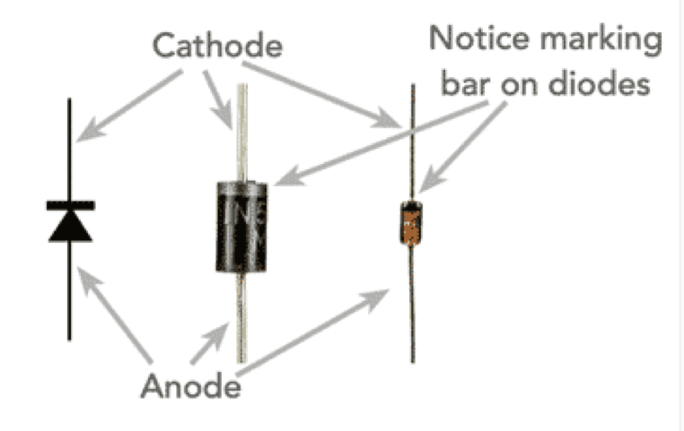

Reverse-biased means if there is a negaitve voltage being applied to the diode, theres no current flow and the diode acts as an open circuit.
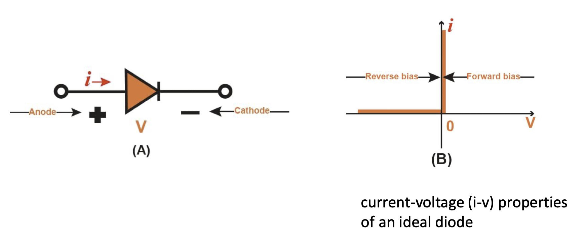

An ideal diode that is reverse-biased is said to be cut off or just off.

When theres a positive current being applied to the ideal diode, there is zero voltage drop across the diode and it act as a short circuit.

The forward-biased operation is known to be turned on or just on.

## Diodes application
### Rectifier Circuit
Rectifier is an electronic device that converts an AC into a DC by using one or more PN junction diodes.
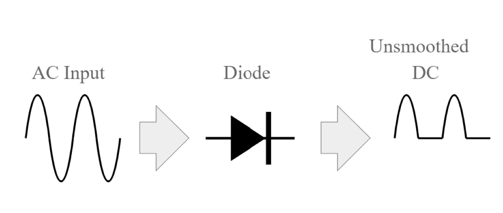

因为负的过不来

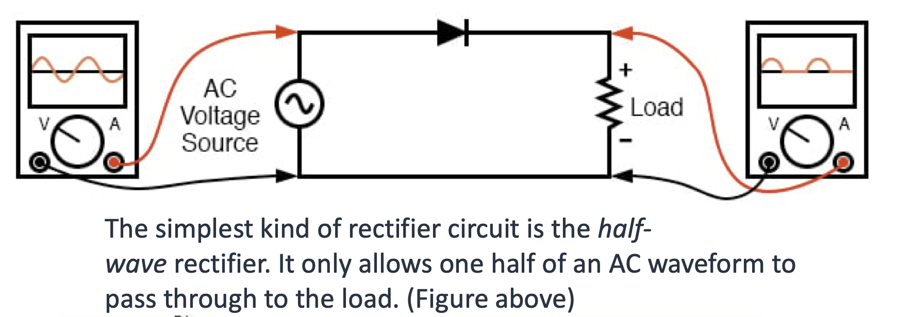

There can be a diode bridge rectifier, where four diodes are arranged in "series pair" with only two diodes conducting current during each half cycle

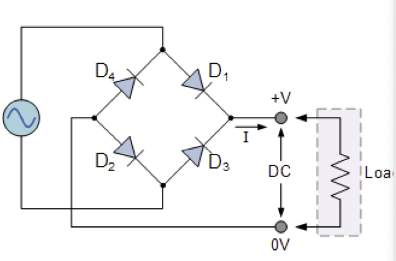

这个样子正负两个half cycle都过得来了

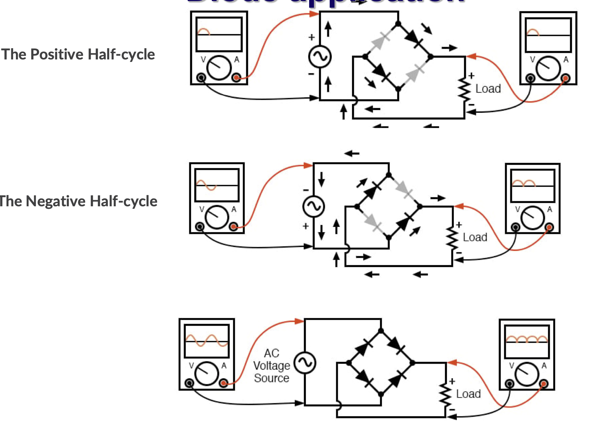

再加一个smooth capacitor就牛逼了

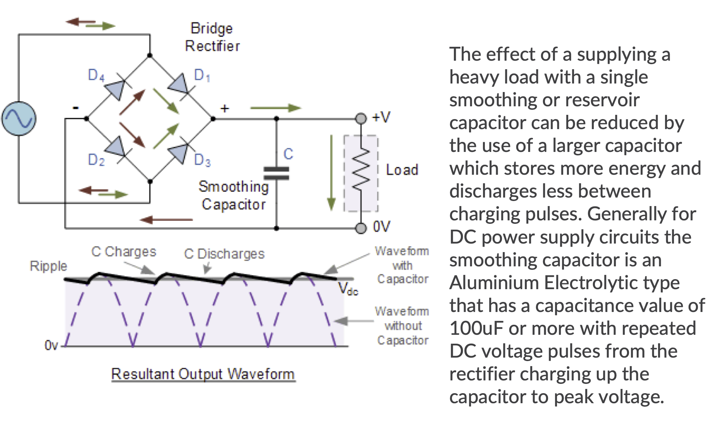

### Diode Logic Gateso
他写的Example是一坨狗屎，看这个ytb视频完事了

[Youtube 牛逼视频](https://www.youtube.com/watch?app=desktop&v=9lqwSaIDm2g)

## Practical Diode Characteristics
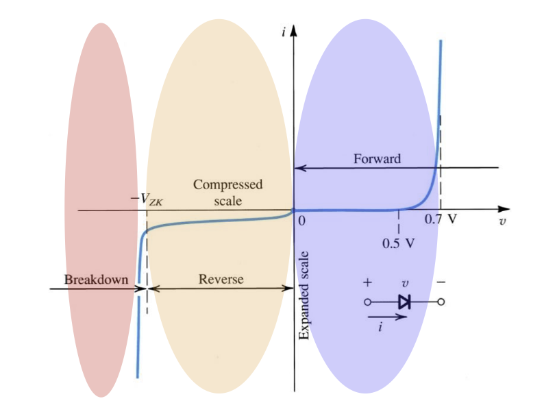

### Forward Bias Region

The forward-bias region of operation is entered when $v>0$

$$i = I_S(e^{\frac{v }{V_T}}-1)$$
- $I_S$ is the constant for diode at given temperature

$$V_T = \frac{kT }{q} = 25.8mV$$
- $V_T$ is the thermal voltage
- $k$ is the Boltzmann's constant $8.62 \times 10^{-5} eV/K$
- $q$ is the magnitude of electron charge $1.6 \times 10^{-19}C$

For large v value, i have a simplified equation
$$i = I_S e^{\frac{v }{V_T}}$$

And this equation can be reversed, for finding voltage
$$v = V_T\ln(\frac{i }{I_S})$$

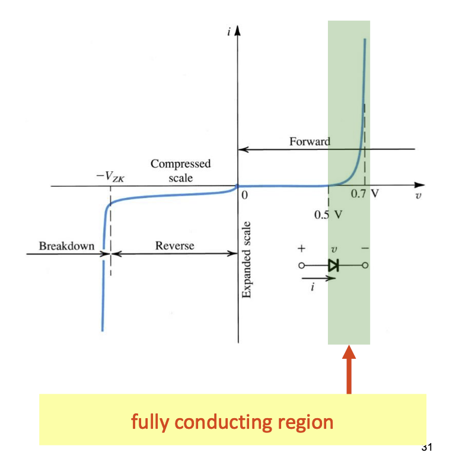

The fully conducting region is the region where $R_{diode}$ is approimately equal to 0.
- between 0.6 and 0.8V

Cut in voltage is the voltage where minimal current flows.
- around 0.5V

### Temperature Dependence
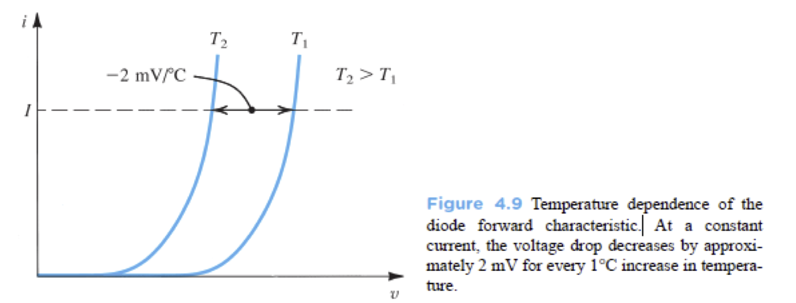

The voltage drop across the diode decreases by approimately $2mV$ every $1^\circ C$ increase in temperature.

### Reverse Bias Region
The reverse bias region of operation is entered when $v < 0$

$$i = -I_s e^{- \frac{|v| }{V^T}}$$

Because when v is larger, the exponential component can approx to 0, hence I-V relationship, for negative voltages with $|v| > V_T(25mV)$ is approimately to
$$i = -I_S$$

A large part of this reverse current is attributed to leakage effects.

$I_s$ double for every $5^\circ C$ rise in temperature.

### Breakdown Region
The breakdown region of operation is entered when $v < V_{ZK}$

## Modelling the Diode Forward Characteristics
We will discuss simplified diode model for circuit analyses
### Exponential Model
Most Accurate, Most Likely to Get Fucked Up.

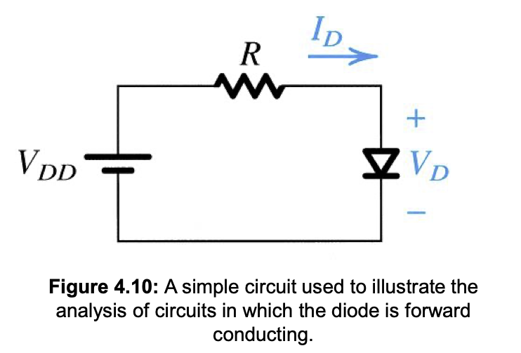

$$I_D = \frac{V_{DD} - V_D }{R}$$

Solve for $I_D$ for $V_DD = 5V, R = 1k\Omega, I_D = 1mA @0.7V$

**Graphical Method**
Plot the relationship on a single graph, and find the interaction of the two

---

<++>

我先不学了因为我发现cw1根本和这个没关系
