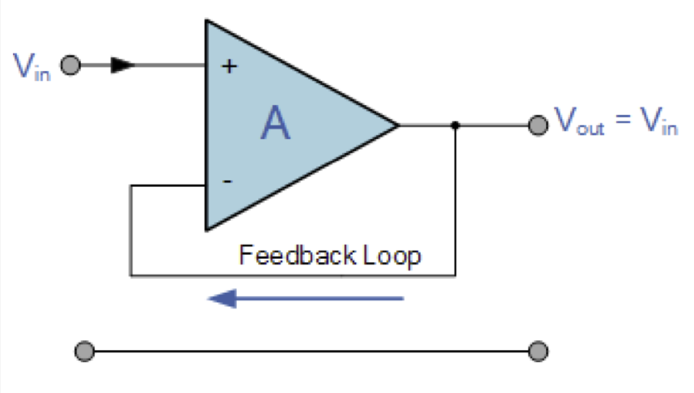
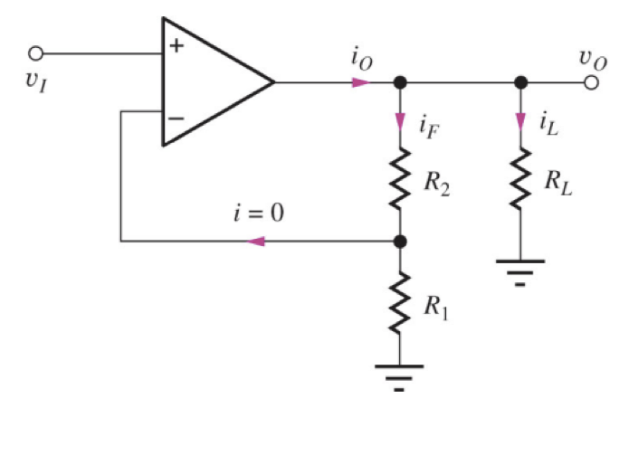

# Operational Amplifier

An operational amplifier is an integrated circuit that can amplify weak electric signals.

It has two input pins and one output pin.

Its basic role is to amplify and output the voltage difference between the two input pins.

Some of its application:
- Amplification of an input signal
- Elimination of noise from input signal

## Equivalent Circuit of an Ideal Operational Amplifier
An Op-Amp is basically a three-terminal device which consists of two high impedance inputs. 

One of the inputs is called the Inverting Input, marked with a negative sign. And another input, Non-Inverting Input, marked with a positive sign.

The third terminal which can both sink and source either a voltage or current is called operational amplifier output port.

## Single and Dual Supply Op Amp

The resulting output signal is the AC waveform with the waveform clipped at the negative portion.

The AC signal never swing negative at the output, because the power supply of the op amp is positive voltage fed into V+ and V- connected to ground.

The resulting output can swing positive all the way down to negative, capturing the entire ac signal cycle.

## Op-Amp Parameter and Idealised Characteristic
Open Loop Gain ($A_{VO}$)
- Ideal: Infinite 
- Practical: 20,000 to 200,000.
- Open loop gain is the gain of op-amp without positive or negative feedback.
- The main function of an op-amp is to amplify the input signal, and more open loop gain it has the better.

---
Input Impedance($Z_{IN}$)
- Ideal: Infinite
- Practical: Input leakage currents from a few pico-amps to few mili-amps
- Input impedance is the ratio of input voltage to input current and is assumed to be infinite to prevent any current flowing from the source supply into the amplifier input circutry $I_{IN} = 0$

---
Output Impedance($Z_{OUT}$)
- Ideal: 0
- Practical: $100\dots 20k\Omega$
- The output is assumed to be zero acting as a perfect internal voltage source with no interal resistance so that it can supply as much current as necessary to the load.
- This internal resistance is effectively in series with the load thereby reducing the output voltage available to the load.

---
Bandwidth($BW$)
- Ideal: Infinite
- An ideal op-amp has infinite frequency response and can amplify any frequency signal from DC to highest AC frequencies.
- Practically, the bandwidth is limited by the Gain-Bandwidth product(GB), which is equal to the frequency where the amplifier gain become unity.

> Bandwidth in electronic system refers to the range of frequencies over which the system can transmit signals or data. Usually measured in Hz.

---
Offset Voltage($V_{IO}$)
- Ideal: 0
- The amplifier output will be zero when the voltage difference between the inverting and non-inverting input is zero, the same, or when both is grounded. Real op-amps have some amount of output offset voltages.

---

In summary, because input resistance is infinite, so no current flows into either input terminal. And the differential input offset voltage is zero.

## Open-loop and Close-loop Gain of Op-Amp

The open-loop gain of an op-amp is the amplification factor provided by the op-amp when no feedback is applied to the system. It is the intrinsic gain of the op-amp itself, which is typically very high, often exceeding 100,000 or more. This high gain is because the op-amp is designed to amplify the difference in voltage between its inverting (-) and non-inverting (+) inputs.

Usually denoted by $A_{OL}$

The closed-loop gain of an op-amp is the amplification factor provided by the op-amp when feedback is applied. Feedback is the process of routing a portion of the output signal back to the input. In closed-loop configurations, the op-amp's intrinsic high gain is controlled and set to a desired value by using feedback resistors. This gain is determined by the feedback network (usually a series of resistors) and is typically much lower than the open-loop gain.

Usually denoted by $A_{CL}$

## Open-loop and Close-loop Gain of Op-Amp

The open-loop gain of an op-amp is the amplification factor provided by the op-amp when no feedback is applied to the system. It is the intrinsic gain of the op-amp itself, which is typically very high, often exceeding 100,000 or more. This high gain is because the op-amp is designed to amplify the difference in voltage between its inverting (-) and non-inverting (+) inputs.

Usually denoted by $A_{OL}$

The closed-loop gain of an op-amp is the amplification factor provided by the op-amp when feedback is applied. Feedback is the process of routing a portion of the output signal back to the input. In closed-loop configurations, the op-amp's intrinsic high gain is controlled and set to a desired value by using feedback resistors. This gain is determined by the feedback network (usually a series of resistors) and is typically much lower than the open-loop gain.

Usually denoted by $A_{CL}$

## Op-Amp Configuration

### Inverting Operational Amplifier
[真正牛逼的教学](https://www.youtube.com/watch?v=c3u9RRIVkok)

Remember the Characteristic of the op-amp
- No current flows into the Input Terminals
- The Differential Input Voltage is Zero, $V_1 = V_2 = 0$

Hence,
$$I_{in} = I_f + 0, I_{in} = I_f$$

Hence

$$\frac{V_{in} - V_2 }{R_{in} } = \frac{V_2 - V_{out}}{R_f}$$

And because $V_1 = V_2 = 0$

Hence
$$\frac{R_f}{R_{in} = \frac{0 - V_{out }}{V_{in} - 0}}$$

Hence the closed loop gain $A_v$ is given as
$$\frac{V_{out} }{V_{in}} = -\frac{R_f }{R_{in}}$$
and
$$V_{out} = - \frac{R_f }{R_{in}} \times V_{in}$$

### Non-Inverting Op-Amp

Based on the Characteristic and KCL
$$I_f + 0 = I_i$$

Based on no differential voltage drop, hence $V_{in} = V_1$

$$\frac{V_{out} - V_{in}}{R_F} = \frac{V_{in} - 0 }{R_2}$$

Hence, the voltage gain $A_V$ is equal to
$$A_V = \frac{V_{out} }{V_{in}} = \frac{R_2 + R_F }{R_2} = 1+ \frac{R_F }{R_2}$$

### Voltage Follower

The output is directly connected to the feedback.

Gain is 1.

Idk why this shit exist.

### The Summing Amplifier

$I_F = I_1 + I_2 + I_3 = - [\frac{V_1 }{R_{in}} + \frac{V_2 }{R_{in}} + \frac{V_3 }{R_{in}}]$

Because the inverting op-amp's equation $V_{out} = - \frac{R_f }{R_{in}} \times V_{in}$

Hence

$$- [\frac{V_1 }{R_{in}} + \frac{V_2 }{R_{in}} + \frac{V_3 }{R_{in}}] = \frac{V_{out} }{R_F}$$

Hence

$$-V_{out} = [\frac{R_f }{R_{in}} V_1 + \frac{R_f }{R_{in}}V_2 + \frac{R_f }{R_{in}}V_3]$$

### Non-Inverting Summing

For the non-inverting op-amp part of the circuit, its the same relationship
$$V_{Out} = [1 + \frac{R_A }{R_B }]V^+$$

And for the summing part, because of KCL
$$I_1 + I_2 = \frac{V_1 - V^+ }{R_1 } + \frac{V_2 - V^+}{R_2} = 0$$
$$\frac{V_1 }{R_1 } - \frac{V^+}{R_1} + \frac{V_2 }{R_2 } - \frac{V^+ }{R_2} = 0$$

And hence
$$\frac{V_1 }{R_1 } + \frac{V_2 }{R_1 }= V^+ \frac{1 }{R_{total}}$$
So
$$V^+ = R_{total}(\frac{V_1 }{R_1 } + \frac{V_2 }{R_2 })$$

Hence the final relationship between $V_{OUT}$ and $V_1, V_2$ is 
$$[1 + \frac{R_A }{R_B}] R_{total}(\frac{V_1 }{R_1 } + \frac{V_2 }{R_2 })$$

### Difference Amplifier

$$I_1 = \frac{V_1 - V_a }{R_1}$$
$$I_2 = \frac{V_2 - V_b}{R_2 }$$
$$I_f = \frac{V_a - V_{OUT }}{R_3}$$

Because $V_a = V_b$

Also
$$V_b=  V_2 \frac{R_4 }{R_2 +R_4}$$

If $V_2 = 0$, then
$$V_{out} = - \frac{V_1 }{\frac{R_3 }{R_1}}$$

If $V_1 = 0$, then
$$V_out = V_2 \frac{R_4}{R_2 + R_4} \frac{R_1 + R_3 }{R_1}$$

Hence,
$$V_{OUT} = - V_1 \frac{R_3 }{R_1 } + V_2 \frac{R_4 }{R_2 + R_4 } \frac{R_1 + R_3 }{R_1}$$

### High Input Impedance Instrumentation Amplifier

### The Integrator Amplifier

The output is a respond to changes in the input voltage. It is proportional to the integral of the input voltage.

$$V_{OUT} = - \frac{1 }{j\omega RC }V_{in}$$
- $\omega = 2\pi f$
- The output voltage $V_{out}$ is a constant $\frac{1 }{RC}$ times the integral of the input voltage $V_{in}$ with respect to time.

Thus, the circuit has the transfer function of an inverting integrator with the gain constant of $- \frac{1 }{RC}$.

The minus sign indicates a 180 phase shift because the input signal is connected directly to the inverting input terminal of the operational amplifier.

### The Differentiator Amplifier

The opamp circuit produces a voltage output which is directly proportional to the input voltage's rate of change with respect to time.

$$V_{out} = -R_F C \frac{dV_{IN }}{dt}$$

### The Op-amp Building Blocks Bridge Circuit

## Op-amp Comparator

<++>

## Practical Op-amp 

### DC-Imperfection

**Input Bias Current**:
- All Op-Amp draw a small constant DC bias current at their inputs, typical value for a 741 is around $100nA$. This is only notable when very high impedance sources are used. In such cases, an alternative op-amp with lower bias current should be used.
- Bias current: $I_B = \frac{I_B + I_{B-} }{2}$
- Offset Current: $I_{off} = I_{B+}- I_{B-}$
- The op-amp datasheet usually specifies the input bias current as the average value of the input bias currents.

---
**Input Offset Voltage**

---
**Output Voltage and Current Limits**

Practical opamps have limited output voltage and current ranges.

Voltage are typically limited to several volts less than power supply span.

Currents are limited by additional circuits(to limit power dissipation or protect against accidental short circuits)

Current limit is often specified as minimum load resistance that the amplifier can drive with a given voltage swing.

For example $|i_O| \leq \frac{10V }{50k\Omega} = 2mA$

$$i_o = i_L + i_F = \frac{v_o }{R_L } + \frac{v_o }{R_2 + R_1 } = \frac{v_o }{R_{EQ}}$$
$$R_{EQ} = R_L||(R_2+R_1)$$

for inverting opamp
$$R_{EQ} = R_L||R_2$$

## Peak Detector Op-Amp
cw1 不用

The capacitor is used as a memory. 

When the input voltage on the non-inverting input is higher than the voltage on the inverting input that is also the voltage across the capacitor, the amplifier enters in saturation and the diode is forward and charges the capacitor.
<++>

## Negative Impedance Converter
<++>

## Op-Amp Slew Rate

Slew rate is defined as the maximum rate of change of an op-amps output voltage, and is given in unit of $V/\mu s$

Slew rate is measured by applying a large signal step, such as 1V, to the input of the op amp. And measuring the rate of change from $10\%$ to $90\%$ of the output signal's amplitude.

The slew rate can limit the performance of a circuit and it can distort the output waveform if its limit is exceeded.

Slew rate of ideal op amp should be as high as possible.

## Op-Amp Bandwidth

Bandwidth is a range of frequencies that a circuit can handle or the range of frequencies that a signal contains or occupies.

Negative feedback is used to give controleld level of gain. This allow very high gain to be traded for bandwidth

The bandwidth also should be as large as possible.
