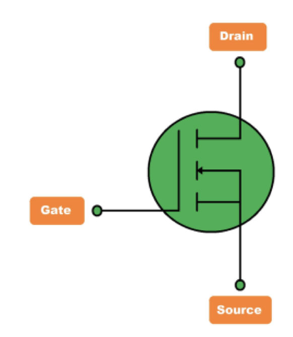

A MOSFET(Metal Oxide Semiconductor Field Effect Transistor) is a semiconductor device that is widely used for switching purpose and for amplification of electronic signals in electronic devices.

A MOSFET is a four-terminal device having source(S), gate(G), drain(D), body(B) terminals.
- The body is connected with the source, hence forming a three-terminal device

MOSFET is a voltage controlled IC, the voltage at gate terminal decides the conductivity etween drain and source.
