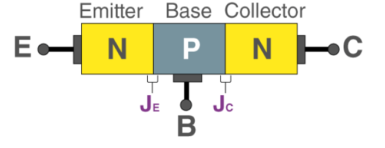

# BJT
A bipolar junction transistor is a three-terminal semiconductor device, consists of two p-n junctions. 

- It is able to amplify or magnify a signal. 
- It is a current controlled devce.

The three terminals are emitter, base and collector.

Two external voltage sources are required for biasing to achieve it

It is manufactured in two types, PNP and NPN, simply talking about whether its sandwiched between two n-type or p-type semiconductor. The difference is that NPN current flows outward the emitter, PNP current flows into the emmiter.

# tl;dr
BJT就是一个你往Collector送一些Voltage，然后再让Base到Emitter流过少量的current（差不多0.6V），然后这个傻逼东西就能帮你放大

BJT can be set in 3 different mode:
- cut-off(both junction reverse)
- **ACTIVE**(EBJ forward, CBJ reversed) 这个课只考active（可能）
    - 也就是Emitter比Base更多Voltage，Collector比Base更少Voltage
- saturation(both forward)

The arrow means emitter, the center is base, the other one is collector. 

To ensure operation in active mode, 
- the collector voltage of an npn-transistor must be kept higher than approximately 0.4V below the base voltage.
- the collector voltage must be 0.4V lower above the base voltage.
- otherwise, CBJ become forward biased and transistor enter saturation.

> Small $i,v$ means instantaneous current and voltage, the uppercase means constant current or voltage over time.

$v_{BE}$ is the input voltage, $v_{CE}$ is the output voltage

$$i_C = I_S e^{v_{BE}/V_T}$$
$$i_B = \frac{i_C}{\beta} = (\frac{I_S}{\beta})e^{v_{BE}/V_T}$$
$$i_E = i_C + i_B = \frac{i_C}{\alpha} = (\frac{I_S}{\alpha})e^{v_{BE}/V_T}$$

> For pnp bjt, replace $V_{BE}$ with $V_{EB}$

$$\beta = \frac{\alpha}{1-\alpha}, \alpha = \frac{\beta}{\beta +1}$$

$\beta$ is common-emitter current gain, and $\alpha$ is common-base current gain, usually given in the question.
- Usually $\beta$ is large, ranging from 100 to 300

$V_T$ is the thermal voltage $=\frac{kT}{q} \approx 25 mV$ at room temperature

> 无论是npn还是pnp，b和e的current箭头是同一边的

The Input goes into the Base, the output is collected through collector and the across the load resistor. The emitter is common to both base and emitter.

## Simplified Structure and Modes of Operation
Transistor consists of two pn-junctions:
- Emitter-base junction (EBJ)
- Collector-base junction (CBJ)

Operating mode depends on biasing:
- Active Mode - Used for Amplification
- Cutoff and Saturation Mode - Used for Switching

Biasing refers to the process of establishing predetermined voltages or current to control the semiconductor/BJTs.

In semiconductor, forward/reverse biasing will control its conductivity.

In terms of BJT biasing applys voltages to the EBJ or CBJ to control the transistor's operation. Which set it to Cutoff/Active/Saturation mode.

| Mode    | EBJ    | CBJ    |
|---------------- | --------------- | --------------- |
| Cutoff    | Reverse    | Reverse    |
| Active    | Forward    | Reverse    |
| Saturation   | Forward   | Forward   |

## Operation of the npn-Transistor in the Active Mode

### Diffusion Current
Forward bias on emitter-base junction will cause current to flow.
- Electrons injected from emitter to base
- Holes injected from base to emitter

This emitter current $i_E$ is current which flows across EBJ, flows out of emitter head

The minority carries - in p-type region, are electrons injected from emitter into base. In opposite direction.

$$n_p(0) = n_{p0}\ e^{V_{BE}/V_T}$$

Where the
- $n_p(x)$ is the concentration of minority carriers a poisition $x$ (where 0 represents EBJ boundary)
- $n_{p0}$ is the thermal equilibrium value of minority carrier concentration in base region
- $V_{BE}$ is the voltage applied across base-emitter junction
- $V_T$ is the thermal voltage(constant)

> Concentration of minority refers to 这个junction里面比较少的那个东西(electron/hole)的concentration rate. In this case, in a npn type BJT, the majority is electron, minority is hole.

> The movement of electrons move from high concentration(near emitter) to a region of low concentratoin(towards collector) is driven by concentration gradient and is called diffusion current

Then the electron diffusion current flow is defined as
$$I_n = A_E q D_n \frac{dn_p(x)}{dx}$$

Where the
- $A_E$ is the cross-section area of the base-emitter junction
- $q$ is the magnitude of the elctron charge
- $D_n$ is the electron diffusivity in base
- $W$ is the width of base

When the gradient is assumed to be straight line, it is
$$I_n = A_Eq D_n(\frac{-dn_p(0)}{W})$$

The current flow causes electrons injected into base to diffuse through base toward collector.

Some of diffusion electron will recombine with holes(the majority carrier in base) and then cause graident to take slightly curved shape. This can be seen in the previous graph.

### Collector Saturation Current
Most diffusing electrons will reach boundary of collector-base depletion region. Because the collector is more positive than base, these electron are swept into collector.

- Collector current $i_C$ is approximately equal to $I_n$, i.e. $i_C = I_n$

$$i_C = I_S e^{V_{BE}/V_T}$$

The saturation current would be
$$I_S = \frac{A_E q D_n n_{p0}}{W}$$

$$I_S = \frac{A_E q D_n}{W} \frac{n^2_i}{N_A}$$

- $n_i$ is intrinsic carrier density
- $N_A$ is the doping concentration of base

Hence, the magnitude of $i_C$ is independent of $v_{CB}$

### Base Current
$$i_B = \frac{i_C}{\beta}$$

$$i_B = \frac{I_S}{\beta}e^{V_{BE}/V_T}$$

The base current composed of two components:
- $i_{b1}$ due to holes injected from base region into emitter
- $i_{b2}$ due to holes that have to be supplied by external circuit to replace those recombined.

$\beta$ is the common-emitter current gain, influenced by the width of base region and relative doping of base emitter regions $N_A/N_D$
- High value of $\beta$ requires thin base, and lightly doped base / heavily doped emitter

### The Emitter Current
All current which enters transistor must leave $i_E = i_C + i_B$

This could expand to

$$i_E = \frac{\beta + 1}{\beta}i_C = \frac{\beta + 1}{\beta}(I_S e^{V_{BE}/V_T})$$

Also, the relationship between $i_C$ and $i_E$ is

$$i_C = ai_E$$

$$\alpha = \frac{\beta}{\beta + 1}$$

$$\beta = \frac{\alpha}{1-\alpha}$$

$$i_E = \frac{I_S}{\alpha} e^{V_{BE}/V_T}$$

# BJT Amplifier Design
## Common Emitter(CE) Amplifier
> The biasing arrangement is not included in this graph

- $v_{sig}$ is the signal sourse
- $R_{sig}$ is the source resistance
- $R_{in}$ is the input resistance
- $A_{VO}$ is the gain
- $R_0$ is the output resistance
- $G_v$ is the transconductance

However, this circuit can also be shown in the hybrid-pi model

where
- $R_{in} = r_\pi = \frac{\beta}{g_m}$ for the input resistance
- The output voltage is $v_0 = -(g_mv_\pi)(R_C || r_O)$
- The open-circuit voltage gain is $A_{VO} = -g_m(R_C || r_O)$
    - With the $r_O$ neglected, $A_{VO} = -g_m R_C$
- The output resistance is $A_{VO} = -g_m R_C$

> Open-circuit voltage gain, means no load is connecting at output, hence means the maximum voltage gain the amplifier can provide.

For the CE Amplifier, the input resistance $R_{in}$ is moderate to low in value.

The output resistance is moderate to high in value.

Hence, the open-circuit voltage gain $A_{VO}$ can be high.

### Overall Voltage Gain
The amplifier input voltage is given by $v_i = v_{sig} \frac{r_\pi}{r_\pi + R_{sig}}$

The voltage gain(not open-loop) is given by $A_v = -g_m(R_C || R_L || R_O)$

The overall voltage gain is hence
$$G_V = \frac{v_O}{v_{sig}} = \frac{- r_\pi}{r_\pi + R_{sig}} g_m(R_C||R_L||R_O)$$

## Common Base(CB) Amplifier

感觉不会考，tutorial和mock都没有出现

