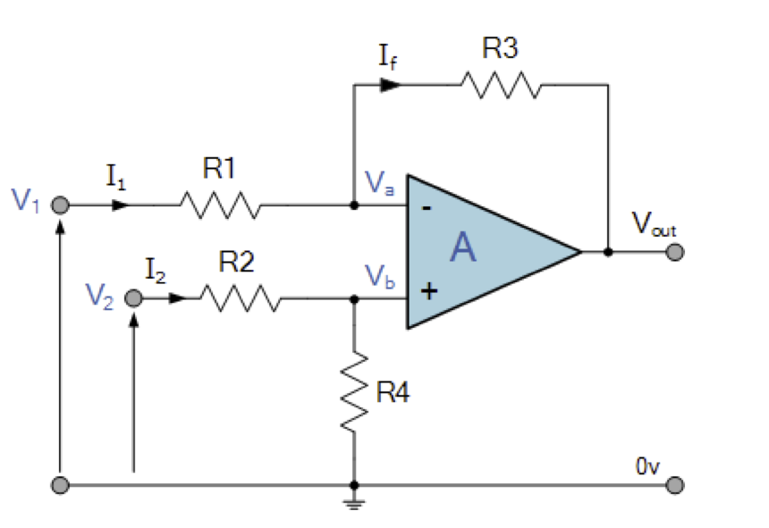
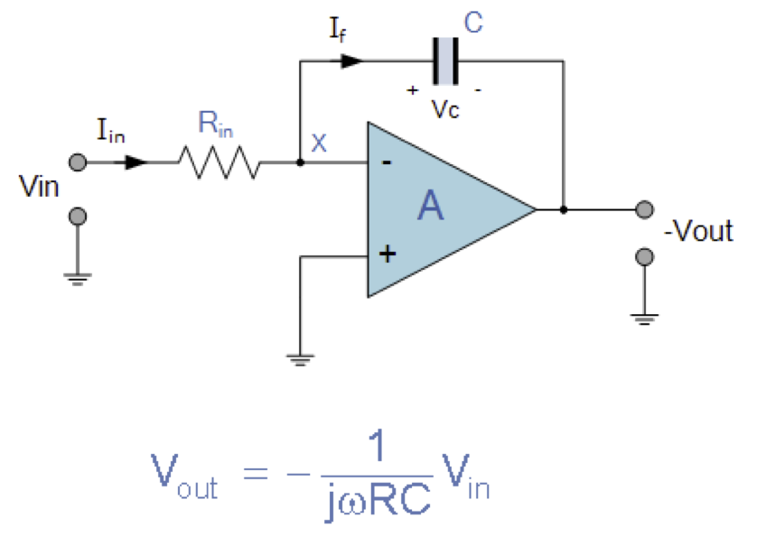
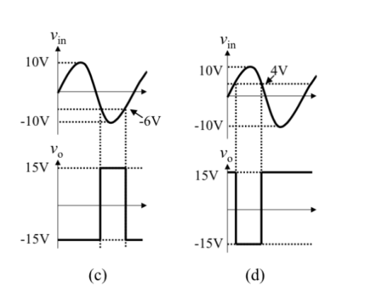
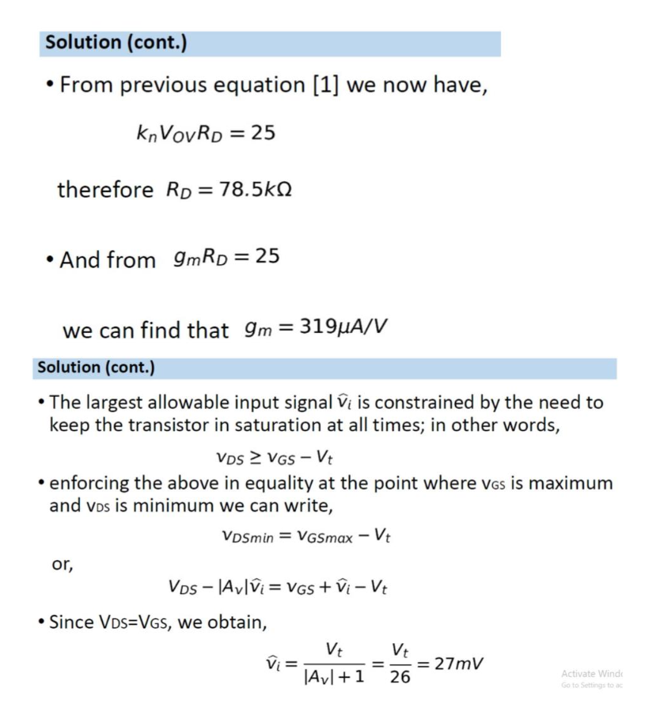
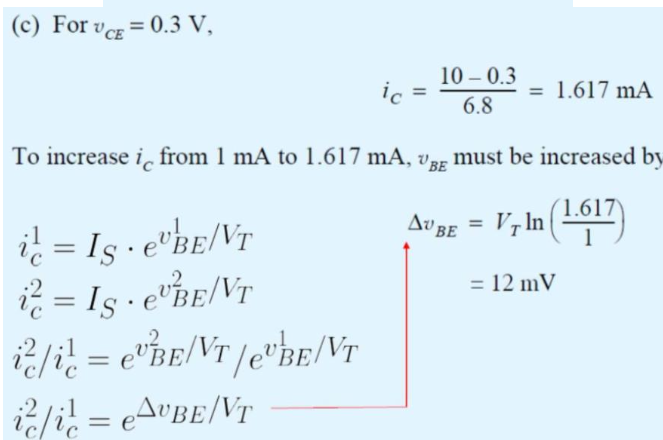

# Circuit Analysis Basics
## KCL

The algebraic sum of all the currents at any node in a circuit equal to zero

## KVL

The algebraic sum of all the voltages around any closed path in a circuit equals zero.

## Node-Voltage Analysis
1.  Identify the n essential nodes
2.  Select a reference node (ground) and label the other n-1 node voltages.
3.  Write KCL for each node identified as independent variable. Express each branch current as function of adjacent node voltages using Ohm's Law.

We assume all the current is leaving the node.
Use ohm's law to write current using voltage and resistor value.
(A node voltage is defined as the voltage rise from the reference node to a nonreference essential node)

1.  Solve the linear system for the node voltages.
2.  If required, calculate the remaining unknown variables.

## Mesh-Current Analysis
Firstly, set a direction and label the current.(because the current in a series is unchanged)

And then write KVL for each mesh.

Use ohm's law to represent voltage with current and resistance.

The collapsing part, use one current to minus the current in another direction.

For mesh a:
$$-40 + 2i_a + 8(i_a-i_b) = 0$$

ia is going down, while ib is going up, so we use ia minus ib

At the end, solve the simuoltaneous equation to find mesh current.

Use mesh current to calculate the remaining unknown variables.

## Voltage Divider

Current dont change

$$v_j = \frac{R_j}{R_{eq}}v$$

## Current Divider

Voltage dont change

$$i_j = \frac{v}{R_j} = \frac{R_{eq}}{R_j}i$$

## AC RMS voltage

$V_{RMS} = \frac{V_{Peak}}{\sqrt{2}} = \frac{V_{peak to peak}}{2 \sqrt{2}}$

The Root Mean Square of a voltage source is a measure of equivalent of DC voltage of a AC voltage source.

## Superposition

When have a lot of voltage/current sources, the current/voltage across/through an element is the algebraic sum of the voltage/current across/through that element due to each independent source acting alone.

就是把每个source单独计算，其他的都先turn off,最后加在一起

# Semiconductor
Two types of charge carrier in semiconductor are **electron** and **holes**.
- Electrons are negatively charged particles.
- Holes are absense of an electron in a lattice structure. When a electron leave its place, it creates a hole.

Electron要往Hole里面钻，产生Current. 所以Semiconductor是单向的.

Intrinsic semiconductors are pure semiconductor materials without any significant impurities added to them. 
- They have equal holes and electrons
- The conductivity depends on temperature, temperature rise, conductivity rise.

The most common examples are pure **silicon** and **germanium**. 

## Doping
Doping refers to adding impurities into an intrinsic semiconductor material. It means increase holes or electrons.
- N-type Doping: adding extra electrons.
    - Majority charge carriers are electrons, minority are holes.
- P-type Doping: adding extra holes
    - Majority charge carriers are holes, minority are electrons.

**Generation** refers to the process of cration of electron-hole pairs in a semiconductor. Can occur due to thermal energy, photo absoption. 导致electron离开valence band to conduction band以此产生hole.

**Recombination** refers to the process where a free electron falls back into a hole.

Drift current are the movement of charge carriers(electrons and holes) under the influence of an external electric field.

Diffusion current are the movement of charge carriers due to concentration gradient, from higher concentration to lower concentration region.
- The formation process of PN junction: electroon move from n-type to p-type material, holes in opposite direction. Form depletion region, which creates an electric field that eventually balance the diffusion current, leads to a state of dynamic equilibriumn in the device.

Phosphorus have five valence electron, one more than silicon's four, when Phosphorus added to silicon, an extra electron is left free to move. This increaases the conductivity of silicon.

Boron have three valence electron, one less than silicon's four, when Boron is added to silicon, an extra hole is left free to move. This movement of holes increase the conductivity of the silicon

Diode Use:
- Rectification, convert AC to DC
- Signal Switching and Logic Gates, diode are used to implement logic gates like AND and OR gate.

## Diode

Current flow from Anode(positive) to Cathode(negative), but not in reverse direction.

Forward-biased means positive current being applied to diode. 
- Cause the diode be turned on
- Diode act as a short circuit

**Reverse-biased** means negative current being applied to diode.
- Cause the diode be cut off, or just off.
- Diode act as a open circuit

The voltage drop across an ideal forward-biased conducting diode is 0.
- But usually we use 0.7V as voltage drop

## Zener Diode

Zener diode is a diode that allow current to flow backwards when a certain set reverse voltage, $V_z$ zener voltage, is reached.

Commonly usedd for voltage regulation.

Usually connected in reverse biased.

The zener voltage/breakdown voltage/ reverse voltage remains constant, it means the voltage across the zener diode when its on.

## Examples

Forward and reverse bias input

The diode connected to V1 is forward-biased, the diode connected to V2 is reverse biased, thus only V1 will conduct. Because its ideal, there will be no voltage drop across it

----

Voltage drop across an ideal conducting diode

The current is flowing, we can infer the diode is forward-biased and conducting.

The voltage drop across an ideal conducting diode is 0V.

> Btw, potential value across a component means the voltage across that component.

----

AC diode voltage

Consider an AC sine wave voltage signal being used to connect a diode and a resistor as shown in Figure. The variation of the voltage across the diode($V_d$) with respect to time is given by

During the positive half-cycle of AC sine wave, the diode will be forward-biased, the voltage drop is 0.

During the negative half-cycle of AC sine wave, the diode will be reverse-biased, the diode is not conducting at all. The volttage drop will be equal to the input voltage.

Therefore, the voltage across the diode will looks like a rectified waveform, where only the negative half-cycle of the input AC sine wave are present, and the negative half-cycle are clipped to 0 volts.

----

AC input with DC battery

The diode will only conduct when the AC source $v_S$ exceed the batttery voltage.

Given that $v_S$ is a sinusoid, its instantaneous voltage is given by
$$v_S(t) = 24 \cdot \sin(\omega t)$$

Hence, we need to find the time period when sine wave is above 12V in one cycle. This involves solving for the angle $\theta$ at which the sine wave is equal to $\frac{12}{24}= 0.5$

$$\sin(\theta) = 0.5$$

The solution to this equation is $\theta = \frac{\pi}{6} \textrm{ and } \frac{5\pi}{6}$ within the first cycle.

The fraction of the cycle during which diode will conductt is then
$$\frac{\frac{5\pi}{6} - \frac{\pi}{6}}{2\pi} = \frac{1}{3}$$

----

Find IV from DC Circuit with resistor

$$I = \frac{V}{R} = \frac{5}{2.5 \times 10^3} = 2mA$$

And theres no voltage drop across the ideal conducting diode.

----

Find IV from DC Circuit in reverse-biased mode

For the circuit shown, find IV for the ideal diode.

和上面是一样的，同时因为+3v 和 -3V 也有6V的voltage difference所以还是forward bias，正常计算就行

$$3-(V_1) -0.7 - (-3V) = 0$$

$$V_1 = 5.3V$$

$$I = \frac{6}{10k} = 5.3mA$$

When measuring the node voltage V of ground reference
$$V = V1 - (IR) = 3 - 5.3mA \times 10k \Omega = -2.3V$$

When measuring the node voltage V of -3V reference
$$V = V1 - IR - V2 = -5.3V$$

----

AC with battery complicate question

k
The fraction of each cycle can be found by $\frac{12}{24} = 0.5$

$$\sin(\theta) = 0.5, \theta = \frac{5\pi}{6} \textrm{ and } \frac{\pi}{6}$$

Hence the fraction would be

$$\frac{\frac{5\pi}{6} - \frac{\pi}{6}}{2\pi} = \frac{1}{3}$$

For the peak diode current

$$I_{peak} = \frac{V_{peak}}{R} = \frac{24-12}{100} = 0.12A$$

24-12 is because the voltage drop across the diode is the maximum input voltage minus the battery voltage.

The maximum reverse-biasd voltage is

$$24 + 12 = 36V$$

Because the diode must block voltage from both the cathode side and the anode side.

----

Complicate Diode circuit with requirement of mesh/nodal analysis

For (a) Assuming both diodes are conducting, hence $V_B = 0, V = 0$

$$I_{D2} = \frac{10-0}{10} = 1mA$$

Hence write a node equation at B

$$I + 1 = \frac{0 - (-10)}{5}$$

$$I = 2mA$$

For (b) Assuming both diodes are conducting

$$I_{D2} = \frac{10-0}{5} = 2mA$$

And then 

$$I + 2 = \frac{0 - (-10)}{10} = -1 mA$$

Which is definitely not correct, hence there must be a diode is in reverse-bias mode. Assuming D1 is off and D2 is on.

$$I_{D2} = \frac{10 - (-10)}{5} = 1.33mA$$

10-(-10) 是在求Diode的potential difference

$$V_B = -10 + 10 \times 1.33 = +3.3 V$$

----

Current in two diode

----

Diode and bias resistor

$$V_1: 10 \times \frac{1}{2}$$

----

When facing circuit with lots of diodes, firstly make assumption on the bias direction, and then solve the circuit to test whether the assumptions are correct or not.

----

Two diode and resistance network

(a) $R_1=4, R_2 = 1$

Assuming that $I_{D1}$ is conducting, and $I_{D2} is conducting$, so these two becomes short circuit

$I_a = I{D1} + I_{D2} = \frac{5 - 0}{4}$

$I_{D2} = \frac{0 -(-5)}{1} = 5$ 

Hence

$$I_{D1} = \frac{5}{4}- 5 = -3.75$$

Which is not correct as our assumption, hence, D1 or D2 must be off.

Assuming that D1 is off and D2 is on

$$I_{D2} = I_{R2} = \frac{1}{4+1} \times 5 - 0.7 -(-5) = 1.86$$

$$V_4 = 1.86 \times 1 + (-5) = -3.14V$$

and, since D1 is turned off, hence $I_{D1} = 0$

(b) When $R_1 = 1, R_2 = 4$
<++>

为什么IR1 = 5-0.7/1, 这个0.7是哪儿来的？？
$$$$

----

Zener Diode Example

The current across the load is $V_L = V_Z + V_D = 7.5V$

The current drawn by application is $I_L = P_L/V_L = 300mW/7.5V = 40mA$

The minumum current must be supplied by the source is
$$I_L + I_Z(min) = 40mA + 5mA = 45mA$$

Hence, the $V_{Bat}(min)$ must be able to supply 45mA through $R_s$

$$R_S = [V_{Bat}(min) - V_L]/I_S(min) = (12-7.5)/45mA = 0.1k \Omega$$

The worst case power dissipated through the Zener diode is when $V_{Bat} = V_{Bat}(max)$ and the load is OFF

$$I_S(max) = (15-7.5)/0.1k\Omega = 75mA$$

All of these current will flow through the Zener diode when the application is OFF and therefore
$$P_L(worst) = 6.8V \times 75mA = 510mW$$

# Op Amp
An operational amplifier, is a DC-coupled high-gain electronic voltage amplifier with a differential input and typically a single-ended output.

Ideal opamp have High input impedance, low output impedance, high gain, high slew rate, and they are used in various configuration like inverting, non-inverting, integrator, and differentiator circuits.

An ideal opamp:
- No current flows into the Input Terminals
- The differencial input voltage is zero, i.e. $V_1 = V_2 = 0$

> Slew rate means the maximum rate at which the output reacts to an input signal
> - It can be found by finding the maximum rate of change of output voltage, for example output changes from $-10V$ to $10V$ in 1 microseconds, the slewrate would be $20V/\mu s$

Open and close loop amplifier:
- An open loop amplifier is an amplifier without a feedback loop, meaning the output is not fed back into the input in any manner. Open loop gain is denoted as $A_{OL}$
- An closed loop amplifier utilizes feedback, means a portion of output signal is fed back to the input to control its properties. Close loop gain is denoted as $A_{CL}$
- Open-loop amplifiers can provide large amplification, they do not offer the stability and control of the close-loop amplifier, which utilizes feedback to stabilize and control their performance attributes.

If an op-amp configured as a non-inverting amplifier produces a distorted output waveform, what could be the potential reasons?
- The op-amp might be driven into saturation due to an input signal of too high amplitude.
- The input frequencies may be too high, causing slew rate issues.
- The power supply voltage may be inappropriate.
- There might be thermal issues causing the op-amp to behave non-linearly.

When its asking to calculate the voltage gain, its asking for the input voltage and output voltage at the terminals of the op-amp itself, instead of the entire circuit!!!

## Inverting Op-Amp

$$I_{in} = I_f + 0, I_{in} = I_f$$

Hence

$$\frac{V_{in} - V_2 }{R_{in} } = \frac{V_2 - V_{out}}{R_f}$$

And because $V_1 = V_2 = 0$

Hence
$$\frac{R_f}{R_{in} = \frac{0 - V_{out }}{V_{in} - 0}}$$

Hence the closed loop gain $A_v$ is given as
$$\frac{V_{out} }{V_{in}} = -\frac{R_f }{R_{in}}$$
and
$$V_{out} = - \frac{R_f }{R_{in}} \times V_{in}$$

## Non-Inverting Op-Amp

Based on the Characteristic and KCL
$$I_f + 0 = I_i$$

Based on no differential voltage drop, hence $V_{in} = V_1$

$$\frac{V_{out} - V_{in}}{R_F} = \frac{V_{in} - 0 }{R_2}$$

Hence, the voltage gain $A_V$ is equal to
$$A_V = \frac{V_{out} }{V_{in}} = \frac{R_2 + R_F }{R_2} = 1+ \frac{R_F }{R_2}$$

## Inverting Summing Op-Amp

The input signal is applied to the inverting terminal(-). The non-inverting terminal is connected to the ground.

$I_F = I_1 + I_2 + I_3 = - [\frac{V_1 }{R_{in}} + \frac{V_2 }{R_{in}} + \frac{V_3 }{R_{in}}]$

Because the inverting op-amp's equation $V_{out} = - \frac{R_f }{R_{in}} \times V_{in}$

Hence

$$- [\frac{V_1 }{R_{in}} + \frac{V_2 }{R_{in}} + \frac{V_3 }{R_{in}}] = \frac{V_{out} }{R_F}$$

Hence

$$-V_{out} = [\frac{R_f }{R_{in}} V_1 + \frac{R_f }{R_{in}}V_2 + \frac{R_f }{R_{in}}V_3]$$

## Non-Inverting Summing Op-Amp

The input signal is applied to the non-inverting terminal, the inverting terminal is used for feedback

For the non-inverting op-amp part of the circuit, its the same relationship
$$V_{Out} = [1 + \frac{R_A }{R_B }]V^+$$

And for the summing part, because of KCL
$$I_1 + I_2 = \frac{V_1 - V^+ }{R_1 } + \frac{V_2 - V^+}{R_2} = 0$$
$$\frac{V_1 }{R_1 } - \frac{V^+}{R_1} + \frac{V_2 }{R_2 } - \frac{V^+ }{R_2} = 0$$

And hence
$$\frac{V_1 }{R_1 } + \frac{V_2 }{R_1 }= V^+ \frac{1 }{R_{total}}$$
So
$$V^+ = R_{total}(\frac{V_1 }{R_1 } + \frac{V_2 }{R_2 })$$

Hence the final relationship between $V_{OUT}$ and $V_1, V_2$ is 
$$[1 + \frac{R_A }{R_B}] R_{total}(\frac{V_1 }{R_1 } + \frac{V_2 }{R_2 })$$

## Difference Op-Amp

$$I_1 = \frac{V_1 - V_a }{R_1}$$
$$I_2 = \frac{V_2 - V_b}{R_2 }$$
$$I_f = \frac{V_a - V_{OUT }}{R_3}$$

Because $V_a = V_b$

Also
$$V_b=  V_2 \frac{R_4 }{R_2 +R_4}$$

If $V_2 = 0$, then
$$V_{out} = - \frac{V_1 }{\frac{R_3 }{R_1}}$$

If $V_1 = 0$, then
$$V_out = V_2 \frac{R_4}{R_2 + R_4} \frac{R_1 + R_3 }{R_1}$$

Hence,
$$V_{OUT} = - V_1 \frac{R_3 }{R_1 } + V_2 \frac{R_4 }{R_2 + R_4 } \frac{R_1 + R_3 }{R_1}$$

## Integrator Op-Amp

The output is a respond to changes in the input voltage. It is proportional to the integral of the input voltage.

$$V_{OUT} = - \frac{1 }{j\omega RC }V_{in}$$
- $\omega = 2\pi f$
- The output voltage $V_{out}$ is a constant $\frac{1 }{RC}$ times the integral of the input voltage $V_{in}$ with respect to time.

Thus, the circuit has the transfer function of an inverting integrator with the gain constant of $- \frac{1 }{RC}$.

The minus sign indicates a 180 phase shift because the input signal is connected directly to the inverting input terminal of the operational amplifier.

## Differentiator Op-Amp

The opamp circuit produces a voltage output which is directly proportional to the input voltage's rate of change with respect to time.

$$V_{out} = -R_F C \frac{dV_{IN }}{dt}$$

## Comparator Op-Amp

## Converting dB to linear scale

$$\textrm{Voltage Gain} = 10^{\frac{\textrm{Gain(dB)}}{20}}$$

> If this ever comes out in exam, FUCK THE ASSHOLE WHO WROTE THE PAPER

## Examples

Inverting Op Amp

(a) Derive an expression for the closed-loop gain vout/vin of this circuit.

(b) use this circuit to design an inverting amplifier with gain of 100 and input resistance of 1M ohm

( c ) Compare your design with that based on traditional inverting configuration

(a)

Because there's no current flows into the op-amp input terminal, hence $i_1 = i_2 + i_0 = i_2 + 0 = i_2$

Because the differential voltage input is 0, hence $v_- = v_+ = 0$

Hence

$$i_1 = i_2 = \frac{v_I - 0}{R_1} = \frac{v_I}{R_1}$$

$v_x = v_1 - i_2R_2 = 0 - \frac{v_I}{R_1}R_2 = - \frac{R_2}{R_1}v_I$

$i_3 = \frac{0 - v_x}{R_3} = \frac{R_2}{R_1R_3}v_I$

$i_4 = i_2+i_3 = \frac{v_I}{R_1} + \frac{R_2}{R_1R_3}v_I$

Hence, the $v_O$ is $$v_O = v_x - i_4R_4 = - \frac{R_2}{R_1}v_I - (\frac{v_I}{R_1} + \frac{R_2}{R_1R_3}v_I)R_4$$

Hence the voltage gain is given by

$$\frac{v_O}{v_I} = - \frac{R_2}{R_1}(1 + \frac{R_4}{R_2} + \frac{R_4}{R_3})$$

(b)

$R_I = 1M\Omega$

Hence

$$100 = - \frac{R_2}{1 \times 10^6}(1 + \frac{R_4}{R_2} + \frac{R_4}{R_3})$$

And then choose whatever value

( c )

If use this configuration for $R_1 = 1M\Omega$ the feedback resistor $R_F = 100M \Omega$ which is impractically large.

----

Ideal inverting op-amp find resistance

$$A_{CL} = \frac{v_O}{v_i} = - \frac{R_2}{R_1} = -2$$

$$R_1 = 10k\Omega, R_2 = 20k\Omega$$

----

Design inverting op-amp giving specs

$A_v = \frac{v_O}{v_I} = -\frac{R_2}{R_1} = -10^{20/20} = -10$

$$R_{EQ} = R_L || R_2 \geq \frac{10V}{2.5mA} = 4k\Omega$$

Since $R_L \geq 5k\Omega, R_2 \geq 20k\Omega$

Choose $R_1 = 10k\Omega, R_2 = 100k\Omega$ to provide an input resistance of $10k \Omega$

The maximum output current will be

$$i_O \leq \frac{10V}{100k\Omega} + \frac{10V}{5k\Omega} = 2.1mA < 2.5mA$$

----

AC RMS voltage source

Just treat RMS AC input as DC value.

(a)

$v_{in} = 1.5V rms$

$A_{CL} = - \frac{R_2}{R_1} = -\frac{137.5}{25} = -5.5$

$$|1.5 \times -5.5| = 8.25V rms$$

(b)

$$i = \frac{v_{in} - v^-}{R_1} = \frac{v_{in} - 0}{25k} = \frac{1.5}{25k} =  0.0006A rms$$

( c )

$$v_O = -5.5 \times v_{in} = 3.3V$$

----

Voltage Follower

The circuit can be viewed as a non-inverting amplifier with $R_1= \infty, R_f = 0$

Ingenerall, for a non-inverting op-amp, the voltage gain is $1 + \frac{R_F}{R_2} = 1 + 0 = 1$

Since the input resistance of an op-amp is $R_{in} =\infty$ and output resistance $R_{out} = 0$, hence it can provide good match for high impedance source and low impedance load.

----

Ideal op-amp find current and voltage on every branch and node

For the circuit, assuming an ideal opamp, find the current through all branches and the voltages at all nodes. Since the current supplied by the op amp is greater than the current drawn from the input signal source, where does the additional current come from? ($R_1 = 1k\Omega, R_f = 10k\Omega, R_L= 2k\Omega, V_{in} = -0.5V$)

$$v^- = v^+ = 0$$

$$i_1 = \frac{ v^- - v_{in}}{1k\Omega} = \frac{0 -(-0.5)}{1k} = 0.5mA$$

$$i_2 = i_1 = 0.5mA$$

$$v_O = i_2 \times 10k\Omega + v^- = 5V$$

$$i_3 = \frac{v_O - 0}{2} = 2.5mA$$

$$i_O = i_2 + i_3 = 3mA$$

----

Summing Op Amp

(a)

$$I_F = I_1 + I_2 + I_3 + I_4 = -[\frac{V_1}{R_{in}} + \frac{V_2}{R_{in}} + \frac{V_3}{R_{in}} + \frac{V_4}{R_{in}}]$$

Because $v_O = v_I \times (- \frac{R_F}{R_{in}})$

$$-[\frac{V_1}{R_{in}} + \frac{V_2}{R_{in}} + \frac{V_3}{R_{in}} + \frac{V_4}{R_{in}}] = \frac{v_O}{R_F}$$

$$v_O = -[\frac{R_F}{R_{1}}v_1 + \frac{R_F}{R_2}v_2 + \frac{R_F}{R_3}v_3 + \frac{R_F}{R_4}v_4]$$
$$ = - (v_1 + 2v_2 + 5v_3 + 10v_4)$$

(b)

$$ = -14 V$$

( c )

idk wtf is R_C just remember how to calculate it.

$$R_C = R_F || R_1 || R_2 || R_3 || R_4 = \frac{1}{R_F} + \frac{1}{R_1} + \frac{1}{R_2} + \frac{1}{R_3} + \frac{1}{R_4} = 5.3k\Omega$$

----

Weird non-inverting opamp

$$A = \frac{V_o}{V^+ - V^-}$$

$$V^- = 0$$

$$V^+ = \frac{1}{1+1000}V_i = \frac{2}{1001}V$$

$$A = \frac{4}{2/1001} = 500.5v/v$$

----

Find Voltage Gain of lots of circuits

----

Superposition

when $v_2$ turn off

$$v_O = (1 + \frac{R_F}{R_g}) \frac{R_2}{R_1+R_2}v_1$$

> Notice that the voltage goes into the terminal is the input voltage minus the voltage across the resistor R1, hence it is the voltage across R2. And R1 and R2 forms a voltage divider, hence using the voltage divider formula to find the voltage.

when $v_1$ turn off

$$v_O = (1 + \frac{R_F}{R_g}) \frac{R_2}{R_1+R_2}v_2$$

Hence the total voltage is that

$$v_o = \frac{R_g + R_f}{R_g}(\frac{R_2}{R_1+R_2}v_1 + \frac{R_1}{R_1+R_2}v_2)$$

----

Super complicated dogshit

Suck my ass

----

Voltage Comparator Op-Amp

----

Integrator Op-Amp

The integrator have output as $v_o = - \frac{1}{R_1C} \int_{0}^{t}v_{in}(t)dt$

and

$$v_{in} = A\sin \omega t \to \int_{0}^{t}A\sin(\omega t)dt = - \frac{A \cos \omega t }{\omega}$$

Hence
$$v_o = - \frac{1}{R_1 C }(- \frac{A \cos \omega t}{\omega}) = \frac{A}{\omega R_1C}\cos \omega t$$

peak at

$$V_{OP} = \frac{A}{\omega R_1 C}$$

(a)

$v_p = 0.5V$

$v_o = \frac{0.5}{100 \times 100 \times 10^3 \times 0.01 \times 10^{-6}} = 5V$

(b) 

$v_o = 0.5V$

----

Questions related to output offset voltages and practical op-amp are not included, because i dont think any asshole will test these shits.

# MOSFET

MOSFET is a type of transistor used to amplifying or switching electronic signals.

- It have 4 terminal, source, drain, gate, body

It operates by varying voltage applied to the gate, which control the flow of electrical current between the source and the drain.

The gate voltage modulates the conductivity of a channel underneath the gate area.
- The threshold voltage $V_t$, is the minimum gate-to-source voltage(V_{GS}) that is required to create a conduction path between the drain and source.

MOSFET can be either in enhancement mode or depletion mode.
- Enhancement mode require gate-source voltage to conduct
- Depletion mode require no gate-source voltage

NMOS
- Substrate region made up of p-type, and source and drain are n-type
- Majority carries are electron
- When positive voltage applied to the gate, it attract electron towards the gate oxide interface, creating a chennel for electron to flow from source to drain.

PMOS
- Substrate n-type, source drain p-type
- Majority carries are Holes
- When negative voltage applied to the gate, holes are attracted to surface area under gate oxide, creating conductive channel, allow cuurent to flow between the source and drain.

This symbol means enhancement PMOS

While the enhancement NMOS will looks like this

Enhancement mosfet simply means its not conducting when no voltage is applied, like an normally open switch

## Linear(Triode) Region

> Its likely that these equation will be given in the exam? If its not given, 操他妈的傻逼东西

When the MOSFET is in the linear region, the drain to source voltage $V_{DS}$ is smaller than the gate to source voltage minus the threshold voltage $V_{GS} - V_t$, and the drain current is given by

$$I_D = \mu_nC_{ox} \frac{W}{L} ((V_{GS}-V_t)V_{DS} - \frac{V^2_{DS}}{2})$$
- This is the equation for n-type, when finding the drain current for p-type, replace $DS, GS$ with $SD, SG$, same for the saturation region

Where:
- $\mu_n$ is the electron mobility
- $C_{ox}$ is the gate oxide capacitance per unit capita
- $W$ is the width of MOSFET channel
- $L$ is the length of MOSFET channel
- $V_{GS}$ is the gate to source voltage
- $V_t$ is the threshold voltage
- $V_{DS}$ is the drain to source voltage

> When the drain voltage $V_D$ is less than the gate voltage, 

> When the MOSFET is in triode region, the drain to source resistance can be estimated using the formula $r_{DS} = \frac{1}{k_n v_{ov}}$

## Saturation Region
$V_{GS} < V_{DS} + V_t$ indicates in saturated region.

The MOSFET enters saturation when $V_{DS}$ is greater than or equal to $V_{GS} - V_t$ and the drain current is maximised and given by

$$I_D = \frac{1}{2}\mu_n C_{ox} \frac{W}{L}(V_{GS} - V_t)^2(1+\lambda V_{DS})$$

where $\lambda$ is the channel-length modulation parameter, representing the change in the channel lenth due to the voltage applied.
- Some question might ignore the channel-length modulation hence make the equation becomes
$$I_D = \frac{1}{2}\mu_n C_{ox} \frac{W}{L} (V_{GS} - V_t)^2$$

The part $V_{GS} - V_t$ is also defined as $V_{ov}$ the overdrive voltage, it indicates how much the gate voltage exceeds the threshold needed to turn the MOSFET on.

The part $\mu_n C_{ox} (\frac{W}{L})$ is also defined as $k'_n \frac{W}{L}$ which is the transcodnctance parameter for an NMOS transistor. Also the uppercase $K = \frac{1}{2}\mu_n C_{ox} (\frac{W}{L})$

## Small Signal Equivalent

The transconductance $g_m = k_n' \frac{W}{L} v_{ov}$

The voltage gain is
$$A_V = -g_m R_D$$

The $r_o$ takes on value $10k\Omega$ to $1M\Omega$ to represent channel-length modulation

## Example

MOSFET circuit design

$V_d = 0.5V, VDD = 2.5V$

Hence

$I_D = \frac{VDD - V_d}{R_D} = \frac{2.5 - 0.5}{R_D} = 0.4mA$

$R_D = 5k \Omega$

$$I_D = \frac{1}{2} \mu_n C_{ox} \frac{W}{L}(V_{GS} - V_t)^2$$
$$0.4mA = \frac{1}{2} 100 \mu A/V^2 \times \frac{32}{1}(V_{GS} - V_t)$$

$$V_{ov}^2 = 0.5V$$

$$V_{GS} = V_{t} + V_{ov} = 0.7 + \sqrt{0.5} = 1.4V$$

Therefore $R_S = \frac{V_s - V_{ss}}{I_D} = \frac{-1.2 - (-2.5)}{0.4} = 3.25k \Omega$

----

Voltage Divider MOSFET

$$I_D = \frac{1}{2}k'_n(\frac{W}{L})v_{ov} = \frac{1}{2} \times 1 mA \times v_{ov}^2$$

$$v_{ov}^2 = \frac{I_D}{0.0005}$$

$$V_G = VDD \frac{R_{G2}}{R_{G1} + R_{G2}} = 10 \frac{10}{20} = 5V$$

$$V_{GS} = 5-6kI_D$$

$$(5-6 I_D - 1)^2 = \frac{I_D}{0.0005}$$

$$18 I_D^2 - 25I_D + 8 = 0$$

$$I_D = 0.89, 0.5mA$$

when $I_D = 0.89$

$V_S = 6 \times 0.89 = 5.34 V$ which is greater than the gate voltage which is incorrect.

Hence

$$I_D = 0.5mA$$

$$V_s = 0.5 \times 6= 3V$$

$$V_{GS} = 5-6\times 0.5 = 2V$$

$$V_D = 10 - 6 \times 0.5 = 7V$$

----

NMOS and PMOS

<++> DTA

----

MOSFET text question

----

Find drain current example

他的solution写的是纯狗屎

<++>

----

One input two terminal

Design the circuit to establish a drain voltlage of $0.1V$. What is the effective resistance between drain and source at this operating point? Let $V_tn = 1V, k'n(W/L) = 1mA/V^2$

Since the drain voltage is lower than the gate voltage by 4.9V, and $V_t = 1V$, the MOSFET is in triode region.

$$I_D = k'n(W\L)((V_{GS} - V_t)V_{DS} - \frac{1}{2}V^2_{DS})$$

$$= 1 \times [(5 -1)0.1 - \frac{1}{2}\times0.01] = 0.395mA$$

$$R_D = \frac{5 - 0.1}{0.395} = 12.4k\Omega$$

and the drain to source resistance can be calculated as

$$r_{DS} = \frac{V_{DS}}{I_D} = \frac{0.1}{0.395} = 253\Omega$$

Also the drain voltage can be determine by the formula

$$r_{DS} = \frac{1}{k_nv_{ov}} = \frac{1}{1\times (5 -1)} = 0.25k\Omega$$

which is close to what we found

----

 <b>IMPORTANT</b> MOSFET Amplifier 

The firgure shows a discrete common-source MOSFET amplifier utilizing a drain-to-gate resistance $R_G$ for biasing purpose.

The input signal $v_I$ is coupled to the gate via a large capacitor, and the output signal at the drain is coupled to the load resistor $R_L$ via another large capacitor.

> The capacitors are used to block dc signals

The transistor has $V_t = 1.5V, k_n'(W/L) = 0.25mA/V^2, V_A = 50 V$

Assuming the couplin gcapacitor be sufficiently large so to act as short circuits at the signal-frequencies of interest.

Q. We wish to determine its (a) Small signal voltage gain (b) input resistance, and largest allowable input signal

We first determine the dc operating point, for this purpose, we eliminate the input signal $v_i$ and open-circuit the two coupling capacitors(since they block dc currents).

Since $I_G = 0$, the dc voltage drop across $R_G$ will be 0, so
$$V_{GS} = V_{DS} = V_{DD} - I_D R_D$$

With $V_{GS} = V_{DS}$ the MOSFET will be operatre at saturation

$$I_D = \frac{1}{2}k_n(V_{GS} - V_t)^2$$

Hence

$$I_D = 1.05mA, V_{DS}=V_{GS} =4.5V, V_{ov} = 4.5-1.5 = 3V$$

我赌他不会出MOSFET Small Signal Model类型的题<++>

----

Determine bias state for the circuit

$$V_{GS} = 1.9V, V_{DS} = 2.5V, V_t = 0.4$$

$$V_{GS} - V_{t} = 1.5V$$

In saturated region, $V_{GS} < V_{DS} + V_t$

Because $1.5V < V_{DS}$, hence in saturated state

----

Find R given MOSFET Characteristic

$V_{DS} = V_{GS} = 0.8, V_{t} = 0.5$

And because of $V_{GS} = 0.8 < 0.8 + 0.5 = V_{DS} + V_{t}$, the MOSFET is on and it is in saturated region

$I_D = \frac{1}{2}\mu_n C_{ox} (V_{GS} - V_t)^2 = \frac{1}{2} 0.4 mA/V^2 \times \frac{0.72}{0.18} (0.8 - 0.5)^2 = 72 \mu A$

$$V_D = 0.8 = 1.8 - IDRD = 1.8 - 72 \times 10^{-6} \times R_D$$

$R = 13.9k\Omega$

----

Another example on Small Signal Analysis

----

# BJT
BJT is a type of transistor that can amplify or switch electrical signals. They have three terminal.
- Emitter: This heavily doped and injects carries(electron or hole) into the base
- Base: This very thin and lightly doped, control the flow of carriers. When a small current is applied to the base, it controls the larger current flow between the emitter and the collector.
- Collector: This region collects carriers from the base

NPN BJT: A layer of p-type semiconductor(base) is sandwiched between two n-type semiconductor. Current flow from collector to emitter when positive voltge is applied to the base.

PNP BJT: A layer of n-type semiconductor(base) is sandwiched between two p-type semiconductor. Current flow from emitter to collector when negative voltage is applied to the base.

> Its the same as MOSFET, b和e的current箭头是同一边的

## Three Modes
Active Mode:
- Emitter-Base Junction Forward Biased, Collector-Base Junction is Reverse Biased.
- BJT Amplify current.
- Most Important

Cut-off Mode:
- Both reverse-biased
- No current flow through the transistor, the base-emitter voltage is below the threshold to turn on the device
- Act like an open switch

Saturation Mode:
- Both forward-biased
- Transistor is ON and allow maximum current to flow from collector to emitter.
- Act like a closed switch, allowing full current flow

## Current gain

$\beta$ is defined as the active mode common-emitter current gain

$$\beta = \frac{I_C}{I_B}$$

At active region, theres these equation that can be used

$$i_C = I_S e^{V_{BE}/ V_T}$$

$$i_B = \frac{i_C}{\beta} = \frac{I_S}{\beta}e^{V_{BE}/V_T}$$

$$i_E = i_C + i_B = \frac{i_C}{\alpha} = \frac{I_S}{\alpha}e^{V_{BE}/V_T}$$

> $V_T$ is the thermal voltage $= \frac{kT}{q} \approx 25mV$ at room temperature

$$\beta = \frac{\alpha}{1 - \alpha}, \alpha = \frac{\beta}{\beta + 1}$$

$\alpha$ is the common-base current gain

## Amplifier

The CE amplifier circuit will have 180 deg phase shift.

## CE Small Signal Equivalent

The input resistance: $R_{in} = r_\pi$

$g_m$ is the transconductance $= \frac{\delta I_C}{\delta V_{BE}}$ given in S simens

> at Q-point $g_m = \frac{I_C}{V_T}$

The voltage gain is

$$A_v =- g_m R_d$$

$R_d$ is the total load resistance, in CE amplifier circuit its usually $R_C$

The overall voltage gain is

$$G_v = \frac{v_o}{v_{sig}}$$

## Superimposed AC on DC

If a AC signal is added on top of a DC signal, the DC source set the operating point of the transistor

The AC will cause the voltage to fluctuate between $V_{DC} + V_{AC Peak}$ and $V_{DC} - V_{AC Peak}$

## Small Signal Equivalent Analysis

DC Analysis:
- Find dc equivalent circuit by replacing all capacitor by open circuits, inductor by short circuits
- Find Q-point from dc equivalent circuit by using appropriate large-signal transistor model

AC Analysis:
- Find AC equivalent circuit by replacing all capacitor by short circuit, inductor by open circuit, dc voltage source by ground connection, dc current source by open circuit.
- Replace transistor by its small-signal model
- Use small-signal ac equivalent to analyze ac characteristic of amplifier
- Combine end results of dc and ac analysis to yield total voltage and currents in the network.

Theres a right thumb estimate of the voltage gain

$$A_V^{CE} = -10V_{CC}$$

## Example

Finding beta given BJT

$$\beta = \frac{I_C}{I_B}$$

$$I_B = \frac{V_i }{R_B} = \frac{10}{400k} = 25 \mu A$$

$$I_C = \frac{10 - V_CE}{R_C} = \frac{10 - 0}{3k} = 3.33 mA$$

$$\beta = \frac{I_C}{I_B} = 133$$

----

Complicated Fucked Up Figure

$$I_S = 10^{-15}A, \beta = 100$$

The base is fed with a DC current source of 10 $\mu A$, the collector is connected to $5V$ dc supply via a resistance of 3k Ohm.

Assuming this BJT in active mode, find VBE and VCE.

$$I_B = \frac{I_S}{\beta}e^{V_{BE}/V_T}$$

$$V_{BE} = V_T \ln \frac{I_B}{I_S/\beta} = 25 \ln (\frac{10\times 10^{-6}}{10^{-17}}) = 690mV$$

$$V_{CE} = V_{CC} - I_C \times R_C$$

$$I_C = \beta I_B = 1mA$$

$$V_{CE} = 2V$$

Because $V_C$ is at +2V higher than $V_B$, the transistor is indeed working in active mode.

----

Replacing the current source with a resistance connected from base to the 5V dc supply, what resistance value is needed to result in same operating conditions?

Replacing the current source with a resistance $R_B$ connecting from the base to 5V dc supply, the value of R_B is 

$$R_B = \frac{V_{CC} - V_{BE}}{I_B} = \frac{5-0.69}{10\muA} = 431k\Omega$$

----

Given Spec Design Resistors

The bjt have $\beta = 100$ and exhibits a $VBE = 0.7V$ at $I_c = 1mA$

$$I_B = \frac{I_C}{\beta}= 0.02mA$$

And the voltage drop across $R_C$ is $V_{RC} = 15 -5 = 10V$

Hence $R_C = \frac{10V}{2mA} = 5k\Omega$

$$I_E = I_B + I_C = 0.02 + 2 = 2.02mA$$

Because $V_{BE} = 0.7V$ at $I_c = 1mA$

Hence

$$I_{C1} = 1mA = I_s e^{V_{BE} /V_T} = I_S e^{0.7/25mV}$$

The current now is that

$$I_{C2} = 2mA = I_s e^{V_{BE}/25mV} $$

Solve for $V_{BE} = 0.717V$

----

Common Emitter Amplifier

(a)

$$I_C = I_Se^{V_{BE}/VT} = 10^{-15} e^{V_{BE}/25mV}$$

$$I_C = \frac{V_{CC} - V_{CE}}{R_C} = \frac{10 - 3.2}{ 6.8k} = 1mA$$

$$ln(1 \times 10^{-3} / 10^{-15})\times 25mV= V_BE$$

$$V_BE = 690.8mV$$

(b)

$$A_v = -g_m R_d = -\frac{i_C}{V_T} \times R_C = -\frac{V_{CC} - V_{CE}}{V_T} = -272V/V$$

$$\hat{V_{CE}} = 272 \times 0.005 = 1.36V$$

( c )

----

Small signal voltage gain

----

Small signal complicated example

----

Small signal full text example

----

Double Ended Differential Voltage Gain

