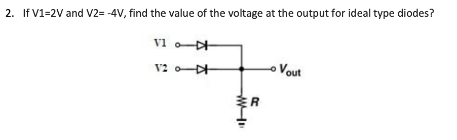

# Circuit Analysis Basics
## KCL

The algebraic sum of all the currents at any node in a circuit equal to zero

## KVL

The algebraic sum of all the voltages around any closed path in a circuit equals zero.

## Node-Voltage Analysis
1.  Identify the n essential nodes
2.  Select a reference node (ground) and label the other n-1 node voltages.
3.  Write KCL for each node identified as independent variable. Express each branch current as function of adjacent node voltages using Ohm's Law.

We assume all the current is leaving the node.
Use ohm's law to write current using voltage and resistor value.
(A node voltage is defined as the voltage rise from the reference node to a nonreference essential node)

1.  Solve the linear system for the node voltages.
2.  If required, calculate the remaining unknown variables.

## Mesh-Current Analysis
Firstly, set a direction and label the current.(because the current in a series is unchanged)

And then write KVL for each mesh.

Use ohm's law to represent voltage with current and resistance.

The collapsing part, use one current to minus the current in another direction.

For mesh a:
$$-40 + 2i_a + 8(i_a-i_b) = 0$$

ia is going down, while ib is going up, so we use ia minus ib

At the end, solve the simuoltaneous equation to find mesh current.

Use mesh current to calculate the remaining unknown variables.

# Semiconductor
## Diode
Two types of charge carrier in semiconductor are **electron** and **holes**.
- Electrons are negatively charged particles.
- Holes are absense of an electron in a lattice structure. When a electron leave its place, it creates a hole.

Electron要往Hole里面钻，产生Current. 所以Semiconductor是单向的.

Intrinsic semiconductors are pure semiconductor materials without any significant impurities added to them. 
- They have equal holes and electrons
- The conductivity depends on temperature, temperature rise, conductivity rise.

The most common examples are pure **silicon** and **germanium**. 

## Doping
Doping refers to adding impurities into an intrinsic semiconductor material. It means increase holes or electrons.
- N-type Doping: adding extra electrons.
    - Majority charge carriers are electrons, minority are holes.
- P-type Doping: adding extra holes
    - Majority charge carriers are holes, minority are electrons.

**Generation** refers to the process of cration of electron-hole pairs in a semiconductor. Can occur due to thermal energy, photo absoption. 导致electron离开valence band to conduction band以此产生hole.

**Recombination** refers to the process where a free electron falls back into a hole.

Drift current are the movement of charge carriers(electrons and holes) under the influence of an external electric field.

Diffusion current are the movement of charge carriers due to concentration gradient, from higher concentration to lower concentration region.
- The formation process of PN junction: electroon move from n-type to p-type material, holes in opposite direction. Form depletion region, which creates an electric field that eventually balance the diffusion current, leads to a state of dynamic equilibriumn in the device.

## Diode

Current flow from Anode(positive) to Cathode(negative), but not in reverse direction.

Forward-biased means positive current being applied to diode. 
- Cause the diode be turned on
- Diode act as a short circuit

**Reverse-biased** means negative current being applied to diode.
- Cause the diode be cut off, or just off.
- Diode act as a open circuit

The voltage drop across an ideal forward-biased conducting diode is 0.

## Examples

Forward and reverse bias input

The diode connected to V1 is forward-biased, the diode connected to V2 is reverse biased, thus only V1 will conduct. Because its ideal, there will be no voltage drop across it

----

Voltage drop across an ideal conducting diode

The current is flowing, we can infer the diode is forward-biased and conducting.

The voltage drop across an ideal conducting diode is 0V.

> Btw, potential value across a component means the voltage across that component.

----

AC diode voltage

Consider an AC sine wave voltage signal being used to connect a diode and a resistor as shown in Figure. The variation of the voltage across the diode($V_d$) with respect to time is given by

During the positive half-cycle of AC sine wave, the diode will be forward-biased, the voltage drop is 0.

During the negative half-cycle of AC sine wave, the diode will be reverse-biased, the diode is not conducting at all. The volttage drop will be equal to the input voltage.

Therefore, the voltage across the diode will looks like a rectified waveform, where only the negative half-cycle of the input AC sine wave are present, and the negative half-cycle are clipped to 0 volts.

----

AC input with DC battery

The diode will only conduct when the AC source $v_S$ exceed the batttery voltage.

Given that $v_S$ is a sinusoid, its instantaneous voltage is given by
$$v_S(t) = 24 \cdot \sin(\omega t)$$

Hence, we need to find the time period when sine wave is above 12V in one cycle. This involves solving for the angle $\theta$ at which the sine wave is equal to $\frac{12}{24}= 0.5$

$$\sin(\theta) = 0.5$$

The solution to this equation is $\theta = \frac{\pi}{6} \textrm{ and } \frac{5\pi}{6}$ within the first cycle.

The fraction of the cycle during which diode will conductt is then
$$\frac{\frac{5\pi}{6} - \frac{\pi}{6}}{2\pi} = \frac{1}{3}$$

----

Find IV from DC Circuit with resistor

$$I = \frac{V}{R} = \frac{5}{2.5 \times 10^3} = 2mA$$

And theres no voltage drop across the ideal conducting diode.

----

Find IV from DC Circuit in reverse-biased mode

For the circuit shown, find IV for the ideal diode.

和上面是一样的，同时因为+3v 和 -3V 也有6V的voltage difference所以还是forward bias，正常计算就行

----

AC with battery complicate question

The fraction of each cycle can be found by $\frac{12}{24} = 0.5$

$$\sin(\theta) = 0.5, \theta = \frac{5\pi}{6} \textrm{ and } \frac{\pi}{6}$$

Hence the fraction would be

$$\frac{\frac{5\pi}{6} - \frac{\pi}{6}}{2\pi} = \frac{1}{3}$$

For the peak diode current

$$I_{peak} = \frac{V_{peak}}{R} = \frac{24-12}{100} = 0.12A$$

24-12 is because the voltage drop across the diode is the maximum input voltage minus the battery voltage.

The maximum reverse-biasd voltage is

$$24 + 12 = 36V$$

Because the diode must block voltage from both the cathode side and the anode side.

----

Complicate Diode circuit with requirement of mesh/nodal analysis

For (a) Assuming both diodes are conducting, hence $V_B = 0, V = 0$

$$I_{D2} = \frac{10-0}{10} = 1mA$$

Hence write a node equation at B

$$I + 1 = \frac{0 - (-10)}{5}$$

$$I = 2mA$$

For (b) Assuming both diodes are conducting

$$I_{D2} = \frac{10-0}{5} = 2mA$$

And then 

$$I + 2 = \frac{0 - (-10)}{10} = -1 mA$$

Which is definitely not correct, hence there must be a diode is in reverse-bias mode. Assuming D1 is off and D2 is on.

$$I_{D2} = \frac{10 - (-10)}{5} = 1.33mA$$

10-(-10) 是在求Diode的potential difference

$$V_B = -10 + 10 \times 1.33 = +3.3 V$$

----

Current in two diode

# Op Amp

# MOSFET

# BJT
