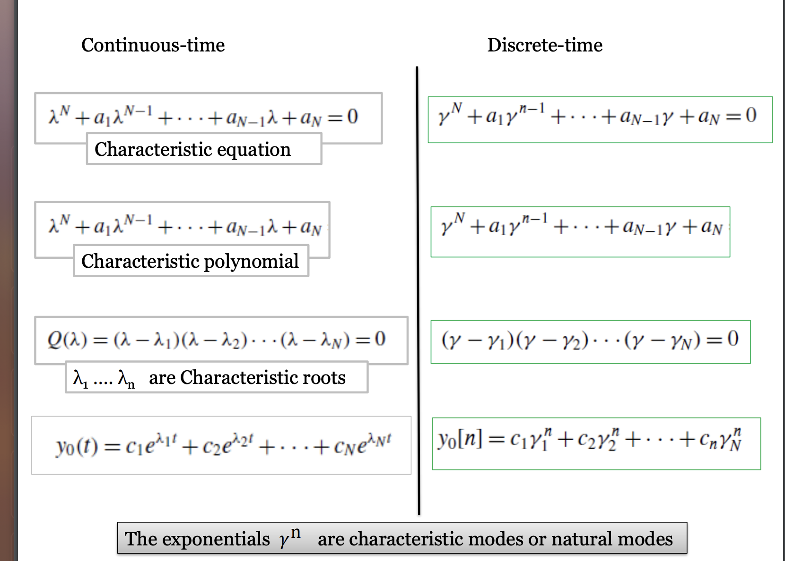

Basically the same shit

# Zero-input Response

For some reason, 把右边的变成$x[n]$，然后左边的$y[n]$是constant term然后每+1就是 $\gamma^{+1}$?

Example 2

Given $y_0[-1] = 3$ and $y_0[-2] = -1$, determine the expression of the zero-input response $y_0[n]$ of an LTID system described by the equation

$$y[n] + \frac{1}{6}y[n-1] - \frac{1}{6}y[n-2] = \frac{1}{3}x[n] + \frac{2}{3}x[n-2]$$

先把右边最小的变成$x[n]$

$$y[n + 2] + \frac{1}{6}[n+1] - \frac{1}{6}y[n] = \frac{1}{3}x[n+2] + \frac{2}{3}x[n]$$

And then get the equation

$$Q(\gamma) = \gamma^2 + \frac{1}{6}\gamma - \frac{1}{6} = 0$$

$$\gamma_1 = -\frac{1}{2}, \gamma_2 = \frac{1}{3}$$

And then substitute this back to get the equation

$$y_0[n] = c_1(-\frac{1}{2})^n + c_2(\frac{1}{3})^n$$

And because of the initial condition, we can have that

$$c_1 = -1, c_2 = \frac{1}{3}$$

And then we have

$$y_0[n] = (\frac{1}{3})^{n+1} - (-\frac{1}{2})^n$$

# Unit Impulse Response

$$Q[E]h[n] = P[E]\delta[n]$$

$$A_0Q[E]\delta[n] = P[E]\delta[n]$$

$$A_0 = \frac{b_N}{a_N}$$

$$h[n] = \frac{b_N}{a_N}\delta[n] + y_c[n]u[n]$$

Example 3

Consider a DT system with input $x[n]$ and output $y[n]$ described by the difference equation

$$y[n+3] - \frac{3}{10}y[n+2] - \frac{1}{10}y[n+1] = 2x[n+1]$$

(a) Determine the characteristic modes of the system

$$y[n+2] - \frac{3}{10}y[n+1] - \frac{1}{10}y[n] = 2x[n]$$

hence

$$\gamma^2 - \frac{3}{10}\gamma - \frac{1}{10} = 0$$

$$\gamma_1 = (\frac{1}{2})^n, \gamma_2 = (- \frac{1}{5})^n$$

(b) Determine a close-form expression for the system's impulse response $h[n]$

$$h[n] = \frac{b_N}{a_N} \delta[n] + y_c[n]u[n]$$

$$ = \frac{2}{- \frac{1}{10}} \delta[n] + [c_1 (\frac{1}{2})^n + c_2(-\frac{1}{5})^n]u[n]$$

In delayed form, $y[n] = \frac{3}{10}y[n-1] + \frac{1}{10}y[n-2] + 2x[n-2]$

Hence $h[n]=  \frac{3}{10}h[n-1] + \frac{1}{10}h[n-2] + 2\delta[n-2]$

And $h[0] = \frac{3}{10}h[-1] + \frac{1}{10}h[-2] + 2\delta[-2] = 0$

> this is because at time before 0, for casual system, its at rest.

$\cdots, h[1] = 0$

Hence

$$h[0] = -20 + c_1 + c_2 = 0$$
$$h[1] = \frac{1}{2}c_1 - \frac{1}{5}c_2 = 0$$

And then we solve for $c_1 = \frac{40}{7}, c_2 = \frac{100}{7}$

$$h[n] = -20\delta[n] + [\frac{40}{7}(\frac{1}{2})^n + \frac{100}{7}(-\frac{1}{5})^n]u[n]$$

# Zero-State Input (Convolution Sum)

For Linear Systems, if we know the system response to a impulse $\delta[n]$, we can obtain the system response to any arbitrary input by summing the system response to various impulse components.

Let $h[n]$ be the system response to impulse input of $\delta[n]$

$$x[n] \to y[n]$$

Which is 

$$\delta[n] \to h[n]$$

Because of time-invariance

$$\delta[n-m] \to h[n-m]$$

Because of linearity

$$x[m]\delta[n-m] \to x[m]h[n-m]$$

And again because of linearity

$$\sum_{m=-\infty}^\infty x[m]\delta[n-m] \to \sum_{m=-\infty}^\infty x[m]h[n-m]$$

The LHS is y[n] and the RHS is x[n]

Hence

$$y[n] = \sum_{m = -\infty}^{\infty} x[m]h[n-m]$$

The RHS is known as the convolution sum of $x[n]$ and $h[n]$, and is represented as $x[n] * h[n]$

