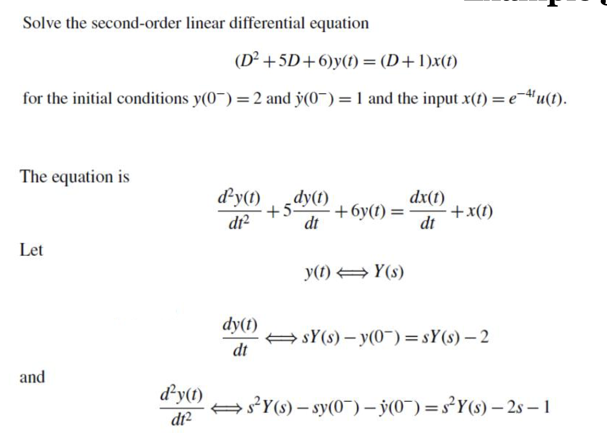
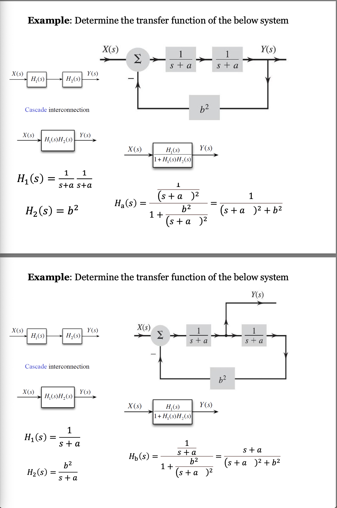

# Laplace Transform
$$X(s) = \int_{-\infty}^{\infty} x(t)e^{-st}dt$$

$$x(t) = \frac{1}{2\pi j} \int_{c-j\infty}^{c+j\infty} X(s)e^{st}dt$$

Hence, $\mathcal{L}\{x(t)\} = X(s)$, and $\mathcal{L}^{-1}\{X(s)\} = x(t)$

## The Difference Between Laplace and Fourier Transform
Laplace transform is applicable for analysing both stable and unstable system from zero time ($t=0^+$) onwards.

Fourier Transform is generally used for analyzing stable systems or stable portions of signals.

## Laplace Table

## Laplace Property
> These Properties are Provided in the Exam
### Linearity
$$\because x_1(t) \Longleftrightarrow X_1(s) \text{ and } x_2(t)\Longleftrightarrow X_2(s)$$

$$\therefore a_1x_1(t) + a_2x_2(t) \Longleftrightarrow a_1X_1(s)+a_2X_2(s)$$

### Time-Shifting Property
$$x(t)u(t)\Longleftrightarrow X(s)$$

then

$$x(t-t_0)u(t-t_0) \Longleftrightarrow X(s)e^{-st_0}$$

### Frequency-Shifting Property
$$x(t) \Longleftrightarrow X(s)$$

then

$$x(t)e^{s_0t} \Longleftrightarrow X(s-s_0)$$

### Time-Integration Property
$$x(t) \Longleftrightarrow X(s)$$

then

$$\int_{0^-}^{t}x(\tau)d\tau \Longleftrightarrow \frac{X(s)}{s} \textrm{ and } \int_{-\infty }^{t }x(\tau)d\tau \Longleftrightarrow \frac{X(s)}{s} + \frac{\int_{-\infty}^{0^-}x(\tau) d\tau}{s}$$

### Time-Differentiation Property

$$x(t) \Longleftrightarrow X(s)$$

then

$$\frac{dx(t)}{dt} \Longleftrightarrow sX(s) - x(0^-)$$

Also, for second order d.e.

$$\frac{d^2x(t)}{dt^2} \Longleftrightarrow s^2X(s) - sx(0^-) - \dot{x}(0^-)$$

Repeated differentiation yields

$$\frac{d^n x(t)}{dt^n} \Longleftrightarrow s^nX(s) - s^{n-1}x(0^-) - s^{n-2}\dot{x}(0^-) - \cdots - x^{(n-1)}(0^-)$$

where $x^{(r)}(0^-)$ is $d^r x/dt^r$ at $t=0^-$

### Time Scaling
Define signal $g$ by $g(t) = f(at)$, where $a>0$; then
$$G(s) = \frac{1}{a} F( \frac{s}{a})$$

The times are scaled by $a$, frequencies by $\frac{1}{a}$

### Time-convolution and Frequency-convolution
$$x_1(t) \Longleftrightarrow X_1(s) \textrm{ and } x_2(t) \Longleftrightarrow X_2(s)$$

then (time-convolution property)
$$x_1(t)x_2(t) \Longleftrightarrow X_1(s)X_2(s)$$

and (frequency-convolution property)
$$x_1(t)x_2(t) \Longleftrightarrow \frac{1}{2\pi j}[X_1(s) X_2(s)]$$

## ROC

## Inverting Laplace Transforms
$$F(s) = \frac{b_ms^m + b_{m-1}s^{m-1} + \cdots + b_1s + b_0}{a_ns^n + a_{n-1}s^{n-1} + \cdots + a_1s + a_0}$$
$$= \frac{a_1}{s-p_1} + \frac{a_2}{s-p_2} + \cdots + \frac{a_q}{s-p_q}$$

And then inverse to find the $f(t)$

Finding the inverse laplace Example 1

Finding the inverse laplace Example 2

Using inverse laplace to find ODE solution

### Zero Input and Zero State Response
ZIR is when inputs are 0 all the time.

When a system is described as

$$\frac{d^m y}{dt^n} + a_{n-1} \frac{d^{m-1}y}{d^{n-1}t} + \cdots + a_0 y = b_0 x$$

And when $x$ is 0 all the time

ZSR describes how system reacts to an input starting from a zero initial state. Basically the response of a system which initially is at rest, and any output is due solely to the inpuit applied.

The total response of a CLTI system is the sum of the zero input and zero state responses.
$$y(t) = y_{zi}(t) + y_{zs}(t)$$

The laplace transform gives the total response. It is possible to separate the two components if we desire.

感觉应该不会考让我们从laplace transform分离一个zir这么傻逼的东西，除非出卷那个人的脑子被狗屎强奸了

如果考了的话，就直接把input全部改成0然后硬算inverse laplace就完事了

### Transfer Function
Basically $Y(s) = H(s) X(s)$

$$H(s) = \frac{P(s)}{Q(s)}$$

Transfer Function Example

Poles are the values that makes the denominator zero. Holes(Zeros) are the value that makes the numerator zero.

### Stability of Transfer Function

> $H(s) = \frac{s+2}{(s+1)(s+3)}$
> Poles are $s=-1, s=-3$, Zeros are $s = -2$

If all the poles of $H(s)$ are in the left half of the complex plane, When $s < 0$, the system is stable. The poles may be simple or repeated

If the (i) at least one pole of $H(s)$ is in the RHP, or (ii) there are repeated poles of $H(s)$ on the imaginary axis, the LTI is unstable.

If and only if there are no poles of $H(s)$ in the RHP and some unrepeated poles on the imaginary axis, the LTI is marginally stable.

### Inverse System (Inverse Transfer Function)
$$H_i(s) = \frac{1}{H(s)}$$

### Block Diagrams
#### Cascade interconnection

#### Parallel Interconnection

#### Feedback Interconnection

Example of Determine the transfer function

# Frequency Response

When the input of the function is a sinusoidal function, then the system response is given by

$$y(t) = |H(j\omega)| \cos [\omega t + \theta + \angle H (j\omega)]$$

The input and output have the same frequency

The amplitude of the output sinusoid is $|H(j\omega)|$ times the input amplitude

The phase of the output sinusoid is shifted by $\angle H(j\omega)$ with respect to the input phase

- $|H(j\omega)|$ is the **amplitude response**
- $\angle H(j\omega)$ is the **phase response**

Therefore, $H(j\omega)$ has the information of both response, hence is called **frequency response**

Example of finding the frequency response

Example of Ideal Integrator and Ideal Differentiator

## Bode Plots

The amplitude and phase response plots of a function of $\omega$ on a logarithmic scale are known as Bode plots

The Bode plots are a graphical way to  represent the frequency response of a linear time-invariant (LTI) system. They consist of two separate plots:

- Magnitude Plot: shows the magnitude of the system's frequency response, $|H(j\omega)|$ in decibels (dB), plotted against frequency on a logarithmic scale.
> To convert the magnitude to decibels, the following formula is used $20\log_{10}|H(j\omega)|$
- Phase Plot: shows the phase angle of the frequency response, $\angle H(j\omega)$, plotted against frequency on a logarithmic scale.

<++>

# Filters

## 行业黑话
### Spectrum 
Spectrum refers to the representation of a signal in freuqency domain.

Basically after FT is applied to the signal,  the graph is a fuckin spectrum.

### Carrier

A carrier is a waveform(usually a sinusoidal) that is modulated with an input signal to carry information.

### Bandwidth (W)

Bandwidth is the range of frequencies within a continuous set of freqquencies. Which measure the width of the spectrum.

### Envelope
Envelope of a signal refers to a smooth curve that outlines its extremes.

# Fourier Transforms
> **FT的Formula都需要自己记住，Formula Sheet没有提供**

The fourier transform of a continuous time-domain signal $x(t)$ is given by the following integral:
$$X(\omega) = \int_{-\infty}^{\infty}x(t)e^{-j\omega t}dt$$
> which $\omega = 2\pi f$

The result $X(\omega)$ is generally a complex function, where
- The magnitude $|X(\omega)|$ is the magnitude of the frequency components
- The phase arg $\angle X(\omega)$ is the phase shift of the frequency components

> For real $x(t)$, the amplitude will be an even function(mirror symmetry with respect to the y-axis), the phase will be a odd function(rotational symmetry, 180 degree rotate around the origin) of $\omega$

## Inverse Fourier Transform
$$x(t) = \frac{1}{2\pi}\int_{-\infty}^{\infty} X(\omega)e^{j\omega t}d\omega$$

Example of using Fourier Integral to find FT

## Fourier Table

## Useful Functions
### Unit Gate Function

### Unit Triangle Function

Fourier Integral

### Interpolation Function $\textrm{sinc}(x)$

- $\textrm{sinc}(x)$ is an even function of $x$
- $\textrm{sinc}(x) = 0$ when $\sin x = 0$ except at $x = 0$.
- Using L'Hopital rule, $\textrm{sinc}(0) = 1$

### Unit Impulse

## Fourier Properties

## Signal Energy
> 没有公式
As we known the signal energy formula is
$$E_x = \int_{-\infty}^{\infty} |x(t)|^2dt$$

For FT signals, the signal energy can also be obtained by

$$E_x = \frac{1}{2\pi}\int_{-\infty}^{\infty} |X(\omega)|^2 d\omega$$

For real FT signals, its formula is
$$E_x = \frac{1}{\pi} \int_{0}^{\infty} |X(\omega)|^2 d\omega$$

Therefore, the energy contributed by spectral components of frequencies between $\omega_1$ and $\omega_2$ is
$$\Delta E_x = \frac{1}{\pi} \int_{\omega_1}^{\omega_2} |X(\omega)|^2 d\omega$$

Example on Finding Energy

# Signal Transmission

## Distortion During Transmission

Transmission is distortionless if the input and output have identical waveshapes within a multiplicative constant

Example given by chatGPT

The input $x(t)$ and the output $y(t)$ satisfy the condition

$$y(t) = G_0x(t-t_d)$$

The Fourier trnasform of this equation yields

$$Y(\omega) = G_0X(\omega)e^{-j\omega t_d}$$

And also

$$Y(\omega)=  X(\omega)H(\omega), \textrm{ and } H(\omega) =G_0e^{-j\omega t_d}$$

It follows that  $|H(\omega)| = G_0, \angle H(\omega)$

Hence, for distortless transmission, $|H(\omega)|$ must be a constant, and the phase response $\angle H(\omega)$ must be a  linear function of $\omega$ with slope $-t_d$.

The group delay is the negative derivative of the phase response, it measures the time delay experienced by the different frequency components of a signal, which is crucial for understanding how a system affects the signal's phase.

$$t_g (\omega) = - \frac{d}{d\omega}\angle H(\omega)$$

我觉得这玩意不会考，不学了 = =
# Sampling

Sampling is a process by which a continuous-time signal is converted into a discrete-time signal by taking snapshots, or samples, of the continuous signal at fixed time intervals.

## Nyquist Rate

Nyquist rate is the minimum rate at which the signal must be sampled to accurately reconstruct the original signal from its samples without any loss of information.

The Nyquist rate is formally defined as twice the highest frequency present in the signal, which is the bandwidth (B) of the signal. If a signal is bandlimited to B Hz, then the Nyquist rate ($f_N$) is given by:
$$f_S = 2B$$

## Nyquist Interval
The Nyquist interval is the time interval between successive samples when sampling at the Nyquist rate. It is the reciprocal of the Nyquist rate. 

$$T = \frac{1}{f_S} = \frac{1}{2B}$$

## Nyquist Samples
Samples of a signal taken at its Nyquist rate are the Nyquist samples of that signal.

$$\omega_s = \frac{2\pi}{T} = 2\pi f_s$$

$$\bar{x}(t) - x(t)\delta_T(t) = \frac{1}{T}[x(t) + 2x(t)\cos\omega_s t + 2x(t)\cos 2\omega_s t + \cdots]$$

The forier transform of this signal is 

$$\bar{X} (\omega) = \frac{1}{T} = \sum_{n=-\infty}^{\infty}X(\omega- n\omega_s)$$

Example on Over and Undersampling

## Signal Reconstruction
The process of reconstructing a continuous-time signal $x(t)$ from its samples is also known as interpolation.

For the case of Nyquist sampling rate, $T = \frac{1}{2B}$, the interpolation formula is

$$x(t ) = \sum_{n}^{}x(nT)\textrm{sinc}(2\pi Bt - n\pi)$$

# Z-Transform
