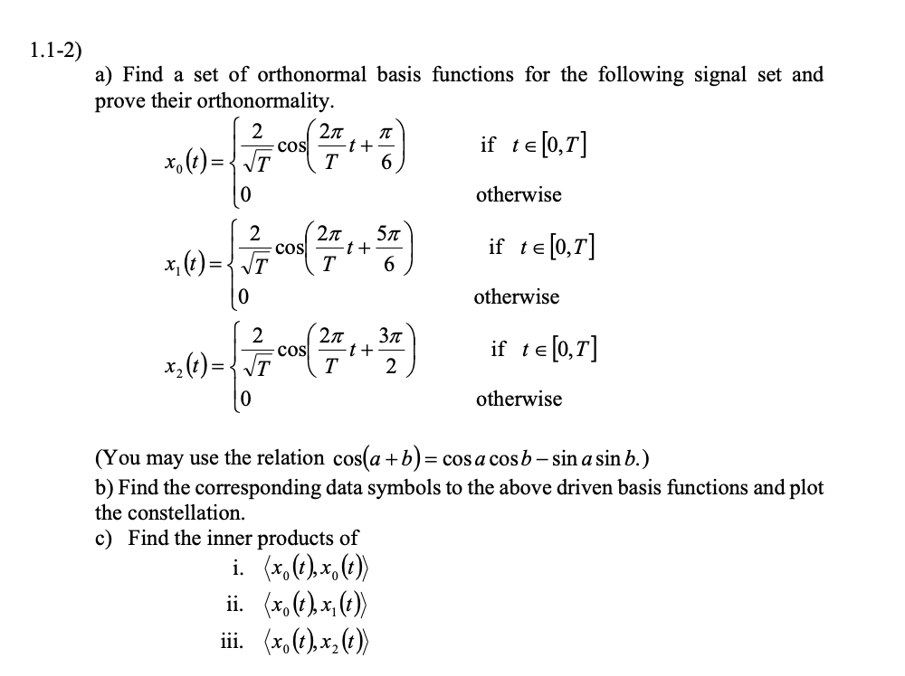
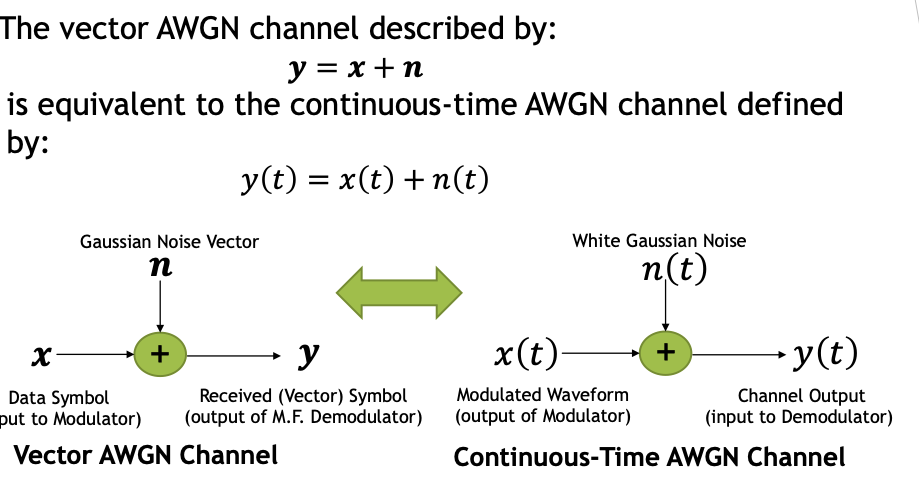
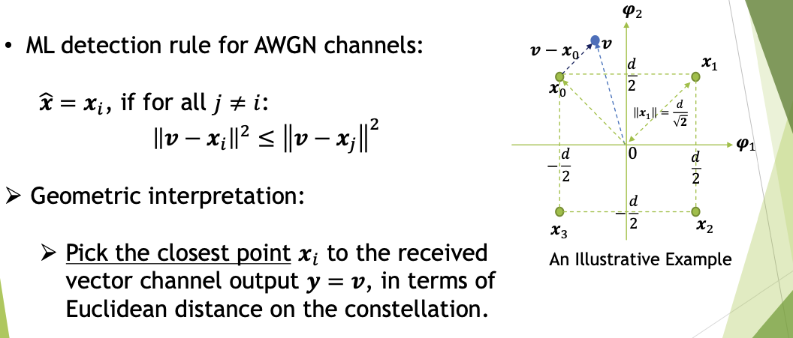
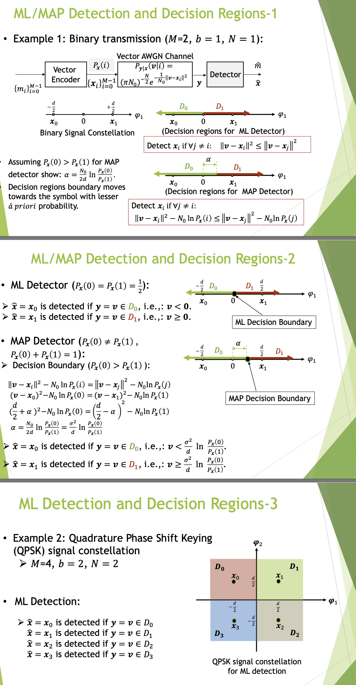
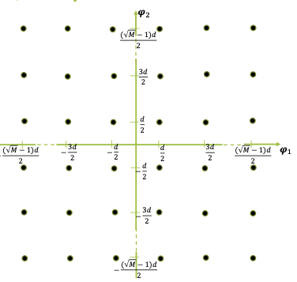
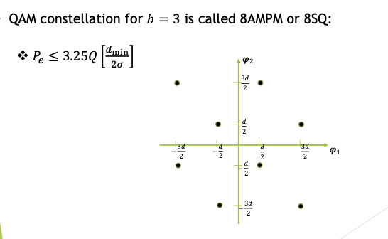

# Math Def in Prior
**Basis Vector** A set of basis vectors in a vector space is a minimal set of vectors that span the entire space. Any vector in the space can be expressed as a linear combination of these basis vectors.

**Basis Function** In function spaces, basis functions are analogous to basis vectors but applied to functions. They are a set of functions that can be combined(usually linearly) to represent any function within a certain space.

# Discrete Data Transmission

Messages are digital sequences of bits(Discrete data)
- Need to be converted to waveforms to get through the communication channel.

Transmitter: Converts discrete data into analog electrical signals(waveforms) that can be sent through the channel

Receiver: Receives the distorted waveforms and tries to recvover the sent messages.(Digital sequence of bits)

**Examples**:
- Ethernet, WiFi, Cable TV

## Message Source Process

$M$ represents the total number of elements in the sequence.

Message Source: Contains a finite set of messages $\{m_i\}^{M-1}_{i=0}: m_0,m_1, m_2, \dots, m_{M-1}$
- Messages: A digital sequence of bits (e.g.$m_5=$ 0b101)

The number of transmitted bits per message is $b = \log_2 M$

Every $T$ seconds, one of the mssages is transmitted.

Data Rate: Number of transmitted bits per second

$$R = \frac{b}{T} = \frac{\log_2 M}{T} \ \textrm{bits/sec}$$

## Transmission and Reception Process

Transmitter maps each message $m_i$ to a suitable continuous time waveforms $x_i(t)$, **Encoding and Modulation** $[m_i \to x_i(t)]$

Channel distorts and modifies the transmitted waveform $x_i(t)$ and outputs a corrupted waveform $y(t)$

Receiver maps $y(t)$ to an estimated message $\hat{m}$: **Demodulation and Detection** $[y(t) \to \hat{m}]$

----

**What are those suitable continuous-time waveforms and how they are chosen?** 

$x_i(t)$ must be chosen based on channel behavior

Example: Want to transmit a binary message 0 or 1, hence M = 2, and $b = \log_2 M = \log_2 2 = 1, m_0 = 0, m_1 = 1$. Transmit the binary message through the channel:

$$H(f) = \begin{cases} 1, 100 \textrm{Hz} < |f| < 200 \textrm{Hz} \\ 0, \textrm{Otherwise} \end{cases}$$

### Encoder

The encoder maps each message $m_i$ to an N-dimensional real-valued vector: $m_i \to \boldsymbol{x}_i, i = 0, 1, \dots, M-1$

$$\boldsymbol{x}_i \overset{\Delta}{=} \begin{bmatrix}x_{i1} \\ x_{i2} \\ \dots \\ x_{iN}\end{bmatrix} = \begin{bmatrix}x_{i1} &x_{i2} &\dots &x_{iN}\end{bmatrix}^T$$

$\boldsymbol{x}_i$ is called the $i$-th data symnbol corresponding to the $i$-th message $m_i$

The set of vectors $\{\boldsymbol{x}_i\}^{M-1}_{i=0}: \boldsymbol{x}_0, \boldsymbol{x}_1, \boldsymbol{x}_2, \dots, \boldsymbol{x}_{M-1}$ is called Signal Constellation

### Modulator

> Modulation is the process of encoding information onto a carrier signal by altering certain properties of the wave. The common properties that are modulated include:
> - Amplitude (Amplitude Shift Keying ASK)
> - Frequency (Frequency Shift Keying FSK)
> - Phase (Phase Shift Keying PSK)
> - A combination of amplitude and phase (Quadrature Amplitude Modulation, QAM)

A set of $N$ functions $\{\varphi_n(t)\}^N_{n=1}$ is called a set of $N$ orthonormal basis functions if:

$$\int_{-\infty}^{\infty}\varphi_n(t) \varphi_m(t) dt = \delta_{nm} = \begin{cases} 1, \textrm{if }n=m \\ 0, \textrm{if } n \neq m\end{cases}$$

- The different function in the set are orthogonal if their inner product is zero,  mathematically when their inner product, i.e. when $\int_{-\infty}^{\infty} \varphi_n(t)\varphi_m(t) dt = 0\ \textrm{if } n \neq m$
- Each function in the set has a norm(magnitude) of 1: $\int_{-\infty}^{\infty} \varphi_n(t)\varphi_n(t) = 1\ \textrm{if }n = m$

and $\varphi_{nm}$ is called a Kronecker delta.

- Kronecker delta is a function for describing the orthogonality property.

Given a set of $N$ orthonormal basis functions $\{\varphi_n(t)\}^N_{n=1}$, a modulator maps the $i$-th data symbol $\boldsymbol{x}_i$ to the $i$-th modulated waveform $x_i(t)$, $\boldsymbol{x}_i \to x_i(t)$ as:

$$x_i(t) = \sum_{n=1}^{N}x_{in}\varphi_n(t)$$

#### Inner Product

Inner Product in Vector Space: The inner product of two $N$-dimensional real-valued vectors $\boldsymbol{u} = [u_1u_2 \dots u_N]^\boldsymbol{T}$ and $\boldsymbol{v} = [v_1v_2 \dots v_N]^T$ is defined as 

$$<\boldsymbol{u,v}> \overset{\Delta}{=} \sum_{n=1}^{N}u_nv_n$$
- $\boldsymbol{u,v}$ is orthogonal if $<\boldsymbol{u,v}> = 0$ (For Euclidean Vectors, it is dot product)
- Sqaured-legnth of a vector $\boldsymbol{u}: ||\boldsymbol{u}||^2 = <\boldsymbol{u,u}>$

Inner Product in Continuous-Time Signal Domain: The inner product of two real-valued functions $u(t)$ and $v(t)$ is defined as:
$$<u(t), v(t)> \overset{\Delta}{=}\int_{-\infty}^{\infty}u(t)v(t)dt$$

Considering sampling of a continuous-time function $u(t)$ with infinitely small sampling period of $dt$.
- Given these infinite number of samples, $u(t)$ can be viewed as an infinite dimensional real-valued vector.

The squared-norm of a real valued $u(t)$ is:
$$||u(t)||^2 = <u(t), v(t)> = \int_{-\infty}^{\infty} u^2(t)dt$$

Hence, for modulator, the definition of $N$ orthonormal basis functions $\{\varphi_n(t)\}^N_{n=1}$ as:

$$\int_{-\infty}^{\infty}\varphi_n(t)\varphi_m(t) dt = \delta_{nm} = \begin{cases} 1 \textrm{ if } n = m\\ 0 \textrm{ if } n\neq m \end{cases}$$

> For $n=m$ is basically asking for squared-norm(squared magnitude), and for normalised values, it should be 1. For $n \neq m$ is asking for dot product, and it should be 0 when they are orthogonal

It can be interpreted in terms of inner product as:

$$< \varphi_n(t), \varphi_m(t)> = \begin{cases} 1 \textrm{ if }n = m\\0 \textrm{ if }n \neq m \end{cases}$$

---

**THEOREM** Given a set of orthonormal basis functions $\{\varphi_n(t)\}^N_{n=1}$ and two continuous-time functions $u(t)$ and $v(t)$, such that:

$$u(t) = \sum_{n=1}^{N}u_n\varphi_n(t), v(t) = \sum_{n=1}^{N}v_n\varphi_n(t)$$

for some N, then:

$$<u(t), v(t)> = <\boldsymbol{u, v}> = \sum_{n=1}^{N}u_nv_n$$

where:

$$\boldsymbol{u} \overset{\Delta}{=} \begin{bmatrix}u_1\\u_2\\\dots\\u_N\end{bmatrix}, \boldsymbol{v} \overset{\Delta}{=} \begin{bmatrix}v_1\\v_2\\\dots\\v_N\end{bmatrix}$$

PROOF

### Transmitter in General

Transmitter action: $m_i \overset{\textrm{Encoder}}{\longrightarrow} \boldsymbol{x_i} \overset{\textrm{Modulator}}{\longrightarrow}x_i(t)$

The set of modulated waveform $\{x_i(t)\}^{M-1}_{i=0}$ is called the **signal set**.

# Constellation Diagram

The constellation diagram, or signal constellation diagram:
- The X-axis is the real axis representing the in-phase component of the signal
- The Y-axis is the imaginary axis representing the quadrature-phase (or out-of-phase) component.
- The distance from the origin (amplitude) of a point represents the magnitude of the signal.
- The angle between the point and positive X-axis represents the phase of the signal (phase shift relative to the reference carrier signal).

In communication systems, signals are often decomposed into two orthogonal components, known as in-phase (I) and quadrature (Q). These terms refer to the relationship between the signal and a reference sine wave (called the carrier signal).

# Tutorial - 1

Question on finding Basis Function and corresponding data symbols

Piecewise Signals

# Symbols Occurrence Probability

The occurrence probability of the $i$-th point on the signal constellation, i.e. symbol $\boldsymbol{x}_i$ or equivalently the $i$-th message $m_i$ or the $i$-th modulated waveform $x_i(t)$, is denoted as $P_x(i)$

$$P_x(i), i = 0,1,\dots, M-1$$ 

is the discrete probability distribution of the symbols on the signal constellation.

$$\sum_{i=0}^{M-1}P_x(i) = 1$$

When the symbols are equally likely to be transmitted:

$$P_x(i) = \frac{1}{M}, i = 0, 1, \dots, M-1$$

# Average Energy and Average Power

The average energy of a signal constellation is 

$$\varepsilon_x \overset{\Delta}{=} E[||\boldsymbol{x}||]^2 = \sum_{i=0}^{M-1}||\boldsymbol{x}_i||^2 P_x(i)$$

- where $||\boldsymbol{x}_i||^2 = \sum_{n=1}^{N}x_{in}^2$ is the squared-length of the vector $\boldsymbol{x_i}$, $E$ denotes expected value.

The average power corresponds to the average energy per symbol period is given by

$$P_x \overset{\Delta}{=} \frac{\varepsilon_x}{T}$$

----

For any modulated waveform

$$x(t) = \sum_{n=1}^{N}x_n \varphi_n(t)$$

where $\boldsymbol{x} = [x_1, x_2, \dots, x_n]^T$ is a symbol on the constellation, the following relation holds:

$$\varepsilon_x = E[||\boldsymbol{x}||^2] = E[\int_{-\infty}^{\infty}x^2(t)dt]$$

*The average energy of a signal constellation is invariant to the choice of basis functions, as long as they are orthonormal* 

> When asking for average energy per dimension, the average energy should be divided by 2, since there's only 2 dimensions(in-phase and quadrature)

Proof

The proof directly follows the invariance of inner product with $u(t) = v(t) = x(t)$

$$E[||\boldsymbol{x}||^2] = E[<\boldsymbol{x}, \boldsymbol{x}>] = E[\int_{-\infty}^{\infty}x^2(t)dt]$$

----

Example

The norm of $x_i$ can be calculated like that is because of the inner product invariance theorem 

$$||u(t)||^2 = <u(t), u(t)> = <\boldsymbol{u}, \boldsymbol{u}>$$

# Tutorial on Energy

Energy Tutorial Question

# Demodulator

Demodulator recover a symbol $\boldsymbol{x}_i = [x_{i1}, x_{i2}, \dots, x_{iN}]^T$, given the corresponding modulated waveform $x_i(t)$ and the set of basis functions $\{\varphi_n(t)\}_{n=1}^{N}$

Process:

Define the N-dimensional unit basis vectors $\boldsymbol{\varphi}_n = [0, 0, \dots,1, \dots, 0]^T$ with a $1$ in the $n$-th position and $0$ everywhere else.

Then, the symbol $\boldsymbol{x}_i$ can be represented in vector space as:

$$x_i = \sum_{n=1}^{N}x_{in}\boldsymbol{\varphi}_n$$

And since $<\boldsymbol{\varphi}_n, \boldsymbol{\varphi}_m> = \begin{cases} 1, \textrm{ when }n=m\\ 0, \textrm{ when }n\neq m \end{cases}$, the $n$-th dimension of $\boldsymbol{x}_i$ can be retrived by:

$$<\boldsymbol{x}_i, \boldsymbol{\varphi}_n> = x_{in}, \forall n = 1,2, \dots , N$$

Both the modulated waveforms $x_i(t), i = 0, \dots, M-1$ and the basis functions $\varphi_n(t), n = 1,2,\dots, N$ satisfy the conditions of the theorem of inner-product invariance, hence

$$\forall n = 1,\dots, N \ \ \ \ \ \forall i = 0, 1, \dots, M-1$$

$$x_{in} = <\boldsymbol{x}_i, \boldsymbol{\varphi}_n> = <x_i(t), \varphi_n(t)> = \int_{-\infty}^{\infty}x_i(t)\varphi_n(t) dt$$

Hence, assume that the channel output $y(t) = x_i(t) = \sum_{n=1}^{N}x_{in}\varphi_n(t)$, then 

$$x_{in} = <y(t), \varphi_n(t)> = \int_{-\infty}^{\infty}y(t)\varphi_n(t)dt, n=1,2,\dots,N$$

to recover $\boldsymbol{x}_i = [x_{i1}, \dots, x_{iN}]^T$

# Vector Channel Model

$P_{\boldsymbol{y|x}}$ is the conditional probability of getting an output vector $\boldsymbol{y} = \boldsymbol{v}$ given a particular symbol $\boldsymbol{x}_i$ was transmitted, $P_{\boldsymbol{y|x}}(\boldsymbol{v}|i)$

$P_{\boldsymbol{x}}(i)$ is the discrete probability distribution indicates the probability of transmitting symbol $\boldsymbol{x}_i, i = 0, \dots, M-1$

Discrete probability distribution of the received symbol values $\boldsymbol{y}$ is given by

$$P_{\boldsymbol{y}}(\boldsymbol{v}) = \sum_{i=0}^{M-1}P_{\boldsymbol{y|x}}(\boldsymbol{v}|i)P_x(i)$$

- where $\boldsymbol{v}$ is a dummy variable spanning all the possible $N$-dimensional vector values of $\boldsymbol{y}$

The average energy of the received symbol $\boldsymbol{y}$ is given by

$$\varepsilon_y = \sum_{\boldsymbol{v}}^{}||\boldsymbol{v}||^2 P_\boldsymbol{y}( \boldsymbol{v})$$

- In the case of continuous probability density function, $P_ \boldsymbol{y}(\boldsymbol{v})$, integration replaces the summations.

----

As an example of $P_ \boldsymbol{y}(\boldsymbol{v})$ being a continuous pdf, consider a channel that simply adds noise vector $\boldsymbol{n}$ to the transmitted symbol $\boldsymbol{x}$ to produce the vector channel output:

$$\boldsymbol{y} = \boldsymbol{x} + \boldsymbol{n}$$

- In this case, $P_{\boldsymbol{y|x}}(\boldsymbol{v}|i) = P_\boldsymbol{n}(\boldsymbol{v} - \boldsymbol{x}_i)$, where $P_\boldsymbol{n}$ is the continuous pdf of noise vector $\boldsymbol{n}$ and $\boldsymbol{n}$ is independent of $\boldsymbol{x}$

$P_e$ is the probability that the decoded message $\hat{m}$ is not equa to the transmitted message $m$:
$$P_e = P(\hat{m} \neq m)$$

$P_c$ is the probabiity that the decoded message $\hat{m}$ is the same as the transmitted message $m$:
$$P_c = 1 - P_e = P(\hat{m} = m)$$

The optimum data detector minimizes $P_e$ and maximizes $P_c$

----

*a priori*  probability:
- $P_x(i)$ is the probability distribution of symbol values, $\{\boldsymbol{x}_i\}^{M-1}_{i=0}$
- $P_m(i)$ is the probability distribution of messages, $\{m_i\}^{M-1}_{i=0}$

*a posteriori* probability:
- $P_{\boldsymbol{x|y}}(i|\boldsymbol{v})$ is the conditional probability distribution of symbol values $\{\boldsymbol{x}_i\}^{M-1}_{i=0}$, given specific channel output $\boldsymbol{y} = \boldsymbol{v}$ is observed.
- $P_{m|{\boldsymbol{y}}}(i|\boldsymbol{v})$ is the conditional probability distribution of messages $\{m_i\}^{M-1}_{i=0}$, given specific channel output $\boldsymbol{y} = \boldsymbol{v}$ is observed.

> Due to one-to-one mapping: $m_i \to \boldsymbol{x}_i$, Hence, $P_{\boldsymbol{x}_i}(i) = P_m(i)$ and $P_{\boldsymbol{x|y}}(i| \boldsymbol{v}) = P_{m|\boldsymbol{y}}(i| \boldsymbol{v})$

## Maximum *a posteriori* (MAP) Detector

MAP Transmitted symbol: $\overset{\max}{i} P_{\boldsymbol{x |y }}(i | \boldsymbol{v})$, means that the detector selects the symbol $i$ that maximizes the probabilty that the symbol data $\boldsymbol{x}_i$ is transmitted, given that the signal $\boldsymbol{v}$ is received.

MAP rule minimize $P_e$ by choosing the message $m_i$(or the symbol data $\boldsymbol{x}_i$) that maximizes *a posteriori*  probability $P_{\boldsymbol{x|y}}(i|\boldsymbol{v})$ over $i$.

According to Baye's Rule:

$$P_{\boldsymbol{x|y}}(i|\boldsymbol{v}) = \frac{P_{\boldsymbol{x,y}}(\boldsymbol{x} = \boldsymbol{x}_i, \boldsymbol{y} = \boldsymbol{v})}{P_\boldsymbol{y}(\boldsymbol{y} = \boldsymbol{v})} = \frac{P_{\boldsymbol{y|x}}(\boldsymbol{v}|i) P_x(i)}{P_\boldsymbol{y}(\boldsymbol{y} = \boldsymbol{v})}$$

MAP detector maximizing $P_{\boldsymbol{x|y}}(i|\boldsymbol{v})$ over $i$, MAP rule says: $\hat{m} = m_i$(or $\hat{\boldsymbol{x}} = \boldsymbol{x}_i$), if for all $j \neq i$:

$$P_{\boldsymbol{y|x}} (\boldsymbol{v}|i)P_\boldsymbol{x}(i) \geq P_{\boldsymbol{y|x}}(\boldsymbol{v}|j)P_\boldsymbol{x}(j)$$

## Maximum Likelihood (ML) Detector

ML Detector Transmitted symbol: $\overset{\max}{i}P_{\boldsymbol{y|x}} (\boldsymbol{v}|i)$, means that the detector selects the symbol $i$ that maximizes the probability that the signal $\boldsymbol{v}$ is received, given that the 

MAP Detector becomes ML Detector, when the symbols are equally likely to be transmitted, i.e. $P_x(i) = \frac{1}{M}$

$\hat{\boldsymbol{x}} = \boldsymbol{x}_i$ if for all $j \neq i$:

$$P_{\boldsymbol{y|x}}(\boldsymbol{v}|i) (\frac{1}{M}) \geq P_{\boldsymbol{y|x}}(\boldsymbol{v} | j)(\frac{1}{M})$$

Which means

$$P_{\boldsymbol{y|x}}(\boldsymbol{v}|i) \geq P_{\boldsymbol{y|x}}(\boldsymbol{v} | j)$$

## Detector Tutorial

Tutorial Question 1

Tutorial Question 2

## Decision Regions

Decision Region (MAP Detector):

$$D_i = \{\boldsymbol{v}| P_{\boldsymbol{y|x}}(\boldsymbol{v}|i) P_\boldsymbol{x}(i) \geq P_{\boldsymbol{y|x}}(\boldsymbol{v}|j)P_{\boldsymbol{x}}(j) \ \ \ \forall j \neq i\}$$

Decision Region (ML Detector)

$$D_i = \{\boldsymbol{v}| P_{\boldsymbol{y|x}}(\boldsymbol{v}|i) \geq P_{\boldsymbol{y|x}}(\boldsymbol{v}|j)\ \ \ \forall j \neq i\}$$

Example:

## Irrelevance Theorem

The channel output signal $\boldsymbol{y}$ may content information (or component) that is useless in deciding which one of the $M$ symbols was transmitted.

The irrelevant component of channel output may be discarded without affecting the decision performance:

**Irrelevance Theorem** : Let $\boldsymbol{y} = \begin{bmatrix} \boldsymbol{y}_1 \\ \boldsymbol{y}_2\end{bmatrix}$ be the output of the vector channel. The component $\boldsymbol{y}_2$ can be ignored by the detector under the following equivalent conditions:
- $P_{\boldsymbol{x}| [\boldsymbol{y_1,y_2}]} = P_{\boldsymbol{x|y_1}}$
- or $P_{\boldsymbol{y_2} | [\boldsymbol{y_1,  x}]} = P_{\boldsymbol{y_2|y_1}}$ 

Proof

Example of Irrelevance Theorem

## Reversibility Theorem

Reversibility Theorem: The application of an invertible transformation $\boldsymbol{y}_1 = G(\boldsymbol{y}_2)$ on the channel $\boldsymbol{y}_2$ does not affect the performance of the MAP/ML detector. i.e. either $\boldsymbol{y_1}$ or $\boldsymbol{y_2}$ is sufficient to detect the transmitted symbol $\boldsymbol{x}$ optimally.

# The Additive White Gaussian Noise (AWGN) Channel

AWGN is a commonly used model for channels where the noise $n(t)$ is domniated by the thermal noise of the front-end analog receiver circuitry.

$n(t)$ is assumed to be *white* and *Gaussian stationary* random process.

At each time instant $t_0, n(t_0)$ is a Gaussian random variable.

----

$n(t)$ is stationary: The autocorrelation of $n(t)$ at any two instants of time $t_0$ and $t_1$ is a function of their time difference, $\tau = t_1 - t_0$, that is:

$$E[n(t_0)n(t_1)] = E[n(t)n(t-\tau)]$$

> Autocorrelation is a measure of how a signal or random process is correlated with itself at different time shifts.
> - In simpler term, autocorrelation answer the question: "How much does the signal at time $t$ resemble the signal at time $t + \tau$?"
> - For random process $X(t)$, the autocorrelation function at a time lag $\tau$ is defined as the expected value of the product of the process with a time-shifted version of itself: $R_{X(\tau)} = E[X(t) X(t+\tau)]$

----

$n(t)$ is white: The noise samples at any two different time instants are uncorrelated

$$E[n(t)n(t-\tau)] = \frac{N_0}{2}\delta(\tau)$$

for any non-zero time offset $\tau$

----

The Power Spectral Desntiy (PSD) of $n(t)$, which is the fourier transform of the autocorrelation function, is characterized by the Boltzman equation:

$$N(f) = \frac{hf}{e^{\frac{hf}{kT}} -1} \approx kT,\ \textrm{for }f \leq 10^{12} = 300 \textrm{GHz}$$
- $k = 1.38\times 10^{-23} \textrm{Joules/degree Kelvin: Boltzman's constant}$
- $h = 6.63 \times 10^{-34} \textrm{Watt-s}^2: \textrm{Planck's constant}$
- $T$ Temperature on the Kelvin scale.

----
$n(t)$ is assumed to be zero mean:

$$E[n(t)] = 0$$

Why $n(t)$ is assumed Gaussian?:
- Due to the Central Limite Theorem: many small noise sources contribute to $n(t)$

----

$n(t)$ is briefly denoted by its distribution (Normal or Gaussian), mean and variance (in power/Hz, or Watts/Hz) as

$$n(t) \sim \mathcal{N} (0, \frac{N_0}{2})$$

- where $\frac{N_0}{2} = \sigma^2$, and $\sigma^2$ is the variance of noise in Watts/Hz

----

The samples of the demodulated random noise vector $\boldsymbol{n} = [n_1, n_2, \dots, n_N]^T$ are the projection of the random process $n(t)$ on the basis function $\varphi_1(t), \varphi_2(t), \dots, \varphi_N (t)$, i.e.

$$n_i = < n(t), \varphi_i(t)> = \int_{-\infty}^{\infty}n(t)\varphi_i(t)dt, i=1,2,\dots,N$$

and Since $n_i$ is a linear combination(sum/integral) of Gaussian random variables, each demodulated sample $n_i$ is also a Gaussian random variable.

- Thus, $\boldsymbol{n}$ is a Gaussian random vector.
- Since $n(t) \sim \mathcal{N}(0, \frac{N_0}{2})$ is zero mean, $\boldsymbol{n}$ is also zero mean, i.e., $E[n_i] = 0, i = 1,2,\dots, N$

Samples of the demodulated noise vector $\boldsymbol{n}$ are independent from one another and have equal variance of $\sigma^2 = \frac{N_0}{2}$

## Optimal Detector for AWGN Channel

$n(t)$ may not be exactly reconstructed from its demodulated samples $\boldsymbol{n}$

$$n(t) \neq \hat{n}(t) = \sum_{k=1}^{N}n_k\varphi_k(t) \Rightarrow y(t) \neq \hat{y}(t) = \sum_{n=1}^{N}y_n\varphi_n(t) = x(t) + \hat{n}(t)$$

Thus the unrepresented part of $n(t)$:

$$\bar{n}(t) = n(t) - \hat{n}(t) = y(t) - \hat{y}(t)$$
- $\bar{n}(t)$ is the unrepresented part of the noise $n(t)$

However, $\bar{n}(t)$ is irrelevant in decision-making, and can be ignored by the detector without any loss in performance.

## Conclusion on AWGN Channel

The vector AWGN channel $\boldsymbol{y} = \boldsymbol{x} + \boldsymbol{n}$ is equivalent to the continuous-time AWGN channel for optimum decision making:

$$y(t) = x(t) + n(t)$$

## Probabilistic Model of Vector AWGN Channel

For the vector AWGN channel: $\boldsymbol{y}= \boldsymbol{x} + \boldsymbol{n}$,
- $\boldsymbol{n} = [n_1, n_2, \dots, n_N]^T$: N-dimensional Gaussian random vector with zero mean, equal variance and uncorrelated elements on each dimension, i.e. $n_k \sim \mathcal{N}(0, \frac{N_0}{2}), k=1,2,\dots,N$

> $N_0$ is the noise power spectral density. The variance is $\sigma^2 = \frac{N_0}{2}$

> $N$ is the dimensionality of the signal space.

The probability distribution of the noise vector $\boldsymbol{n}$ is:

$$P_\boldsymbol{n}(\boldsymbol{u}) = (\pi N_0)^{- \frac{N}{2}} e^{- \frac{1}{N_0} || \boldsymbol{u}||^2}$$

and the variance is

$$\sigma^2 = \frac{N_0}{2}$$

Hence, the vector AWGN channel $\boldsymbol{y} = \boldsymbol{x} + \boldsymbol{n}$ in terms of conditional probability:

$$P_{\boldsymbol{y|x}}(\boldsymbol{v|i}) = P_{\boldsymbol{n}}(\boldsymbol{v} - \boldsymbol{x}_i) = (\pi N_0)^{- \frac{N}{2}}e^{-\frac{1}{N_0}||\boldsymbol{v} - \boldsymbol{x}_i||^2}$$

### MAP Detection Rule for Vector AWGN Channel

Minimizing $P_e$

$\hat{\boldsymbol{x}} = \boldsymbol{x}_i$, if for all $j \neq i$

$$P_{\boldsymbol{y|x}}(\boldsymbol{v}|i)P_{\boldsymbol{x}}(i) \geq P_{\boldsymbol{y|x}}(\boldsymbol{v}|j)P_{\boldsymbol{x}}(j)$$

$$e^{- \frac{1}{N_0}||\boldsymbol{v} - \boldsymbol{x}_i||^2}P_{\boldsymbol{x}}(i) \geq e^{- \frac{1}{N_0}||\boldsymbol{v} - \boldsymbol{x}_j||^2}P_{\boldsymbol{x}}(j)$$

Hence

$$||\boldsymbol{v} - \boldsymbol{x}_i||^2 - N_0 \ln P_{\boldsymbol{x}}(i) \leq ||\boldsymbol{v} - \boldsymbol{x}_j||^2 - N_0 \ln P_{\boldsymbol{x}}(j)$$

### ML Detector

When symbols are equally likely to be transmitted, $P_{\boldsymbol{x}}(i) = \frac{1}{M}$

$\hat{\boldsymbol{x} } = \boldsymbol{x}_i$ if for all $j \neq i$

$$P_{\boldsymbol{y|x}}(\boldsymbol{v}|i)P_{\boldsymbol{x}}(i) \geq P_{\boldsymbol{y|x}}(\boldsymbol{v}|j)P_{\boldsymbol{x}}(j)$$

$$e^{- \frac{1}{N_0}||\boldsymbol{v} - \boldsymbol{x}_i||^2} \geq e^{- \frac{1}{N_0}||\boldsymbol{v} - \boldsymbol{x}_j||^2}$$

Hence

$$||\boldsymbol{v} - \boldsymbol{x}_i||^2 \leq || \boldsymbol{v} - \boldsymbol{x}_j||^2$$

#### Simple Interpretation of ML Detection Rule for AWGN Channels

Pick the closest point $\boldsymbol{x}_i$ to the received vector channel output $\boldsymbol{y}= \boldsymbol{v}$, in terms of Euclidean distance on the constellation.

## ML and MAP Detector for vector AWGN channel Example

# Normal Distribution Reminder
A normal distribution is a continuous probability distribution characterized by a bell-shaped curve, and it is defined by two parameters:

**Mean** $\mu$: This is the average or expected value of the distribution, and it defines the center of the distribution.

**Variance** $\sigma^2$ This measures the spread or width of the distribution. A higher variance means the distribution is more spread out.

The PDF of a normal distribution is givern by

$$f(x) = \frac{1}{\sqrt{2\pi \sigma^2}}e^{- \frac{(x-\mu)^2}{2 \sigma^2}}$$

## Properties of Normal Distribution

**Symmetry** 

The normal distribution is symmetric about its mean $\mu$. This means that the distribution to the left of the mean is a mirror image of the distribution to the right.

----

**Mean, Median, Mode are Equal** 

The mean, median and mode all coincide at $\mu$, since the distribution is perfectly symmetric.

## Standard Normal Distribution

A special case of normal distribution is where the mean is 0 and variance is 1, the distribution became standard normal distribution:

$$Z \sim \mathcal{N}(0,1)$$

PDF of standard normal distribution is

$$f(z) = \frac{1}{\sqrt{2\pi}}e^{0 \frac{z^2}{2}}$$

Any normal distribution can be converted to a standard normal distribution by using the transformation

$$Z = \frac{X - \mu}{\sigma}$$

## Q Function

$$Q(x) = \frac{1 }{\sqrt{2\pi}} \int_{x}^{\infty} e^{- \frac{t^2}{2} }dt$$

The Q function gives the probability that a standard normal variable exceeds a certain value $x$.

# Average Probability of Error, $P_e$

Consider vector AWGN channel: $\boldsymbol{y}= \boldsymbol{x} + \boldsymbol{n}$

$P_e$ is usually calculated for the ML detector, i.e. $P_{\boldsymbol{x}}(i) = \frac{1}{M}$
- The optimum ML detector: $\hat{\boldsymbol{x}} = \boldsymbol{x}_i$ (or $\hat{m} = m_i$), if for all $j \neq i$: $|| \boldsymbol{v} - \boldsymbol{x}_i||^2 \leq || \boldsymbol{v} - \boldsymbol{x}_j||^2$
- $P_e$ for ML detector only depends on the signal constellation and the noise variance $\sigma^2 = \frac{N_0}{2}$

$$P_e = P(\hat{m} \neq m) = \sum_{i=0}^{M-1}P_{e|i}P_x(i)$$

and 

$$P_{e|i} = P(\hat{m} \neq m_i | m = m_i) = P(\hat{\boldsymbol{x}} \neq \boldsymbol{x}_i | \boldsymbol{x } = \boldsymbol{x}_i) = \textrm{Prob.}\{\boldsymbol{n} \textrm{ such that: }\boldsymbol{y} = \boldsymbol{v }\in D_j, j\neq i, \boldsymbol{x } = \boldsymbol{x}_i\}$$

## 1-Dimensional Binary Transmission $P_e$

$$P_{\boldsymbol{n}}(\boldsymbol{n}) = (\pi N_0)^{-\frac{N}{2}}e^{- \frac{1}{N_0}||\boldsymbol{n}||^2}$$

Let $\sigma^2 = \frac{N_0}{2}$

$$P_{\boldsymbol{n}}(\boldsymbol{n}) = \frac{1}{\sqrt{2\pi \sigma^2}} e^{- \frac{n^2}{2\sigma^2}}$$

The calculation of $P_{e|0} = \textrm{Prob.}\{\boldsymbol{n} \textrm{ such that } \boldsymbol{y} = \boldsymbol{v} \in D_1, \boldsymbol{x} = \boldsymbol{x}_0\}$

$$P_{e|0} = P_{\boldsymbol{n}} ( n \geq \frac{d }{2 }) = \int_{\frac{d }{2 }}^{+\infty} \frac{1}{\sqrt{2 \pi \sigma^2}} e^{- \frac{n^2 }{2\sigma^2}} dn$$
- $d \overset{\Delta}{=} || \boldsymbol{x}_0 - \boldsymbol{x}_1||$ is the distance between the pair of symbols $\boldsymbol{x_0}$ and $\boldsymbol{x}_1$
- Change the variable $u = \frac{n }{\sigma}$, we get $dn = \sigma du$

$$P_{\boldsymbol{n}}(n \geq \frac{d }{2}) = \int_{\frac{d }{2}}^{\infty} \frac{1 }{\sqrt{2\pi\sigma^2}}e^{-\frac{n^2}{2\sigma^2}}dn = \frac{1}{\sqrt{2\pi}} \int_{\frac{d }{2\sigma}}^{\infty} e^{- \frac{u^2}{2}}du = Q[\frac{d }{2\sigma}]$$

Thus $P_{e|0} = Q[\frac{d }{2\sigma}]$

Similarly: $P_{e|1} = P_{\boldsymbol{n}}(n \leq - \frac{d }{2}) = P_{\boldsymbol{n}}(n \geq \frac{d}{2}) = Q[ \frac{d }{2\sigma}]$

Since $P_x(0) = P_x(1) = \frac{1}{2}$

$$P_e = P(\hat{m} \neq m) = \sum_{i=0}^{1}P_{e|i}P_{\boldsymbol{x}}(i) = Q [ \frac{d }{2\sigma}]$$

## N-dimensional $P_e$ calculation

The N-Dimensional Noise Vector $\boldsymbol{n} = \boldsymbol{n}_1 + \boldsymbol{n}_2$

The decision region still bisects the line segment connecting the 2 symbols $\boldsymbol{x}_i$ and $\boldsymbol{x}_j$

Tutorial Question 1

Tutorial Question 2

## Q-Function Value Graphs

To calculate $P_e = Q[\frac{d}{2\sigma}]$ using Q-function value graphs:

1. Find $20\log_{10}(\frac{d }{2\sigma})$ and project it on the horizon axis
2. Using the graph, read the corresponding value on the vertical axis.

Because Q funciton value graph is monotonically decreasing function of its argument, hence

$d \uparrow \Rightarrow$  Larger Q-function argument

$\frac{d}{2\sigma}\uparrow \Rightarrow$ Lower $P_e \downarrow$

## Rotational Invariance of $P_e$

$P_e$ is invariant under the rotation of all symbols in a constellation by an orthogonal transformation $\boldsymbol{T}$.

## Translational Invariance

$P_e$ is invariant under the translation of all symbols in a constellation by a constant vector $\boldsymbol{a}$ i.e. $\boldsymbol{x}_i - \boldsymbol{a} = \hat{\boldsymbol{x}}_i$, for all $i=0, 1, \dots, M-1$

However, translation does change the average energy of constellation, because

$$||\hat{\boldsymbol{x}}||_i^2 \neq ||\boldsymbol{x}_i||^2 \textrm{ for all }i = 0, 1, \dots, M-1$$

Tutorial Question

## Minimum Energy Translate of a Signal Constellation

Minimum Energy Translate refers to a technique used to minimize the required energy for transmitting symbols while ensuring reliable communication.

Minimum energy translate of a constellation is achieved by subtracting the constant vector $\boldsymbol{a} = E[\boldsymbol{x}] = \sum_{i=0}^{M-1}\boldsymbol{x}_i P_{\boldsymbol{x}}(i)$, from each data symbol in the constellation.

The average energy of the minimum energy translated constellation is $[\varepsilon_{\boldsymbol{x - a}}]_{min} = \varepsilon_{\boldsymbol{x}} - || E [\boldsymbol{x}]||^2$

Subtracting the constant vector $\boldsymbol{a} = E[\boldsymbol{x}]$ from each constellation point minimizes the average transmitted energy without affecting the $P_e$
- due to translational invariance

## Union Bound
Union bound on probability of error $P_e$ for the ML-detector in AWGN channel is given by

$$P_e \leq (M-1) Q [ \frac{d_{min}}{2\sigma}]$$

- where $M$ is the number of symbols on the signal constellation, $\sigma = \sqrt{\sigma^2}$, and $d_{\min}$ is the smallest separation between any two symbols on the constellation, i.e.

$$d_{\min} \overset{\Delta}{=} \overset{min}{i\neq j} ||\boldsymbol{x}_i - \boldsymbol{x}_j||, \forall i \neq j$$

Tutorial Question

### Nearest Neighbor Union Bound (NNUB)

The multiplier factor (i.e. $M-1$) is replaced by the constellation's **average number of nearest neighbors**, $N_e$, to produce a cclose-to-accurate UB on $P_e$

> 算得更快，更accurate因为他只考虑nearest neighbor

$$N_e \overset{\Delta}{=} \sum_{i = 0}^{M-1}N_iP_\boldsymbol{x}(i)$$

> $N_i$ is the number of other constellation's symbols that share a common decision region boundary with the symbol $x_i$, usually approximated to the symbol with $d_{\min}$ from the $x_i$

The NNUB for ML-detector's $P_e$ on the AWGN channel is given by

$$P_e \leq N_e Q[\frac{d_{\min}}{2\sigma}]$$

8 PSK NNUB Example

8 AMPM NNUB Example

## Bit-Error Rate and Probability

### Average Bit Error Rate $P_b$
$$P_b \overset{\Delta}{=} \sum_{i=0}^{M-1} \sum_{j, j\neq 1}^{} n_b(i,j) \cdot P\{\varepsilon_{ij}\}\cdot p_\boldsymbol{x}(i)$$

- $n_b(i,j)$ is the number of bits in error when symbol $x_j$ is wrongly detected instead of symbol $x_i$
> basically 就是把nearest neighbour, 也就是dmin最少的那几个点, 对比一下哪几个bit是错的，然后把他们加起来，比如101和111就是错1位
- $P\{\varepsilon_{ij}\}$ is the symbol-error probability corresponding to wrongly detecting symbol $x_j$ instead of symbol $x_i$
- $P_x(i)$ is the a priori probability of transmitting symbol $x_i$

Typically, $P_b$ is approximated.

$$P_b \approx N_b Q[\frac{d_{\min}}{2\sigma}]$$
- $N_b = \int_{i=0}^{M-12}n_b(i)P_x(i)$
- $n_b(i) = \sum_{N_i - \textrm{Nearest Neighbours}}^{}n_b(i,j)$

Remember that $P_b$ is not a probability.

And $P_b$ is an approximation not a upper-bound.

### Average bit-error probability

If each symbol $x_i$ corresponds to a message $m_i$ with $b$ binary information bits, then, the average bit-error probability $\bar{P_b}$ is defined as:

$$\bar{P_b} \overset{\Delta}{=} \frac{P_b}{b} \approx \bar{N_b}Q[\frac{d_{\min}}{2\sigma}]$$

- $\bar{N_b} = \frac{N_b}{b}$, the average total number of bit errors per number of bits.
- $\bar{P_b} \approx \bar{N_b}Q[\frac{d_{\min}}{2\sigma}]$ never exceed 1

Average bit-error probability example

## Packet Error-Free Second Probability

Several messages cascaded into a larger message form a packet or a block of information bits.

An entire packet may be useless if one of the bits is in error.

Consider a duration of one second containing a packet of $B$ independent bits.
- The probability of an error-free second (i.e. a second free of error) is
$$P_{\textrm{efs}} = (1 - \bar{P_b})^B$$

## Constellation Measures

Number of dimensions available for the construction of signal constellation is

$$N = 2WT$$

- $T$ is the symbol period, and $W$ is the total bandwidth used.

---

Number of bits per dimension for a signal constellation is defined as

$$\bar{b} = \frac{b}{N} = \frac{\log_2 M}{N}$$

The related definition is the data-rate

$$R = \frac{b}{T}$$

The spectral efficiency in "bits/second Hz" of a signal constellation is

$$\frac{R}{W} = \frac{b/T}{N/2T} = 2 \frac{b }{N} = 2\bar{b}$$

---

The average energy per dimension for a signal constellation is

$$\bar{\varepsilon_x} = \frac{\varepsilon_x}{N}$$

The related definition is the average power:

$$P_x = \frac{\varepsilon_x}{T}$$

Further more

$$\frac{P_x}{2W} = \frac{\varepsilon_x / T }{N/T} = \frac{\varepsilon_x}{N} = \bar{\varepsilon_x}$$

----

The Signal-to-Noise Ratio for AWGM channel is defined as

$$\textrm{SNR} = \frac{\bar{\varepsilon_x}}{\sigma^2}$$

> The average energy of a signal constellation $\varepsilon_x$ is given by $\varepsilon_x = \sum_{i=0}^{M-1}||x_i||^2 P_x(i)$

> The noise energy per dimention for an N-dimensional AWGN channel is $\bar{sigma^2} = \sigma^2 = \frac{N_0}{2}$

----

Constellation Figure of Merit (CFM) is defined as:

$$\zeta_x = \frac{ (\frac{d_{\min}}{2})^2}{\bar{\varepsilon_x}}$$

- CFM is unitless

CFM is a useful measure for comparing constellation with the same $\bar{b} = \frac{b}{N}$, provided that $\bar{b}>1$

Generally, a higher CFM leads to a constellation with a better performance and quality in channel use.

# Constellation and Modulation Types

$N$ represents the number of dimensions in the modulation scheme.

$M$ represents the total number of symbols in the modulation scheme.

$b$ represents the number of bits per symbols.

$\bar{b}$ represents the average number of bits per symbol, it is used in cases involving probablistic modulation schemes or defining the efficiency in a communication system.

## Cubic Signal Constellation

## Binary Antipodal

> Antipodal refers to two points that are directly opposite to each other on a given structure.

## Binary Phase Shift Keying BPSK

## Non-Return-to-Zero NRZ

## On-Off Keying

## Circular Constellations (M-PSK Constellation)

Symbols are equally spaced on a circle with radius $\sqrt{\varepsilon_x}$ in 2 dimensions, N = 2

## Quadrature Phase Shifting Keying (QPSK) 

$N = b = 2$

## Pulse Amplitude Modulation

$N=1$

NNUB is exact for PAM

$$P_e = 2(1- \frac{1}{M}) Q[\frac{d }{2\sigma}] = $$

## Channel Filtering

PAM Low Pass Channel.

QAM Band Pass Channel.

## Quadrature Amplitude Modulation

QAM is a generalization of PAM in 2D.

QAM basis function

### M-QAM Square Constellation

> $\otimes$ means Cartesian Product, it combines two sets to generatre all possible ordered pairs, where each pair consists of one element from the first set and one element from the second set.

For the M-QAM Square Constellation

### M-QAM Cross Constellation

Happens when b is odd.

> 当他有奇数逼的时候

### Amplitude Modulated Phase Modulation AMPM

