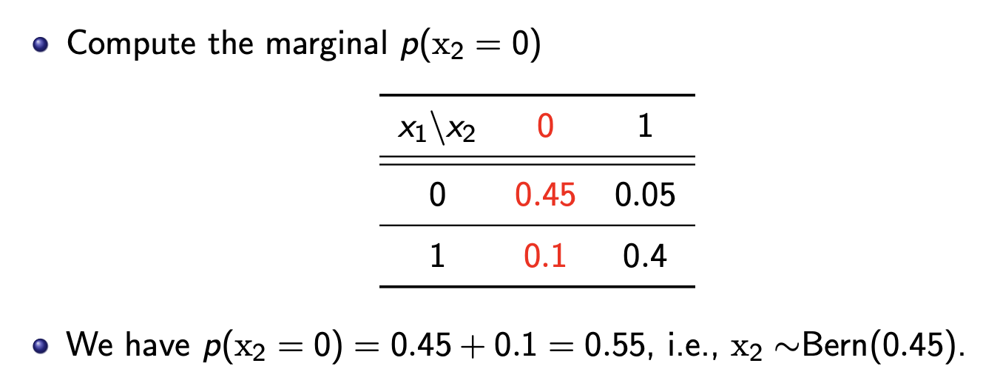
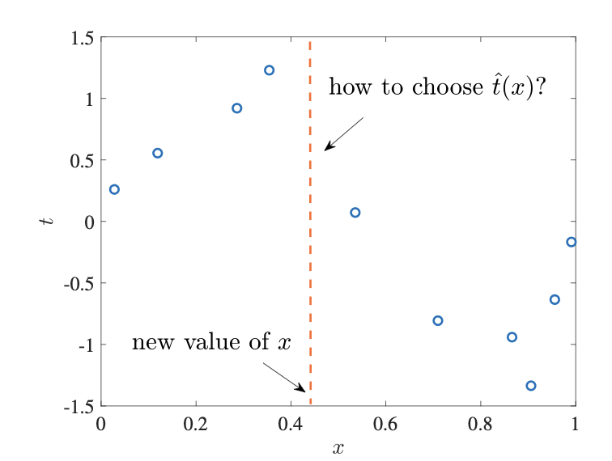
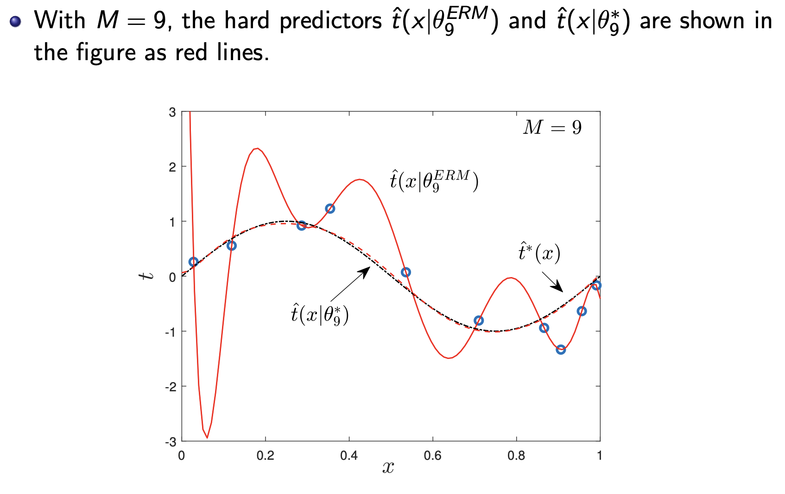

# Random Variables

A random variable (rv) is a numerical quantity that takes value in a set $\mathcal{X}$ with some probability:
- **discrete**: the domain $\mathcal{X}$ contains a discrete finite number of values. e.g. $\mathcal{X} = \{0,1\}$
- **continuous**: the domain $\mathcal{X}$ can take values on a continuum $\mathcal{X}$. e.g. $\mathcal{X} = \R$

A realization $\mathcal{X} = x$ of the rv $\mathcal{X}$ means that rv $\mathcal{X}$ takes the value $x$

## Discrete Random Variables
A discrete rv $\mathcal{X}$ is described by a pmf, $p(x)$.
$$\mathcal{X} = p(x) = \textrm{Pr}[\mathcal{X} = x]$$
- $0 \leq p(x) \leq 1, \sum_{x \in \mathcal{X}}^{}p(x) = 1$

### Bernoulli RV

A Bernoulli(binary) variable $\mathcal{X} \sim \textrm{Bern}(q)$ takes value in set $\mathcal{X} = \{0,1\}$
- pmf $p(x) = \textrm{Bern}(x|q)$
- $p(1) = q$
- $p(0) = 1-q$

### Categorical RV
A categorical(multinoulli) variable $\mathcal{X} \sim \textrm{Cat}(q)$ takes values in $\mathcal{X} = \{0,1,\dots,C-1\}$
- pmf $p(x) = \textrm{Cat}(x|q)$
- $p(k) = q_k$
- probability vector $q = [q_0, q_1, \dots, q_{C-1}]$ with $\sum_{k=0}^{C-1}q_k = q_0 + q_1 + \dots + q_{C-1} = 1$

$\mathcal{X}^{OH}$ is of dimension $C \times 1$ with all zeros except for a 1 in the $(k+1)$th position where $\mathcal{X}=k$
- example if $C=4, \mathcal{X} = 0$ then
$$\mathcal{X}^{OH} = \begin{bmatrix}1 \\ 0 \\ 0\\ 0\end{bmatrix}$$

## Continuous RV
Continuous RV is defined by pdf: $p(x): \mathcal{X} \sim p(x)$
- $p(x)\geq 0, \int_{-\infty}^{\infty}p(x)dx = 1$

Example Gaussian Variable $\mathcal{X} \sim \mathcal{N}(\mu, \sigma^2)$, takes real values in $\mathcal{X} = \R$

$$p(x) = \mathcal{N}(x|\mu, \sigma^2) = \frac{1}{\sqrt{2\pi \sigma^2}}\textrm{exp}(- \frac{(x-\mu)^2}{2\sigma^2})$$
- $\int_{a}^{b}p(x)dx = \textrm{Pr}[\mathcal{X} \in (a,b)]$

## Expectation

$$E_{\mathcal{X}\sim p(x)}[af(\mathcal{X}) + bg(\mathcal{X})] = aE_{\mathcal{X}\sim p(x)}[f(\mathcal{X})] + bE_{\mathcal{X}\sim p(x)}[g(\mathcal{X})]$$

### Expectation on Discrete RV

$$E_{\mathcal{X} \sim p(x)} [\mathcal{X}] = \sum_{x \in \mathcal{X}}^{}p(x)\cdot x$$

*The average observed value of $\mathcal{X}$ if we erpeat the measurement many times* 

The expectation of a function of a discrete rv:

$$E_{\mathcal{X} \sim p(x)} [f(\mathcal{X})] = \sum_{x \in \mathcal{X}}^{}p(x)\cdot f(x)$$

Example

### Expectation on Continuous RV

$$E_{\mathcal{X} \sim p(x)} [f(\mathcal{X})] = \int_{-\infty}^{\infty}p(x)f(x)dx$$

# Vectors

Column Vector: $x = \begin{bmatrix}1 \\ 0\\ 0\end{bmatrix}$

Row Vector: $x^T = \begin{bmatrix}1 & 0 & 0\end{bmatrix}$

## Inner Product

Inner Product measures the degree of alignment(similarity) between vectors.

Inner Product between two $L \times 1$ vectors:

$$<x, y> = x^T y = \sum_{i=1}^{L}x_iy_i$$

- Large positive inner product means strong alignment
- 0 Inner Product indicates vectors are orthogona

## Norm

Geometrically, the norm $||x||$ measures the length of vector $x$.

The squared $\ell_2$ norm of a vector is defined as

$$||x||^2 = x^T x = \sum_{i=1}^{L} x^2_i$$

---

The $\ell_2$ norm is

$$||x|| = \sqrt{x^T x} = \sqrt{\sum_{i=1}^{L}x_i^2}$$

---

Normalization 

$$\tilde{x} = \frac{x}{||x||}$$

And $||\tilde{x}||^2 = 1$

# Matrix

A **square** matrix has equal dimensions $L \times L$.

A **symmetric** matrix $A$ is a square matrix that satisfies the equality $A^T = A$. Diagnal matrices are symmetric.
- $[A]_{i,j} = [A]_{j,i} \ \ \textrm{for }i\neq j$

The $L \times L$ Diagonal Matrix $\textrm{Diag}(a)$ is defined as

$$\textrm{Diag}(a) = \begin{bmatrix}a_1 & 0 & \dots & 0\\ 0 & a_2 &\dots & 0 \\ \dots & \dots & \dots & \dots \\ 0 & 0 & \dots & a_L\end{bmatrix}$$

Identity matrix is a special diagonal matrix $I_L = \textrm{Diag}(1_L)$

## Matrix Vector Multiplication

$$[A]_r: [a_{r1}, a_{r2}, a_{r3}...,a_{rM}]$$

is a $M \times 1$ vector containing the $r$th row of matrix $A$.

And the right multiplication of an $L \times M$ matrix $A$ by an $M \times 1$ vector $x$, yields the $L \times 1$ vector.

$$Ax = \begin{bmatrix}[A]_{1:}x \\ [A]_{2:} x \\ \dots \\ [A]_{L:}x\end{bmatrix} $$

- The : in $[A]_{i:} x$ means, select the $i$-th row, and get the dot product between it and vector $x$

The left multiplication of an $L \times M$ matrix $A$ by transpose of an $L \times 1$ vector $x$ yields the $1 \times M$ vector

$$x^T A = (A^T x)^T$$

----

For $L \times 1$ vector $x, y$:

$$\textrm{Diag}(x)y = \textrm{Diag}(y)x = \begin{bmatrix}x_1y_1 \\ x_2 y_2 \\ \dots \\ x_L y_L\end{bmatrix} = x \odot y$$

- $\odot$ means element-wise(Hadamard) product of two vectors of the same size.

## Matrix-Matrix Multiplicaiton

For $L \times M$ and $M \times D$ matrices $A$ and $B$. The product $AB$ is given by the $L \times D$ matrix:

$$AB = [A[B]_{:1}\ A[B]_{:2}\ \dots \ A[B]_{:D} = \begin{bmatrix}[A]_{1:}B \\ [A]_{2:}B \\ \dots \\ [A]_{L:}B\end{bmatrix}$$

----

$$\textrm{Diag}(x) \textrm{Diag}(y) = \textrm{Diag}(x \odot y)$$

# Random Vectors

> 他写的$\mathcal{X}$ 太他妈的复杂傻逼了，我决定直接用$X$来表示

A collection of multiple, jointly distributed, random variables define a random vector.

$$X = \begin{bmatrix}X_1 \\ X_2 \\ \dots \\ X_L\end{bmatrix}$$

## Discrete Random Vectors
When all rvs are discrete, with $x_i \in X$, the joint distribution is defined by a **joint point pmf** $p(x)$

> The joint probability mass function (joint PMF) of discrete random vectors describes the probability that a pair (or more generally, a tuple) of discrete random variables simultaneously take specific values.

$$p(x) = p(x_1, \dots, x_L)$$
$$= \textrm{Pr}[X = x]$$
$$= \textrm{Pr}[X_1 = x_1] \textrm{ and }X_2 = x_2 \dots \textrm{ and } X_L = x_L$$

- We have $0 \leq p(x) \leq 1$ and $\sum_{x_1 \in X}^{}\sum_{x_2 \in X}^{} \dots \sum_{x_L \in X}p(x) = 1$
- We can think of $p(x)$ as the fraction of time we observe $\{X_1 = x_1, X_2 = x_2, \dots, X_L = x_L\}$, repeating the measurements many times.

---

Example:

Jointly Bernoulli Random Vector $X = [X_1, X_2]^T$ with joint pmf $p(x_1, x_2)$:

## Continuous Random Variables

When all the rvs are continuous, with $x_i \in \R$, the joint distribution is defined by a **Joint pdf** $p(x)$

## Marginal Distributions

Give a joint distribution $p(x_1, x_2)$ what is the distribution $p(x_1)$ of $x_1$?

 
The marginal distribution of $x_1$ is given as

$$p(x_1) = \sum_{x_2 \in X}^{} p (x_1, x_2)$$

- i.e. it measure the fraction of times that $X_1 = x_1$ no matter what the value of $x_2$ is.

If asked to find $p(X_1 = 0)$

## Conditional Distribution

If $X_2 = x_2$ what is the probability distribution of $X_1$

This is the conditional distribution $p(x_1 | x_2)$

$$p(x_1 | x_2 = \frac{p(x_1,x_2)}{p(x_2)}) = \frac{p(x_1, x_2)}{\sum_{x_1 \in X}^{}p(x_1, x_2)}$$

## Identically Distribution

Identically distributed refers to the property of a set of rvs that all have the same probability distribution.

## Independent Random Variables

Two rvs are independent if their joint distribution can be written as a product of the marginal distributions:

$$p(x_1, x_2) = p(x_1)p(x_2)$$

## Chain Rule

$$p(x_1,x_2) = p(x_1) p(x_2|x_1)$$

Chain Rule Example

## Independent Random Variables

$N$ random variables are independent, if the joint distribution can be written as the product of marginals:

$$p(x_1,x_2,\dots,x_N) = p(x_1)p(x_2)\dots p(x_N)$$
$$=\prod_{i=1}^N p(x_i) $$

> $\Pi$ is the product operator

---

More generally, the chain rule gives that

$$p(x_1,x_2,\dots,x_N) = p(x_1)p(x_2|x_1)p(x_3|x_1,x_2)\dots p(x_N| x_1, x_2, \dots, x_{N-1})$$
$$= \prod_{i=1}^N p(x_i|x_1, \dots, x_{i-1})$$

## Bayes Theorem

Bayes’ Theorem is a mathematical formula that describes how to update the probabilities of hypotheses when given evidence.

$$p(x_2|x_1) = p(x_2) \frac{p(x_1|x_2)}{p(x_1)}$$

Posterior distribution = Prior distribution times the likelihood ratio.
- Posterior probability is the probability of event $x_2$ occuring given that $x_1$ is true
- Prior probability, or the initial probability of event $x_2$ occuring before taking into account $x_1$
- likelihood ratio is the probability of event $x_2 given that $x_1$ is true compares with the marginal probability of $x_2$  which ensures the probabilities sums to 1.

# Defining Inference
The inference problem have input variable $x$, and output(target) variable $t$.

The general problem in inference is to obtain a predictor of target $t$ given input $x$ based on a probabilistic model.
- Model = Joint Distribution $p(x,t)$

> In learning problem, the joint distribution is not known, but in inferencep roblem, it is available to design the predictor

## Detection Problem

The target $t$ takes values in a discrete and finite set.
- e.g. predicting rain vs shine weather, or predicting next word in a text.

Detection Example

## Estimation Problem

The Estimation problem is when the target $t$ is continuous.
- e.g. predicting temperature, or predicting next frame in a video.

## Predictor

Hard Predictor(point predictor) specifies a single predicted value $\hat{t}$ of $t$ for every value of $X = x$
- we write $\hat{t}(x)$ for the predictive function mapping input $x$ to predicted value $t$

Soft Predictor specifies a score for each possible value of $t$ given $X=x$
- we write $q(t|x)$ for the function returning the score of value $t$ for a given value $x$

> $t|x$ is not a conditional probability, it simply means the input is parameter t and it is depending on x

Predictor Example

For the weather prediction (detection) example, a possible hard predictor

- when $x = 0$, predict $\hat{t} = 0$
- when $x = 1$, predict $\hat{t} = 1$

This corresponds to the hard predictive function $\hat{t}(x)$ defined as $\hat{t}(0) = 0$ and $\hat{t}(1) = 1$

A possible soft predictor is

- when $x = 0$ output the distribution $(0.8, 0.2)$
- when $x = 1$ output the distribution $(0.3, 0.7)$

corresponds to the soft predictive function $q(t|x)$ defined as $q(1|0) = 0.2, q(1|1) = 0.7$

## Optimal Soft Prediction, aka Bayesian Inference

A natural choice for the soft predictor $q(t|x)$ of $t$ given $X = x$ is the posterior distribution $p(t|x)$
- The score $q(t|x)$ assigned to each value of $t$ is its posterior probability given $X=x$

Example

## Loss Function and Optimal Hard Prediction

To measure the quality of a hard prediction $\hat{t}$ when the correct value for the target variable is $t$, we introduce a loss function

$$\ell(t, \hat{t})$$

We will assume without loss of generality that the loss function satisfies the conditions

$$\ell(t, \hat{t}) = 0, \textrm{if } t= \hat{t}$$
$$\textrm{and }\ell (t, \hat{t}) \geq 0$$

For estimation, we often use the $\ell_k$ loss for some integer $k \geq 1$, which is defined as

$$\ell(t, \hat{t}) = \ell_k(t, \hat{t}) = |t - \hat{t}|^k$$

A typical choice is $k = 2$ which yields the quadratic error.

One can give different weight to errors $\{t \neq \hat{t}\}$

----

The 0-1 loss, aka detection-error loss, defined as

$$\ell(t, \hat{t}) = \mathbf{1}(t \neq \hat{t})$$

where the indicator function

$$\mathbf{1}(a) = \begin{cases} 1, \textrm{if }a= \textrm{true}\\ 0, \textrm{if } a= \textrm{false} \end{cases}$$

### Population Loss

The average loss with respect to the model $p(x,t)$ is konwn as the population loss

$$L_p(\hat{t}(\cdot)) = E_{(x,t) \sim p(x,t)}[\ell(t, \hat{t}(x))]$$

- The inner part $\ell(t, \hat{t}(x))$ calculates the error for a single prediction
- The Expected value calculates the average error across all possible inputs $x$ and output $t$, weighted by their likelihood $p(x,t)$
- The final equation calculates the voerall average loss for the model $\hat{t}(x)$

More generally, for the detection-error loss, for discrete rv $t$, we have

$$L_p(\hat{t}(\cdot)) = E_{(x,t)\sim p(x,t)}[\mathbf{1}\hat{t}(x) \neq t] = \textrm{Pr}[\hat{t}(x)\neq t]$$

## Optimal Hard Predictor

For a given loss function, an optimal hard predictor minimizes the population loss.

$$\hat{t}^*(\cdot) = \arg \underset{\hat{t}(\cdot)}{\min} L_p(\hat{t}(\cdot))$$

- The notation means the "argument" that minimizes the function in the bracelets.

Optimal Hard Predictor Example

### Detection Error Loss

$$\hat{t}^*(x) = \arg \underset{t}{\max}\ p(x,t) = \arg \underset{t}{\max}\ p(t| x)$$

- aka The maximum of the posterior distribution

This is known as the maximum a posteriori(MAP) predictor.

### $\ell_2$ Loss

For estimation problems, under the $\ell_2$(quadratic loss), the optimal hard predictor is the mean of the posterior distribution

$$\hat{t}^*(x) = E_{t \sim p(t|x)}[t]$$

## Optimal Soft Prediction

The **log-loss**(**cross-entropy loss**) for a soft predictor $q(t|x)$ on an inout-output pair $(x,t)$ is defined as

$$-\log q(t|x)$$

the log-loss measures the "suprises" experienced by the predictor when observing $t =  t$ given $X = x$
- The surprieses are higher if the output is less expected.

If $t$ is a discrete rv, if we have a detection problem, the score $q(t|x)$ is constrained in the interval $[0,1]$
- Therefore the log-loss $-\log q(t|x) \geq 0$ and $-\log q(t|x) = 0$ if and only if $q(t|x) = 1$

If $t$ is a continuous rv, if we have a estimation problem, the score $q(t|x)$ is non-negative and it can be larger than $1$.
- Therefore, the log-loss $-\log q(t|x)$ can be negative when $t$ is continuous.

### Population Log-Loss

$$L_p(q(\cdot | \cdot)) = E_{(x,t)\sim p(x,t)}[-\log q(t|x)]$$

An optimal soft predictor is then be obtained by minimizing the population log-loss

$$q^*(\cdot|\cdot) = \arg \underset{q(\cdot|\cdot)}{\min}\ L_p(q(\cdot|\cdot))$$

Which is minimized when we choose $q^*(t|x) = p(t|x)$

Population Example

Given that observation $x_5 = 0$, provide a hard prediction of bit $x_6$ that minimizes the average detection error loss by using the model.

using the table, $p(x_6 = 0| x_5 = 0) = 0.1$, and thus the optimal prediciton that minimizes the average detection-error loss is $\hat{x_6} = 1$

---

Given the observation $x_2 = 0$, provide the optimal soft prediction of bit $x_1$ by using the model $p(x_1,x_2)$ derived from the table and from the uniform distribution of random variable $x_1$

# Supervised Leraning

An inductive bias refers to the set of assumptions or preconceptions that a learning algorithm uses to make predictions or generalize from training data to unseen instances.

> For example, in supervised learning: Given a few points on a 2D plane, a linear regression algorithm assumes that the relationship between x and y is linear, which is an inductive bias.

**Regression problems**, the target variable $t$ are continuous-valued. 
- When the model is known and tractable, these correspond to estimation problems in inference. 

**Classification problems**, the target variable $t$ takes value in a discrete and finite set.
- When the model is known and tractable, these correspond to detection problems in inference.

## Regression

We are given a training set $\mathcal{D}$ of $N$ training data points $\mathcal{D} = \{(x_n, t_n): n = 1, \dots, N\}$, where
- $x_n$ represents the $n$-th input(or covariate vector, or explanatory variables)
- $t_n$ represents the corresponding $n$-th desired output(or target variables, or responses)

The goal is to predict the output $t$ for a test, as of yet unobserved, input $x$.

in this module, data is assumed to be generated according to a true distribution $p(x,t)$ in an i.i.d. manner.
- The true distribution $p(x,t)$ is referred to as **population distribution** 

The training set $\mathcal{D}$ is assumed to be generated as

$$(x_n, t_n) \underset{i.i.d.}{\sim} p(x,t), n = 1, \dots, N$$

And the test pair $(x,t)$ is drawn independently from the same distribution

$$(x,t) \underset{\textrm{independent of }\mathcal{D}}{\sim} p(x,t)$$

Classification Example

> Empirical distribution is a distribution that represents the observed data.

Regression Example

## Supervised Training of Deterministic Models: ERM

> A deterministic model is a mathematical or computational model that provides a precise and predictable output for a given set of input parameters or initial conditions. In such models, the outcome is entirely determined by the input data, and there is no element of randomness or uncertainty in the process. This contrasts with stochastic models, where randomness plays a role, and the same inputs may yield different outputs on different runs.

We start by selecting a model class $\mathcal{H}$ of hard predictors $\hat{t}(\cdot | \theta)$, which are parameterized by a vector $\theta \in \Theta$ in some set $\Theta$

$$\mathcal{H} = \{\hat{t}(\cdot | \theta): \theta \in \Theta\}$$

## Loss Function

We can measure the quality of a hard predictor $\hat{t}(\cdot| \theta)$ and hence of a model parameter $\theta$, for a pair $(x,t)$ by evaluating the loss

$$\ell(t, \hat{t}(\cdot|\theta))$$

For regression, we typically use the $\ell_k$ loss with some $k\geq 1$

$$\ell(t, \hat{t}) = \ell_k(t,\hat{t}) = |t - \hat{t}|^k$$

For classification, we often use the detection-error loss

$$\ell(t,\hat{t}) = \mathbf{1}(t\neq\hat{t})$$

### Population Loss

Given the inductive bias $\mathcal{H}$ and the loss functino, the goal of supervised learning is to minize the population loss

$$L_p(\theta) = E_{(x,t)\sim p(x,t)}[\ell(t,\hat{t}(x|\theta))]$$
- Which is konwn as generalization or out-of-sample loss

But unlike inference, we don't know $p(x,t)$, thats why we need training loss.

### Training Loss
$$L_{\mathcal{D}}(\theta) = \frac{1}{N} \sum_{n=1}^{N} \ell(t_n, \hat{t}(x_n|\theta))$$

Training loss measures the empirical average of the loss accumulated by the predictor on the examples of the training set.

The training loss $L_{\mathcal{D}}(\theta)$ is an estimate of the population loss $L_p(\theta)$ based on the training data set.

## Law of Large Numbers

## Empirical Risk Minimization(ERM)

By law of large numbers, the training loss

$$L_{\mathcal{D}}(\theta) = \frac{1}{N} \sum_{n=1}^{N} \ell(t_n, \hat{t}(x_n|\theta))$$

Tends to the population loss $L_p(\theta)$ as $N\to \infty$ with high probability for any fixed $\theta$.

This limit, suggests ERM as principle for learning.

$$\theta^{\textrm{ERM}}_{\mathcal{D}} = \arg \underset{\theta \in \Theta}{\min}L_{\mathcal{D}}(\theta)$$

## Model Class Selection

### Validation

$$\mathcal{H}_M = \{\hat{t}(x|\theta) = \theta^T u (x) = \sum_{i=0}^{M} \theta_i x^i\}$$

The model class of polynomials of degree - or model order - $M$.

**Population-optimal unconstrained predictor**:

$$\hat{t}^*(\cdot) = \arg \underset{\hat{t}(\cdot)}{\min}\ L_p(\hat{t}(\cdot))$$

> The predictor that minimizes the population loss without any constraint on the model class.

**Population-optimal within-class predictor**:

$$\theta^*_M = \arg \underset{\theta\in \R^{M+1}}{\min}\ L_p(\theta)$$

> The optimization is constrained the optimization to the model class $\mathcal{H}_M$

**ERM predictor**:

$$\theta^{\textrm{ERM}}_{M} = \arg \underset{\theta \in \R^{M+1}}{\min}\ L_{\mathcal{D}}(\theta)$$

---

**Underfitting** 

With $M = 1$, the ERM predictor $\hat{t}(x|\theta^{\textrm{ERM}}_1)$ underfits the data, the model is not rich enough to capture the variations presents in the data.
- Small **estimation error**, since the ERM solution is a good approximation of the population-optimal within-class parameter, i.e. $\theta^{\textrm{ERM}}_1 \simeq \theta^*_1$
- Large **bias**, even with the population-optimal within-class parameter, the predictor $\hat{t}(x|\theta^*_1)$ is very different from the population-optimal unconstrained predictor $\hat{t}^*(x)$
- Underfitting yields both large training loss $L_{\mathcal{D}}(\theta^{\textrm{ERM}}_{\mathcal{D}})$ and a large population loss $L_p(\theta^{\textrm{ERM}}_{\mathcal{D}})$

---

**Overfitting** 

With $M = 9$, the ERM predictor $\hat{t}(x | \theta^{\textrm{ERM}}_9)$ overfits the data, the model is too rich and, in order to account for the observations in the training set, it yields inaccurate predictions outside it.
- Overfitting model memorize the training set, rather than leraning how to generalize to unseen examples.
- Large **estimation error**, since the ERM solution $\theta^{\textrm{ERM}}_9$ is not a good approximation of the population-optimal within-class parameter $\theta^*_9$
- A small bias, since with the population-optimal within-class parameter, the predictor $\hat{t}(x|\theta^*_9)$ would be a good approximation of the population-optimal unconstrained predictor $\hat{t}^*(x)$, i.e. $\hat{t}(x|\theta^*_9) \simeq \hat{t}^*(x)$
- if we had more data, with a larger $N$, we would be able to ensure that the ERM solution is a good approximation of the population-optimal within-class model. $\theta^{\textrm{ERM}}_9 \simeq \theta^*_9$

## Validation

Validation is the standard approach to estimate the population loss.

Keep some data as validation set to estimate the population loss

> The validation set should not be used for training

$$\mathcal{D}^v = \{(x^v_n, t^v_n)\}^{N^v}_{n=1}$$

The validation data set of $N^v$ data points, the validation estimate $\hat{L}_p(\theta)$ of the population loss for a model parameter vector $\theta$ is defined as the empirical loss on the validation set.

$$\hat{L}_p(\theta) = L_{\mathcal{D}^v}(\theta) = \frac{1}{N^v} \sum_{n=1}^{N^v}\ell(t^v_n, \hat{t}(x^v_n|\theta))$$

