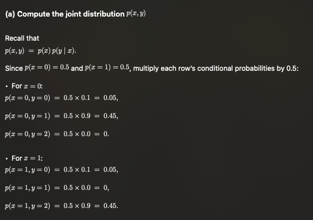
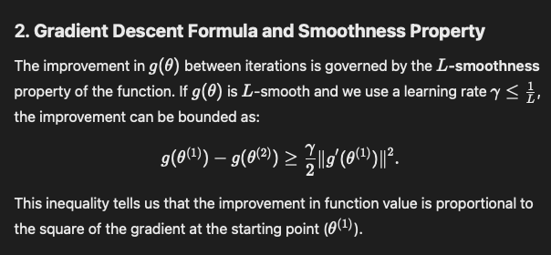

I just dont give a fuck on the lectures, this is how to do exam questions

# Probabilities

## Ask to find Joint Distribution

!!!REMEMBER: The equation for Joint Probabilities

$$
p(x,y) = p(x)p(y|x)
$$

## Ask to find another conditional distribution

Bayes' rule:

$$
p(x|y) = \frac{p(x,y)}{p(y)}
$$

Finding $p(y)$

## Predictors

Hard prediction produces a single, fixed output $\hat{y} = 1$
- Hard predictions are required in cases where a clear decision is necessary, such as in classification tasks where a model must assign each input to one specific class.

$$
\hat{y} = \arg \underset{y}{\max}\ P(y|x)
$$

> Basically means find the value of y that maximise the value of $P(y|x)$, whatever

Soft prediction provides probabilities or confidence scores for each possible output $P(y=0) = 0.2, y(y=1) = 0.8$

Optimal prediction minimizes the probability of making an error.
- typically just selects the most likely class for a given input, aka. MAP rule.

### Optimal hard prediction

## Finding minumum probability of error

Firstly you find the optimal detection rule for each value. In this case is to find the best y under all the possible value of x.

Hence, first you find $P_c$, then $P_e = 1 - P_c$

$$
P_c = \sum_{i=0}^{length(x) - 1} P_(x_i) P_{y_c|x_i}
$$

> 我瞎几把写的，我自己看得懂就行了，这条公式很可能不是mathematically correct的

# Distribution shits

## Empirical Distribution

In simple terms, an empirical distribution reflects the proportions of different outcomes based on actual observations in a dataset, rather than theoretical probabilities.
> So basically if sth happens 100 out of 200 times, then the probability of it happening is 100/200

Empirical distribution is constructed directly from data.

## Log Loss

> Log loss (short for logarithmic loss) is a performance metric for evaluating the predictions of a probabilistic model, particularly in classification problems. It measures the difference between the predicted probabilities of a model and the actual class labels. Log loss quantifies how uncertain or incorrect a classifier's predictions are.

Population log loss:

$$
L_p(\theta) = E_{(x,t) \sim p(x,t)} [- \log p(t| x, \theta)]
$$

----

Training log loss:

$$
L_D(\theta) = \frac{1}{N} \sum_{n=1}^{N}(-\log p(t_n|x_n, \theta))
$$

他说的很复杂，但basically就是你先选一个true label

比如t=1就是你的true label，那所有t=1的情况的probability都直接当$p_c$来算

其他的t就当作$(1-p_c)$

最后给他们加起来处以N（sample size）就行了。

这种题就只是给他前面多乘一下而已

# Obtain the optimal soft predictor

Optimal soft predictor  is a probabilistic model that predicts the probability of a target variable t given an input x in a way that minimizes the expected log-loss

## Obtain minimum unconstrained population loss, bias, and estimation error

The minimum unconstrained population loss is when using the soft-predictor.

$q^*(t|x) = p(t|x)$

$$
L_{min} = L(q^*(t|x)) = L(p(t|x))
$$

And if the question stated its a unconstrained shit, then bias is 0.

And that Population Log-loss = L_min + Bias + Estimation Error

And that Bias and Estimation Error is 

# Optimization shits

## Stationary Points

Just find derivative

## Gradient Descent

$$
\theta^{(k+1)} = \theta^{(k)} - \gamma g'(\theta^{(k)})
$$

- where $\gamma$ is the step size
- where $\theta^{(1)}$ is the starting point

## L-smooth

The L-smoothness property is a mathematical condition describing how "fast" the gradient of a function g(θ) can change.

- Larger L means changes more rapidly

A function $g(\theta)$ is L-smooth if:

$$
|g'(\theta_1) - g'(\theta_2)| \leq L|\theta_1 - \theta_2|, \forall \theta_1,\theta_2
$$

hence, just find the second derivative to get the value of $L$

## Learning Rate problem

# Neural Networks

Input layers is where the input data fed into the network
- In this case is $\vec{x} = [1, -1]^T$

Hidden Layers are the intermediate layers between the input and output. They process the input data using weights and activation functions
- Here, there's a hidden layer with two neurons.

Weights: each neuron in a layer is connected to the neurons in the next layer using weights.
- Weights determine how much influence one neuron has on another
- For example, the weights for the first layer are given by the matrix $W$

Activation functions: after applying weights, the network applies an activation function to introduce non-linearly.
- Here the activation function is ReLU(Rectified Linear Unit), defined as
    - $\textrm{ReLU}(z) = \max(0,z)$

Output Layer: the final layer produces the output (e.g. the predicted class or probability)
- Here the output is processced by the sigmoid function
    - $\sigma(z) = \frac{1}{1+e^{-z}}$

## Ask for finding the probability output

## Ask for optimal hard prediction

## Gradient of log-loss

