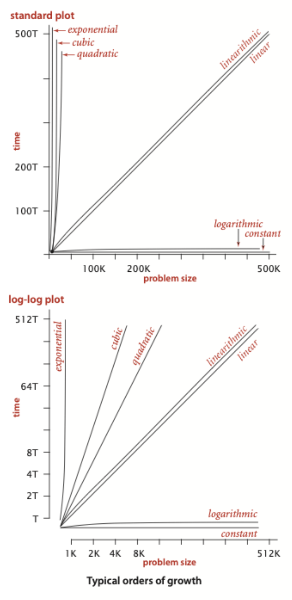

# Analysis of Algorithms

## Basic Logarithmic Shit

1. Logarithm of Products

$$\log_b(x\cdot y) = \log_b(x) + \log_b(y)$$

2. Logarithm of a Power

$$\log_b(x^c) = c \cdot \log_b(x)$$

3. Change of Base Formula

$$\log_b(x) = \frac{\log_k(x)}{\log_k(b)}$$

## Tilde Approximation
Basically get rid of the low-order term to reduce complexity.

We write $\sim f(N)$ to represent any function that, when divided by $f(N)$, approaches 1 as $N$ grows.

> Example $N^3/6 - N^2/2 + N/3$ can be write in tilde approximation $N^3/6$

## Order-of-growth Classification

### Constant
A program whose running time's order of growth is constant executes a fixed number of operations to finish its job.

i.e. **The running time does not depend on *N*.**

Example: Adding two numbers

### Logarithmic
Efficiency is barely slower than constant-time program.

Algorithms that exhibit logarithmic growth often divide the problem into smaller subproblems, typically reducing the size of the problem space by a constant factor (often by half) with each step.

Example: Binary Search

### Linear
Programs that spend a constant amount of time processing each piece of input data, or that are based on a single for loop, are quite common. The running time is proportional to $N$.

Example: Find the maximum
### Linearithmic

The running time has a order of growth $N\log N$.

Example: Mergesort

### Quadratic
Order of growth $N^2$, usually has two nested for loops.

Example: Check all pairs

### Cubic
Order of growth $N^3$, usually has three nested for loop.

Example: Check all triples

### Exponential
Programs whose running times are proportional to $b^N, b> 1$.

Exponential algrotihms are extremely slow.

Example: Check all subsets

