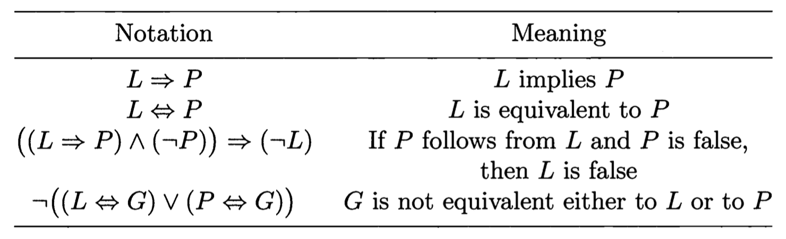

# Logical Symbolism

The order of priorities for the logical symbol:

$$\neg, \wedge, \vee, \Rightarrow, \Longleftrightarrow$$

> For example, $(x^2 - 3x + 2 = 0) \Longleftrightarrow (x = 1) \vee (x = 2)$.

The special symbol $:=$ (equality by definition) in which the colon placed on the side of the object being defined.

> For example $\int_{a}^{b} f(x) dx := \lim_{\lambda(P) \to 0} \sigma(f;P,\xi)$, means the right hand side defines the left-hand side.

# Sets and Elementary Operations on them
The words "class", "family", "totality" and "collection" are synonyms for "set" in naive set theory.

Cantorian("naive") set theory:
- A set may consist of any distinguishable objects
- A set is unambiguously determined by the collection of objects that comprise it
- Any property defines the set of objects having that property

> If $x$ is an object, $P$ is the property, and $P(x)$ denotes the assertion that $x$ has the property $P$, then the class of objects having the property $P$ is denoted $\{x| P(x)\}$. The objects that constitute a class or set are called the elements of the class or set.

The set consisting of the elements $x_1, \dots, x_n$ is usually denoted $\{x_1, \dots, x_n\}$

When only have one element, for example $\{a\}$, we can just denoted it simply as $a$

But this is only for naive set theory, modern mathematics have more complicated shits to define a set.

## The Inclusion Relation

The sets are denoted by uppercase letters, and their elements are lowercase letters.

$$x \in X$$

and its negation as

$$x \notin X$$

For logical symbols, there's $\exists$ ("there exists", "there are") and $\forall$ ("every", "for any")

$$\forall x((x\in A) \Longleftrightarrow (x\in B))$$

For this logical relation, it means $A = B$, the set A and B are the same.

If every element of $A$ is an element of $B$, we write as $A \subset B$, says that $A$ is a subset of $B$. This is called inclusion relation.

Thus

$$(A \subset B) := \forall x ((x\in A) \Rightarrow (x \in B))$$

If $A \subset B$ and $A \neq B$, we say that the inclusion $A \subset B$ is strict or that $A$ is a proper subset of $B$.

Hence

$$(A = B) \Longleftrightarrow (A\subset B) \wedge (B \subset A)$$

> If $M$ is a set, any property $P$ distinguishes in $M$ the subset $\{x \in M| P(x)\}$ consisting of the elements of $M$ that have the property
> - $M = \{x \in M| x\in M\}$
> - $\oslash = \{x \in M | x\neq x\}$, i.e. If $P$ is taken as a property that no element of the set $M$ has, for example $P(x):= (x \neq x)$, hence this is called the empty subset of $M$.

## Elementary Operations on Sets

Let $A$ and $B$ be subsets of a set $M$.

- The *union* of $A$ and $B$
$$A \cup B := \{x \in M | (x \in A) \vee (x \in B)\}$$

- The *intersection* of $A$ and $B$
$$A \cap B := \{x \in M | (x \in A) \wedge (x \in B)\}$$

- The *difference* between $A$ and $B$
$$A \setminus B := \{x \in M | (x \in A) \wedge (x \notin B)\}$$

The difference between the set $M$ and its subset $A$ is usually called the "complement" of $A$ in $M$, denoted as $C_M A$ or $CA$

de Morgan's theorem can also be applied here

$$C_M(A \cup B) = C_MA \cap C_M B$$
$$C_M(A \cap B) = C_MA \cup C_M B$$

Proof of de Morgan's theorem

$$(x\in C_M(A\cup B)) \Rightarrow (x\notin (A\cup B)) \Rightarrow ((x \notin A) \wedge (x \notin B))$$

$$\Rightarrow (x \in C_M A) \wedge (x \in C_M B) \Rightarrow (x \in (C_M A \cap C_M B))$$

similar for the other side

----
The *direct(Cartesian) product of sets*, For any two sets $A$ and $B$ one can form a new set:

$$\{A,B\} = \{B,A\}$$

This set has two elements if $A \neq B$ and one element if $A = B$, this is unordered pair of sets A and B.

For ordered pair $(A,B)$ in which the elements are endowed with additional properties to dinstinguish the first and second elements of the pair $\{A, B\}$, the equality
$$(A,B) = (C,D)$$

between two ordered pairs means by definition that $A = C$ and $B = D$. In particular if $A \neq B$, then $(A,B) \neq (B,A)$

Let $X$ and $Y$ be arbitrary sets, the set

$$X \times Y := \{(x,y)| (x\in X) \wedge (y \in Y)\}$$

This is called the direct or Cartesian product of the sets $X$ and $Y$(In that order) 

Because the order matter, hence $X \times Y \neq Y \times X$, equality only holds if $X = Y$ and $X \times X$ can be denoted as $X^2$

----

In the ordered pair $z = (x_1, x_2)$, which is an element of the direct product $Z = X_1 \times X_2$ of the sets $X_1$ and $X_2$, the element $x_1$ is the first projection of the pair $z$
# Functions
Let $X$ and $Y$ be certain sets. We say that there is a function defined on $X$ with values in $Y$ if, by virtue of some rule $f$, to each element $x \in X$ there corresponds to an element $y \in Y$

- The set $X$ is the domain of definition of the function, $x$ denote a general element of the domain called the *argument* of the function, or the *independent variable*.
- The element $y_0 \in Y$ corresponding to a particular value $x_0 \in X$ of the argument $x$ is called the *value* of the function at $x_0$, and is denoted as $f(x_0)$.
- The quantity $y = f(x)$ is referred as the *dependent variable*

> Sometimes we use the word *domain of departure* and *domain of arrival* to refer the domain of input set $X$, and the range of the set $Y$

The set
$$f(X) := \{y \in Y | \exist x((x\in X) \wedge (y = f(x)))\}$$

of values assumed by a function on elements of the set $X$ will be called the set of values or the *range* of the function.

For a function, the following notations are standard:
$$f: X \to Y, \ \ \ \ \ \ X \xrightarrow{f} Y$$

## Equal Function

Two functions are identical or equal if they have the same domain $X$ and at each element $x \in X$, the values $f_1(x)$ and $f_2(x)$ are the same. In this case we write $f_1 = f_2$.

## Restriction of Function

If $A \subset X$ and $f: X \to Y$ is a function, we denote by $f|A$ or $f|_A$ the function $\varphi: A \to Y$ that agrees with $f$ on A

More precisely, $f|_A (x) := \varphi(x)$ if $x \in A$. The function $f|_A$ is called the restriction of $f$ to $A$.

The function $f: X \to Y$ is called an *extension* or *continuation* of $\varphi$ to $X$.

## Elementary Classification of Mappings
When a function $f: X \to Y$ is called a mapping, the value $f(x) \in Y$ that it assumes at the element $x \in X$ is usually called the image of $x$

The *image* of a set $A \subset X$ under the mapping $f: X \to Y$ is defined as the set 

$$f(A):= \{y \in Y| \exists x((x \in A) \wedge (y=f(x)))\}$$

consisting of the elements of $Y$ that are images of elements of $A$

----

The set 
$$f^{-1}(B) := \{x \in X | f(x) \in B\}$$

consisting of the elements of $X$ whose images belong to $B$ is called the *preimage* of the set $B \subset Y$

----

A mapping $f:X \to Y$ is said to be 
- *surjective* (A mapping of $X$ onto $Y$) if $f(X) = Y$
    - When every element in the codomain $Y$ is the image of at least one element in the domain $X$.
    - $f \textrm{ is surjective} \Longleftrightarrow \forall y \in Y, \exists x \in X \textrm{ such that } f(x) = y$
- *injective* (An imbedding or injection) if for any element $x_1,x_2$ of $X$, $(f(x_1) = f(x_2)) \Rightarrow (x_1 = x_2)$, distinct elements have distinct images
    - When $f(x_1) = f(x_2)$ then $x_1$ must equal to $x_2$
    - $f \textrm{ is injective} \Longleftrightarrow \forall x_1,x_2 \in X, (f(x_1) = f(x_2)) \Longrightarrow x_1 = x_2$
- *bijective* (or a one-to-one correspondance) if it is both surjective and injective

For bijective mappings, there exisit the inverse of the original mapping
$$f^{-1}: Y \to X$$
- if $f(x) = y$ then $f^{-1}(y) = x$

## Composition of Functions

For mappings $f: X \to Y$ and $g: Y \to Z$, one can construct a new mapping

$$g \circ f : X \to Z$$

And the elements are defined by

$$(g \circ f)(x) := g(f(x))$$

And this operation can be carried out several times

$$h \circ (g \circ f)$$

And there exist associative property that

$$h \circ (g \circ f) = (h \circ g) \circ f$$

If all the terms of a composition $f_n \circ \cdots f_1$ are equal to the same function $f$, we can abbreviate it to $f^n$

Remember that $g \circ f \neq f\circ g$

The mapping $f: X \to X$ that assigns to each element of $X$ the element itself, that is $x \xrightarrow{f} x$, will be denoted $e_x$, and called the *identity mapping* on $X$.

----
**Lemma**

$$(g\circ f = e_X) \Rightarrow (g\textrm{ is surjective}) \wedge (f \textrm{ is injective})$$

 Proof 

if $f:X \to Y$, $g: Y \to X$, and $g\circ f = e_X:X \to X$, then

$$X = e_X(X) = (g\circ f)(X) = g(f(X)) \subset g(Y)$$

Hence, $g$ is surjective

Further, if $x_1 \in X$ and $x_2 \in X$

$$(x_1 \neq x_2) \Rightarrow (e_X(x_1) \neq e_X(x_2)) \Rightarrow ((g\circ f)(x_1) \neq (g\circ f )(x_2))$$

$$\Rightarrow (g(f(x_1)) \neq g(f(x_2))) \Rightarrow (f(x_1) \neq f(x_2))$$

Therefore $f$ is injective

----

**Proposition**

The mappings $f:X \to Y$ and $g: Y \to X$ are *bijective* and *mutually inverse* to each other if and only if $g \circ f = e_X$ and $f \circ g = e_Y$

## Functions as Relations (aka. the actual modern definition)
A *relation* $\mathcal{R}$ is any set of ordered pairs $(x,y)$
- The set $X$ of the first elements of the ordered pair is *domain of definition*
- The set $Y$ of the second elements of the ordered pair is *range of values*

Instead of writing $(x,y) \in \mathcal{R}$, we often write $x\mathcal{R}y$ and says: $x$ is connected with $y$ by the relation $\mathcal{R}$

A relation having the three properties is an **equivalance relation**.
- $a\mathcal{R}a$(reflexivity)
- $a\mathcal{R}b \Rightarrow b\mathcal{R}a$ (symmetry)
- $(a\mathcal{R}b) \wedge (b\mathcal{R}c) \Rightarrow a\mathcal{R}c$ (transitivity)

An equivalance relation is denoted by the symbol $\sim$

### Functions and their graphs

A relation $\mathcal{R}$ is said to be *functional* if
$$(x\mathcal{R}y_1) \wedge(x\mathcal{R}y_2)\Rightarrow (y_1=y_2)$$

A functional relation is called a *function*.

If $X$ and $Y$ are two sets, a relation $\mathcal{R} \subset X \times Y$ between elements $x$ of $X$ and $y$ of $Y$ is a *functional* relation on $X$ if for every $x \in X$ there exists a unique element $y \in Y$ in the given relation to $x$. Such a functional relationship $R \subset X \times Y$ is a mapping from $X$ to $Y$ or a function from $X$ to $Y$.

# Supplementary Material
## The Cardinality of a Set (Cardinal Numbers)
The set $X$ is said to be *equipollent* to the set $Y$ if there exists a bijective mapping of $X$ onto $Y$
