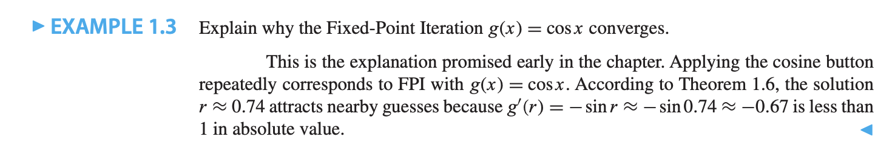

# The Bisection Method
## Bracketing a root

**DEFINITION** : The function $f(x)$ has a **root** at $x=r$ if $f(r)=0$

**THEOREM** : Let $f$ be a *continuous function* on $[a,b]$, satisfying $f(a)f(b) < 0$. Then $f$ has a root between $a$ and $b$. There's a number $r$ satisfying $a < r < b$ and $f(r) = 0$

**DEFINITION** : A solution is correct within $p$ decimal places if error is less than $0.5 \times 10^{-p}$

**Bisection Method** 

```
Given initial interval [a,b] such that f(a)f(b) < 0
while ( b - a ) / 2 > TOL
    c = (a + b) / 2
    if f(c) = 0, stop, end
    if f(a)f(c) < 0
        b = c
    else
        a = c
    end
end
```

> TOL is the tolerance which is a small positive number that determines how close the algorithm's approximation should be to the actual root before stopping.

Bisection method keep bisecting the interval between $a$ and $b$, until tolerance or 0 is met to find the approximated root.

After $n$ steps of the Bisection Method, for the midpoint $x_c$ estimate the solutoin $r$, we find that

$$\textrm{Solution Error} = | x_c - r | < \frac{b-a }{2^{n+1}}$$

and

$$\textrm{Function Evaluations} = n + 2$$

<details>
<summary>Example on Bisecting and Requirement of Accuracy</summary>


</details>

## Fixed Point Iteration

**DEFINITION** The real number $r$ is a *fixed point* of the function $g$ if $g(r) = r$

The number $r=0.7390851332$ is an approximate fixed point for the function $g(x) = \cos x$.

When equation like $\cos x - x = 0$ need to be solved, it can be reordered as $\cos x = x$ which is basically a fixed-point problem, $g(x) = x$.

**Fixed-Point Iteration** 

$$x_0 = \textrm{initial guess}$$
$$x_{i+1} = g(x_i) \textrm{ for }i=0,1,2,\dots$$

Therefore,

$$x_1 = g(x_0)$$
$$x_2 = g(x_1)$$
$$x_3 = g(x_2)$$
$$\vdots$$

If the sequence $x_i$ converge as the number of step goes to infinity, to a number $r$, then $r$ is a fixed point.

> Also this align with the Continuous Limit Theorem, $g(r) = g(\lim_{i  \to \infty }x_i ) = \lim_{i  \to \infty}g(x_i) = \lim_{i  \to \infty }x_{i+1} = r$

However not every eqaution can converge.


**DEFINITION** Let $e_i = |r - x_i|$ denote the error at step $i$ of an iterative method. If

$$\lim_{i  \to \infty} \frac{e_{i+1}}{e_i} = S < 1$$

the method is said to obey linear convergence with rate $S$.

> Basically 每一步之间error的比值要小于1，error要越来越小

**THEOREM** Assume that $g$ is continuously differentiable, that $g(r) = r$, and that $S = |g'(r)|<1$. Then Fixed-Point Iteration converges linearly with rate $S$ to the fixed point $r$ for initial guesses sufficiently close to $r$.

**DEFINITION** An iterative method is called locally convergent to $r$ if the method converges to $r$ for initial guesses sufficiently close to $rjlka.$ 

如果题目问为什么没有Converge，just find S，然后看S大于还是小于1。尽量找到一个S小一点的结果，会converge的快一点，最好是S=0.

如果题目给了个equation让解开，同时很难直接分解出x=啥啥的情况，add x at both side。

<details>
<summary>Example on explain why converges</summary>



</details>

<details>
<summary>Example on convert a equation to fixed point problem</summary>


</details>

<details>
<summary>Example on averaging the guess to stablize the FPI</summary>


</details>

### Stopping Criteria

$$|x_{i+1} - x_i| < \textrm{TOL}$$

$$\frac{|x_{i+1}-x_i|}{|x_{i+1}|} < \textrm{TOL}$$

$$\frac{|x_{i+1} - x_i }{\max(|x_{i+1}|, \theta)} < \textrm{TOL}$$

Good FPI Code st a limit on the maximum number of steps in case convergence fails.

## Limits of Accuracy

### Forward and Backward Error

**DEFINITION** Assume that $f$ is a function and that $r$ is a root, meaning that it satisfies $f(r) = 0$. Assume that $x_a$ is an approximation to $r$. The backward error of approximation $x_a$ is $f(x_a)$, and the forward error is $|r-x_a|$
- Backward Error is related to input(problem data) side.
- Forward Error is related to solution

**DEFINITION** Assume that $r$ is a root of the differentiable function $f$; that is, assume that $f(r) = 0$. Then if $0 = f(r) = f'(r) = f''(r) = \dots = f^{(m-1)}(r)$ but $f^{(m)}(r) \neq 0$, we say that $f$ has a **root of multiplicity** $m$ at $r$. We say that $f$ has multiple root at $r$ if the multiplicity is greater than one. The root is called *simple* if the multiplicity is one

> 比如 $f(x) = x^2$ has two roots. $f(0) = 0, f'(0) = 0, f''(0) = 2 \neq 0$.

<details>
<summary>Example of finding Forward and Backward Error</summary>


</details>

### Wilkinson Polynomial

$$W(x) = \prod^{20}_{i=1}(x-i)=(x-1)(x-2)\dots(x-20)$$

**Derivative of Wilkinson Polynomial** 

Because of the product rule

$$W'(j) = \prod_{k\neq j}(j-k)$$

$$W'(j) = \prod_{k = 1}^{j-1}(j-k)\cdot \prod_{k=j+1}^{20}(j-k)$$

$$W'(j) = (-1)^j (j-1)!(20-j)!$$

### Sensitivity of Root-Finding
A problem is sensitive if a small error in input cause a large error in output.

**Sensitivity Formula for Roots** 
Assume $r$ is a root of $f(x)$ and $r + \Delta r$ is a root of $f(x) + \epsilon g(x)$,

$$\Delta r \approx - \frac{\epsilon g(r)}{f'(r)}$$

if $\epsilon \ll  f'(r)$

$$\textrm{error magnification factor} = \frac{\textrm{relative forward error}}{ \textrm{relative backward error}}$$

The error magnification factor tells how sensitive the roots of a function are to small perturbations or errors in input data.

The significance of the error magnification factor is that it tells how many of the 16 digits of operation precision are lost from input to output. For a problem with error magnification factor of $10^{12}$ we lost 12 of the 16 and have about four correct significant digits left in the root.

<details>
<summary>Example on estimating largest root</summary>


</details>

<details>
<summary>Example on finding error magnification factor</summary>


</details>

# Newton's Method

Make a initial guess, and find the tangent line at that point and find the root of the tangent line as the new guess. Iterate to find the approximated root.


**Newton's Method** 

$$x_0 = \textrm{initial guess}$$
$$x_{i+1} = x_i - \frac{f(x_i )}{f'(x_i)} \textrm{ for } i = 0,1,2,\dots$$

<details>
<summary>Newton's Example</summary>


</details>

**DEFINITION** Let $e_i$ denote the error after step $i$ of an iterative method. The iteration is quadratically convergent if
$$M = \lim_{i  \to \infty }\frac{e_{i+1}}{e_i^2} < \infty$$

**THEOREM** Let $f$ be twice continuously differentiable and $f(r) = 0$. If $f'(r) \neq 0$, then Newton's Method is locally and quadratically convergent to $r$. The error $e_i$ at step $i$ satisfies

$$\lim_{i  \to \infty }\frac{e_{i+1 }}{e^2_i } = M$$

where

$$M = \frac{f''(r)}{2f'(r)}$$

