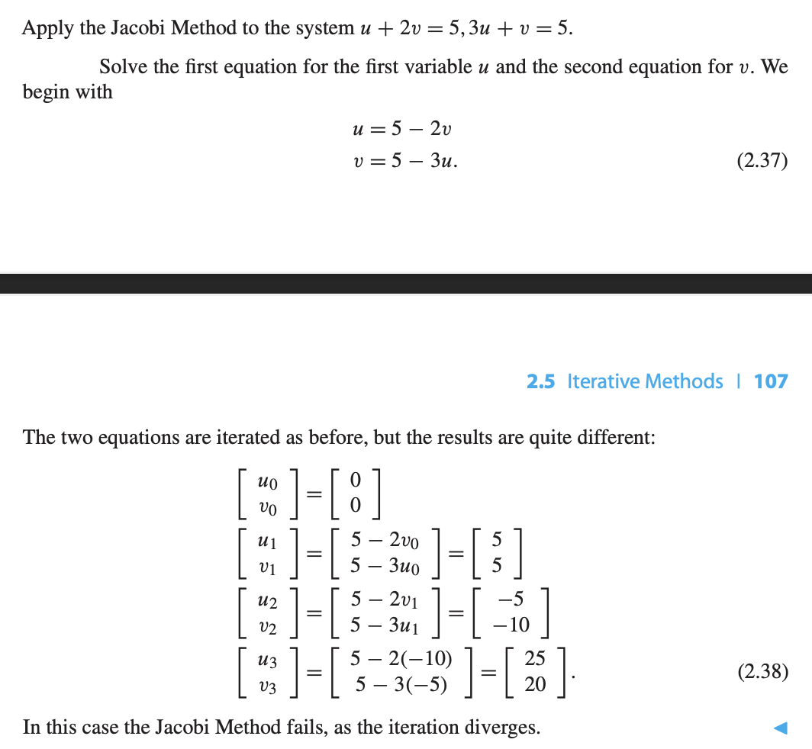

# Gaussian Elimination
Gaussian Elimination transform the system of equations to a simpler form for substituting and solving the system.

# The LU Factorization
## Matrix form of Gaussian Elimination

Linear system can be written as $\boldsymbol{Ax} = \boldsymbol{b}$ in matrix form.

- $\boldsymbol{A}$ is the coefficient matrix.
- $\boldsymbol{b}$ is the right hand side vector.

**DEFINITION** An $m \times n$ matrix $\boldsymbol{L}$ is lower triangular if entreis satisfy $l_{ij} = 0$ for $i<j$. 下面的全都是 0.

**DEFINITION** An $m \times n$ matrix $\boldsymbol{U}$ is upper triangular if entries satisfy $u_{ij} = 0$ for $i > j$. 上面的全都是 0.

The coefficient matrix $\begin{bmatrix}1 &1\\3 &-4\end{bmatrix}$ can be eliminated and factorised into two matrix, this is called LU factoization

$$\boldsymbol{LU} = \begin{bmatrix}1 & 0 \\ 3 & 1\end{bmatrix}\begin{bmatrix}1 & 1 \\ 0 & -7\end{bmatrix} = \begin{bmatrix}1 & 1 \\ 3 & -4\end{bmatrix}$$

- LU Factorization Trick
    - Let $L_{ij}(-c)$ denote the lower triangular matrix whose only none 0 entries are 1's on the main diagonal and $-c$ in the $(i,j)$ position. Then $L_{ij}(-c)A$ represents the row operation 在i row减去c次j行"
    - $L_{ij}(-c)^{-1} = L_{ij}(c)$
    - $\begin{bmatrix}1 & 0 & 0\\ c_1 & 1 & 0 \\ 0 & 0 & 1\end{bmatrix}\begin{bmatrix}1 & 0 & 0 \\ 0 & 1 & 0 \\ c_2 & 0 & 1\end{bmatrix} = \begin{bmatrix} 1 & 0 & 0\\ c_1 & 1 & 0 \\ c_2 & 0 &1\end{bmatrix}$

## Back substitution with the LU factorization
The problem $Ax = b$ can be rewritten as $LUx = b$. 

Define a new vector $c = Ux$

Then back substitution:

1. Solve $Lc = b$, for $c$
2. Solve $Ux = c$, for $x$

Basic Example

Basic Example 2

## LU Efficiency

<++> TBH

## Sources of Error

**DEFINITION** The **infinity norm** or **maximum norm**, of vector $x = (x_1, \dots, x_n)$ is 

$$||x||_\infty = \max |x_i|, i = 1, \dots, n$$

Which is the maximum of the absolute values of the components of vector $x$

**DEFINITION**  Let $x_a$ be an approximate solution of the linear system $Ax = b$. The residual is the vector $r = b - Ax_a$. The backward error is the norm of the residual $||b-Ax_a||_\infty$ and the forward error is $||x-x_a||$_\infty

Example

Relative backward error of system $Ax = b$ is $\frac{||r||_\infty}{||b||_\infty}$

Relative forward error is $\frac{||x-x_a||_\infty}{||x||_\infty}$

The error magnification factor is the ratio of these two. relative forward/relative backward.

### Condition Number
**DEFINITION** The condition number of a square matrix $A$, $\textrm{cond}(A)$, is the maximum possible error magnification factor for solving $Ax= b$.

Theres a formula for condition number of a square matrix.

**DEFINITION** Matrix norm of an $n \times n$ matrix $A$ is
$$||A||_\infty = \textrm{maximum absolute row sum}$$

**THEOREM** The condition number of the $n\times n$ matrix $A$ is 

$$\textrm{cond}(A) = ||A||\cdot ||A^{-1}||$$

Example on finding condition number

Vector norm have the following properties:
- $||x|| \geq 0$ with equality if and only if $x = [0, \dots, 0]$
- for each scalar $\alpha$ and vector $x$, $||\alpha x|| = |\alpha| \cdot ||x||$
- for vectors $x,y, ||x + y|| \leq ||x|| + ||y||$

Matrix norm have similar properties:
- $||A|| \geq 0$ with equality if and only if $A=0$
- for each scalar $\alpha$ and matrix $A$, $||\alpha A|| = |\alpha| \cdot ||A||$
- for matrices $A,B, ||A+B|| \leq ||A|| + ||B||$

### Swamping
<++> Not related to exam TBC.

# The PA=LU Factorization

**DEFINITION** A pivot is the leading non-zero entry in a row that is used as a reference for row operations.

> Why is partial pivoting needed?
> - In Gaussian elimination, when reducing the matrix to an upper triangular form, the leading entry in each row(the pivot) is used to eliminate the values velow it in the same colum. If the pivot element is zero or very small, performing row operations could cause issues like devision by zero. Partial Pivoting will choose the largest available pivot from the current column to avoid computational problems.

Partial Pivoting:

- At each step of Gaussian elimination, before using a pivot element, check the entire column below the current pivot position.
- Find the largest absolute value in that column
- If the largest value isn't alreadyi n the pivot position, swap rows to bring that element into the pivot position.

Partial Pivoting Example

Partial Pivoting and Gaussian Elimination to solve

## Permutation matrices

**DEFINITION** A permutation matrix is an $n \times n$ matrix consisting of all zeros, except for a single 1 in every row and column.

**THEOREM** Let $P$ be the $n \times n$ permutation matrix formed by a particular set of row exchanges applied to the identity matrix. Then for any $n \times n$ matrix $A$, $PA$ is the matrix obtained by applying exactly the same set of row exchanges to $A$.

## PA=LU Factorization

If the matrix requires multiple partial pivoting procedure, just multiply the P matrix together.

Remember the order should be $P_nP_n{-1}\dots P_2P_1A$

Using $PA=LU$ to solve $Ax=b$ system. Multiply both side by $P$.

$$PAx = Pb$$

Hence

$$LUx = Pb$$

Then solve it like normal LU system

Solve $Lc = Pb$ for $c$

Solve $Ux = c$ for $x$

Example

Example 2

# Iterative Methods

## Jacobi Method

Jacobi Example 1

Jacobi Example when failed

**DEFINITION** The $n\times n$ matrix $A = (a_{ij})$ is strictly diagonally dominant if, for each $1 \leq i \leq n, |a_{ii}| > \sum_{j\neq i }^{}|a_{ij}|$, 就是每一row的diagnal entry都比其他的entry加起来都大.

**THEOREM** If the $n\times n$ matrix $A$ is strictly diagonally dominant, then $A$ is a nonsingular matrix and for every vector $b$ and every starting guess, the Jacobi Method applied to $Ax = b$ converge to the unique solution.

Let $D$ denote the main diagonal of $A$.

Let $L$ denote the lower triangle of $A$, and $U$ denote the upper triangle. (Note this is not the same as in LU factorisation)

Then $A = L+D+U$, the equation be solved is $Lx + Dx + Ux = b$

Then $x = D^{-1}(b-(L+U)x)$

**Jacobi Method** 

$$x_0 = \textrm{initial vector}$$
$$x_{k+1} = D^{-1}(b-(L+U)x_k), \textrm{ for } k = 0,1,2,\dots$$

### Jacobi Convergence Proof

The Jacobi Method is written as

$$x_{k+1} = -D^{-1}(L+U)x_k + D^{-1}b$$

If the spectral radius $\rho(D^{-1}(L+U)) < 1$, then the Jacobi Method converge.

Let $R = L + U$, and let $\lambda$ be eigenvalue of $D^{-1}R$ with corresponding eigenvector $v$.

Choose $v$ so $||v||_{\infty} = 1$, and that for some $1 \leq m \leq n$, the component $v_m = 1$ and all other components are less than 1.

> $n$ is the square matrix length

Hence $D^{-1}Rv = \lambda v$, or $Rv = \lambda Dv$

Since $r_{mm} = 0$, hence taking the m-th components of this vector equation implies

$$|r_{m1}v_1 + r_{m2}v_2 + \dots + r_{m,m+1}v_{m+1} + \dots + r_{mn}v_n|\\= |\lambda d_{mm}v_m| = |\lambda||d_{mm}|$$

As all the $||v_i|| < 1$, the left hand side is at most $\sum_{j \neq m }^{}|r_{mj}|.$

According to strict diagnoal dominance hypothesis, is less than $|d_{mm}|$

Hence

$$|\lambda||d_{mm}| < |d{mm}|$$

$$|\lambda| < 1$$

Hence $\rho(D^{-1}R) < 1$

This implies Jacobi converges to a solution of $Ax=b$

## Gauss-Seidel Method

**Gauss-Seidel Method** 

Same as Jacobi, but interpret $(L+D+U)x = b$ as

$$(L+D)x_{k+1} = -Ux_k +b$$

hence

$$x_0 = \textrm{initial vector}$$
$$x_{k+1} = D^{-1}(b-Ux_k - Lx_{k+1}) \textrm{ for } k = 0,1,2,\dots$$

Gauss-Seidel Example

### Proof of Gauss-Seidel Method

$$x_{k+1} = - (L + D)^{-1} Ux_k + (L+D)^{-1}b$$

Hence need to proof $\rho({(L+D)^{-1} U}) < 1$ to show that Gauss-Seidel Converge

**THEOREM** If the $n\times n$ matrix $A$ is strictly diagonally dominant, then A is a nonsigular matrix, and for every vector $b$ and every starting guess, the Gauss-Seidel Method applied to $Ax=b$ converges to a solution.

Proof:

Let $\lambda$ be the eigenvalue to a corresponding eigenvector $v$.

Choose the normalized magnitude $v_m =1$ and all the other component are smaller in magnitude.

$$\lambda (D+L)v = Uv$$

Let $a_{ij}, i < j$ be entries for U. $a_{ij}, i > j$ for L

$$\lambda (d_{mm}v_m + \sum_{i < m}^{}a_{mi} v_{i}) = \lambda\sum_{i > m}^{}a_{mi} v_i$$

$$\lambda (a_{mm} + \sum_{i < m}^{}a_{mi}v_{i}) = \sum_{i > m}^{}a_{mi}v_i$$

Take Absolute value for both side

$$|\lambda| (|a_{mm}| + \sum_{i < m}^{}|a_{mi}||v_i|) = \sum_{i > m}^{}|a_{mi}||v_i|$$

For the rhs, because $|v_i| \leq 1$

hence,

$$\sum_{i > m}^{}|a_{mi}||v_i| \leq \sum_{i > m }^{}|a_{mi}|$$

This gives us the inequality that

$$|\lambda| (|a_{mm}| + \sum_{i < m}^{}|a_{mi}||v_i|) \leq \sum_{i > m}^{}|a_{mi}|$$

----
Also, the property of strict diagonal matrix yields that

$$|a_{mm}| > \sum_{i \neq m}^{}|a_{mi}|$$

$$|a_{mm}| - \sum_{i \neq m}^{}|a_{mi}| > 0$$

$$|a_{mm}| - \sum_{i < m}^{}|a_{mi}| - \sum_{i > m}^{}|a_{mi}| > 0$$

Hence, this yields that

$$|\lambda|\sum_{i > m}^{}|a_{mi}| < |\lambda| (|a_{mm}| - \sum_{i < m}^{}|a_{mi}|)$$

$$|\lambda|\sum_{i > m}^{}|a_{mi}| \leq |\lambda| (|a_{mm}| - \sum_{i < m}^{}|a_{mi}v_i|)$$

The rhs yields that

$$|\lambda| (|a_{mm}| - \sum_{i < m}^{}|a_{mi}v_i|) \leq |\lambda| (|a_{mm}|+ \sum_{i < m}^{}|a_{mi}||v_i|)$$

And the RHS according to before is equal to

$$|\lambda| (|a_{mm}|+ \sum_{i < m}^{}|a_{mi}||v_i|)= |\sum_{i > m}^{}a_{mi}v_i| \leq \sum_{i > m}^{}|a_{mi}v|$$

Hence

$$|\lambda|\sum_{i > m}^{}|a_{mi}| < \sum_{i > m}^{}|a_{mi}|$$

Hence $|\lambda| < 1$

## SOR
**Successive Over-Relaxation** 
Let $\omega$ be a real number as the relaxation parameter.

Add $(1-\omega)x_k$ component and $\omega$ times the Gauss-Seidel right-hand side component together to form SOR approximation.

Same as Jacobi, but interpret that as

$$(\omega L + \omega D + \omega U)x = \omega b$$

Hence

$$x_0 = \textrm{initial vector}$$
$$x_{k+1} = (\omega L + D)^{-1}[(1-\omega)Dx_k - \omega Ux_k] + \omega(D + \omega L)^{-1} b, \textrm{ for }k=0,1,2,\dots$$

Successive Over-Relaxation Example

Compare Each

# Symmetric Positive-Definite Matrices

**DEFINITION** The $n\times n$ matrix $A$ is symmetric if $A^T = A$. 

**DEFINITION** The matrix is positive-definite if $x^T Ax > 0$ for all vectors $x \neq 0$

Example on symmetric or positive definite

**PROPERTY** If the $n \times n$ matrix $A$ is symmetric , then $A$ is positive-define if and only if all the eigenvalues are positive.

**PROPERTY** If $A$ is $n \times n$ symmetric positive-define and $X$ is an $n \times m$ matrix of full rank with $n \geq m$, then $X^TAX$ is $m \times m$ symmetric positive definite

**DEFINITION** A principal submatrix of a square matrix $A$ is a square submatrix whose diagonal entries are diagonal entries of $A$.

**PROPERTY** Any principal submatrix of a symmetric positive-definite matrix is symmetric psositive-definite 

## Cholesky Factorzation
**THEOREM** (Cholesky Factorization Theorem) If $A$ is a symmetric positive-definite $n\times n$ matrix, then there exists an upper triangular $n\times n$ matrix $R$ such that $A = R^T R$

$R$ is an upper triangular matrix of the form

$$R = \begin{bmatrix}\sqrt{a} & u \\ 0 & v \end{bmatrix}$$

Then 

$$R^T = \begin{bmatrix} \sqrt{a} & 0 \\ u & v\end{bmatrix}$$

Using the matrix block multiplication method, any matrix can be split into four block, and then the Cholesky Factorization theorem became:

$$A = \begin{bmatrix} a & b\\ c& d\end{bmatrix} = \begin{bmatrix} \sqrt{a} & 0 \\ u & v\end{bmatrix}\begin{bmatrix}\sqrt{a} & u \\ 0 & v \end{bmatrix} = \begin{bmatrix}a &u \sqrt{a} \\ u\sqrt{a} & u^2+v^2\end{bmatrix} = R^T R$$

Comparing the left and right hand side we can obtain that $u = b / \sqrt{a}$ and $v^2 = c - u^2$

$$A = \begin{bmatrix}\sqrt{a} & 0\\ \frac{b }{\sqrt{a}} & \sqrt{c-b^2/a}\end{bmatrix} \begin{bmatrix}\sqrt{a} & \frac{b }{\sqrt{a }} \\ 0 & \sqrt{c - b^2/a}\end{bmatrix}$$

**PROOF of Cholesky Factorization** 

Partition any symmetrical and positive-definite matrix

$$A = \begin{bmatrix}a & b^T \\ b & C\end{bmatrix}$$

- $a$ is a scalar, the top left component of the matrix $A$
- $b$ is a column vector of length $n-1$.
- $C$ is a $(n-1) \times (n-1)$submatrix

Construct matrix $S$

$$S = \begin{bmatrix}\sqrt{a} & u^T \\ 0 & I\end{bmatrix}$$

- $\sqrt{a}$ is the square root of scalar $a$
- $u = \frac{b}{\sqrt{a}}$ is a vector.
- $I$ is the identity matrix of size $(n-1) \times (n-1)$

and setting $A_1 = C - uu^T$

$$S^T \begin{bmatrix}1 & 0 \\ 0 & A_1\end{bmatrix}S= \begin{bmatrix}\sqrt{a} & 0 \\ u & I\end{bmatrix}\begin{bmatrix}1 & 0 \\ 0 & A_1\end{bmatrix} \begin{bmatrix}\sqrt{a} & u^T \\ 0 & I\end{bmatrix}$$

$$ = \begin{bmatrix}a  & b^T \\ b & uu^T + A_1\end{bmatrix} = A$$

> Also $A_1$ is symmetirc positive-definite, as it follows from the fact that if $A$ is an $n \times n$ symmetric psoitive-definite and $X$ is an $n \times m$ matrix of full rank with $n \geq m$, then $X^T A X$ is $m \times m$ symmetric positive-definite.

And by induction, the symmetrical positive-definite matrix $A_1$ can be factorise to $A_1=  V^T V$ where V is the upper triangular

Hence

$$R = \begin{bmatrix}\sqrt{a } & u^T \\ 0 & V\end{bmatrix} $$

$$R^TR = \begin{bmatrix}a & b^T \\ b & uu^T + V^TV\end{bmatrix} = A$$

Symmetrical Positive Definite Matrix can be Cholesky Factorized into upper triangular matrix component and its transpose, hense can be then solved using Jacobi or Gauss-Seidel Methods.

# Conjugate Gradient Method
<++>

# Nonlinear System of Equations
## Multivariate Newton's Method
<++>
## Broyden's Methods
<++>

