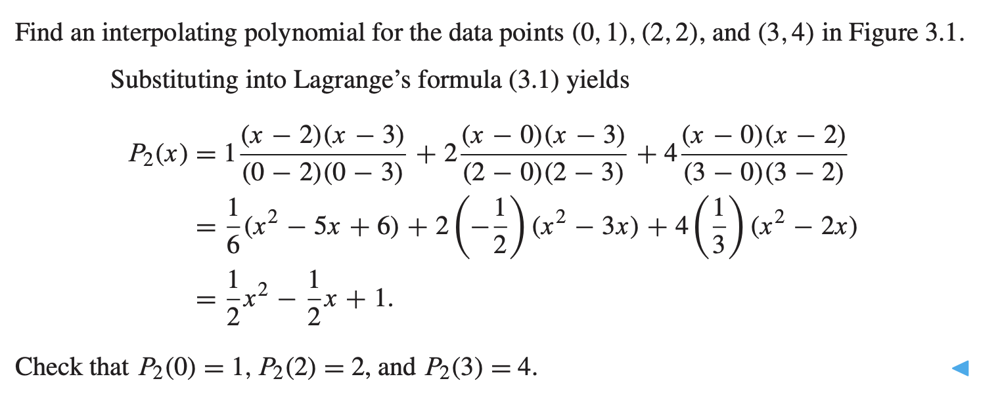

A function is said to **interpolate** a set of data points if it passes through those points.

**DEFINITION** The function $y = P(x)$ **interpolates** the data points $(x_1, y_1), \dots, (x_n,y_n)$ if $P(x_i)=y_i$ for each $1 \leq i \leq n$

# Interpolating Functions
## Lagrange Interpolation
Assume that $n$ data points, $(x_1, y_1), (x_2, y_2), \dots, (x_n, y_n)$ are give. There exist a Lagrange Interpolating Formula for writing down a polynomial degree of $d = n-1$ that interpolate the points.

For each $k$ between $1$ and $n$, define the degree $n-1$ polynomial

$$L_k(x) = \frac{(x-x_1) \dots (x-x_{k-1})(x-x_{k+1})\dots(x-x_n)}{(x_k-x_1)\dots(x_k-x_{k-1})(x_k - x_{k+1})\dots(x_k-x_n)}$$

Also there's property that $L_k(x_k) = 1, L_k(x_j) = 0$, hence when we want to query for data, all the other points are dropped.

$$P_{n-1}(x) = y_1L_1(x) + \dots + y_n L_n(x)$$

Example

**THEOREM** Main Theorem of Polynomial Interpolation. Let $(x_1, y_1), \dots, (x_n, y_n)$ be $n$ points in the plane with distinct $x_i$. Then there exist one and only one polynomial $P$ of degree $n-1$ or less that satisfies $P(x_i) = y_i$ for $i=1,\dots,n$

Lagrange Example 2

## Newton's Divided Differences
**DEFINITION** Denote by $f[x_1, \dots, x_n]$ the coefficient of the $x^{n-1}$ term in the (unique) polynomial that interpolates $(x_1, f(x_1)), \dots, (x_n, f(x_n))$

**The Newton's Divided Difference Formula** 

$$P(x) = f[x_1] + f[x_1\ x_2](x-x_1) +f[x_1\ x_2\ x_3](x-x_1)(x-x_2) +\dots \\ + f[x_1\ \dots\ x_n](x-x_1)\dots(x-x_{n-1})$$

The coefficient can be recursively calculated as 

and so on.

The recursive definition of Newton's divided difference, can be written in table form

Newton Table Example

Newton Table Example 2

Due to the Main Theorem of Polynomial Interpolation, there's only one polynomial that pass through the $n$ data points with less than $n-1$ degrees. However, if the question ask for what about $m$ degree polynomial that $m > n$? 

Well, there's infinite many of them, and just add the previous equation with a constant term and Newton's Divided Difference equation

More Degree Example

### Representing function by approximating polynomials

# Interpolation Error

**THEOREM** Assume that $P(x)$ is the (degree $n-1$ or less) interpolating polynomial fitting the $n$ points $(x_1,y_2),\dots,(x_n,y_n)$. The interpolation error is:

$$f(x)-P(x) = \frac{(x-x_1)(x-x_2)\dots(x-x_n)}{n!}f^{(n)}(c)$$

where $c$ lies between the smallest and largest of the numbers $x,x_1,\dots,x_n$

Interpolation Error Example

## Newton's Method and Interpolation Error Proof
<++>

## Runge Phenomenon

The Runge phenomenon occurs in polynomial interpolation when high-degree polynomials are used to interpolate data points, particularly when the points are spaced at equal intervals. As the degree of the polynomial increases, the interpolation error tends to become larger, especially near the edges of the interval, resulting in large oscillations in the interpolating polynomial.

# Chebyshev Interpolation

The goal for Chebyshev interpolation is to shrink the interpolation error on the choice of data points.

**THEOREM** The choice of real numbers $-1 \leq x_1, \dots, x_n \leq 1$ that makes the value of

$$\max_{-1\leq x \leq 1} |(x-_1)\dots(x-x_n)|$$
as small as possible is

$$x_i = \cos \frac{(2i-1)\pi}{2n} \textrm{ for }i=1,\dots,n$$

and the minimum value is $\frac{1}{2^{n-1}}$.

The minimum is achieved by $\frac{1}{2^{n-1}}T_n(x)$, and that $T_n(x)$ denotes the degress $n$ Chebyshev polynomial.

Chebyshev error bound example

## Chebyshev Polynomial

> Remind the trigonometric formula, $\cos(a+b) = \cos a \cos b - \sin a \sin b$

Define the $n$-th Chebyshev Polynomial by $T_n(x) = \cos(n \arccos x)$

In general

$$T_{n+1}(x) = \cos(n+1)y = \cos(ny+y) = \cos n y \cos y - \sin n y \sin y$$
$$T_{n-1}(x) = \cos(n-1)y = \cos(ny-y) = \cos n y \cos y - \sin n y \sin (-y)$$

Because $\sin(-y) = -\sin y$, we can add the equation to get that

$$T_{n+1)(x) + T_{n-1}(x) = 2\cos ny \cos y = 2x T_n(x)}$$

hence

$$T_{n+1}(x) = 2x T_n(x) - T_{n-1}(x)$$

This is called the recursion relationship for the Chebyshev polynomials.

<Chebyshev Proof++> TBD

### Change of Interval

Just change $\cos \frac{\textrm{odd} \pi}{2n}$

to

$$\frac{b-a}{2} \cos \frac{\textrm{odd}\pi }{2n }+ \frac{b+a}{2}$$

> Stretch the points by the ratio of the two interval length, and then translate the points to move the center of mass to the midpoint of [a,b]

**Chebyshev interpolation nodes** 
On the interval $[a,b]$

$$x_i = \frac{b+a }{2 }+ \frac{b-a}{2}\cos \frac{\textrm{odd}\ \pi}{2n}$$

for $i = 1, \dots, n$ The inequality

$$|(x-x_1)\dots(x-x_n)| \leq \frac{(\frac{b-a }{2 })^n}{2^{n-1}}$$

Example

# Cubic Splines

# Bezier Curves
