# Least Square
System that are inconsistent referes to a set of equation with no solutions.

> $x_1 + x_2 = 2\\ x_1-x_2 =1\\x_1+x_2 =3$ , this is a system with no solution, hence it is inconsistent.

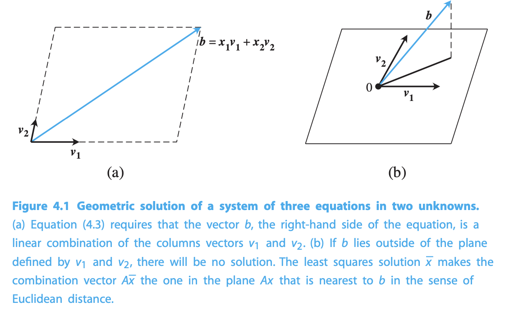

**Normal Equations for Least Sqaures** 

Given the inconsistent system $Ax = b$

solve

$$A^T A \bar{x} = A^T b$$

for least squares solution $\bar{x}$ that minimizes the Euclidean length of the residual $r = b-Ax$

Normal Least Square Example

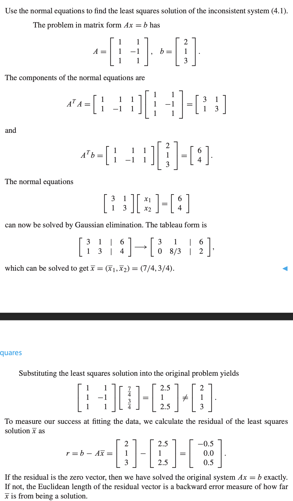

The Euclidean length of a vector

$$||r||_2 = \sqrt{r_1^2 + \dots + r^2_m}$$

The *squared error* is: $\textrm{SE} = r^2_1 + \dots + r^2_m$

The **Root Mean Squared Error**:

$$\textrm{RMSE} = \sqrt{\frac{SE}{m}} = \frac{||r||_2}{\sqrt{m}}$$

Example on Finding Euclidean lengthu

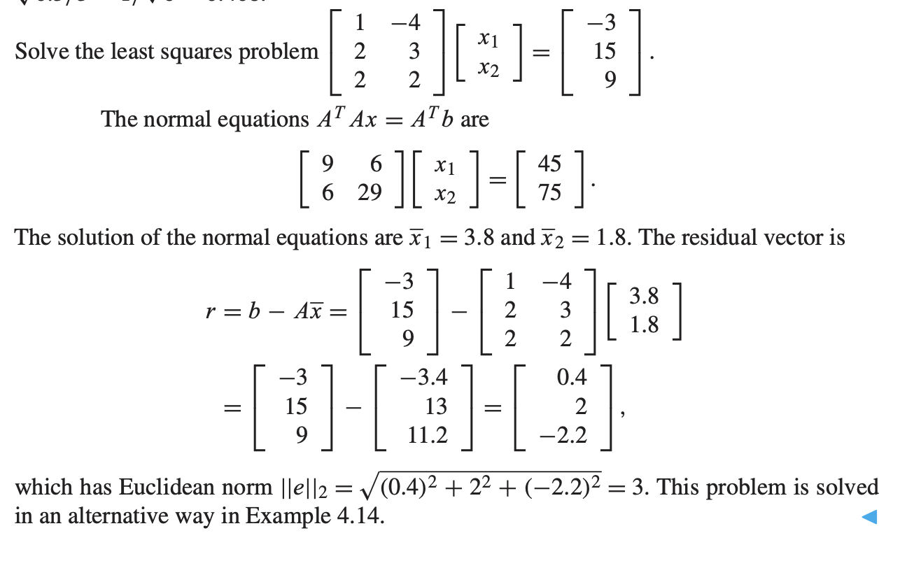

## Fitting data by least square

aka. the problem of finding the line of best fit

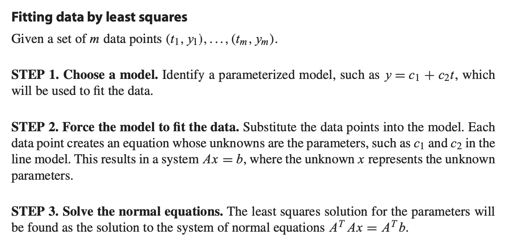

Example on finding best fit

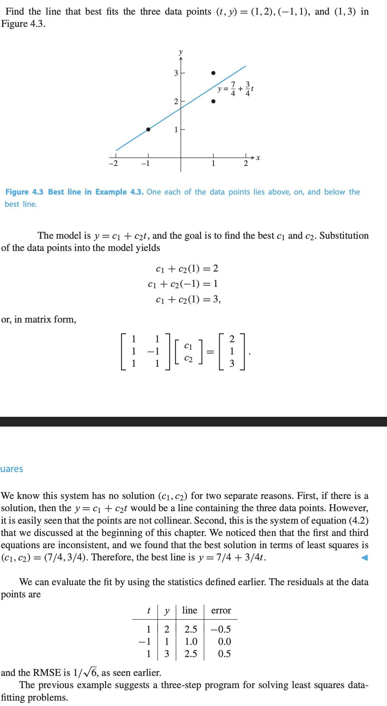

Example on choosing different models

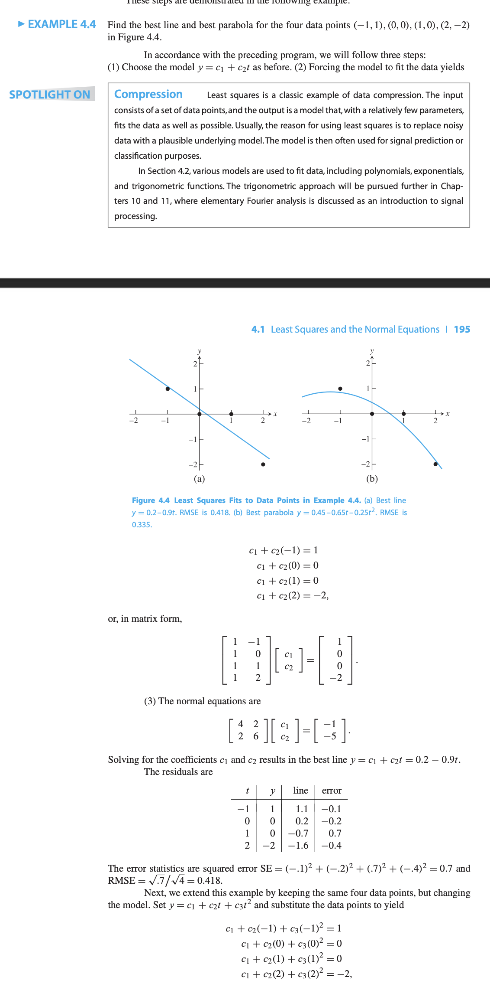

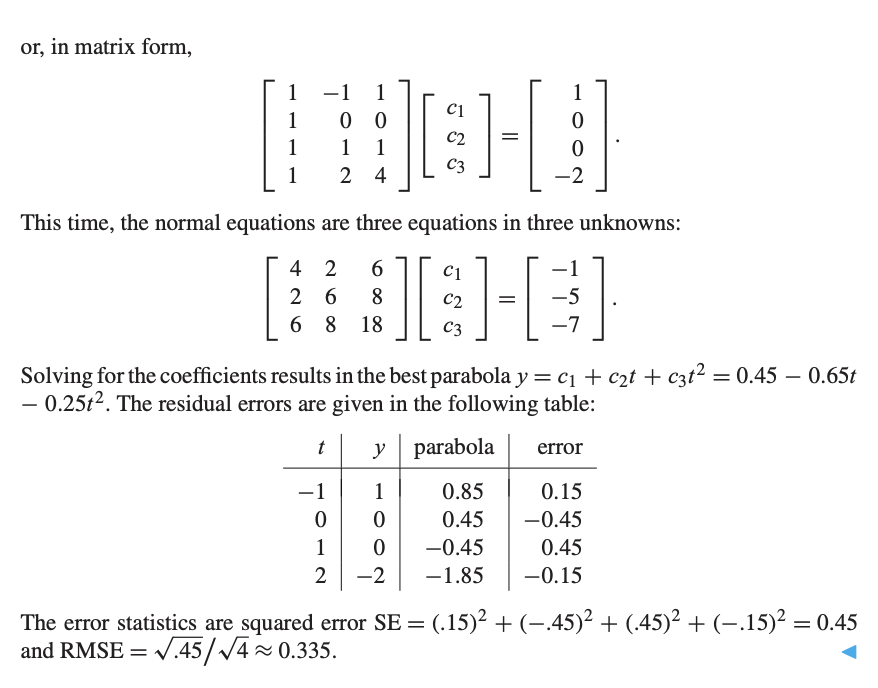

# QR Factorization
## Gram-Schmidt orthogonalization and least squares

Let $A_1, \dots, A_n$ be linearly independent vectors from $R^m$. Thus $n\leq m$. The Gram-Schimidt method begins by dividing $A_1$ by its length to make it a unit vector.

$$y_1 = A_1 \textrm{ And}\ q_1 = \frac{y_1}{||y_1||_2}$$

To find the second unit vector, subtract away the projection of $A_2$ in the direction of $q_1$, and normalize the result:

$$y_2 = A_2 - q_1(q_1^T A_2) \textrm{ and } q_2 = \frac{y_2}{||y_2||_2}$$

Then because $q_1^T y_2 = q_1^T (A_2 - q_1(q_1^T A_2)) = q_1^T A_2 - q_1^T A_2 = 0$, so $q_1$ and $q_2$ are pairwise orthogonal.
> $q_i^T q_i = ||q_i||_2 = 1$ because it is a unit vector.

At the $j$th step, define

$$y_j = A_j - q_1(q_1^T A_j) - q_2(q_2^T A_j) - \dots - q_{j-1}(q_{j-1}^T A_j)$$

and

$$q_j = \frac{y_j}{||y_j||_2}$$

This implies that

$$q_i^T y_j = q_i^T A_j - q_i^Tq_1(q_1^TA_j) - \dots - q_i^T q_{j-1}(q_{j-1}^T A_j)$$
$$= q_i^T A_j - q_i^T q_i(q_i^T A_j) = 0$$

**Reduced QR Factorization** 

Let $r_{jj} = ||y_j||_2$, and $r_{ij} = q_i^T A_j$

And the equation before can be written as

$$A_1 = r_{11} q_1$$
$$A_2 = r_{12} q_1 + r_{22} q_2$$

Which generalize to

$$A_j = r_{1j}q_1 + \dots + r_{j-1,j}q_{j-1} + r_{jj}q_j$$

The result of Gram-Schmidt orthogonalization can be written in matrix form as

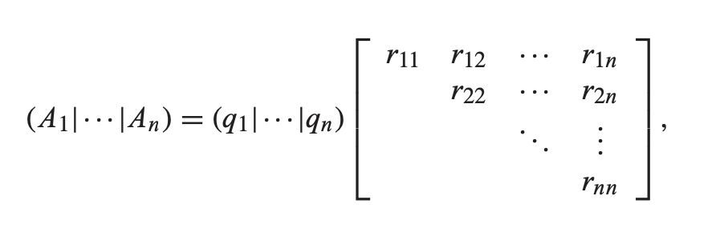

or $A=QR$, where $A$ is a matrix consisting of the columns $A_j$.

Reduced QR Factorization Example

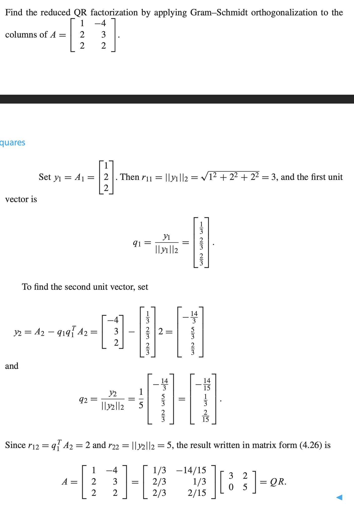

**Full QR Factorization** 

Add $m-n$ extra vectors to the $A_j$ to let it span the $R^m$.

> The choice of $A_j$ is arbitrary, any vector that is linearly independent of the existing columns could be used.

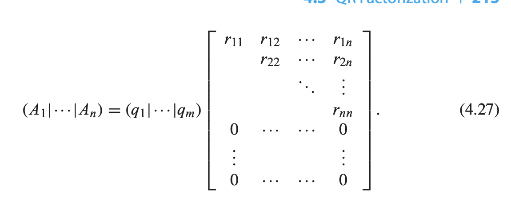

FULL QR example

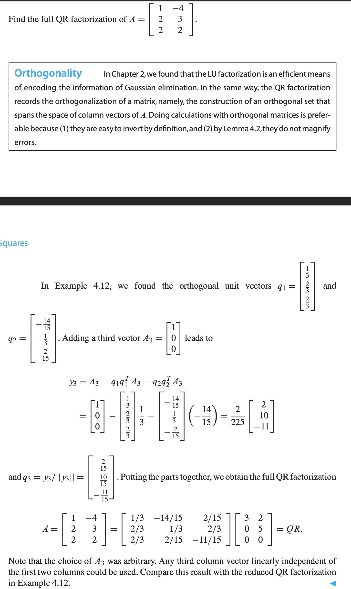

**DEFINITION** A sqaure matrix $Q$ is Orthogonal matrix, if $Q^T = Q^{-1}$

Hence, for full QR factorization, $A=QR$, where $Q$ is a orthogonal square matrix and $R$ is an upper triangular matrix the same size as $A$.

**LEMMA** If $Q$ is orthogonal $m \times m$ matrix, and $x$ is an $m$-dimensional vector, then $||Q_x||_2 = ||x||_2$

**LEMMA** The product of two orthogonal $m \times m$ matrices is also orthogonal.

Using QR factorization to solve Least Square problem

$Ax = b$ and $A = QR$. Hence

$$QRx = b$$

$$Rx = Q^Tb$$

To minimize the least square error $||Ax - b||_2 = ||QRx - b||_2 = ||R_x - Q^T b||_2$. Let $d = Q^T_b$

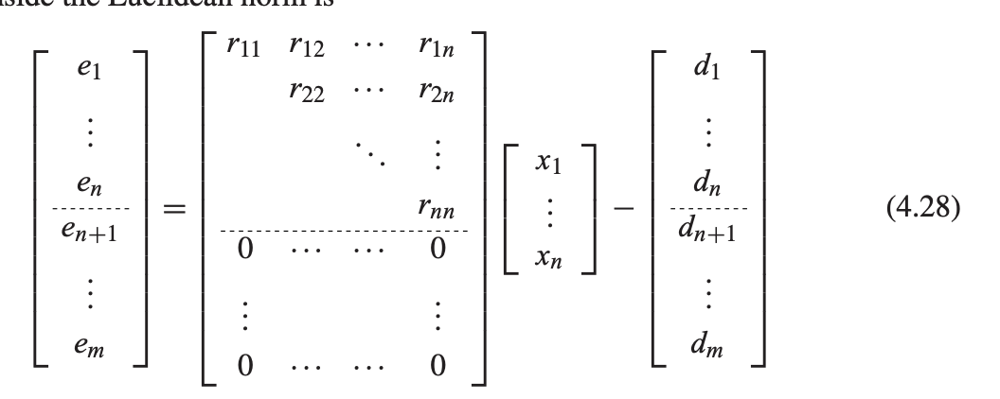

The least square error is $||e||^2_2 = d^2_{n+1} + \dots + d^2_m$

Hence

**Least square by QR factorisation** 

Given the $m \times n$ inconsistent system

$$Ax = =b$$

find the full QR factorization $A = QR$ and set

$$\hat{R} = \textrm{upper } n \times n \textrm{ submatrix of }R$$
$$\hat{d} = \textrm{upper } n \textrm{ entries of }d= Q^Tb$$

Solve $\hat{R}\bar{x} = \hat{d}$ for least squares solution $\bar{x}$

full QR example

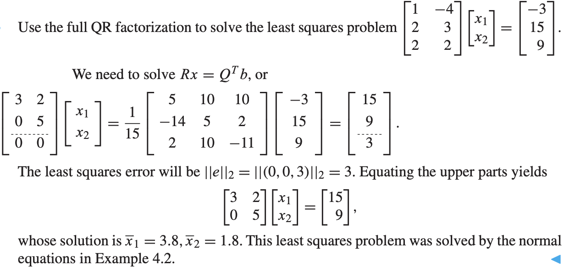

# Nonlinear Least Squares

