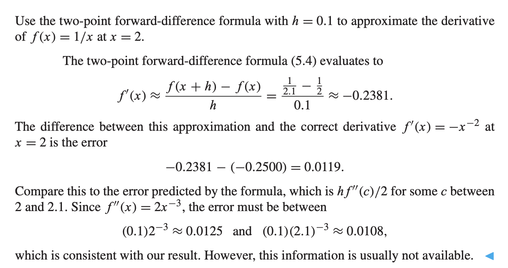
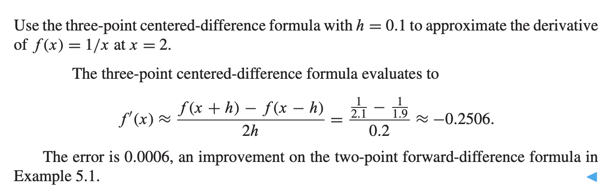

# Finite Difference Formulas

By definition, the derivative of $f(x)$ at a value $x$ is 

$$f'(x) = \lim_{h\to 0} \frac{f(x+h) - f(x)}{h}$$

Taylor's Theorem says that if $f$ is twice continuously differentiable then

$$f(x+h) = f(x) + hf'(x) + \frac{h^2}{2}f''(c)$$

where $c$ is between $x$ and $x +h$

**Two-point forward difference formula** 

$$f'(x) = \frac{f(x+h) - f(x)}{h} - \frac{h }{ 2 }f''(c)$$

First Order Approximation:

$$f'(x) \approx \frac{f(x+h) - f(x)}{h}$$

where the $c$ term is treated as an error. Since the last term is corresponding to $h$, as we make $h$ small enough, we can make the error small.

Example on first order formula

**Second Order Formula** 

If $f$ is three times continuously differentiable then

$$f(x+h) = f(x) + hf'(x) + \frac{h^2}{2}f''(x) + \frac{h^3}{6}f'''(c_1)$$

$$f(x-h) = f(x) - hf'(x) + \frac{h^2}{2}f''(x) - \frac{h^3}{6}f'''(c_2)$$

where $x-h < c_2 < x < c_1 < x+h$.

subtracting the equations gives the three-point formula with explicit error term:

$$f'(x) = \frac{f(x+h) - f(x-h)}{2h} - \frac{h^2}{6}f'''(c)$$

where $x-h < c < x+h$

> Proof on the error term neglected

Three-point centered difference formula example

You can keep Taylor expanding the function to find higher derivatives formula.

**Three-point centered-difference formula for second derivative** 

$$f''(x) = \frac{f(x-h) - 2f(x) + f(x+h)}{h^2} - \frac{h^2}{12}f^{(iv)}(c)$$

## Rounding Error

## Extrapolation

# Newton-Cotes Formulas for Numerical Integration

The simple definite integrals

The first region under the line interpolating data points $(0,0), (h,1)$. The region is a triangle of height $1$ and base $h$, so the area is

$$\int_{0}^{h} \frac{x }{h }dx = \frac{h}{2}$$

The second region under the parabola $P(x)$ interpolating the data points $(-h,0), (0,1)$ and $(h,0)$. which has the area
$$\int_{-h}^{h}P(x)dx = x - \frac{x^3 }{3h^2 }= \frac{4}{3}h$$

The third region between $x$-axis and the parabola interpolating the data points $(-h, 1), (0,0)$ and $(h,0)$ with net positive area

$$\int_{-h}^{h}P(x)dx = \frac{1}{3}h$$

## Trapezoid Rule
**The Rule itself** 

$$\int_{x_0}^{x_1}f(x)dx = \frac{h}{2}(y_0 + y_1) - \frac{h^3}{12}f''(c)$$

where $h=x_1-x_0$, and $c$ is between $x_0$ and $x_1$.

**原理** 

The Lagrange formulation to interpolate a degree 1 polynomial $P_1(x)$ through $(x_0, y_0)$ and $(x_1, y_1)$.

$$f(x) = y_0 \frac{x - x_1}{x_0 - x_1 }+y_1 \frac{x - x_0}{x_1 - x_0} + \frac{(x-x_0)(x-x_1)}{2!}f''(c_x) = P(x) + E(x)$$

and then take integral at both side.

$$\int_{x_0}^{x_1} f(x)dx = \int_{x_0}^{x_1}P(x)dx + \int_{x_0}^{x_1}E(x)dx$$

steps of integration

## Simpson's Rule

**The Rule itself** 

$$\int_{x_0}^{x_2}f(x)dx = \frac{h}{3}(y_0 + 4y_1 + y_2) - \frac{h^5}{90}f^{(iv)}(c)$$

where $h = x_2 - x_1 = x_1 - x_0$, and $c$ is between $x_0$ and $x_2$

**原理**

Degree 2 Largrange Interpolating the three points

$$f(x) = y_0 \frac{(x-x_1)(x-x_2)}{(x_0-x_1)(x_0-x_2)} + y_1 \frac{(x-x_0)(x-x_2)}{(x_1-x_0)(x_1-x_2)} + y_2 \frac{(x- x_0)(x-x_1)}{(x_2 - x_0)(x_2-x_1)} \\ + \frac{(x-x_0)(x-x_1)(x-x_2)}{3!}f'''(c_x)$$

$$= P(x) + E(x)$$

Integrating both side with respect to $x$ from $x_0$ to $x_2$

steps of integration

Applying Trapezoid Rule and Simpson Rule

## Degree of Precision

Degree of precision is the highest degree of polynomial that the method can integrate exactly (without error) over a given interval.

> If a numerical integration method have degree $d$, it means it can integrate any polynomial of degree $d$ or less.

The trapezoid rule's error term shows that $-h^3 f''(c)/12$ would be 0, if $f(x)$ is a polynomial of degree 1 or less. Hence the degree of precision of the Trapezoid Rule is $1$.

Simpson's Rule have degree of precision 3.

## Composite Newton-Cotes formulas

**Composite Trapezoid Rule** 
$$\int_{a}^{b}f(x)dx = \frac{h }{2 }(y_0 + y_m + 2 \sum_{i=1}^{m-1} y_i) - \frac{(b-a)h^2}{12}f''(c)$$

where $h= (b-a)/m$ and $c$ is between $a$ and $b$

**Composite Simpson's Rule** 
$$\int_{a}^{b}f(x)dx = \frac{h}{3}[y_0 + y_{2m} + 4 \sum_{i=1}^{m}y_{2i-1} + 2 \sum_{i=1}^{m-1}y_{2i}] - \frac{(b-a)h^4}{180}f^{(iv)}(c)$$

where $c$ is between $a$ and $b$

 Proof of these method

Example of composite approximation

Example of finding number of panels need for approximation

## Midpoint Rule

**Midpoint Rule** 

$$\int_{x_0}^{x_1}f(x)dx = hf(w) + \frac{h^3}{24}f''(c)$$

where $h=(x_1-x_0)$, $w$ is the midpoint $x_0 + h/2$, and $c$ is between $x_0$ and $x_1$

**Composite Midpoint Rule** 

$$\int_{a }^{b }f(x)dx = h \sum_{i=1}^{m}f(w_i) + \frac{(b-a)h^2}{24}f''(c)$$

Example of midpoint rule

# Romberg Integration

# Adaptive Quadrature

# Gaussian Quadrature
