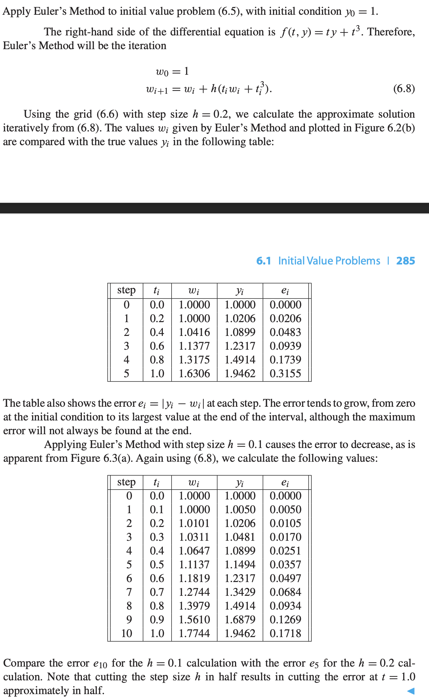

# Initial Value Problems
An initial value problem for first-order ordinary differential equation is the equaiton toghether with an initial condition on a specific interval $a \leq t \leq b$

## Euler's Method

$$w_0 = y_0$$
$$w_{i+1} = w_i + hf(t_i,w_i)$$

where $h$ is the horizontal distance between each step.

Then, each $w_i$ will be an approximation to the solution at $t_i$

Example

## Lipschiz continuous

**DEFINITION** A function $f(t,y)$ is Lipschiz continuous in the variable $y$ on the rectangle $S = [a,b] \times [\alpha, \beta]$ if there exists a constant $L$ (called the Lipschitz constant) satisfying

$$|f(t,y_1) - f(t,y_2) \leq L |y_1 - y_2|$$

for each $(t,y_1), (t, y_2)$ in $S$

> This condiiton essential means the function does not change too rapidly; the rate of change is bounded by the constant $L$.

> $S$ represents a rectangular domain in the t-y plane. $t$ ranging over the interval $[a,b]$. $y$ ranging over the interval $[\alpha, \beta]$

A function that is Lipschitz continuous in $y$ is continuous in $y$, but not necessarily differntiable.

Example

### S as Convex Set

A convex set is a subset of a vector space $\R^n$ with the property that, for any two points within the set, the entire line segment joining them is also contained within the set.

> Pick any two points in the set and draw a straight line between them, every point on that line will also be in the set.

$S$ can be a convec set. If function $f$ is continuously differentiable in the variable $y$ , the maximum absolute value of the partial derivative $\frac{\partial f}{\partial y}$ is a Lipschitz constant.

$L$ can be taken to be the maximum of 

$$| \frac{\partial f }{\partial y}(t,c)$$

**THEOREM** Assume that $f(t,y)$ is Lipschitz continuous in the variable $y$ on the set $[a,b] \times [\alpha, \beta]$ and that $\alpha < y_a < \beta$. Then there exist $c$ between $a$ and $b$ such that the intial value problem

has exactly one solution $y(t)$. Moreover, if $f$ is Lipschitz on $[a,b] \times (-\infty, \infty)$, then there exists exactly one solution on $[a,b]$

# Analysis of IVP Solvers

## Local and Global Truncation Error

**Global Truncation Error** is the cumulative error that results from applying the numerical method across many steps over an interval.

$$g_i = |w_i - y_i|$$

**Local Truncation Error** is the error made in a single step of the numerical method

$$e_i = |w_{i+1} - z(t_{i+1})$$

