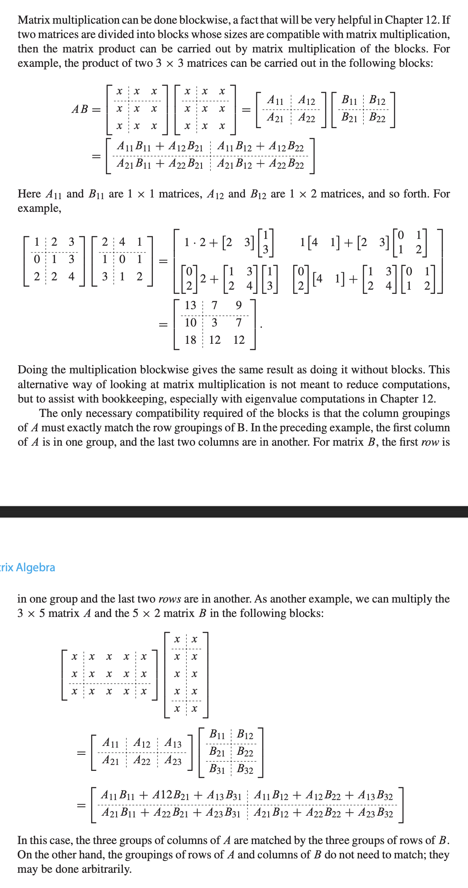
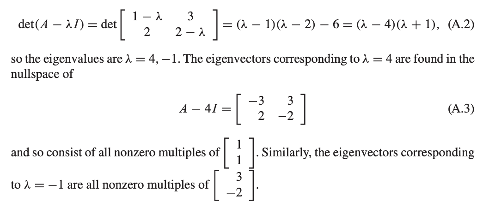
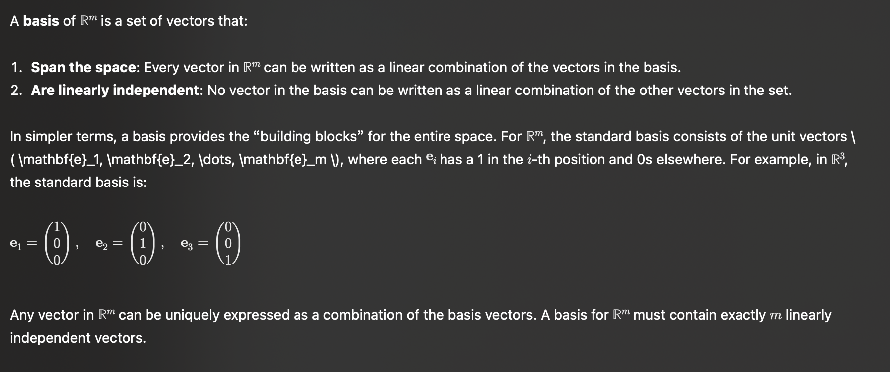
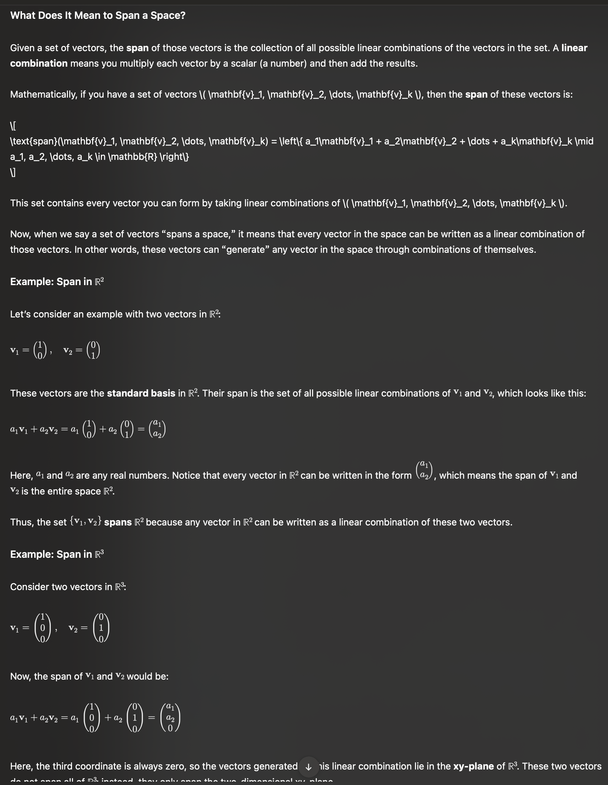

The $n\times n$ identity matrix $I_n$ is the matrix with $I_{ii} = 1$ for $1 \leq i \leq n$, and 0 for all the rest.

$$A^{-1}A = I$$

If matrix $A$ has an inverse, it is invertible.

Non invertible matrix are singular matrix.

Transpose of matrix $A^T$ whose entries are $A^T_{ij} = A_ji$
- $(AB)^T = B^T A^T$

# Block Multiplication

# Eigen Values and Eigen Vectors
The nullspace of a matrix $A$ is the set of all vectors $v$ such that

$$Av = 0$$

**DEFINITION** Let $A$ be an $m \times m$ matrix and $x$ a non-zero $m$-dimensional real or complex vector. If $Ax = \lambda x$ for some real or complex number $\lambda$, then $\lambda$ is called an *eigenvalue* of $A$ and $x$ is the corresponding **eigenvector** .

> For example, the matrix $A = \begin{bmatrix}1 &3 \\ 2 & 2\end{bmatrix}$ has an eigen vector $\begin{bmatrix}1 \\ 1\end{bmatrix}$, and corresponding eigenvalue 4.

Eigenvalues are roots $\lambda$ of the *characteristic polynomial* $\det(A-\lambda I)$.

If eigenvalues are found, eigenvectors associated with each eigenvalue can be found by solving the system:
$$(A-\lambda I)v = 0$$

## Similar Matrix
**DEFINITION** The $m \times m$ matrices $A_1$ and $A_2$ are similar, denoted $A_1 \sim A_2$, if there exists an invertible $m\times m$ matrix $S$ such that $A_1 = SA_2 S^{-1}$

Similar matrix also have identical eigenvalues

<++>

## Symmetric matrices

Basis of r^m

**DEFINITION** A set of vector is orthonormal if elements of the set are unit vectors that are pairwise orthogonal.

for set ${w_1, w_2, \dots, w_m}$, orthonormality means

- $w_i^T\cdot w_j = 0, i\neq j $
- $w_i^T w_i =1,$ for $1 \leq i, j \leq m$

For example, the sets $\{(1,0,0), (0,1,0), (0,0,1)\}$ is orthonormal sets.

**THEOREM** $A$ is a symmetric $m \times m$ matrix with real entries. Then the eigenvalues are real numbers, the set of unit eigenvectors of $A$ is an orthonormal set $\{w_1, \dots, w_m\}$ that forms a basis of $R^m$

**DEFINITION** The spectral radius $\rho (A)$ of a square matrix $A$ is the maximum magnitude of its eigenvalues.

**THEOREM** If the $n \times n$ matrix $A$ has spectral radius $\rho(A) < 1$, and $b$ is arbitrary, then, for any vector $x_0$, the iteration $x_{k+1} = Ax_k + b$ converges. There exist a unique $x_*$ such that $\lim_{k \to \infty}x_k = x_*$ and $x_* = Ax_* + b$

**COROLLARY** If $n\times n$ matrix $A$ has spectral radius $\rho(A) < 1$, then, for any initial vector $x_0$, the iteration $x_{k+1} = Ax_k$ converges to 0
