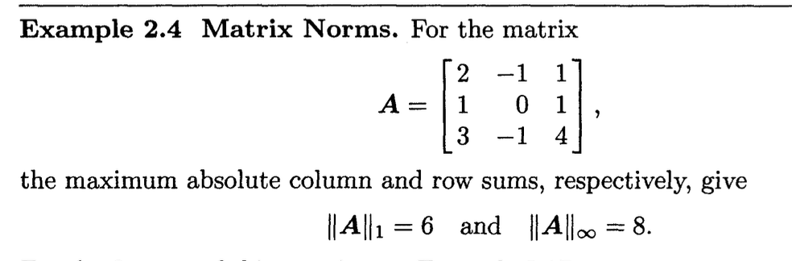
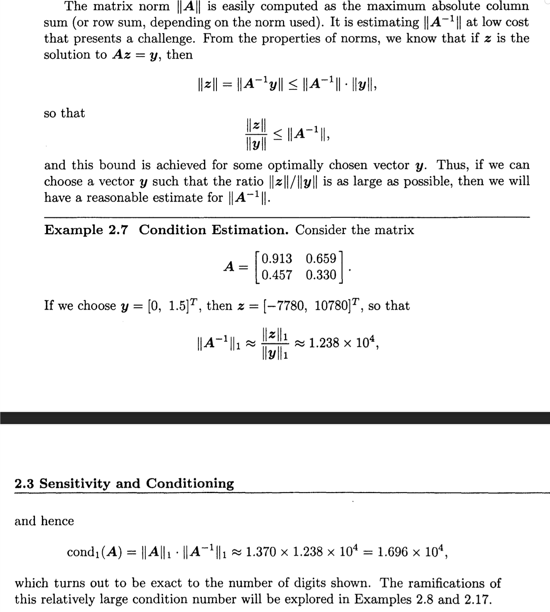
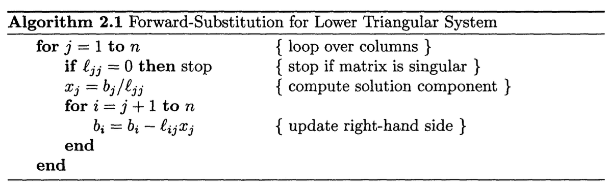
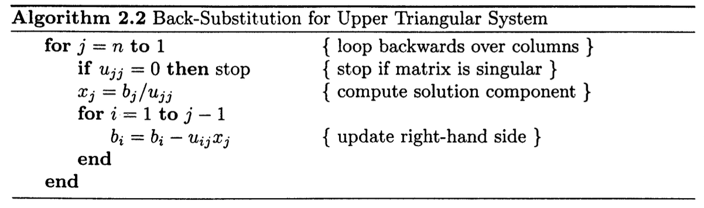
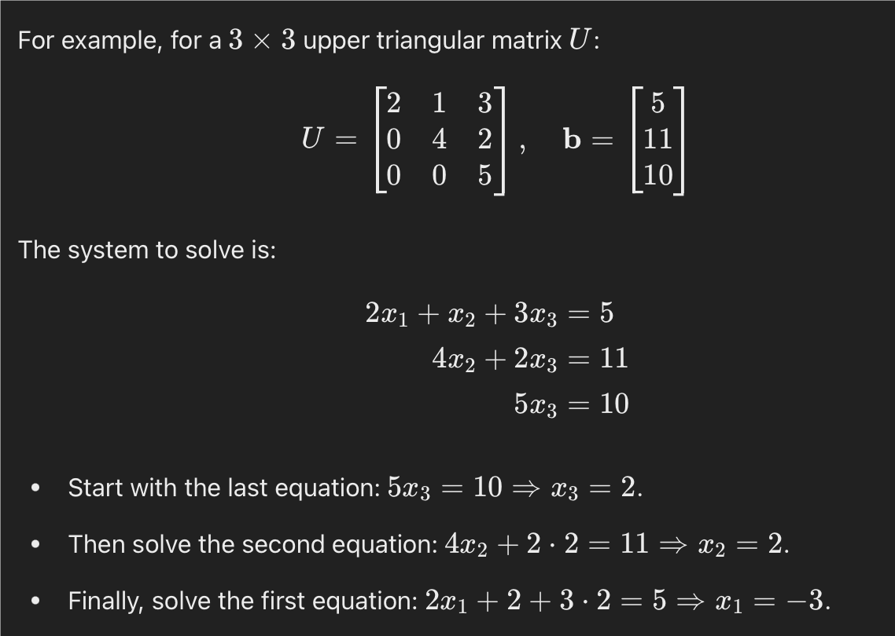

# Linear Systems
Linear system can be expressed in the form $\boldsymbol{Ax}=b$

> Derivative provides a linear approximation to a non-linear curve.

# Existence and Uniqueness
An $n \times n$ matrix, is nonsingular if satiesfies any one of these conditions:
1. $\boldsymbol{A}$ has an inverse.
2. $\det(\boldsymbol{A})\neq 0$
3. $\textrm{rank}(\boldsymbol{A}) = n$
4. For any vector $\boldsymbol{z} \neq 0, \boldsymbol{Az}\neq 0$

> The rank of matrix, is the number of linearly independent rows, or the number of linearly independent columns.

> Linearly independent row means it cannot be written by a linear combination of other rows.

Otherwise, the matrix is singular.

When matrix is nonsingular, the inverse always exist, the linear system $\boldsymbol{Ax} = \boldsymbol{b}$ always have a unique solution $\boldsymbol{x} = \boldsymbol{A}^{-1}\boldsymbol{b}$.

For a given matrix $\boldsymbol{A}$, and right-hand-side vector $\boldsymbol{b}$, the possibilities:
- Unique solution: $\boldsymbol{A}$ nonsingular, $\boldsymbol{b}$ arbitrary.
- Infinite many solution: $\boldsymbol{A}$ singular, $\boldsymbol{b} \in \textrm{span}(\boldsymbol{A})$ (consistent)
- No solution: $\boldsymbol{A}$ singular, $\boldsymbol{b}\notin \textrm{span}(\boldsymbol{A})$ (inconsistent)

# Sensitivity and Conditioning
Norms are used to measure the "magnitude" or "length" of vectors and matrix.
## Vector Norms
**p-norms** :
$$||\boldsymbol{x}||_p = (\sum_{i=1}^{n}|x_i|^p)^{1/p}$$

**1-norms** :
$$||\boldsymbol{x}||_1 = \sum_{i=1}^{n}|x_i|$$

sometimes is called *Manhattan norm*.

**2-norms** :
$$||\boldsymbol{x}||_2 = (\sum_{i=1}^{n}|x_i|^2)^\frac{1}{2}$$

which corresponds to the usual notion of distance in Euclidean space, so this is called Euclidean norm.

This can be used to refer the "straight-line" distance from origin to the point represented by the vector.

**$\infty$-norm** :
$$||\boldsymbol{x}||_\infty = \max_{i\leq i \leq n} |x_i|$$

which can be viewed as a limiting case as $p\to \infty$.

This can be used to find the largest component of the vector.

### Vector Norms Properties
1. $||\boldsymbol{x}|| > 0$ if $\boldsymbol{x} \neq 0$
2. $||\gamma \boldsymbol{x}|| = |\gamma| \cdot ||\boldsymbol{x}||$ for any scalar $\gamma$.
3. $||\boldsymbol{x} + \boldsymbol{y}|| \leq ||\boldsymbol{x}|| +||\boldsymbol{y}||$(triangle inequality)

A useful variation on the triangle inequality is

$$|\ ||\boldsymbol{x}|| - ||\boldsymbol{y}||\ | \leq ||\boldsymbol{x} - \boldsymbol{y}||$$

Also

$$||\boldsymbol{x}||_1 \geq ||\boldsymbol{x}||_2 \geq ||\boldsymbol{x}||_\infty$$

On the other hand, we also have
$$||\boldsymbol{x}||_1 \leq \sqrt{n}||\boldsymbol{x}||_2$$
$$||\boldsymbol{x}||_2 \leq \sqrt{n}||\boldsymbol{x}||_\infty$$
$$||\boldsymbol{x}||_1 \leq n ||\boldsymbol{x}||_\infty$$

## Matrix Norms
The matrix norm of an $m \times n$ matrix $\boldsymbol{A}$ is given by:
$$||\boldsymbol{A}|| = \max_{\boldsymbol{x}\neq 0} \frac{||\boldsymbol{Ax}||}{\boldsymbol{x}}$$

**The 1-norm/column-sum norm**:

$$||\boldsymbol{A}||_1 = \max_{1\leq j \leq n} \sum_{i=1}^{m }|a_{ij}|$$

sum the absolute values of each column, then take the largest summation.

**$\infty$ norm:** 
$$||\boldsymbol{A}||_\infty = \max_{1 \leq i \leq n} \sum_{j=1}^{n}|a_{ij}|$$
sum the absolute values of each row, then take the largest summation.

Example

### Matrix Norms Properties
1. $||\boldsymbol{A}|| > 0$ if $\boldsymbol{A} \neq \boldsymbol{O}$
2. $||\gamma \boldsymbol{A}|| = |\gamma| \cdot ||\boldsymbol{A}||$ for any scalar $\gamma$
3. $||\boldsymbol{A}+ \boldsymbol{B}|| \leq ||\boldsymbol{A}|| + ||\boldsymbol{B}||$
4. $||\boldsymbol{AB}|| \leq ||\boldsymbol{A}|| \cdot ||\boldsymbol{B}||$
5. $||\boldsymbol{Ax}|| \leq ||\boldsymbol{A}|| \cdot ||\boldsymbol{x}||$ for any vector $x$.

### Matrix Condition Number
The condition number of a matrix measure how sensitive the solution of a linear system is to small change in the input data.
The *condition number* of a nonsingular square matrix $\boldsymbol{A}$ with respect to a given matrix norm is defined to be:
$$\textrm{cond}(\boldsymbol{A}) = ||\boldsymbol{A}|| \cdot ||\boldsymbol{A}^{-1}||$$

By convention, $\textrm{cond}(\boldsymbol{A}) = \infty$ if $\boldsymbol{A}$ is singular.

If $\textrm{cond}(\boldsymbol{A})$ is close to 1, the matrix is said to be well-conditioned. The solution is stable and not overly sensitive to small changes in the input.

If $\textrm{cond}(\boldsymbol{A})$ is large, much greater than 1, the matrix is considered ill-conditioned, the small changes in the input can cause large changes in the output.

If $\textrm{cond}(\boldsymbol{A})$ is infinite, the matrix is singular, the system has no unique solution or matrix cannot be inverted.

#### Condition Number Properties
1. For any matrix $\boldsymbol{A}$, $\textrm{cond}(\boldsymbol{A}) \geq 1$
2. For the identity matrix, $\textrm{cond}(\boldsymbol{I}) = 1$
3. For any matrix $\boldsymbol{A}$ and nonzero scalar $\gamma$, $\textrm{cond}(\gamma \boldsymbol{A}) = \textrm{cond}(\boldsymbol{A})$
4. For any diagonal matrix $\boldsymbol{D} = \textrm{diag}(d_i)$, $\textrm{cond}(\boldsymbol{D}) = (\max|d_i|)/(\min |d_i|)$

Example on Estimating $||\boldsymbol{A}||$

### Error Bounds
Let $\boldsymbol{x}$ be the solution to the nonsingular linear system $\boldsymbol{Ax}= \boldsymbol{b}$, and let $\hat{\boldsymbol{x}}$ be the solution to the systm $\boldsymbol{A \hat{x}} = \boldsymbol{b}+ \Delta \boldsymbol{b}$

We define $\Delta \boldsymbol{x} = \hat{\boldsymbol{x}} -\boldsymbol{x}$

$$\boldsymbol{A\hat{x}} = \boldsymbol{A}(\boldsymbol{x}+\Delta \boldsymbol{x}) = \boldsymbol{Ax} + \boldsymbol{A}\Delta \boldsymbol{x} = \boldsymbol{b} + \Delta \boldsymbol{b}$$

Because $\boldsymbol{Ax} = \boldsymbol{b}$

So $\boldsymbol{A}\Delta \boldsymbol{x} = \Delta \boldsymbol{b}$

Hence

$$\Delta \boldsymbol{x} = \boldsymbol{A}^{-1} \Delta\boldsymbol{b}$$

Hence we obtain the inequalities
$$||\boldsymbol{b}|| = ||\boldsymbol{Ax}|| \leq ||\boldsymbol{A}|| \cdot ||\boldsymbol{x}||$$

$$||\boldsymbol{x}|| \geq ||\boldsymbol{b}|| / ||\boldsymbol{A}||$$

and

$$||\Delta \boldsymbol{x}|| = ||\boldsymbol{A^{-1}}\Delta \boldsymbol{b }|| \leq ||\boldsymbol{A}^{-1} || \cdot || \Delta \boldsymbol{b }||$$

Combining these inequalities, we obtain
$$\frac{||\Delta \boldsymbol{x}||}{||\boldsymbol{x}||} \leq ||\boldsymbol{A}^{-1}|| \cdot ||\Delta \boldsymbol{b}|| \frac{||\boldsymbol{A}||}{||\boldsymbol{b}||}$$

Hence

$$\frac{||\Delta \boldsymbol{x}||}{||\boldsymbol{x}||} \leq \textrm{cond}(\boldsymbol{A}) \frac{||\Delta\boldsymbol{b}||}{||\boldsymbol{b}||}$$

Hence, the conditionumber is an "amplification factor" bounds the maximum relative change in solution due to a given relative change in the right-hand-side vector.

# Solving Linear Systems
A triangular matrix linear system is a system of linear equations in which the coefficient matrix is a triangular matrix, these linear system can be solved efficiently by successive substitution process.

Upper Triangular Matrix $\boldsymbol{U}$, has all the entries below the main diagonal are zero.

$$U = \begin{bmatrix}
u_{11} & u_{12} & \dots & u_{1n} \\
0 & u_{22} & \dots & u_{2n} \\
0 & 0 & \ddots & \vdots \\
0 & 0 & \dots & u_{nn}
\end{bmatrix}$$

Lower Triangular Matrix $\boldsymbol{L}$, has all the entries aabove the main diagonal are zero.

$$L = \begin{bmatrix}
l_{11} & 0 & \dots & 0 \\
l_{21} & l_{22} & \dots & 0 \\
\vdots & \vdots & \ddots & \vdots \\
l_{n1} & l_{n2} & \dots & l_{nn}
\end{bmatrix}$$

To solve the Lower Triangular System $\boldsymbol{Lx} = \boldsymbol{b}$, successive substitution is called forward-substitution and can be expressed mathematically as

$$x_1 = b_1/\ell_{11},\ \ \ \ \ \  x_i = (b_i - \sum_{j=1 }^{i-1 }\ell_{ij}x_j)/\ell_{ii}, i = 2, \dots, n$$

To solve the Upper Triangular System $\boldsymbol{Ux} = \boldsymbol{b}$, successive substitution is called back-substitution and can be expressed mathematically as

$$x_n = b_n/u_{nn},\ \ \ \ \ x_i = (b_i - \sum_{j = i+1 }^{n} u_{ij}x_j)/u_{ii},\ i = n-1,\dots, 1$$

Example of Forward/Backward Substitution

## Elementary Elimination Matrices

